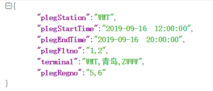
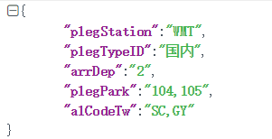

<center><font size = 8>集中式A-CDM接口设计</font></center>


<center><font size = 5>中国民航信息网络股份有限公司</font></center>
<center>版权所有</center>
<center>保留所有权利</center>


|项目名称|集中式ACDM|
|----|----|
|项目内部名称||
|版本||
|作者|中国航信||
|检查||
|说明||
|文件名||
|依赖文件||

<center>修改纪录</center>
|序号|章节|类型  | 日期       |  作者  |   备注|
|----|----|----|----|----|----|
|1|修改记录|修改|2019-01-07|王宇|增加文档变更记录章节|
|2|修改记录|修改|2019-01-11|符晓巍|修改了保障和当前放行率相关接口|
|3|修改记录|修改|2019-01-15|李东洲|修改了航班动态删除以及动态查询接口|
|4|新增记录|新增|2019-01-16|李东洲|新增了航班动态中的基础数据查询接口|
|5|修改记录|修改|2019-01-17|李东洲|修改航班动态详细查洵等接口|
|6|修改记录|修改|2019-01-30|李东洲|修改航班修改接口传参方式|
|7|修改记录|修改|2019-02-18|李东洲|修改航班动态查看接口,添加进出港共享航班字段|
|8|修改记录|修改|2019-02-20|未康康|修改机位冲突消息字段类型，Integer 改为String|
|9|修改记录|修改|2019-02-21|李建宁|修改航路信息4.4.2、4.4.3、4.4.4接口增加响应参数|
|10|修改记录|修改|2019-02-22|未康康|修改4.3.5.3机位冲突消息的业务描述|
|11|修改记录|修改|2019-02-25|李东洲|增加4.2.2航班详情中上座率字段和预计起飞/降落时间字段|
|12|修改记录|修改|2019-02-28|未康康|更新4.3.4补充航班放行信息属性名（保障、预测滑行），更正进港、离港航班属性名写反的错误。<br><br>更新航班放行排序接口名称。|
|13|修改记录|修改|2019-02-28|李东洲|更新4.2.2航班详情查询接口 新增值机柜台号 登机口 行李提取转盘,统一航节起飞到达时间格式|
|14|修改记录|修改|2019-03-01|未康康|更新4.3.4 航班放行排序，补充属性：保障名称。<br><br>更新：预测滑行，类型 Strig改为整int|
|15|修改记录|修改|2019-03-04|未康康|更新4.3.4 接口地址|
|16|修改记录|修改|2019-03-06|李东洲|更新4.2.1 新增查询字段 4.2.12  4.2.14 新增航线字段|
|17|修改记录|修改|2019-03-06|李建宁|更新4.4.3 本场空域监控 4.4.4 全国空域监控 响应参数新增机号字段|
|18|修改记录|修改|2019-03-07|未康康|更新4.5.2.6机位使用率，预警阈值threshold类型float改为String|
|19|修改记录|修改|2019-03-11|李东洲|更新4.2.2 航班详情增加离港航段旅客数据|
|20|修改记录|修改|2019-03-11|李东洲|更新4.2.2 航班详情增加 进出机位实际时间|
|21|修改记录|修改|2019-03-14|李东洲|更新4.2.2 航班详情增加 进港配载数据中的行李件数|
|22|修改记录|修改|2019-03-14|未康康|需求变更：4.3.5.1当前态势|
|23|新增记录|新增|2019-03-14|未康康|增加变更需求：4.3.5.4 (查询全场完成航班)、4.3.5.5 (查询保障预警航班)、 4.3.5.6 (查询保障异常航班)|
|24|修改记录|修改|2019-03-15|李建宁|4.4.3本场空域监控 响应参数新增航司二字码字段|
|25|修改记录|修改|2019-03-18|李建宁|4.4.3本场空域监控 响应参数新增预计到达时间、预计起飞时间二字段|
|26|修改记录|修改|2019-04-10|张宇轩|4.2.1航班动态查看  响应参数增加：进出港机龄，进出港航空器状态，地服保障环节现有的状态，出港放行等待时间字段<br><br>4.2.2 航班详情查看  响应参数增加：计划进/出机位时间<br><br>进出港机组信息数据（进出港机组资质，进出港飞行员，进出港安全员，进出港乘务员）<br><br>进港行李提取转盘信息预计开放时间/实际开放时间/预计关闭时间/实际关闭时间字段<br><br>离港行李分拣转盘信息/预计开放时间/实际开放时间/预计关闭时间/实际关闭时间字段<br><br>值机柜台的预计开放时间/实际开放时间/预计关闭时间/实际关闭时间字段                 登机口的实际开放时间和实际关闭时间|
|27|新增记录|新增|2019-04-10|赵明|增加变更需求：4.5.1.4(今日始发航班放行正常率)、 4.6.17(值班信息)|
|28|新增记录|新增|2019-04-16|赵明|增加变更需求：4.1.29（用户密码初始化）|
|29|修改记录|修改|2019-04-16|赵明|4.1.4增加用户 请求参数增加：是否启用字段<br><br>4.1.5修改用户 请求参数增加：是否启用字段<br><br>4.1.7查询用户信息 请求参数增加：角色id字段，响应参数增加：是否启用字段|
|30|修改记录|修改|2019-05-05|赵明|4.5.1.4按日期范围内每小时放行正常率<br><br>更新接口地址，响应参数增加：放行航班数/放行正常航班数/放行不正常航班数|
|31|修改记录|修改|2019-05-05|赵明|4.3.4.1查询航班放行排序 放行航班排序的进港航班停机位属性改为离港航班停机位，进港航班排序的离港航班停机位属性改为进港航班停机位|
|32|修改记录|修改|2019-05-05|张艳菊|4.1.7查询用户信息 响应参数增加:角色列表，包括角色Id和角色名称；<br><br>4.3.5.1查询当前态势信息 修改响应参数名称|
|33|修改记录|修改|2019-05-08|赵明|4.4.4全国空域监控 请求参数增加：纬度最大值/纬度最小值/经度最大值/经度最小值|
|34|修改记录|修改|2019-05-08|张宇轩|4.2.1航班动态查看增加过滤航站字段，实现过滤查询<br><br>4.2.2航班详情查看响应参数增加后序航班信息|
|35|修改记录|修改|2019-05-14|赵明|4.4.4全国空域监控 请求参数增加：航司二字码/预计起飞时间/预计到达时间|
|36|修改记录|修改|2019-05-15|赵明|4.4.4全国空域监控 响应参数增加：航司二字码/预计起飞时间/预计到达时间|
|37|新增记录|新增|2019-05-22|张宇轩|4.2.25电子进程单查询接口|
|38|修改记录|修改|2019-05-23|张艳菊|4.2.10天气信息查看接口 响应参数添加：未来两小时天气、最低温度、最高温度和24小时天气列表<br><br>4.4.1.4特请公告接口 响应参数添加机场三字码和特请信息<br><br>新增4.7.1生产动态地图展示接口<br><br>新增4.8.2报文检索接口<br><br>新增4.8.3温度露点走势图接口<br><br>新增4.8.4风速风向走势图接口<br><br>新增4.8.5气压走势图接口<br><br>新增4.8.6能见度走势图接口|
|39|新增记录|新增|2019-05-23|赵明|4.2.26 里程碑保障时间显示<br><br>4.8.1.3全国流量信息查询接口|
|40|修改记录|修改|2019-07-01|姬晓灿|4.6.5 机场信息接口的查询、新增、修改接口，增加 apCityNameChn 字段|
|41|修改记录|修改|2019-07-09|赵明|4.2.26 里程碑保障时间显示 修改全航线字段为进港、离港航班全航线，修改保障环节信息集合为进港、离港航班保障环节信息集合|
|42|新增记录|新增|2019-07-26|翁剑军|新增4.1.30.卡号登录|
|43|修改记录|修改|2019-07-26|翁剑军|修改 4.1.4增加用户、4.1.5.修改用户请求参数添加卡号字段，4.1.7.查询用户信息返回参数添加卡号字段|
|44|修改记录|修改|2019-08-05|钟楷|4.10.5.6服务项信息查询接口 返回数据新增id字段|
|45|新增记录|新增|2019-08-15|陈世豪|4.6.36 班制接口<br><br>4.6.37 班组接口<br><br>4.6.38 保障人员接口|
|46|修改记录|修改|2019-08-16|陈世豪|4.6.7 航班保障环节字段修改|
|47|新增记录|新增|2019-08-19|张祖海|4.6.43 保障环节分配<br><br>4.6.44 部门与保障环节接口<br><br>4.6.45 部门与签单接口<br><br>4.6.46 系统航班状态配置接口|
|48|新增记录|新增|2019-08-19|宋银科|4.6.48单机场保障环节信息维护|
|49|修改记录|修改|2019-08-20|陈世豪|4.6.7 航班保障环节字段修改|
|50|修改记录|修改|2019-08-21|陈世豪|4.2.7 机位资源分配|
|51|修改记录|修改|2019-08-28|洛泽华|4.6.43 保障环节分配接口<br><br>4.6.44 部门与保障环节接口<br><br>4.6.45 部门与签单接口<br><br>4.6.46系统航班状态配置接口<br><br>更新|
|52|新增记录|新增|2019-08-30|陈世豪|4.13.1 开始排班日期接口<br><br>4.13.2 班制与人员对应关系接口|
|53|新增记录|新增|2019-09-06|陈世豪|4.12.8报表个性化配置编辑删除查询接口|
|54|修改记录|修改|2019-09-06|钟楷|4.10.5.4 服务项保存接口<br><br>4.10.5.5 服务项修改接口<br><br>4.10.5.6 服务项信息查询接口|
|55|修改记录|修改|2019-09-09|蔡明恒|4.6.4.2.航空公司查询接口<br><br>4.6.4.2.航空公司新增接口<br><br>4.6.4.2.航空公司修改接口<br><br>4.6.5.2.机场查询接口<br><br>4.6.5.3.机场新增接口<br><br>4.6.5.4.机场修改接口|
|56|修改记录|修改|2019-09-20|蔡明恒|4.6.9.2登机口查询接口<br><br>4.6.10.2值机柜台查询接口<br><br>4.6.12.2机位查询接口<br><br>4.13.1.1.开始排班日期查询接口|
|62|新增记录|新增|2019-09-24|毛敏|4.6.14 飞机注册号接口新增字段<br><br>4.6.15 航站楼查询新增字段<br><br>4.6.47 新增系统配置接口|
|63|新增记录|新增|2019-09-27|陈世豪|4.12.7 报表-航司执行率查询接口|
|64|新增记录|新增|2019-10-11|钟楷|4.10.5.5 服务项批量保存接口|
|64|新增记录|新增|2019-10-12|翁建军|4.12.2.1 放行正常率查询总计接口<br><br>4.12.2.2 放行正常率查询接口<br><br>4.12.2.3 始发航班放行正常率查询总计接口<br><br>4.12.2.4 始发航班放行正常率查询接口|
|64|新增记录|新增|2019-10-14|陈世豪|4.16.1.1 查询自主派工列表<br><br>4.16.2.1 派工<br><br>4.16.3.1 任务查询|
|65|姬晓灿|新增|2019-10-14|姬晓灿|4.19.2 关注、取消关注航班接口<br><br>4.19.3 航班关注列表查询接口|
|66|陈威|新增|2019-10.14|陈威|4.15.1.15 查询最早最晚执行时间接口|
|67|新增记录|新增|2019-10-14|蔡明恒|4.15.1.12 重要航班查询接口|
|68|新增记录|新增|2019-10-17|姬晓灿|4.15.1.7.航班小时分布|
|69|新增记录|新增|2019-10-17|毛敏|4.15.2.5.航班列表信息查询接口|
|70|修改记录|修改|2019-10-17|廖程祥|4.6.24 保障异常原因<br><br>4.6.34 机位廊桥<br><br>4.15.1.3 放行正常率|
|71|增加记录|增加|2019-10-17|洛泽华|4.15.2.6 下小时航班延误|
|72|增加记录|增加|2019-10-18|蔡明恒|4.6.38.6 保障人员和保障环节接口查询<br><br>4.6.38.7 保障人员和保障环节编辑接口<br><br>4.17.1 tabbar资源接口<br><br>4.12.8 延误详情接口|
|73|增加记录|增加|2019-10-21|翁剑军|4.15.1.12.航班正常率|
|74|修改记录|修改|2019-10-22|洛泽华|4.6.43.5 修改更新增加接口改为编辑接口|
|75|修改记录|修改|2019-10-22|张祖海|4.13.4.2 更新特殊出勤接口|
|76|修改记录|修改|2019-10-23|宋银科|4.6.49单机场保障环节信息修改|
|77|新增记录|新增|2019-10-23|宋银科|4.16.5单个航班保障详情信息查看<br><br>4.16.6异常上报<br><br>4.16.7个人工作量统计|
|78|修改记录|修改|2019-10-23|张祖海|4.16.4.1快捷上报接口|
|79|修改记录|修改|2019-10-24|洛泽华|4.6.44 部门与保障环节修改|
|82|修改记录|修改|2019-10-25|毛敏|4.6.14.2.飞机注册号新增接口<br><br>4.6.14.3.飞机注册号修改接口|
|83|新增记录|新增|2019-10-25|毛敏|4.16.5.1航班信息接口<br><br>4.18. 移动保障跨平台-通讯录联系人|
|84|新增记录|新增|2019-10-29|洛泽华|4.17.4 APP资源管理|
|85|修改记录|修改|2019-10-29|陈威|4.6.37 班组新增和修改接口|
|86|新增记录|新增|2019-10-29|陈世豪|4.14航班计划查询、单段航班|
|87|新增记录|新增|2019-10-31|钟楷|4.17.2 App-Web增、删、改、分页、指定记录5个接口|
|88|修改记录|修改|2019-10-30|陈威|4.6.37班组分页查询返回结果修改|
|89|新增记录|新增|2019-10-31|张祖海|4.14.6 拼接航班计划批量新增<br><br>4.14.7 拼接航班计划查看<br><br>4.14.8 拼接航班计划编辑<br><br>4.14.9 拼接航班计划删除<br><br>4.14.10 拼接航班计划拆分|
|90|修改记录|修改|2019-11-4|宋银科|4.6.31机位与行李转盘信息接口<br><br>4.6.33 值机柜台航空公司查询接口<br><br>4.2.19 地服保障系统信息录入<br><br>4.2.27 地服系统保障信息批量录入|
|91|新增记录|新增|2019-11-4|宋银科|4.2.30 进程日志接口|
|92|新增记录|新增|2019-11-4|廖程祥|4.20 VIP模块|
|93|新增记录|新增|2019-11-5|陈世豪|4.19航班那动态查询接口|
|94|修改和新增|修改和新增|2019-11-06|钟楷|4.10.5.7 服务项信息查询接口 修改返回部门id为部门名称<br><br>4.10.5.6 服务项修改接口 增加isDelete和serviceID字段<br><br>4.10.5.8 新增航班下保障环节关联服务项自动赋值|
|95|修改记录|修改|2019-11-7|宋银科|4.2.30进程日志接口<br><br>4.15.5.2 保障环节信息查询接口|
|96|新增记录|新增|2019-11-7|蔡明恒|4.15.1.16 重要航班列表接口|
|97|新增记录|新增|2019-11-11|张祖海|4.19.7 航班动态拆分4.19.8 航班动态拼接|
|98|修改记录|修改|2019-11-11|张祖海|4.6.22.4 分航空公司接口地址|
|99|新增记录和修改记录|新增和修改|2019-11-11|陈威|4.19.6航班信息删除接口<br><br>4.9.3个性化信息的删除|
|100|新增记录|新增|2019-11-11|廖程祥|4.19.4 航班信息新增接口|
|101|新增记录|新增|2019-11-12|毛敏|4.19.5 航班信息修改接口|

# 1.前言

本文档服务于技术研发人员，进行接口对接时使用的文档说明，根据该文档中的接口设计描述进行开发。

# 2.接口规范定义
	
1、 本接口接收协议为http，支持POST请求方式，编码为UTF-8。以json格式返回响应参数。

参数请求的方式请按照网关技术规范文档的要求进行传递。

2、请求的IP端口号信息请联系相关人员获取。

3、接口描述中【是否可空】：N表示必填，Y表示可选。

4、接口返回报文统一格式：data为业务数据，详见4.接口设计部分，错误码详细信息见网关接口技术规范文档。

|参数名称|类型|是否必需|描述|
|----|----|----|----|
|code|String|是|错误代码，请参考附件错误码描述|
|msg|String|否|错误信息，请参考附件错误码描述|
|data|Object|否|业务返回信息|

**正常返回示例：**
```
{

"code":0,

"msg":"success",

"data":```
{

"id":1,

"name":"get",

"age":18,

"pageNum":0,

"pageSize":0


}


}
```
**异常返回示例：**
```
{

"cause": null,

"stackTrace": [],

"code": "502_00_00_00001",

"msg": "请求参数验证失败",

"data": null,

"localizedMessage": null,

"message": null,

"suppressed": []


}
```
**异常错误码表：**

|通用错误码|||
|----|----|----|
|code|msg|备注|
|505-00-00-20001|system inner error|系统内部异常|
|502-00-00-00001|请求参数验证失败|缺少参数、参数错误等，未按接口文档定义进行传递|
|502-00-00-00002|请求参数bean为空||
|502-00-00-00003|已经存在相同记录||
|502-00-00-00004|日期字符串格式解析失败||
|502-00-00-00005|航班信息不存在||
|502-00-00-99999|系统异常或未知错误||
|502-00-01-00001|新增失败||
|502-00-01-00002|修改失败||

|登录和用户管理错误码|||
|----|----|----|
|code|msg|备注|
|502-00-01-00200|登录失败|用户登录|
|502-00-01-00201|旧密码错误|修改密码|
|502-00-01-00202|新密码与旧密码相同|修改密码|
|502-00-01-00203|新密码为弱密码|修改密码|
|502-00-01-00204|新密码或旧密码为空|修改密码|
|502-00-01-00205|用户已存在|添加用户，修改用户|
|502-00-01-00215|用户不存在|修改用户|
|502-00-01-00206|角色已存在|增加角色，修改角色|
|502-00-01-00216|角色不存在|修改角色|
|502-00-01-00207|权限编码已存在|增加权限，修改权限|
|502-00-01-00217|权限不存在|修改权限|
|502-00-01-00208|部门已存在|增加部门，修改部门|
|502-00-01-00218|部门不存在|修改部门|
|502-00-01-00209|岗位已存在|增加岗位，修改岗位|
|502-00-01-00219|岗位不存在|修改岗位|
|502-00-01-00210|用户已存在该角色|给用户分配角色|

|航班管理错误码|||
|----|----|----|
|502-00-01-00301|删除地服保障信息处理失败||
|502-00-01-00302|地服保障录入处理失败||
|502-00-01-00303|空管系统航班动态信息录入处理失败||
|502-00-01-00304|保障环节信息不存在||

# 3.接口文档描述

本接口服务提供集中式ACDM业务平台相关数据的能力。

# 4.接口设计
	
## 4.1.登录和用户管理
	
### 4.1.1.用户登录
	
#### 4.1.1.1.业务描述

输入用户名和密码，登入系统。

#### 4.1.1.2.请求地址

http://ip:端口/aoc-central/1.0/login

#### 4.1.1.3.请求参数

|参数值|类型|是否可空|描述|
|----|----|----|----|
|userLoginName|String|N|登录名|
|userPwd|String|N|密码，MD5加密|
|plegStation|String|N|机场三字码|

#### 4.1.1.4.响应参数

|参数值|类型|是否可空|描述|
|----|----|----|----|
|usrId|Long|N|主键|
|userLoginName|String|N|登录名|
|userShowName|String|N|显示名|
|deptId|Long|Y|部门ID|
|deptName|String|Y|部门名称|
|postId|Long|Y|岗位ID|
|postName|String|Y|岗位名称|
|userTelephone|String|Y|电话|
|plegStation|String|N|机场三字码|
|userOpTm|Timestamp|N|操作时间|

#### 4.1.1.5.结果示例

返回结果:
```
{

"code": "0",

"msg": "success",

"data": 
{

"usrId": "27495",

"userLoginName": "admin",

"userShowName": "管理员",

"deptId": "65425",

"deptName": "运营部",

"postId": "23454",

"postName": "开发",

"userTelephone": "18200000000",

"plegStation": "CSX",

"userOpTm": "1523858105448"


}


}
```
### 4.1.2.获取用户权限
	
#### 4.1.2.1.业务描述

返回用户的权限列表。

#### 4.1.2.2.请求地址

http://ip:端口/aoc-central/1.0/aas/getUserAuthority

#### 4.1.2.3.请求参数

|参数值|类型|是否可空|描述|
|----|----|----|----|
|usrId|String|N|用户ID|
|plegStation|String|N|机场三字码|

#### 4.1.2.4.响应参数

|参数值|类型|是否可空|描述|
|----|----|----|----|
|resultList|List&lt;Privilege&gt;|Y|权限列表|

|List&lt;Privilege&gt;|||||
|----|----|----|----|----|
|参数值|类型|是否可空|描述||
|prvlId|Long|N|权限ID||
|prvlCode|String|N|权限编码，最大长度500||
|prvlShowName|String|N|权限显示名，最大长度100||
|prvlUrl|String|Y|界面菜单的url||
|prvlType|String|Y|类型|menu：菜单|
|||||func：功能|
|prvlIcon|String|Y|菜单图标||
|prvlResources|String|Y|权限对应的资源||
|prvlParentId|Long|N|父权限||
|prvlSortFlag|String|N|权限的排序序号||
|prvlOpTm|Timestamp|N|操作时间||
|prvlAppType|String|N|应用类型(web/app)||

#### 4.1.2.5.结果示例

返回结果:
```
{

"code": "0",

"msg": "success",

"data": 
{

"resultList": [

{

"prvlId": "5349615",

"prvlCode": "SET",

"prvlShowName": "设置",

"prvlUrl": "",

"prvlType": "",

"prvlIcon": "",

"prvlParentId": "4709677",

"prvlResources": "",

"prvlSortFlag": "1146",

"prvlAppType": "web",

"prvlOpTm": "1523858105448"


}

{

"prvlId": "333323",

"prvlCode": "main",

"prvlShowName": "首页",

"prvlUrl": "",

"prvlType": "function",

"prvlIcon": "",

"prvlParentId": "0",

"prvlResources": "/main,/ov/summary,/panel/message/warnMessageList,/panel/message/aocMessageList,/panel/message/dispatchMessageList",

"prvlSortFlag": "1",

"prvlAppType": "web",

"prvlOpTm": "1523858105448"


}

... ...

]


}


}
```
### 4.1.3.修改密码
	
#### 4.1.3.1.业务描述

修改用户密码。

#### 4.1.3.2.请求地址

http://ip:端口/aoc-central/1.0/aas/user/updateUserPassword

#### 4.1.3.3.请求参数

|参数值|类型|是否可空|描述|
|----|----|----|----|
|usrId|Long|N|用户ID|
|oldPwd|String|N|旧密码，MD5加密|
|newPwd|String|N|新密码，不加密，长度8-16，必须包含大小写，数字，特殊符号|
|plegStation|String|N|机场三字码|

#### 4.1.3.4.响应参数

无

#### 4.1.3.5.结果示例
```
{

"code": "0",

"msg": "success",

"data": null


}
```
### 4.1.4.增加用户
	
#### 4.1.4.1.业务描述

用户新增。

#### 4.1.4.2.请求地址

http://ip:端口/aoc-central/1.0/aas/user/add

#### 4.1.4.3.请求参数

|参数值|类型|是否可空|描述|
|----|----|----|----|
|userLoginName|String|N|登录名,最大长度200|
|userShowName|String|N|用户名，最大长度100|
|userPwd|String|N|用户密码，MD5加密|
|deptId|Long|Y|部门ID|
|postId|Long|Y|岗位ID|
|plegStation|String|N|机场三字码|
|userTelephone|String|Y|电话|
|isEnable|String|Y|是否启用(默认：Y)|
|userCard|String|Y|员工卡号|

#### 4.1.4.4.响应参数

无

#### 4.1.4.5.结果示例

```
{

"code": "0",

"msg": "success",

"data": null


}
```

### 4.1.5.修改用户
	
#### 4.1.5.1.业务描述

修改用户信息。

#### 4.1.5.2.请求地址

http://ip:端口/aoc-central/1.0/aas/user/edit

#### 4.1.5.3.请求参数

|参数值|类型|是否可空|描述|
|----|----|----|----|
|usrId|Long|N|用户ID|
|userLoginName|String|N|登录名,最大长度200|
|userShowName|String|N|用户名，最大长度100|
|deptId|Long|Y|部门ID|
|postId|Long|Y|岗位ID|
|plegStation|String|N|机场三字码|
|userTelephone|String|Y|电话|
|isEnable|String|N|是否启用|
|userCard|String|Y|员工卡号|

#### 4.1.5.4.响应参数

无

#### 4.1.5.5.结果示例

```
{

"code": "0",

"msg": "success",

"data": null


}
```

### 4.1.6.删除用户
	
#### 4.1.6.1.业务描述

删除用户，可批量删除。

#### 4.1.6.2.请求地址

http://ip:端口/aoc-central/1.0/aas/user/delete

#### 4.1.6.3.请求参数

|参数值|类型|是否可空|描述|
|----|----|----|----|
|usrIds|String|N|用户ID，批量删除时，多个ID之间用逗号分隔|
|plegStation|String|N|机场三字码|

#### 4.1.6.4.响应参数

无

#### 4.1.6.5.结果示例

```
{

"code": "0",

"msg": "success",

"data": null


}
```

### 4.1.7.查询用户信息
	
#### 4.1.7.1.业务描述

返回用户列表。

#### 4.1.7.2.请求地址

http://ip:端口/aoc-central/1.0/aas/user/query

#### 4.1.7.3.请求参数

|参数值|类型|是否可空|描述|
|----|----|----|----|
|userLoginName|String|Y|用户登录名，模糊查询|
|userShowName|String|Y|用户显示名，模糊查询|
|deptId|Long|Y|部门ID|
|plegStation|String|N|机场三字码|
|currentPage|Integer|N|页码|
|pageSize|Integer|N|每页条数|
|roleId|String|Y|角色id|

#### 4.1.7.4.响应参数

|参数值|类型|是否可空|描述|
|----|----|----|----|
|total|Integer|N|总条数|
|pageSize|Integer|N|页面大小|
|currentPage|Integer|N|当前页码|
|resultList|List&lt;User&gt;|Y|用户列表|

|List&lt;User&gt;||||
|----|----|----|----|
|参数值|类型|是否可空|描述|
|usrId|Long|N|主键|
|userLoginName|String|N|登录名|
|userShowName|String|N|显示名|
|deptId|Long|Y|部门ID|
|deptName|String|Y|部门名称|
|postId|Long|Y|岗位ID|
|postName|String|Y|岗位名称|
|userTelephone|String|Y|电话|
|plegStation|String|N|机场三字码|
|userOpTm|Timestamp|N|操作时间|
|isEnable|String|N|是否启用|
|roleList|List&lt;Role&gt;|Y|角色列表|
|userCard|String|Y|员工卡号|

|List&lt;Role&gt;||||
|----|----|----|----|
|参数值|类型|是否可空|描述|
|roleId|Long|N|角色Id|
|roleName|String|N|角色名称|

#### 4.1.7.5.结果示例

返回结果:

```
{

"code": "0",

"msg": "success",

"data": 
{

"total":"100",

"pageSize":"20",

"currentPage":"1",

"resultList": [

{

"usrId": "27495",

"userLoginName": "admin",

"userShowName": "管理员",

"deptId": "65425",

"postId": "23454",

"userTelephone": "18200000000",

"userImagePath": "",

"plegStation": "CSX",

"userOpTm": "1523858105448",

"isEnable":"Y",

"roleList": []


}
{

"usrId": "271234",

"userLoginName": "test",

"userShowName": "测试用户",

"deptId": "65321",

"postId": "21254",

"userTelephone": "18200000000",

"userImagePath": "",

"plegStation": "CSX",

"userOpTm": "1523858105448",

"isEnable":"N",

"roleList": [```
{

"plegStation": "CSX",

"roleId": 363,

"roleName": "系统管理员",

"deptId": 648,

"roleOpTm": 1508227370000


}
]


}

... ...

]


}


}
```

### 4.1.8.增加角色
	
#### 4.1.8.1.业务描述

角色新增。

#### 4.1.8.2.请求地址

http://ip:端口/aoc-central/1.0/aas/role/add

#### 4.1.8.3.请求参数

|参数值|类型|是否可空|描述|
|----|----|----|----|
|roleName|String|N|角色名称|
|deptId|Long|N|部门ID|
|plegStation|String|N|机场三字码|

#### 4.1.8.4.响应参数

无

#### 4.1.8.5.结果示例

```
{

"code": "0",

"msg": "success",

"data": null


}
```

### 4.1.9.修改角色
	
#### 4.1.9.1.业务描述

修改角色信息。

#### 4.1.9.2.请求地址

http://ip:端口/aoc-central/1.0/aas/role/edit

#### 4.1.9.3.请求参数

|参数值|类型|是否可空|描述|
|----|----|----|----|
|roleId|Long|N|角色ID|
|roleName|String|N|角色名称|
|deptId|Long|N|部门ID|
|plegStation|String|N|机场三字码|

#### 4.1.9.4.响应参数

无

#### 4.1.9.5.结果示例

```
{

"code": "0",

"msg": "success",

"data": null


}
```

### 4.1.10.删除角色
	
#### 4.1.10.1.业务描述

删除角色，可批量删除。

#### 4.1.10.2.请求地址

http://ip:端口/aoc-central/1.0/aas/role/delete

#### 4.1.10.3.请求参数

|参数值|类型|是否可空|描述|
|----|----|----|----|
|roleIds|String|N|角色ID，批量删除时多个ID之间用逗号分隔|
|plegStation|String|N|机场三字码|

#### 4.1.10.4.响应参数

无

#### 4.1.10.5.结果示例

```
{

"code": "0",

"msg": "success",

"data": null


}
```

### 4.1.11.查询角色信息
	
#### 4.1.11.1.业务描述

查询角色列表。

#### 4.1.11.2.请求地址

http://ip:端口/aoc-central/1.0/aas/role/query

#### 4.1.11.3.请求参数

|参数值|类型|是否可空|描述|
|----|----|----|----|
|roleName|String|Y|角色名称，模糊查询|
|deptId|Long|Y|部门ID|
|plegStation|String|N|机场三字码|
|currentPage|Integer|N|页码|
|pageSize|Integer|N|每页条数|

#### 4.1.11.4.响应参数

|参数值|类型|是否可空|描述|
|----|----|----|----|
|total|Integer|N|总条数|
|pageSize|Integer|N|页面大小|
|currentPage|Integer|N|当前页码|
|resultList|List&lt;Role&gt;|Y|角色列表|

|List&lt;Role&gt;||||
|----|----|----|----|
|参数值|类型|是否可空|描述|
|roleId|Long|N|主键|
|roleName|String|N|角色名称|
|deptId|Long|Y|部门ID|
|deptName|String|Y|部门名称|
|plegStation|String|N|机场三字码|
|userOpTm|Timestamp|N|操作时间|

#### 4.1.11.5.结果示例

返回结果:

```
{

"code": "0",

"msg": "success",

"data": 
{

"total":"100",

"pageSize":"20",

"currentPage":"1",

"resultList": [

{

"roleId": "27495",

"roleName": "设备管理员",

"roleLevel": "2",

"deptId": "65425",

"deptName": "运营部",

"plegStation": "CSX",

"userOpTm": "1523858105448"


}

{

"roleId": "274123",

"roleName": "系统管理员",

"roleLevel": "1",

"deptId": "65425",

"deptName": "运营部",

"plegStation": "CSX",

"userOpTm": "1523858105448"


}

... ...

]


}


}
```

### 4.1.12.增加权限
	
#### 4.1.12.1.业务描述

权限新增。

#### 4.1.12.2.请求地址

http://ip:端口/aoc-central/1.0/aas/privilege/add

#### 4.1.12.3.请求参数

|参数值|类型|是否可空|描述||
|----|----|----|----|----|
|prvlCode|String|N|权限编码，最大长度500||
|prvlShowName|String|N|权限显示名，最大长度100||
|prvlUrl|String|Y|界面菜单的url||
|prvlType|String|Y|类型|menu：菜单|
|||||func：功能|
|prvlIcon|String|Y|菜单图标||
|prvlParentId|Long|N|父权限，默认为0||
|prvlResources|String|Y|权限对应的资源||
|plegStation|String|N|机场三字码||
|prvlAppType|String|N|应用类型(web/app)||

#### 4.1.12.4.响应参数

无

#### 4.1.12.5.结果示例

```
{

"code": "0",

"msg": "success",

"data": null


}
```

### 4.1.13.修改权限
	
#### 4.1.13.1.业务描述

修改权限。

#### 4.1.13.2.请求地址

http://ip:端口/aoc-central/1.0/aas/privilege/edit

#### 4.1.13.3.请求参数

|参数值|类型|是否可空|描述||
|----|----|----|----|----|
|prvlId|Long|N|权限ID||
|prvlCode|String|N|权限编码，最大长度500||
|prvlShowName|String|N|权限显示名，最大长度100||
|prvlUrl|String|Y|界面菜单的url||
|prvlType|String|Y|类型|menu：菜单|
|||||func：功能|
|prvlIcon|String|Y|菜单图标||
|prvlParentId|Long|N|父权限，默认为0||
|prvlSortFlag|String|Y|权限的排序序号||
|prvlResources|String|Y|权限对应的资源||
|plegStation|String|N|机场三字码||
|prvlAppType|String|N|应用类型(web/app)||

#### 4.1.13.4.响应参数

无

#### 4.1.13.5.结果示例

```
{

"code": "0",

"msg": "success",

"data": null


}
```

### 4.1.14.删除权限
	
#### 4.1.14.1.业务描述

删除权限，可批量删除。

#### 4.1.14.2.请求地址

http://ip:端口/aoc-central/1.0/aas/privilege/delete

#### 4.1.14.3.请求参数

|参数值|类型|是否可空|描述|
|----|----|----|----|
|prvlIds|String|N|权限ID，批量删除时多个ID之间用逗号分隔|
|plegStation|String|N|机场三字码|

#### 4.1.14.4.响应参数

无

#### 4.1.14.5.结果示例

```
{

"code": "0",

"msg": "success",

"data": null


}
```

### 4.1.15.查询权限信息
	
#### 4.1.15.1.业务描述

查询权限列表。

#### 4.1.15.2.请求地址

http://ip:端口/aoc-central/1.0/aas/privilege/queryAll

#### 4.1.15.3.请求参数

|参数值|类型|是否可空|描述|
|----|----|----|----|
|plegStation|String|N|机场三字码|

#### 4.1.15.4.响应参数

|参数值|类型|是否可空|描述|
|----|----|----|----|
|resultList|List&lt;Privilege&gt;|Y|权限列表|

|List&lt;Privilege&gt;|||||
|----|----|----|----|----|
|参数值|类型|是否可空|描述||
|prvlId|Long|N|权限ID||
|prvlCode|String|N|权限编码，最大长度500||
|prvlShowName|String|N|权限显示名，最大长度100||
|prvlUrl|String|Y|界面菜单的url||
|prvlType|String|Y|类型|menu：菜单|
|||||func：功能|
|prvlIcon|String|Y|菜单图标||
|prvlResources|String|Y|权限对应的资源||
|prvlParentId|Long|N|父权限||
|prvlSortFlag|String|N|权限的排序序号||
|prvlOpTm|Timestamp|N|操作时间||
|prvlAppType|String|N|应用类型(web/app)||

#### 4.1.15.5.结果示例

返回结果:

```
{

"code": "0",

"msg": "success",

"data": 
{

"resultList": [
{

"prvlId": "5349615",

"prvlCode": "SET",

"prvlShowName": "设置",

"prvlUrl": "",

"prvlType": "",

"prvlIcon": "",

"prvlParentId": "4709677",

"prvlResources": "",

"prvlSortFlag": "1146",

"prvlAppType": "web",

"prvlOpTm": "1523858105448"


}


{

"prvlId": "333323",

"prvlCode": "main",

"prvlShowName": "首页",

"prvlUrl": "",

"prvlType": "function",

"prvlIcon": "",

"prvlParentId": "0",

"prvlResources": "/main,/ov/summary,/panel/message/warnMessageList,/panel/message/aocMessageList,/panel/message/dispatchMessageList",

"prvlSortFlag": "1",

"prvlAppType": "web",

"prvlOpTm": "1523858105448"


}

... ...

]


}


}
```

### 4.1.16.给用户分配角色
	
#### 4.1.16.1.业务描述

给用户分配角色。

#### 4.1.16.2.请求地址

http://ip:端口/aoc-central/1.0/aas/userRole/add

#### 4.1.16.3.请求参数

|参数值|类型|是否可空|描述|
|----|----|----|----|
|userId|Long|N|用户ID|
|roleId|Long|N|角色ID|
|plegStation|String|N|机场三字码|

#### 4.1.16.4.响应参数

无

#### 4.1.16.5.结果示例

```
{

"code": "0",

"msg": "success",

"data": null


}
```

### 4.1.17.删除用户的角色
	
#### 4.1.17.1.业务描述

删除用户的角色，可批量删除。

#### 4.1.17.2.请求地址

http://ip:端口/aoc-central/1.0/aas/userRole/delete

#### 4.1.17.3.请求参数

|参数值|类型|是否可空|描述|
|----|----|----|----|
|userRoleIds|String|N|用户角色ID，批量删除时多个ID之间用逗号分隔|
|plegStation|String|N|机场三字码|

#### 4.1.17.4.响应参数

无

#### 4.1.17.5.结果示例

```
{

"code": "0",

"msg": "success",

"data": null


}
```

### 4.1.18.查询用户的角色
	
#### 4.1.18.1.业务描述

获取用户的角色列表。

#### 4.1.18.2.请求地址

http://ip:端口/aoc-central/1.0/aas/userRole/query

#### 4.1.18.3.请求参数

|参数值|类型|是否可空|描述|
|----|----|----|----|
|userId|Long|N|用户ID|
|plegStation|String|N|机场三字码|
|currentPage|Integer|N|页码|
|pageSize|Integer|N|每页条数|

#### 4.1.18.4.响应参数

|参数值|类型|是否可空|描述|
|----|----|----|----|
|total|Integer|N|总条数|
|pageSize|Integer|N|页面大小|
|currentPage|Integer|N|当前页码|
|resultList|List&lt;UserRole&gt;|Y|用户角色列表|

|List&lt;UserRole&gt;||||
|----|----|----|----|
|参数值|类型|是否可空|描述|
|userRoleId|Long|N|用户角色ID|
|userId|Long|N|用户ID|
|roleId|Long|N|角色ID|
|roleName|String|N|角色名称|
|userRoleOpTm|Timestamp|N|操作时间|

#### 4.1.18.5.结果示例

返回结果:

```
{

"code": "0",

"msg": "success",

"data": 
{

"total":"100",

"pageSize":"20",

"currentPage":"1",

"resultList": [

{

"userRoleId": "5524222",

"userId": "111",

"roleId": "43534",

"roleName": "设备管理员",

"userRoleOpTm": "1523858105448"


}

{

"userRoleId": "2435423",

"userId": "111",

"roleId": "4525225",

"roleName": "系统管理员",

"userRoleOpTm": "1523858105448"


}

... ...

]


}


}
```

### 4.1.19.编辑角色的权限
	
#### 4.1.19.1.业务描述

给角色分配权限。

#### 4.1.19.2.请求地址

http://ip:端口/aoc-central/1.0/aas/rolePrivilege/edit

#### 4.1.19.3.请求参数

|参数值|类型|是否可空|描述|
|----|----|----|----|
|roleId|Long|N|角色ID|
|prvlIds|String|Y|权限ID，多个ID之间用逗号分隔|
|plegStation|String|N|机场三字码|

#### 4.1.19.4.响应参数

无

#### 4.1.19.5.结果示例

```
{

"code": "0",

"msg": "success",

"data": null


}
```

### 4.1.20.查询角色的权限
	
#### 4.1.20.1.业务描述

返回角色的权限列表。

#### 4.1.20.2.请求地址

http://ip:端口/aoc-central/1.0/aas/rolePrivilege/query

#### 4.1.20.3.请求参数

|参数值|类型|是否可空|描述|
|----|----|----|----|
|roleId|Long|N|角色ID|
|plegStation|String|N|机场三字码|

#### 4.1.20.4.响应参数

|参数值|类型|是否可空|描述|
|----|----|----|----|
|resultList|List&lt;RolePrivilege&gt;|Y|角色权限列表|

|List&lt;RolePrivilege&gt;||||
|----|----|----|----|
|参数值|类型|是否可空|描述|
|rolePrvlId|Long|N|角色权限ID|
|roleId|Long|N|角色ID|
|prvlId|Long|N|权限ID|
|prvlShowName|String|N|权限显示名|
|rolePrvlOpTm|Timestamp|N|操作时间|

#### 4.1.20.5.结果示例

返回结果:

```
{

"code": "0",

"msg": "success",

"data": 
{

"resultList": [

{

"rolePrvlId": "5524222",

"roleId": "111",

"prvlId": "43534",

"prvlShowName": "43534",

"rolePrvlOpTm": "1523858105448"


}


{

"rolePrvlId": "242342",

"roleId": "111",

"prvlId": "45654",

"prvlShowName": "43534",

"rolePrvlOpTm": "1523858105448"


}

... ...

]


}


}
```

### 4.1.21.增加部门
	
#### 4.1.21.1.业务描述

部门新增。

#### 4.1.21.2.请求地址

http://ip:端口/aoc-central/1.0/aas/dept/add

#### 4.1.21.3.请求参数

|参数值|类型|是否可空|描述|
|----|----|----|----|
|deptName|String|N|部门名称|
|deptCode|String|N|部门编码|
|deptTelephone|String|Y|部门电话|
|deptAddress|String|Y|部门地址，最大长度100|
|deptParentId|Long|N|父部门的deptId,默认为0|
|plegStation|String|N|机场三字码|

#### 4.1.21.4.响应参数

无

#### 4.1.21.5.结果示例

```
{

"code": "0",

"msg": "success",

"data": null


}
```

### 4.1.22.修改部门
	
#### 4.1.22.1.业务描述

修改部门信息。

#### 4.1.22.2.请求地址

http://ip:端口/aoc-central/1.0/aas/dept/edit

#### 4.1.22.3.请求参数

|参数值|类型|是否可空|描述|
|----|----|----|----|
|deptId|Long|N|部门ID|
|deptName|String|N|部门名称|
|deptCode|String|N|部门编码|
|deptTelephone|String|Y|部门电话|
|deptAddress|String|Y|部门地址，最大长度100|
|deptParentId|Long|N|父部门的deptId|
|plegStation|String|N|机场三字码|

#### 4.1.22.4.响应参数

无

#### 4.1.22.5.结果示例

```
{

"code": "0",

"msg": "success",

"data": null


}
```

### 4.1.23.删除部门
	
#### 4.1.23.1.业务描述

删除部门，可批量删除。

#### 4.1.23.2.请求地址

http://ip:端口/aoc-central/1.0/aas/dept/delete

#### 4.1.23.3.请求参数

|参数值|类型|是否可空|描述|
|----|----|----|----|
|deptIds|String|N|部门ID，批量删除时多个ID之间用逗号分隔|
|plegStation|String|N|机场三字码|

#### 4.1.23.4.响应参数

无

#### 4.1.23.5.结果示例

```
{

"code": "0",

"msg": "success",

"data": null


}
```

### 4.1.24.查询部门信息
	
#### 4.1.24.1.业务描述

查询部门列表。

#### 4.1.24.2.请求地址

http://ip:端口/aoc-central/1.0/aas/dept/query

#### 4.1.24.3.请求参数

|参数值|类型|是否可空|描述|
|----|----|----|----|
|plegStation|String|N|机场三字码|
|currentPage|Integer|N|页码|
|pageSize|Integer|N|每页条数|

#### 4.1.24.4.响应参数

|参数值|类型|是否可空|描述|
|----|----|----|----|
|total|Integer|N|总条数|
|pageSize|Integer|N|页面大小|
|currentPage|Integer|N|当前页码|
|resultList|List&lt;Dept&gt;|Y|部门列表|

|List&lt;Dept&gt;||||
|----|----|----|----|
|参数值|类型|是否可空|描述|
|deptId|Long|N|部门ID|
|deptName|String|N|部门名称|
|deptCode|String|N|部门编码|
|deptTelephone|String|Y|部门电话|
|deptAddress|String|Y|部门地址，最大长度100|
|deptParentId|Long|N|父部门的deptId|
|plegStation|String|N|机场三字码|
|deptOpTm|Timestamp|N|操作时间|

#### 4.1.24.5.结果示例

返回结果:

```
{

"code": "0",

"msg": "success",

"data": 
{

"total":"100",

"pageSize":"20",

"currentPage":"1",

"resultList": [

{

"deptId": "234",

"deptName": "信息部",

"deptCode": "MEG",

"deptTelephone": "15999999999",

"deptAddress": "信息部地址",

"deptParentId": "0",

"plegStation": "CSX",

"deptOpTm": "1523858105448"


}


{

"deptId": "324",

"deptName": "运维部",

"deptCode": "ywb",

"deptTelephone": "15999999999",

"deptAddress": "运维部地址",

"deptParentId": "0",

"plegStation": "CSX",

"deptOpTm": "1523858105448"


}


... ...

]


}


}
```

### 4.1.25.增加岗位
	
#### 4.1.25.1.业务描述

岗位新增。

#### 4.1.25.2.请求地址

http://ip:端口/aoc-central/1.0/aas/post/add

#### 4.1.25.3.请求参数

|参数值|类型|是否可空|描述|
|----|----|----|----|
|postNameChn|String|N|岗位中文名，最大100位|
|postName|String|N|岗位英文名，最大100位|
|postLevel|Integer|Y|岗位级别，最大3位|
|plegStation|String|N|机场三字码|

#### 4.1.25.4.响应参数

无

#### 4.1.25.5.结果示例

```
{

"code": "0",

"msg": "success",

"data": null


}
```

### 4.1.26.修改岗位
	
#### 4.1.26.1.业务描述

修改岗位。

#### 4.1.26.2.请求地址

http://ip:端口/aoc-central/1.0/aas/post/edit

#### 4.1.26.3.请求参数

|参数值|类型|是否可空|描述|
|----|----|----|----|
|postId|Long|N|岗位ID|
|postNameChn|String|N|岗位中文名，最大100位|
|postName|String|N|岗位英文名，最大100位|
|postLevel|Integer|Y|岗位级别，最大3位|
|plegStation|String|N|机场三字码|

#### 4.1.26.4.响应参数

无

#### 4.1.26.5.结果示例

```
{

"code": "0",

"msg": "success",

"data": null


}
```

### 4.1.27.删除岗位
	
#### 4.1.27.1.业务描述

删除岗位，可批量删除。

#### 4.1.27.2.请求地址

http://ip:端口/aoc-central/1.0/aas/post/delete

#### 4.1.27.3.请求参数

|参数值|类型|是否可空|描述|
|----|----|----|----|
|postIds|String|N|岗位ID,批量删除时多个ID之间用逗号分隔|
|plegStation|String|N|机场三字码|

#### 4.1.27.4.响应参数

无

#### 4.1.27.5.结果示例

```
{

"code": "0",

"msg": "success",

"data": null


}
```

### 4.1.28.查询岗位信息
	
#### 4.1.28.1.业务描述

查询岗位列表。

#### 4.1.28.2.请求地址

http://ip:端口/aoc-central/1.0/aas/post/query

|参数值|类型|是否可空|描述|
|----|----|----|----|
|plegStation|String|N|机场三字码|
|postNameChn|String|Y|岗位中文名，模糊查询|
|postName|String|Y|岗位英文名，模糊查询|
|currentPage|Integer|N|页码|
|pageSize|Integer|N|每页条数|

#### 4.1.28.3.响应参数

|参数值|类型|是否可空|描述|
|----|----|----|----|
|total|Integer|N|总条数|
|pageSize|Integer|N|页面大小|
|currentPage|Integer|N|当前页码|
|resultList|List&lt;Post&gt;|Y|岗位列表|

|List&lt;Post&gt;||||
|----|----|----|----|
|参数值|类型|是否可空|描述|
|postId|Long|N|岗位ID|
|postNameChn|String|N|岗位中文名|
|postName|String|N|岗位英文名|
|postLevel|Integer|Y|岗位级别|
|plegStation|String|N|机场三字码|
|postOpTm|Timestamp|N|操作时间|

#### 4.1.28.4.结果示例

返回结果:

```
{

"code": "0",

"msg": "success",

"data": 
{

"total":"100",

"pageSize":"20",

"currentPage":"1",

"resultList": [


{

"postId": "234",

"postNameChn": "测试",

"postName": "test",

"postLevel": "123",

"plegStation": "CSX",

"postOpTm": "1523858105448"


}
,


{

"postId": "324",

"postNameChn": "开发",

"postName": "dev",

"postLevel": "352",

"plegStation": "CSX",

"postOpTm": "1523858105448"


}

]


}


}
```

### 4.1.29.用户密码初始化
	
#### 4.1.29.1.业务描述

通过用户id重置用户密码,密码为默认值（12345678Qa!）

#### 4.1.29.2.请求地址

http://ip:端口/aoc-central/1.0/aas/user/resetUserPassword

#### 4.1.29.3.请求参数

|参数值|类型|是否可空|描述|
|----|----|----|----|
|usrId|Long|N|用户ID|
|plegStation|String|N|机场三字码|

#### 4.1.29.4.响应参数

无

#### 4.1.29.5.结果示例

```
{

"code": "0",

"msg": "success",

"data": null


}
```

### 4.1.30.卡号登录
	
#### 4.1.30.1.业务描述

通过用户卡号登录

#### 4.1.30.2.请求地址

http://ip:端口/aoc-central/1.0/loginByCardNum

#### 4.1.30.3.请求参数

|参数值|类型|是否可空|描述|
|----|----|----|----|
|userCard|String|N|员工卡号|
|plegStation|String|N|机场三字码|

#### 4.1.30.4.响应参数

|参数值|类型|是否可空|描述|
|----|----|----|----|
|usrId|Long|N|主键|
|userLoginName|String|N|登录名|
|userShowName|String|N|显示名|
|deptId|Long|Y|部门ID|
|deptName|String|Y|部门名称|
|postId|Long|Y|岗位ID|
|postName|String|Y|岗位名称|
|userTelephone|String|Y|电话|
|plegStation|String|N|机场三字码|
|userOpTm|Timestamp|N|操作时间|

#### 4.1.30.5.结果示例

```
{

"code": "0",

"msg": "success",

"data": null


}
```

## 4.2.航班管理
	
### 4.2.1.航班动态查看
	
#### 4.2.1.1.业务描述

根据机场三字码查询航班动态信息列表,包括自定义分类过滤航班信息列表

#### 4.2.1.2.请求地址

http://ip:端口/aoc-central/1.0/flightDynamic/query

#### 4.2.1.3.请求参数：

|参数值|类型|是否可空|描述|
|----|----|----|----|
|plegStation|String|N|机场三字码(可用,隔开进行多个条件的查询)|
|alCodeTw|String|Y|航空公司二字码(可用,隔开进行多个条件的查询)|
|plegDate|String|Y|航班日期(yyyy-MM-dd 00:00:00)|
|plegPlaneType|String|Y|机型(可用,隔开进行多个条件的查询)|
|plegTypeID|String|Y|区域(可用,隔开进行多个条件的查询)|
|plegPark|String|Y|机位(可用,隔开进行多个条件的查询)|
|plegParkDep|String|Y|起飞机位|
|plegParkArr|String|Y|到达机位|
|plegFltnoArr|String|Y|进港航班号|
|plegFltnoDep|String|Y|离港航班号|
|plegStatusArr|String|Y|进港状态|
|plegStatusDep|String|Y|出港状态|
|plegAbnStatusInnerArr|String|Y|进港异常状态|
|plegAbnStatusInnerDep|String|Y|出港异常状态|
|otherPlegStation|String|Y|过滤航站字段|

#### 4.2.1.4.响应参数：

|参数值|类型|是否可空|描述|
|----|----|----|----|
|Map&lt;Object,Object&gt;|Map集合|N|航班动态列表结果集|
|resultList|List&lt;Map&lt;String,Object&gt;&gt;|N|航班动态列表数据|
|List&lt;Map&lt;String,Object&gt;&gt;||||

|Map&lt;String,Object&gt;|||||
|----|----|----|----|----|
|参数值|Key值类型|Value值类型|是否为空|描述|
|arr_alCodeTw|String|String|N|进港航空公司二字码|
|arr_plegDate|String|String|N|进港航班日期|
|arr_plegApThrDep|String|String|N|进港起飞站三字码|
|arr_plegApThrArr|String|String|N|进港到达站三字码|
|arr_plegType|String|String|Y|进港航班任务|
|arr_plegTypeID|String|String|Y|进港航班属性(国内、国际、地区、混合)|
|arr_plegFltno|String|String|N|进港航班号(例如SC4755)|
|arr_plegApThrAll|String|String|Y|进港航线|
|arr_plegShare|String|String|Y|进港共享航班(空格隔开的字符串)|
|arr_plegStatus|String|String|Y|进港航班状态|
|arr_plegAbnStatusInner|String|String|Y|进港航班异常状态|
|arr_plegAbnReasonInner|String|String|Y|进港航班异常原因|
|arr_plegRegno|String|String|Y|进港机号(例如B5627)|
|arr_plegPlaneType|String|String|Y|进港机型|
|arr_plegParkDep|String|String|Y|进港起飞机位|
|arr_plegParkArr|String|String|Y|进港到达机位|
|arr_plegTmPta|String|String|Y|进港计划到达时间(yyyy-MM-dd HH:mm:ss)|
|arr_plegTmAta|String|String|Y|进港实际到达时间(yyyy-MM-dd HH:mm:ss)|
|arr_plegTmPtd|String|String|Y|进港计划起飞时间(yyyy-MM-dd HH:mm:ss)|
|arr_plegTmAtd|String|String|Y|进港实际起飞时间(yyyy-MM-dd HH:mm:ss)|
|arr_cdmRunway|String|String|Y|进港跑道|
|arr_VTT|String|String|Y|进港滑行时间|
|dep_alCodeTw|String|String|N|离港航空公司二字码|
|dep_plegDate|String|String|N|离港航班日期|
|dep_plegApThrDep|String|String|N|离港起飞站三字码|
|dep_plegApThrArr|String|String|N|离港到达站三字码|
|dep_plegType|String|String|Y|离港航班任务|
|dep_plegTypeID|String|String|Y|离港航班属性(国内、国际、地区、混合)|
|dep_plegFltno|String|String|N|离港航班号(例如SC4755)|
|dep_plegApThrAll|String|String|Y|离港航线|
|dep_plegShare|String|String|Y|离港共享航班(空格隔开的字符串)|
|dep_plegStatus|String|String|Y|离港航班状态|
|dep_plegAbnStatusInner|String|String|Y|离港航班异常状态|
|dep_plegAbnReasonInner|String|String|Y|离港航班异常原因|
|dep_plegRegno|String|String|Y|离港机号(例如B5627)|
|dep_plegPlaneType|String|String|Y|离港机型|
|dep_plegParkDep|String|String|Y|离港起飞机位|
|dep_plegParkArr|String|String|Y|离港到达机位|
|dep_plegTmPta|String|String|Y|离港计划到达时间(yyyy-MM-dd HH:mm:ss)|
|dep_plegTmAta|String|String|Y|离港实际到达时间(yyyy-MM-dd HH:mm:ss)|
|dep_plegTmPtd|String|String|Y|离港计划起飞时间(yyyy-MM-dd HH:mm:ss)|
|dep_plegTmAtd|String|String|Y|离港实际起飞时间(yyyy-MM-dd HH:mm:ss)|
|dep_cdmRunway|String|String|Y|离港跑道|
|dep_plegBrdgGate|String|String|Y|离港登机口|
|dep_COBT|String|String|Y|COBT|
|dep_TOBT|String|String|Y|TOBT|
|dep_CTOT|String|String|Y|CTOT|
|plegAircraftAge|String|String|Y|飞机机龄|
|arr_plegAircraftStatus|String|String|Y|进港航空器状态|
|dep_plegAircraftStatus|String|String|Y|离港航空器状态|
|dep_plegReleaseWaitTime|String|String|Y|出港放行等待时间(当前时间-推出时间）|
|arr_plegTmEtd|String|String|Y|进港预计起飞时间(yyyy-MM-dd HH:mm:ss)|
|arr_plegTmEta|String|String|Y|进港预计到达时间(yyyy-MM-dd HH:mm:ss)|
|dep_plegTmEtd|String|String|Y|出港预计起飞时间(yyyy-MM-dd HH:mm:ss)|
|dep_plegTmEta|String|String|Y|出港预计到达时间(yyyy-MM-dd HH:mm:ss)|

#### 4.2.1.5.返回正常数据：

返回结果:

```
{

"code": "0",

"msg": "success",

"data": 
{

"resultList": [

{

"arr_plegDate": "2019-03-06 00:00:00",

"dep_plegPlaneType": "737/85N(WL)",

"dep_CTOT": null,

"dep_plegBrdgGate": "待定",

"arr_plegType": null,

"arr_plegParkArr": null,

"dep_plegTmAtd": null,

"arr_plegStatus": "计划",

"dep_plegTmAta": null,

"arr_plegTmAta": null,

"dep_plegAbnStatusInner": null,

"arr_plegTmAtd": null,

"arr_VTT": null,

"arr_plegApThrAll": "西安-合肥-厦门",

"arr_plegApThrArr": "HFE",

"dep_plegApThrAll": "西安-合肥-厦门",

"dep_plegApThrArr": "XMN",

"arr_plegParkDep": "4",

"dep_plegTmPtd": "2019-03-06 23:55:00",

"dep_plegTmPta": "2019-03-07 01:35:00",

"dep_plegTypeID": "国内",

"dep_plegType": null,

"dep_plegParkDep": null,

"dep_plegParkArr": null,

"arr_plegApThrDep": "XIY",

"arr_plegAbnReasonInner": null,

"arr_plegShare": "G56146 CA8778 ",

"dep_plegFltno": "SC8778",

"dep_plegRegno": "B5450",

"arr_alCodeTw": "SC",

"dep_COBT": null,

"arr_plegRegno": "B5450",

"arr_cdmRunway": null,

"dep_plegShare": "CA8778 G56146 ",

"arr_plegPlaneType": "737/85N(WL)",

"dep_alCodeTw": "SC",

"dep_plegDate": "2019-03-06 00:00:00",

"dep_plegStatus": "计划",

"arr_plegAbnStatusInner": null,

"dep_TOBT": null,

"arr_plegTypeID": "国内",

"dep_cdmRunway": null,

"dep_plegApThrDep": "HFE",

"arr_plegTmPta": "2019-03-06 23:10:00",

"arr_plegFltno": "SC8778",

"dep_plegAbnReasonInner": null,

"arr_plegTmPtd": "2019-03-06 21:25:00"


}
,

...

]


}


}
```

### 4.2.2.航班详情查看
	
#### 4.2.2.1.业务描述

根据机场三字码,航班号,航班日期,起飞站三字码,到达站三字码,查询航班详细信息

#### 4.2.2.2.请求地址

http://ip:端口/aoc-central/1.0/flightDynamic/detail

#### 4.2.2.3.请求参数：

|参数值|类型|是否可空|描述|
|----|----|----|----|
|plegStation|String|N|机场三字码|
|plegFltno|String|N|航班号|
|plegDate|String|N|航班日期:yyyy-MM-dd HH:mm:ss|
|plegApThrDep|String|N|起飞站三字码|
|plegApThrArr|String|N|到达站三字码|

#### 4.2.2.4.响应参数：

|Map&lt;String,Map&lt;String,Object&gt;&gt;|||||
|----|----|----|----|----|
|参数值|Key值类型|Value值类型|是否可空|描述|
|pre|String|Map&lt;String,Object&gt;|N|前序航班详情结果集|
|arr|String|Map&lt;String,Object&gt;|N|进港航班详情结果集|
|dep|String|Map&lt;String,Object&gt;|N|出港航班详情结果集|
|last|String|Map&lt;String,Object&gt;|N|后序航班详情结果集|
|Map&lt;String,Object&gt;|||||
|参数值|Key类型|Value值类型|是否可空|描述|
|alCodeTw|String|String|Y|航空公司|
|plegFltno|String|String|N|航班号|
|plegApThrAll|String|String|Y|航线|
|plegDate|String|String|N|执飞日期:yyyy-MM-dd HH:mm:ss|
|plegType|String|String|Y|航班任务|
|plegTypeID|String|String|Y|航班属性(国内、国际、地区、混合)|
|plegRegno|String|String|Y|机号(例如B5627)|
|plegPlaneType|String|String|Y|机型|
|plegParkDep|String|String|Y|起飞机位|
|plegParkArr|String|String|Y|到达机位|
|plegStatus|String|String|Y|航班状态|
|plegAbnStatusInner|String|String|Y|航班异常状态|
|plegTmPtd|String|String|Y|计划起飞(yyyy-MM-dd HH:mm:ss)|
|plegTmEtd|String|String|Y|预计起飞(yyyy-MM-dd HH:mm:ss)|
|plegTmAtd|String|String|Y|实际起飞(yyyy-MM-dd HH:mm:ss)|
|plegTmPta|String|String|Y|计划到达(yyyy-MM-dd HH:mm:ss)|
|plegTmEta|String|String|Y|预计到达(yyyy-MM-dd HH:mm:ss)|
|plegTmAta|String|String|Y|实际到达(yyyy-MM-dd HH:mm:ss)|
|plegAbnReasonInner|String|String|Y|异常原因|
|plegCkiCounterNo|String|String|Y|值机柜台号(仅离港数据)|
|plegBrdgGate|String|String|Y|登机口(仅离港数据)|
|plegCdmPushTime|String|String|Y|实际出机位时间(仅离港数据)|
|plegCdmInseatTime|String|String|Y|实际进机位时间(仅进港数据)|
|plegBagTransBeltArr|String|String|Y|行李提取转盘(仅进港数据)|
|boardedNumber|String|int|Y|旅客人数|
|seatNumber|String|int|Y|座位数|
|occupancy|String|float|Y|占座率|
|plegBagTransBeltDep|String|String|Y|行李分拣转盘（仅离港数据）|
|plegCdmPushTimePlan|String|String|Y|计划出机位时间（仅离港数据）|
|plegCdmInseatTimePlan|String|String|Y|计划进机位时间（仅进港数据）|
|plegBagTransBeltArrPot|String|String|Y|行李提取转盘预计开放时间（仅进港数据）|
|plegBagTransBeltArrAot|String|String|Y|行李提取转盘实际开放时间（仅进港数据）|
|plegBagTransBeltArrPct|String|String|Y|行李提取转盘预计关闭时间（仅进港数据）|
|plegBagTransBeltArrAct|String|String|Y|行李提取转盘实际关闭时间（仅进港数据）|
|plegBagTransBeltDepPot|String|String|Y|行李分拣转盘预计开放时间（仅离港数据）|
|plegBagTransBeltDepAot|String|String|Y|行李分拣转盘实际开放时间（仅离港数据）|
|plegBagTransBeltDepPct|String|String|Y|行李分拣转盘预计关闭时间（仅离港数据）|
|plegBagTransBeltDepAct|String|String|Y|行李分拣转盘实际关闭时间（仅离港数据）|
|plegCkiCounterPot|String|String|Y|值机柜台预计开放时间（仅离港数据）|
|plegCkiCounterAot|String|String|Y|值机柜台实际开放时间（仅离港数据）|
|plegCkiCounterPct|String|String|Y|值机柜台预计关闭时间（仅离港数据）|
|plegCkiCounterAct|String|String|Y|值机柜台实际关闭时间（仅离港数据）|
|plegCdmAgot|String|String|Y|登机口实际开放时间（仅离港数据）|
|plegCdmAgct|String|String|Y|登机口实际关闭时间（仅离港数据）|
|plegCdmAgotPlan|String|String|Y|计划出机位时间(仅离港数据)|
|plegCdmAgotPlan|String|String|Y|计划进机位时间(仅进港数据)|
|aircrewClaim|String|List&lt;Map&lt;String,Object&gt;&gt;|Y|航班机组要求数据|
|weightList|String|List&lt;Map&lt;String,Object&gt;&gt;|Y|配载数据|
|Map&lt;String,Object&gt; 各航段对应的配载数据|||||
|dep|String|String|Y|航段起飞站|
|arr|String|String|Y|航段到达站|
|baggageWeight|String|String|Y|该航段的行李重量|
|baggageCount|String|String|Y|该行段的行李件数|
|cargoWeight|String|String|Y|该航段的货物重量|
|mailWeight|String|String|Y|该航段的邮件重量|
|aPsrcount|String|String|Y|成人数A|
|cPsrcount|String|String|Y|儿童数C|
|iPsrcount|String|String|Y|婴儿数I|
|bFPsrcount|String|String|Y|头等舱旅客人数|
|bCPsrcount|String|String|Y|商务舱旅客人数|
|bYPsrcount|String|String|Y|经济舱旅客人数|
|seatCap|String|String|Y|舱位分布（头等舱数、商务舱数、经济舱数等）|
|dutyPsrcnt|String|String|Y|该航段的已值机人数(仅离港数据)|
|checkedPsrcnt|String|String|Y|该航段的已安检人数(仅离港数据)|
|boardPsrcnt|String|String|Y|该航段的已登机人数 (仅离港数据)|
|Map&lt;String,Object&gt;各航段对应的机组数据|||||
|aviatorCount|String|String|Y|飞行员人数|
|attendantCount|String|String|Y|乘务员人数|
|securityOfficerCount|String|String|Y|安全员人数|

#### 4.2.2.5.返回正常数据：

返回结果:

```
{

"code": "0",

"msg": "success",

"data": 
{

{

"arr": 
{

"plegTmAtd": "2019-03-25 06:49:00",

"plegTmEta": null,

"plegTmEtd": null,

"occupancy": 0.7,

"plegBagTransBeltArr": null,

"alCodeTw": "MF",

"plegParkArr": null,

"plegTmAta": "2019-03-25 07:57:00",

"seatNumber": 128,

"plegParkDep": "p06",

"plegStatus": "BDC",

"plegFltno": "MF8305",

"boardedNumber": 89,

"plegDate": "2019-03-25 00:00:00",

"plegAbnStatusInner": null,

"plegType": "W/Z",

"weightList": [


{

"arr": "CAN",

"baggageCount": 6,

"cPsrcount": null,

"iPsrcount": null,

"baggageWeight": 56,

"cargoWeight": 451,

"passagerNum": 89,

"aPsrcount": null,

"mailWeight": 864,

"dep": "XMN",

"seatCap": null


}


],

"plegAbnReasonInner": null,

"plegRegno": "5219",

"plegPlaneType": "737",

"plegApThrAll": "厦门-广州",

"plegTmPtd": "2019-03-25 06:50:00",

"plegCdmInseatTime": null,

"plegTmPta": null,

"plegTypeID": "国内",

"seatcap": "J8Y120"


}
,

"pre": 
{

"plegTmAtd": null,

"plegTmEta": null,

"plegTmEtd": null,

"plegFltno": null,

"plegDate": null,

"plegAbnStatusInner": null,

"plegType": null,

"alCodeTw": null,

"plegParkArr": null,

"plegRegno": null,

"plegAbnReasonInner": null,

"plegTmAta": null,

"plegPlaneType": null,

"plegApThrAll": "",

"plegTmPtd": null,

"plegParkDep": null,

"plegStatus": null,

"plegTmPta": null,

"plegTypeID": null


}
,

"dep": 
{

"plegTmAtd": null,

"plegCkiCounterNo": null,

"plegTmEta": null,

"plegFltno": null,

"plegTmEtd": null,

"plegAbnStatusInner": null,

"plegDate": null,

"occupancy": 0,

"plegBrdgGate": null,

"alCodeTw": null,

"plegType": null,

"plegParkArr": null,

"plegCdmPushTime": null,

"plegRegno": null,

"plegAbnReasonInner": null,

"plegTmAta": null,

"plegPlaneType": null,

"plegApThrAll": "",

"plegTmPtd": null,

"plegParkDep": null,

"plegStatus": null,

"plegTmPta": null,

"plegTypeID": null,

"seatcap": null


}


}


}


}
```

### 4.2.3.自定义分类过滤航班列表

参考4.2.1航班动态查看接口

### 4.2.4.航线信息查看

参考4.2.10天气信息查看接口

### 4.2.5.航班增删改

参考4.2.12航班信息新增接口4.2.13航班信息删除接口4.2.14航班信息修改接口

### 4.2.6.航班指挥调度

参考4.2.14航班信息修改接口

### 4.2.7.机位资源分配

#### 4.2.7.1.应用场景

根据机场三字码,航班号,航班日期,起飞站三字码,到达站三字码为条件对航班进行机位分配操作。修改航班的机位以及计划和实际进出机位时间。

注意: isForced（是否强制分配）为“0”时，需要判断所分配的机位是否被占用，如果被占用则分配失败返回提示信息提示哪个机位被占用。isForced（是否强制分配）为“1”时，忽略时间冲突进行分配。（计划进出时间不能同时为空）

通过number，list的size 确定航班经停类型。（单进、单出、关联）

机位被占用规则（本航班为关联航班）：

1.与没有实际进机位时间的航班比较时，取其计划进出机位时间与本航班的计划进出机位时间进行对比，如有冲突则被占用。

2.与有实际进机位时间但无实际出机位时间的航班比较时，如果其实际进机位时间早于本航班计划出机位时间，则被占用。

3.与有实际进出机位时间的航班比较时，取其实际进出机位时间与本航班的计划进出机位时间进行对比，如有冲突则被占用。

机位被占用规则（本航班为单进航班）：

1.该机位已分配其他单进航班

2.分配了该机位的其他航班（关联或单出）的计划出机位时间晚于本航班（单进）的计划进机位时间

3.分配了该机位的其他航班的计划出机位时间为空（空占用情况，即一架飞机到了以后一直没有任务飞走）

机位被占用规则（本航班为单出航班）：

1.该机位已分配其他单出航班

2.分配了该机位的其他航班（关联或单进）的计划进机位时间早于本航班（单出）的计划出机位时间

3.分配了该机位的其他航班的计划出机位时间为空（空占用情况，即一架飞机到了以后一直没有任务飞走）

#### 4.2.7.2.接口地址

http://ip:端口/aoc-central/1.0/resourceAllot/plegPark

#### 4.2.7.3.请求参数：

|RequestLegListParamBean 机位分配请求bean||||
|----|----|----|----|
|List&lt;RequestLegParamBean&gt; list航班信息列表数据||||
|RequestLegParamBean||||
|参数值|类型|是否可空|描述|
|plegStation|String|N|机场三字码|
|plegApThrDep|String|N|起飞站三字码|
|plegApThrArr|String|N|到达站三字码|
|plegFltno|String|N|航班号|
|plegDate|String|N|航班日期:yyyy-MM-dd HH:mm:ss|

|plegPark|String|Y|分配的机位（可分配多个机位，使用英文”,”隔开，如：“10,11,12”）|
|----|----|----|----|
|isForced|String|Y|是否强制分配（“0”为否，“1”为是），如果是强制分配则忽略计划时间冲突，将机位进行分配|
|plegCdmPushTime|String|Y|实际出机位时间（格式： yyyy-MM-dd HH:mm:ss）|
|plegCdmInseatTime|String|Y|实际进机位时间（格式： yyyy-MM-dd HH:mm:ss）|

|plegCdmPushTimePlan|String|N|计划出机位时间（格式： yyyy-MM-dd HH:mm:ss）|
|----|----|----|----|
|plegCdmInseatTimePlan|String|N|计划进机位时间（格式： yyyy-MM-dd HH:mm:ss）|
|number|String|N|序号(按照进出港依次排序,进港为1出港为2)|

#### 4.2.7.4.响应参数：

|参数值|类型|是否可空|描述|
|----|----|----|----|
|Map&lt;Object,Object&gt;|Map集合|N|结果集|
|result|String|N|是否成功|
|occupyParkList|List|Y|被占用机位列表|

#### 4.2.7.5.返回正常数据：

返回结果:

```
{

"code": "0",

"msg": "success",

"data": null


}
```

### 4.2.8.搜索定位航班

暂无(页面操作)

### 4.2.9.航班异常原因录入

参考4.2.14航班信息修改接口

### 4.2.10.天气信息查看
	
#### 4.2.10.1.业务描述

根据机场三字码,航班号,航班日期,起飞站三字码,到达站三字码查询航班所在航线上机场的天气,温度等情况.

#### 4.2.10.2.请求地址

http://ip:端口/aoc-central/1.0/flightDynamic/queryOfWeather

#### 4.2.10.3.请求参数：

|参数值|类型|是否可空|描述|
|----|----|----|----|
|plegStation|String|N|机场三字码|
|plegFltno|String|N|航班号|
|plegDate|String|N|航班日期:yyyy-MM-dd HH:mm:ss|
|plegApThrDep|String|N|起飞站三字码|
|plegApThrArr|String|N|到达站三字码|

#### 4.2.10.4.响应参数：

|参数值|类型|是否可空|描述|
|----|----|----|----|
|resultList|List&lt;Map&lt;String,Object&gt;&gt;|N|航线信息列表结果集|

|Map&lt;String,Object&gt;|||||
|----|----|----|----|----|
|参数值|Key值类型|Value值类型|是否为空|描述|

|number|String|String|Y|序号|
|----|----|----|----|----|
|weather|String|String|Y|天气|
|temperature|int|String|Y|温度|
|cityname|String|String|Y|城市|
|airportthr|String|String|Y|机场三字码|
|metar|String|String|Y|METAR|
|metartemper|String|int|Y|METAR气温|
|dewpoint|String|int|Y|漏点温度|
|winddirection|String|String|Y|风向|
|windspeed|String|String|Y|风速|
|windpower|String|String|Y|风力|
|pressure|String|String|Y|气压|
|visible|String|String|Y|可见度|
|taf|String|String|Y|TAF|
|airportstate|String|String|Y|机场当前运行状态|
|arrflow|String|String|Y|进港流量|
|depflow|String|String|Y|出港流量|
|futureWeather|String|String|Y|未来两小时天气|
|minTemperature|String|String|Y|最低温度|
|maxTemperature|String|String|Y|最高温度|
|weatherList|String|List&lt;Map&lt;String,object&gt;&gt;|N|24小时天气信息集（过去12小时，未来12小时）|

|weatherList 24小时天气信息集 Map&lt;String,Object&gt;|||||
|----|----|----|----|----|
|参数值|Key值类型|Value值类型|是否为空|描述|
|Hour|String|String|N|小时(HH:00)|
|weather|String|String|N|天气中文描述|
|weatherCode|String|String|N|天气英文码|

#### 4.2.10.5.返回正常数据：

返回结果:

```
{

"code": "0",

"msg": "success",

"data": [

{

"airportstate": null,

"metar": null,

"dewpoint": "-12",

"visible": "不可",

"windpower": "5级",

"cityname": "沈阳",

"metartemper": "-8",

"pressure": "105p",

"winddirection": "东风",

"number": 3,

"arrflow": null,

"weather": "晴",

"temperature": "-4",

"taf": null,

"windspeed": "9.5",

"airportthr": "SHE",

"depflow": null,

"weatherList":[
{

"Hour":"12:00",

"weather":"",

"weatherCode":""


}
]


}
,


{

"airportstate": null,

"metar": null,

"dewpoint": null,

"visible": null,

"windpower": null,

"cityname": "昆明",

"metartemper": null,

"pressure": null,

"winddirection": null,

"number": 1,

"arrflow": null,

"weather": "晴",

"temperature": "11",

"taf": null,

"windspeed": null,

"airportthr": "KMG",

"depflow": null,

"weatherList":[```
{

"Hour":"13:00",

"weather":"",

"weatherCode":""


}
]


}
,


{

"airportstate": null,

"metar": null,

"dewpoint": null,

"visible": null,

"windpower": null,

"cityname": "重庆",

"metartemper": null,

"pressure": null,

"winddirection": null,

"number": 2,

"arrflow": null,

"weather": "轻雾",

"temperature": "6",

"taf": null,

"windspeed": null,

"airportthr": "CKG",

"depflow": null,

"weatherList":[
{

"Hour":"14:00",

"weather":"",

"weatherCode":""


}`]


}


]


}
```

### 4.2.11.天气信息录入
	
#### 4.2.11.1.业务描述

根据机场三字码对天气信息进行录入操作

#### 4.2.11.2.请求地址

http://ip:端口/aoc-central/1.0/flightDynamic/weatherAdd

#### 4.2.11.3.请求参数：

|参数值|类型|是否可空|描述||
|----|----|----|----|----|
|RequestWeatherListBean|weatherMsgList|N|天气录入请求bean||
|list|List&lt;RequestWeatherBean&gt;|N|天气信息集合||
|RequestWeatherBean|||||
|参数值|Key值类型|Value值类型|是否为空|描述|
|weatherDesc|String|String|Y|天气|
|temperature|String|String|Y|温度|
|airportThr|String|String|N|机场三字码|
|metarMessage|String|String|Y|METAR|
|metarTemper|String|int|Y|METAR气温|
|metarDewpoint|String|int|Y|漏点温度|
|metarWindDirection|String|String|Y|风向|
|metarWindSpeed|String|String|Y|风速|
|metarWindPower|String|String|Y|风力|
|metarPressure|String|String|Y|气压|
|metarVisibility|String|String|Y|可见度|
|taf|String|String|Y|TAF|
|airportState|String|String|Y|机场当前运行状态|
|arrFlow|String|String|Y|进港流量|
|depFlow|String|String|Y|出港流量|

#### 4.2.11.4.响应参数：

|参数值|类型|是否可空|描述|
|----|----|----|----|
|Map&lt;Object,Object&gt;|Map集合|N|结果集|
|result|String|N|是否成功|

#### 4.2.11.5.返回正常数据：

返回结果:

```
{

"code": "0",

"msg": "success",

"data": null


}
```

### 4.2.12.航班信息新增接口
	
#### 4.2.12.1.业务描述

通过录入航班号,航班日期以及其他航班信息对航班数据进行新增操作

注意:只允许新增本场航班数据并且只能新增两个航节的数据(进港数据和出港数据),通过序号属性number按照上下接飞关联关系进行排序,序号1为进港航班信息序号,序号2为出港航班信息的序号.

#### 4.2.12.2.请求地址

http://ip:端口/aoc-central/1.0/flightDynamic/flightAdd

#### 4.2.12.3.请求参数：

|RequestLegListParamBean 航班新增请求bean|||||
|----|----|----|----|----|
|List&lt;RequestLegParamBean&gt; list航班信息列表数据|||||
|RequestLegParamBean 航班信息|||||
|参数值|Key类型|Value类型|是否可空|描述|
|number|String|String|N|序号|
|plegFltno|String|String|N|航班号|
|plegStation|String|String|N|机场三字码|
|plegDate|String|String|N|航班日期:yyyy-MM-dd HH:mm:ss|
|plegType|String|String|Y|航班任务|
|plegRegno|String|String|Y|机号|
|plegPlaneType|String|String|Y|机型|
|plegApThrAll|String|String|Y|航线信息例如:TAO-SHE|
|plegTypeID|String|String|Y|航班国际国内属性|
|plegApThrDep|String|String|N|起飞站三字码|
|plegApThrArr|String|String|N|到达站三字码|
|plegShare|String|String|Y|共享航班|
|plegTmPtd|String|String|N|计划起飞:yyyy-MM-dd HH:mm:ss|
|plegTmPta|String|String|N|计划降落:yyyy-MM-dd HH:mm:ss|

#### 4.2.12.4.响应参数：

|参数值|类型|是否可空|描述|
|----|----|----|----|
|Map&lt;Object,Object&gt;|Map集合|N|结果集|
|result|String|N|是否成功|

#### 4.2.12.5.返回正常数据：

返回结果:

```
{

"code": "0",

"msg": "success",

"data": null


}
```

### 4.2.13.航班信息删除接口
	
#### 4.2.13.1.业务描述

根据航班号,航班日期,起飞站三字码,到达站三字码对航班信息进行删除操作

注意:传入一个航节数据时删除的同时处理该航节的接飞关系,传入进/出港航节数据时删除的同时处理进/出港航节数据的上下接飞关系

#### 4.2.13.2.请求地址

http://ip:端口/aoc-central/1.0/flightDynamic/flightDel

#### 4.2.13.3.请求参数：

|RequestLegListParamBean 航班新增请求bean|
|----|
|List&lt;RequestLegParamBean&gt; list航班信息列表数据|

|RequestLegParamBean 航班信息||||
|----|----|----|----|
|参数值|类型|是否可空|描述|
|plegStation|String|N|机场三字码|
|plegFltno|String|N|航班号|
|plegDate|String|N|航班日期:yyyy-MM-dd HH:mm:ss|
|plegApThrDep|String|N|起飞站三字码|
|plegApThrArr|String|N|到达站三字码|

#### 4.2.13.4.响应参数：

|参数值|类型|是否可空|描述|
|----|----|----|----|
|Map&lt;Object,Object&gt;|Map集合|N|结果集|
|result|String|N|是否成功|

#### 4.2.13.5.返回正常数据：

返回结果:

```
{

"code": "0",

"msg": "success",

"data": null


}
```

### 4.2.14.航班信息修改接口
	
#### 4.2.14.1.业务描述

根据航班号,航班日期,起飞站三字码,到达站三字码为条件对航班的其他信息进行修改操作.

注意:修改信息时,如果需要清空原值,需要传入空字符串;如果不修改,不要传入相关属性字段;

#### 4.2.14.2.请求地址

http://ip:端口/aoc-central/1.0/flightDynamic/flightEdit

#### 4.2.14.3.请求参数：

|RequestLegListParamBean 航班新增请求bean||||
|----|----|----|----|
|List&lt;RequestLegParamBean&gt; list航班信息列表数据||||
|RequestLegParamBean 航班信息修改请求bean||||
|参数值|类型|是否可空|描述|
|number|String|N|序号(按照进出港依次排序,进港为1出港为2)|
|plegStation|String|N|机场三字码|
|plegApThrDep|String|N|起飞站三字码|
|plegApThrArr|String|N|到达站三字码|
|plegFltno|String|N|航班号|
|plegDate|String|N|航班日期:yyyy-MM-dd HH:mm:ss|
|plegType|String|Y|航班任务|
|plegRegno|String|N|机号|
|plegPlaneType|String|Y|机型|
|plegApThrAll|String|Y|航线信息例如:TAO-SHE|
|plegParkDep|String|Y|起飞机位|
|plegParkArr|String|Y|到达机位|
|plegTypeID|String|Y|航班国际国内属性|
|plegShare|String|Y|共享航班|
|plegTmPtd|String|Y|计划起飞(yyyy-MM-dd HH:mm:ss)|
|plegTmPta|String|Y|计划降落(yyyy-MM-dd HH:mm:ss)|
|plegTmEtd|String|Y|预计起飞|
|plegTmAtd|String|Y|实际起飞|
|plegTmEta|String|Y|预计到达|
|plegTmAta|String|Y|实际到达|
|plegStatus|String|Y|航班状态|
|plegAbnStatusInner|String|Y|航班异常状态|
|plegAbnReasonInner|String|Y|异常原因|

#### 4.2.14.4.响应参数：

|参数值|类型|是否可空|描述|
|----|----|----|----|
|Map&lt;Object,Object&gt;|Map集合|N|结果集|
|result|String|N|是否成功|

#### 4.2.14.5.返回正常数据：

返回结果:

```
{

"code": "0",

"msg": "success",

"data": null


}
```

### 4.2.15.集成系统航班接飞关系
	
#### 4.2.15.1.业务描述

根据进港/出港的航班号,航班日期,起飞站三字码,到达站三字码对两条航班数据进行接飞关系确认的操作,将进出港两个航班设置为上下接飞关系.

#### 4.2.15.2.请求地址

http://ip:端口/aoc-central/1.0/flightDynamic/cpfltEdit

#### 4.2.15.3.请求参数：

|RequestLegDoubleParamBean 航班接飞关系请求bean||||
|----|----|----|----|
|参数值|类型|是否可空|描述|
|arr|RequestLegParamBean|N|进港bean|
|dep|RequestLegParamBean|N|出港bean|
|RequestLegParamBean||||
|参数值|类型|是否可空|描述|
|plegStation|String|N|机场三字码|
|plegFltno|String|N|航班号|
|plegDate|String|N|航班日期:yyyy-MM-dd HH:mm:ss|
|plegApThrDep|String|N|起飞站三字码|
|plegApThrArr|String|N|到达站三字码|

#### 4.2.15.4.响应参数：

|参数值|类型|是否可空|描述|
|----|----|----|----|
|Map&lt;Object,Object&gt;|Map集合|N|结果集|
|result|String|N|是否成功|

#### 4.2.15.5.返回正常数据：

返回结果:

```
{

"code": "0",

"msg": "success",

"data": null


}
```

### 4.2.16.集成系统纯进港
	
#### 4.2.16.1.业务描述

根据进港的航班号,航班日期,起飞站三字码,到达站三字码信息确定唯一航班,如果此航班进港后当日不再执行其他任务,可通过本接口将其设置为本机场的纯进港航班

#### 4.2.16.2.请求地址

http://ip:端口/aoc-central/1.0/flightDynamic/cpfltEditOfArr

#### 4.2.16.3.请求参数：

|RequestLegListParamBean 集成系统纯进港处理请求bean||||
|----|----|----|----|
|List&lt;RequestLegParamBean&gt; list 航班信息list||||
|RequestLegParamBean||||
|参数值|类型|是否可空|描述|
|plegStation|String|N|机场三字码|
|plegFltno|String|N|航班号|
|plegDate|String|N|航班日期:yyyy-MM-dd HH:mm:ss|
|plegApThrDep|String|N|起飞站三字码|
|plegApThrArr|String|N|到达站三字码|

#### 4.2.16.4.响应参数：

|参数值|类型|是否可空|描述|
|----|----|----|----|
|Map&lt;Object,Object&gt;|Map集合|N|结果集|
|result|String|N|是否成功|

#### 4.2.16.5.返回正常数据：

返回结果:

```
{

"code": "0",

"msg": "success",

"data": null


}
```

### 4.2.17.集成系统纯出港
	
#### 4.2.17.1.业务描述

根据出港的航班号,航班日期,起飞站三字码,到达站三字码信息确定唯一航班,如果此航班出港前当日没有执行其他任务,可通过本接口将其设置为本机场的纯出港航班.

#### 4.2.17.2.请求地址

http://ip:端口/aoc-central/1.0/flightDynamic/cpfltEditOfDep

#### 4.2.17.3.请求参数：

|RequestLegListParamBean 集成系统纯出港处理请求bean||||
|----|----|----|----|
|List&lt;RequestLegParamBean&gt; list 航班数据list||||
|RequestLegParamBean||||
|参数值|类型|是否可空|描述|
|plegStation|String|N|机场三字码|
|plegFltno|String|N|航班号|
|plegDate|String|N|航班日期:yyyy-MM-dd HH:mm:ss|
|plegApThrDep|String|N|起飞站三字码|
|plegApThrArr|String|N|到达站三字码|

#### 4.2.17.4.响应参数：

|参数值|类型|是否可空|描述|
|----|----|----|----|
|Map&lt;Object,Object&gt;|Map集合|N|结果集|
|result|String|N|是否成功|

#### 4.2.17.5.返回正常数据：

返回结果:

```
{

"code": "0",

"msg": "success",

"data": null


}
```

### 4.2.18.空管系统航班动态信息录入
	
#### 4.2.18.1.业务描述

各机场可通过该接口进行航班动态信息的录入。

航班信息已存在的直接替换航班动态的具体字段信息。

不存在的直接录入操作。

如果传递的参数需要清空字段信息，传递对应参数值为空字符串；否则不需要传递

#### 4.2.18.2.请求地址

http://ip:端口/aoc-central/1.0/cdmInfOpt/addPlegFlopInfo

#### 4.2.18.3.请求参数

|参数值|类型|是否可空|描述|
|----|----|----|----|
|plegStation|String|N|机场三字码|
|plegDate|String|N|航班日期:yyyy-mm-dd|
|plegFltno|String|N|航班号|
|plegApThrDep|String|N|起飞航站三字码|
|plegApThrArr|String|N|到达航站三字码|
|plegCdmEldt|String|Y|航班预达时间<br><br>格式：yyyy-MM-dd HH:mm:ss|
|plegCdmTldt|String|Y|确认落地时间<br><br>格式：同上|
|plegCdmAldt|String|Y|实际落地时间<br><br>格式：同上|
|plegCdmAcct|String|Y|实际关舱门时间<br><br>格式：同上|
|plegCdmEibt|String|Y|预计挡轮挡时间<br><br>格式：同上|
|plegCdmAibt|String|Y|实际挡轮挡时间<br><br>格式：同上|
|plegCdmAbip|String|Y|靠桥时间<br><br>格式：同上|
|plegCdmAadt|String|Y|离桥时间<br><br>格式：同上|
|plegCdmAsrt|String|Y|实际请求开车时间<br><br>格式：同上|
|plegCdmAsat|String|Y|实际许可开车时间<br><br>格式：同上|
|plegCdmAxit|String|Y|飞机实际滑入时间<br><br>格式：同上|
|plegCdmAxot|String|Y|飞机实际滑出时间|
|plegCdmEobt|String|Y|预计撤轮档时刻<br><br>格式：同上|
|plegCdmTobt|String|Y|目标撤轮挡时间<br><br>格式：同上|
|plegCdmCobt|String|Y|计算撤轮挡时间<br><br>格式：同上|
|plegCdmDobt|String|Y|三方决定撤轮挡时间<br><br>格式：同上|
|plegCdmAobt|String|Y|实际离港时间<br><br>格式：同上|
|plegCdmCodt|String|Y|协调起飞时刻<br><br>格式：同上|
|plegCdmEtot|String|Y|目标起飞时间<br><br>格式：同上|
|plegCdmCtot|String|Y|计算起飞时间<br><br>格式：同上|
|plegCdmAtot|String|Y|实际起飞时间<br><br>格式：同上|
|plegCdmAtdo|String|Y|实际开舱门时间<br><br>格式：同上|
|plegCdmPushTime|String|Y|推出时间，格式：同上|
|plegCdmInseatTime|String|Y|入位时间，格式：同上|
|plegCdmRunway|String|Y|航空器起飞或者落地使用的跑道编号,长度不能大于4位|

#### 4.2.18.4.响应参数

无业务参数返回，根据code判断是否成功。

#### 4.2.18.5.结果示例

```
{

"code": "0",

"msg": "success",

"data":  null


}
```

### 4.2.19.地服系统保障信息录入
	
#### 4.2.19.1.业务描述

各机场可通过该接口进行航班地服系统保障信息的录入。

航班对应地服保障信息已存在的直接替换地服信息的具体字段信息。

不存在的直接录入操作。

如果传递的参数需要清空字段信息，传递对应参数值为空字符串；否则不需要传递

#### 4.2.19.2.请求地址

http://ip:端口/aoc-central/1.0/guaranteeInfOpt/addPlegGuaranteeInfo

#### 4.2.19.3.请求参数

|参数值|类型|是否可空|描述|
|----|----|----|----|
|plegStation|String|N|机场三字码|
|plegFltno|String|N|航班号|
|plegApThrDep|String|N|起飞航站三字码|
|plegApThrArr|String|N|到达航站三字码|
|plegDate|String|N|航班日期:yyyy-mm-dd|
|fgdName|String|N|保障环节名称:需要调用接口4.2.3中地服保障名称查询接口获取相关名称|
|fgBatch|String|N|保障批次|
|origMsgSubtype|String|N|原始报文子类型|
|fgTimeBegin|String|Y|保障环节开始时间<br><br>格式：yyyy-MM-dd HH:mm:ss|
|fgTimeEnd|String|Y|保障环节结束时间<br><br>格式：yyyy-MM-dd HH:mm:ss|
|fgStatus|String|Y|保障状态|
|fgWorker|String|Y|保障人员|
|fgExpReason|String|Y|保障异常原因|
|fgSupervisor|String|Y|保障监督人|
|fgSvBeginTm|String|Y|监督人记录的保障开始时间<br><br>格式：yyyy-MM-dd HH:mm:ss|
|fgSvEndTm|String|Y|监督人记录的保障结束时间<br><br>格式：yyyy-MM-dd HH:mm:ss|
|fgWorkerDept|String|Y|保障人部门|
|fgSchdtimeBegin|String|Y|保障环节计划开始时间<br><br>格式：yyyy-MM-dd HH:mm:ss|
|fgSchdtimeEnd|String|Y|保障环节计划结束时间<br><br>格式：yyyy-MM-dd HH:mm:ss|
|fgInplaceTm|String|Y|到位时间<br><br>格式：yyyy-MM-dd HH:mm:ss|
|dataSource|String|Y|数据来源|

#### 4.2.19.4.响应参数

无业务参数返回，根据code判断是否成功

#### 4.2.19.5.结果示例

```
{

"code": "0",

"msg": "success",

"data":  null


}
```

### 4.2.20.地服系统保障名称查询
	
#### 4.2.20.1.业务描述

各机场可通过该接口查询地服系统保障名称集合。

#### 4.2.20.2.请求地址

http://ip:端口/aoc-central/1.0/guaranteeInfOpt/getGuaranteeNameList

#### 4.2.20.3.请求参数

|参数值|类型|是否可空|描述|
|----|----|----|----|
|plegStation|String|N|机场三字码|

#### 4.2.20.4.响应参数

List&lt;Object&gt;

|参数值|类型|是否为空|描述|
|----|----|----|----|
|fgdId|String|N|保障编号|
|fgdName|String|N|保障名称|
|origMsgSubtype|String|N|原始报文子类型|
|fgdFlag|String|Y|标识|
|fgdType|String|Y|保障类型|
|fgdOpTm|Timestamp|N|操作时间|

#### 4.2.20.5.结果示例

```
{

"code": "0",

"msg": "success",

"data":  [

{

" fgdId "："1",

" fgdName "："值机",

" origMsgSubtype"："ASUN",

" fgdOpTm"：1476342297000,

" fgdFlag"：null,

" fgdType"：null


}
,


{

" fgdId "："2",

" fgdName "："登机",

" origMsgSubtype"："ASUN",

" fgdOpTm"：1476342297000,

" fgdFlag"：null,

" fgdType"：null


}


……省略

]


}
```

### 4.2.21.地服系统保障信息删除
	
#### 4.2.21.1.业务描述

各机场可通过该接口对相应地服保障信息进行删除。

#### 4.2.21.2.请求地址

http://ip:端口/aoc-central/1.0/guaranteeInfOpt/delPlegGuaranteeInfo

#### 4.2.21.3.请求参数

|参数值|类型|是否可空|描述|
|----|----|----|----|
|plegStation|String|N|机场三字码|
|plegFltno|String|N|航班号|
|plegApThrDep|String|N|起飞航站三字码|
|plegApThrArr|String|N|到达航站三字码|
|plegDate|String|N|航班日期:yyyy-mm-dd|
|fgdName|String|N|保障环节名称:需要调用接口4.2.3中地服保障名称查询接口获取相关名称|
|fgBatch|String|N|保障批次|

#### 4.2.21.4.响应参数

无业务参数返回，根据code判断是否成功

#### 4.2.21.5.结果示例

```
{

"code": "0",

"msg": "success",

"data":  null


}
```

### 4.2.22.地服系统保障信息查询
	
#### 4.2.22.1.业务描述

各机场可通过该接口对某航班地服保障信息进行查询。

扩展当前用户只能查看所在部门的保障信息,所以需要追加部门过滤字段。可能存在更细粒度的保障信息查询,为了以后的扩展,所以追加按照保障环节名称查询条件。

#### 4.2.22.2.请求地址

http://ip:端口/aoc-central/1.0/guaranteeInfOpt/getPlegGuaranteeInfo

#### 4.2.22.3.请求参数

|参数值|类型|是否可空|描述|
|----|----|----|----|
|plegStation|String|N|机场三字码|
|plegFltNo|String|N|航班号|
|plegDepStation|String|N|起飞航站三字码|
|plegArrStation|String|N|到达航站三字码|
|plegDate|String|N|航班日期:yyyy-mm-dd|
|deptName|String|Y|部门名称|
|guaranteeLinkName|String|Y|保障环节名称|
|fgdCode|String|Y|保障环节编码|

#### 4.2.22.4.响应参数

List&lt;Object&gt;

|参数值|类型|是否为空|描述|
|----|----|----|----|
|plegFltno|String|N|航班号|
|fgdName|String|N|保障节点名称|
|fgSchdtimeBegin|String|N|计划开始时间<br><br>格式：<br><br>yyyy-MM-dd HH:mm:ss|
|fgSchdtimeEnd|String|N|计划结束时间<br><br>格式：<br><br>yyyy-MM-dd HH:mm:ss|
|fgTimeBegin|String|N|实际开始时间：<br><br>格式：<br><br>yyyy-MM-dd HH:mm:ss|
|fgTimeEnd|String|N|实际结束时间：<br><br>格式：<br><br>yyyy-MM-dd HH:mm:ss|
|fgBatch|String|Y|保障批次|
|fgType|String|Y|保障类型：0点环节 1段环节|
|fgWorderDept|String|Y|保障部门|
|fgStatus|String|Y|保障状态|
|fgWorker|String|Y|保障人员|
|fgExpReason|String|Y|保障异常原因|
|fgInplaceTm|String|Y|到位时间|

#### 4.2.22.5.结果示例

```
{

"code": "0",

"msg": "success",

"data":  [

{

" plegFltno "：" CA1846",

" fgdName "："值机",

" fgSchdtimeBegin "："2018-12-17 10:10:00",

" fgSchdtimeEnd "："2018-12-17 10:10:05",

" fgTimeBegin "："2018-12-17 10:10:00",

" fgTimeEnd "："2018-12-17 10:10:05"，

" fgBatch "："1",

" fgType"："1",

" fgWorderDept"："部门",

" fgStatus"："完成",

" fgWorker"："张三",

" fgExpReason"：""，

"fgInplaceTm": "2019-05-23 11:00:00.0"


},

{

" plegFltno "：" CA1846",

" fgdName "："登机",

" fgSchdtimeBegin "："2018-12-17 10:10:00",

" fgSchdtimeEnd "："2018-12-17 10:10:05",

" fgTimeBegin "："2018-12-17 10:10:00",

" fgTimeEnd "："2018-12-17 10:10:05"，

" fgBatch "："1",

" fgType"："1",

" fgWorderDept"："部门",

" fgStatus"："完成",

" fgWorker"："张三",

" fgExpReason"：""


}


……省略

]


}
```

### 4.2.23.地服系统个保障环节信息查询
	
#### 4.2.23.1.业务描述

各机场可通过该接口对某航班地服保障信息进行查询。根据传递航班信息参数，查询出相关的地服22保障环节信息集合

#### 4.2.23.2.请求地址

http://ip:端口/aoc-central/1.0/guaranteeInfOpt/getTtPlegGuaranteeInfo

#### 4.2.23.3.请求参数

|参数值|类型|是否可空|描述|
|----|----|----|----|
|plegStation|String|N|机场三字码|
|plegFltNo|String|N|航班号|
|plegDepStation|String|N|起飞航站三字码|
|plegArrStation|String|N|到达航站三字码|
|plegDate|String|N|航班日期:yyyy-mm-dd|

#### 4.2.23.4.响应参数

List&lt;Object&gt;

|参数值|类型|是否为空|描述|
|----|----|----|----|
|plegFltno|String|N|航班号|
|fgdName|String|N|保障节点名称|
|fgSchdtimeBegin|String|N|计划开始时间<br><br>格式：<br><br>yyyy-MM-dd HH:mm:ss|
|fgSchdtimeEnd|String|N|计划结束时间<br><br>格式：<br><br>yyyy-MM-dd HH:mm:ss|
|fgTimeBegin|String|N|实际开始时间：<br><br>格式：<br><br>yyyy-MM-dd HH:mm:ss|
|fgTimeEnd|String|N|实际结束时间：<br><br>格式：<br><br>yyyy-MM-dd HH:mm:ss|
|fgBatch|String|Y|保障批次|
|fgType|String|Y|保障类型：0点环节 1段环节|
|fgWorderDept|String|Y|保障部门|
|fgStatus|String|Y|保障状态|
|fgWorker|String|Y|保障人员|
|fgExpReason|String|Y|保障异常原因|

#### 4.2.23.5.结果示例

```
{

"code": "0",

"msg": "success",

"data":  [

{

" plegFltno "：" CA1846",

" fgdName "："值机",

" fgSchdtimeBegin "："2018-12-17 10:10:00",

" fgSchdtimeEnd "："2018-12-17 10:10:05",

" fgTimeBegin "："2018-12-17 10:10:00",

" fgTimeEnd "："2018-12-17 10:10:05"，

" fgBatch "："1"，

" fgType"："1",

" fgWorderDept"："部门",

" fgStatus"："完成",

" fgWorker"："张三",

" fgExpReason"：""


}
,

{

" plegFltno "：" CA1846",

" fgdName "："登机",

" fgSchdtimeBegin "："2018-12-17 10:10:00",

" fgSchdtimeEnd "："2018-12-17 10:10:05",

" fgTimeBegin "："2018-12-17 10:10:00",

" fgTimeEnd "："2018-12-17 10:10:05"，

" fgBatch "："1",

" fgType"："1",

" fgWorderDept"："部门",

" fgStatus"："完成",

" fgWorker"："张三",

" fgExpReason"：""


}

……省略

]


}
```

### 4.2.24.基础数据提供接口
	
#### 4.2.24.1.业务描述

查询航司/机场//机位/机型/区域的基础数据

#### 4.2.24.2.请求地址

http://ip:端口/aoc-central/1.0/flightDynamic/queryOfStatic

#### 4.2.24.3.请求参数

无

#### 4.2.24.4.响应参数

|Map&lt;String, List&lt;Map&lt;String, Object&gt;&gt;&gt; 基础数据结果集合|||||
|----|----|----|----|----|
|Key值|key类型|Value值|是否可为空|描述|
|alCodeTw|String|List&lt;Map&lt;String, Object&gt;&gt;|Y|航空公司|
|plegStation|String|List&lt;Map&lt;String, Object&gt;&gt;|Y|机场|
|plegPark|String|List&lt;Map&lt;String, Object&gt;&gt;|Y|机位|
|plegPlaneType|String|List&lt;Map&lt;String, Object&gt;&gt;|Y|机型|
|plegTypeID|String|List&lt;Map&lt;String, Object&gt;&gt;|Y|区域|
|List&lt;Map&lt;String, Object&gt;&gt; 以上分类结果集|||||
|Map&lt;String, Object&gt;|||||
|Key类型|value类型|是否可空|描述||
|String|String|N|||

#### 4.2.24.5.结果示例

```
{

"code": "0",

"msg": "success",

"data": 
{

"plegStation": [
{

"plegStation": "RVN",

"apNameChn": "罗瓦涅米"


},

{

"plegStation": "BAO",

"apNameChn": "乌隆他尼国际机场"


}
,


{

"plegStation": "FNJ",

"apNameChn": "平壤"


}
,

.....

"plegPark": [


{

"plegStation": "URC",

"plegPark": "39"


}
,


{

"plegStation": "URC",

"plegPark": "52"


}
,

{

"plegStation": "URC",

"plegPark": "53"


}

...

]


}


}
```

### 4.2.25.电子进程单数据展示接口
	
#### 4.2.25.1.业务描述

根据机场三字码请求当前时间 对应机场电子进程单展示数据，数据进行分类展示：即将进港、进港滑行、正在保障、出港滑行和跑道外等待。电子进程单显示用户关注的航班属性：进出港航班号、要客标识、航线、航空器状态、跑道、机位、机号、机型、时间和TOBT。

#### 4.2.25.2.请求地址

http://ip:端口/aoc-central/1.0/flightDynamic/queryElectronProcessList

#### 4.2.25.3.请求参数

|参数值|类型|是否可空|描述|
|----|----|----|----|
|plegStation|String|N|机场三字码|

#### 4.2.25.4.响应参数

|Map&lt;String,Map&lt;String,Object&gt;&gt;|||||
|----|----|----|----|----|
|参数值|Key值类型|Value值类型|是否可空|描述|
|runWayUsage|String|Integer|N|跑道使用情况（分/架次）|
|flights|String|Map&lt;String，List&lt;Map&lt;String,object&gt;&gt;&gt;|N|分类航班结果集|
|List&lt;Map&lt;String,object&gt;&gt;|||||
|参数值|Key值类型|Value值类型|是否可空|描述|
|approachingList|String|Map&lt;String,object&gt;|Y|即将进港航班集|
|slideInList|String|Map&lt;String,object&gt;|Y|进港滑行航班集|
|guaranteeingList|String|Map&lt;String,object&gt;|Y|正在保障航班集|
|slideOutList|String|Map&lt;String,object&gt;|Y|出港滑行航班集|
|waitOutRunwayList|String|Map&lt;String,object&gt;|Y|跑道外等待航班集|
|Map&lt;String,Object&gt;|||||
|参数值|Key类型|Value值类型|是否可空|描述|
|fltClaStatus|String|String|N|航班分类状态（即将进港、进港滑行、正在保障、出港滑行、跑道外等待）|
|aircraftStatus|String|String|N|航空器状态（描述见2.3.参数说明 航空器状态）|
|arrPlegFltno|String|String|Y|进港航班号|
|depPlegFltno|String|String|Y|出港航班号|
|cdmRunway|String|String|N|跑道号|
|plegApThrAll|String|String|N|航线|
|arrVipPleg|String|String|N|进港航班要客标志（Y/N）|
|depVipPleg|String|String|N|出港航班要客标志（Y/N）|
|plegRegno|String|String|N|机号|
|plegPlaneType|String|String|N|机型|
|parkNumber|String|String|N|机位号|
|TOBT|String|String|Y|TOBT时间（无TOBT时间用“--”表示）|
|preTime|String|String|N|前项时间（根据不同航班分类状态显示不同时间）|
|postTime|String|String|N|后项时间（根据不同航班分类状态显示不同时间）|
|guaranteeDelay|String|String|N|保障环节是否延误（Y/N），仅正在保障状态航班显示是否延误，其他航班状态为空，保障环节延误判断规则见4.2.25.5参数说明 保障环节是否延误|

#### 4.2.25.5.参数说明

**runWayUsage**  **跑道使用情况：**

显示本场当前小时航班进出港架次，计算公式：60分钟/（当前时间-1小时到当前时间进港航班、出港航班总数），单位：分/架次；

**flights 分类** **航班结果集** **：**

存储当前时间本场航班按即将进港航班集、进港滑行航班集、正在保障航班集、出港滑行航班集、跑道外等待航班集，五类状态分类的航班集，五类航班根据保障环节完成情况判断，各集合的筛选条件在下面的参数说明中；

**approachingList** **即将进港航班集：**

存储即将进港状态的航班信息，即将进港：前方起飞但还未本场落地的航班，按照计划落地时间（或计划到达时间）排序，即将进港航班筛选条件：前方起飞但还未本场落地的航班，保障大列表环节中，已完成前方起飞环节，未完成本场落地环节的航班；

**slideInList** **进港滑行航班集：**

存储进港滑行状态的航班信息，进港滑行：已经本场落地但还未挡轮挡的航班，按照预计挡轮挡时间排序，进港滑行航班筛选条件：已经本场落地但还未挡轮挡的航班，本场落地环节已完成，挡轮挡环节未完成的航班；

**guaranteeingList 正在保障航班集：**

存储正在保障状态的航班信息，正在保障：已经挡轮挡但还未撤轮档的航班，判断条件：挡轮挡环节已完成，撤轮挡环节未完成，其中单进航班（生产日内，只进不出的航班）为已经完成挡轮挡还未关客舱门的航班，判断条件：挡轮挡环节已完成，关客舱门环节未完成，单出航班（单进航班第二天从本站出发的航班）为已经完成开客舱门还未撤轮挡的航班，判断条件：开客舱门环节已完成，撤轮挡环节未完成，按照COBT时间排序；

**slideOutList** **出港滑行航班集：**

存储出港滑行状态的航班信息，出港滑行：已经撤轮档但还未滑入跑道口的航班，判断条件：撤轮挡环节已完成，推出到位环节未完成，按照实际撤轮档时间排序；

**waitOutRunwayList** **跑道外等待航班集：**

存储跑道外等待状态的航班信息，跑道外等待：已经滑入跑道口等待但未起飞的航班，判断条件：推出到位环节已完成，起飞环节未完成，按照预计起飞时间排序。

**aircraftStatus 航空器状态：**

塔台席包含：ANC预警管制、TCT塔台管制、LND落地、TOD接地、MIS复飞、OFR脱离跑道、TTX塔台滑行、WAT跑道口等待、LIN进跑道、T K F起飞、BRK中断起飞、FIN结束;地面席状态包含:ITAX进港滑行、OVER入位（进入机坪）、OVE入位结束、NPU未推出、PUS推出、STR开车、PAS推出开车、OTAX离港滑行;放行席状态包含：PRE预激活、RCL请求放行、CLD已发放放行许可、RDY准备好、CNL计划取消；

正在保障状态包含：显示保障主环节：挡轮挡、靠桥/靠客梯、开舱门、下客、客舱清洁、本站登机、撤桥/撤客梯、关舱门、撤轮档，正在保障状态航班优先显示保障主环节。

**preTime、postTime 前后项时间：**

即将进港的航班，时间展示计划落地时间（或计划到达时间，单位：HH:mm）和预计到达时间(单位：HH:mm)；

进港滑行的航班，时间展示进港滑行时间和计划进机位时间(单位：HH:mm)，进港滑行时间可根据当前时间与实际落地时间的时间差确定，单位 xx min；

正在保障的航班，时间展示主要保障环节实际开始时间(单位：HH:mm)和计划完成时间(单位：HH:mm)；

出港滑行的航班，时间展示实际出机位时间(单位：HH:mm)和出港滑行时间(单位：HH:mm)，出港滑行时间可根据撤轮挡时间与当前时间的时间差确定，单位 xx min；

跑道外等待的航班，时间展示放行等待时间(单位 xx min)和预计起飞时间(单位：HH:mm)。

**guaranteeDelay** **保障环节是否延误：**

保障环节延误的约定：若环节是点时间，实际完成时间晚于计划完成时间，则显示延误；若环节是段时间，实际开始时间晚于计划完成时间或实际完成时间晚于计划完成时间，则显示延误。

备注：所有字段无数据时用“--”（双 - ）代替。

#### 4.2.25.6.结果实例

```
{

"code": "0",

"msg": "success",

"data": 
{

"flightList": 
{

"guaranteeingList": [


{

"fltClaStatus": "正在保障",

"aircraftStatus": "客舱清洁",

"arrPlegFltno": null,

"depPlegFltno": "SC4512",

"cdmRunway": null,

"plegApThrAll": "青岛-成都",

"plegRegno": B307D,

"plegPlaneType": 321,

"parkNumber": 12,

"arrVipPleg": null,

"depVipPleg": "N",

"preTime": "2019-04-18 12:50:00",

"postTime": "2019-04-18 12:55:00",

"guaranteeDelay": "N",

"tobt": "--"


}
,

……

],

"slideInList": [

……

],

"approachingList": [

……

],

"waitOutRunwayList": [

……

],

"slideOutList": [

……

]


},

"runWayUsage": 8


}


}
```

### 4.2.26.里程碑保障时间显示

**航班保障大列表数据查询**

#### 4.2.26.1.业务描述

各机场可通过该接口对某航班地服保障信息进行查询。进入页面后显示所有航班的所有保障信息，同时支持可以根据过滤条件进行查询。

#### 4.2.26.2.请求地址

http://ip:端口/aoc-central/1.0/guaranteeInfOpt/getFlightGuaranteeList

#### 4.2.26.3.请求参数

|参数值|类型|是否可空|描述|
|----|----|----|----|
|plegStation|String|N|机场三字码|
|startDate|String|N|开始日期(yyyy-MM-dd)|
|endDate|String|N|结束日期(yyyy-MM-dd)|
|airlines|String|Y|航空公司二字码集合,如"airline":"MU,SD”逗号隔开|
|craftTypes|String|Y|机型集合,如<br><br>"craftTypes":"320,738"，逗号隔开|
|regions|String|Y|区域集合,如<br><br>"regions":"地区，国际”逗号隔开|
|inOuts|String|Y|进出港标识，进港 arr 出港dep如:<br><br>"inOuts":"arr",逗号隔开|
|crafts|String|Y|远近机位,远机位 far 进近机位near如<br><br>“crafts":"far"，逗号隔开|

#### 4.2.26.4.响应参数

参数data：List&lt;GuaranteeListVO&gt;

|[GuaranteeListVO]航班信息和保障信息集合||||
|----|----|----|----|
|参数值|类型|是否可空|描述|
|arrPlegType|String|Y|进港航班任务|
|depPlegType|String|Y|离港航班任务|
|arrPlegFltno|String|Y|进港航班号(例如SC4755)|
|depPlegFltno|String|Y|离港航班号(例如SC4755)|
|arrPlegApThrAll|String|Y|进港航班全航线(航线中文名)|
|depPlegApThrAll|String|Y|离港航班全航线(航线中文名)|
|arrPlegRegno|String|Y|进港机号(例如B5627)|
|depPlegRegno|String|Y|离港机号(例如B5627)|
|arrPlegPlaneType|String|Y|进港机型|
|depPlegPlaneType|String|Y|离港机型|
|preTakeOff|String|Y|前站起飞 格式: 计划时间(HH:mi)/变更时间(HH:mi)/实际时间(HH:mi)|
|arrLanding|String|Y|本场到达时间，格式: 计划时间(HH:mi)/变更时间(HH:mi)/实际时间(HH:mi)|
|preTakeOff|String|Y|本场起飞 格式: 计划时间(HH:mi)/变更时间(HH:mi)/实际时间(HH:mi)|
|arrPlegApThrDep|String|Y|进港起飞站三字码|
|arrPlegApThrArr|String|Y|进港到达站三字码|
|depPlegApThrDep|String|Y|离港起飞站三字码|
|depPlegApThrArr|String|Y|离港到达站三字码|
|arrPlegDate|String|Y|进港航班日期|
|depPlegDate|String|Y|离港航班日期|
|arrAlCodeTw|String|N|进港航空公司二字码|
|arrPlegTypeID|String|Y|进港航班属性(国内、国际、地区、混合)|
|arrPlegShare|String|Y|进港共享航班(空格隔开的字符串)|
|arrPlegStatus|String|Y|进港航班状态|
|arrPlegAbnStatusInner|String|Y|进港航班异常状态|
|arrPlegAbnReasonInner|String|Y|进港航班异常原因|
|arrPlegParkDep|String|Y|进港起飞机位|
|arrPlegParkArr|String|Y|进港到达机位|
|arrPlegTmPta|String|Y|进港计划到达时间(yyyy-MM-dd HH:mm:ss)|
|arrPlegTmAta|String|Y|进港实际到达时间(yyyy-MM-dd HH:mm:ss)|
|arrPlegTmPtd|String|Y|进港计划起飞时间(yyyy-MM-dd HH:mm:ss)|
|arrPlegTmAtd|String|Y|进港实际起飞时间(yyyy-MM-dd HH:mm:ss)|
|arrCdmRunway|String|Y|进港跑道|
|arrVTT|String|Y|进港滑行时间|
|depAlCodeTw|String|Y|离港航空公司二字码|
|depPlegTypeID|String|Y|离港航班属性(国内、国际、地区、混合)|
|depPlegShare|String|Y|离港共享航班(空格隔开的字符串)|
|depPlegStatus|String|Y|离港航班状态|
|depPlegAbnStatusInner|String|Y|离港航班异常状态|
|depPlegAbnReasonInner|String|Y|离港航班异常原因|
|depPlegParkDep|String|Y|离港起飞机位|
|depPlegParkArr|String|Y|离港到达机位|
|depPlegTmPta|String|Y|离港计划到达时间(yyyy-MM-dd HH:mm:ss)|
|depPlegTmAta|String|Y|离港实际到达时间(yyyy-MM-dd HH:mm:ss)|
|depPlegTmPtd|String|Y|离港计划起飞时间(yyyy-MM-dd HH:mm:ss)|
|depPlegTmAtd|String|Y|离港实际起飞时间(yyyy-MM-dd HH:mm:ss)|
|depCdmRunway|String|Y|离港跑道|
|depPlegBrdgGate|String|Y|离港登机口|
|depCOBT|String|Y|COBT|
|depTOBT|String|Y|TOBT|
|depCTOT|String|Y|CTOT|
|arrPlegTmEtd|String|Y|进港预计起飞时间(yyyy-MM-dd HH:mm:ss)|
|arrPlegTmEta|String|Y|进港预计到达时间(yyyy-MM-dd HH:mm:ss)|
|depPlegTmEtd|String|Y|出港预计起飞时间(yyyy-MM-dd HH:mm:ss)|
|depPlegTmEta|String|Y|出港预计到达时间(yyyy-MM-dd HH:mm:ss)|
|arrGuaranteeInfoList|List&lt;Map&lt;String, List&lt;GuaranteeInfo&gt; &gt;&gt;|Y|进港航班保障环节信息集合, Key对应表头的field，value为多批次保障信息的集合(如第一批次，第二批次，第三批次的保障信息)|
|depGuaranteeInfoList|List&lt;Map&lt;String, List&lt;GuaranteeInfo&gt; &gt;&gt;|Y|离港航班保障环节信息集合, Key对应表头的field，value为多批次保障信息的集合(如第一批次，第二批次，第三批次的保障信息)|

|[GuaranteeInfo]保障信息对象||||
|----|----|----|----|
|参数值|类型|是否可空|描述|
|fgdName|String|Y|保障节点名称|
|fgdlSubtype|String|N|保障环节CODE,唯一用于标识保障环节(原子报文子类型)|
|fgStartSchdtime|String|Y|保障计划开始时间(时间点环节的话将保障时间挂在开始信息上即可)|
|fgEndSchdtime|String|Y|保障计划结束时间|
|fgStartTime|String|Y|保障实际开始时间(时间点环节的话将保障时间挂在开始信息上即可)|
|fgEndTime|String|Y|保障实际结束时间|
|fgBatch|String|Y|保障批次|
|fgType|String|Y|保障类型:0点环节，1段环节|
|fgWorderDept|String|Y|保障部门|
|fgStatus|String|Y|保障状态|
|fgWorker|String|Y|保障人员|
|fgExpReason|String|Y|保障异常原因|

#### 4.2.26.5.结果示例  

```
{

"code": "0",

"msg": "success",

"data":  [

{

"depPlegTmEta": "2019-05-22 15:23:00",

"depTakeOff": "12:25/13:20/13:06",

"depPlegTmEtd": "2019-05-22 13:20:00",

"arrPlegParkArr": null,

"depPlegParkArr": null,

"depPlegTmAta": "2019-05-22 14:55:00",

"depPlegTmAtd": "2019-05-22 14:55:00",

"depTOBT": null,

"arrPlegAbnStatusInner": null,

"arrPlegApThrDep": null,

"arrPlegDate": null,

"arrPlegShare": null,

"depPlegApThrDep": "CSX",

"depPlegAbnStatusInner": null,

"arrPlegAbnReasonInner": null,

"arrAlCodeTw": null,

"depPlegPlaneType": "737/700(WL)",

"arrPlegPlaneType": null,

"depAlCodeTw": "MU",

"depPlegFltno": "MU9733",

"depPlegParkDep": "6",

"arrPlegFltno": null,

"depCTOT": null,

"depCdmRunway": null,

"depPlegBrdgGate": "26",

"arrCdmRunway": null,

"arrPlegApThrArr": null,

"arrLanding": "11:15/12:00/12:01",

"depPlegApThrArr": "DLU",

"arrPlegTypeID": null,

"depPlegType": "正班",

"depPlegStatus": null,

"depPlegTypeID": "国内",

"arrPlegTmAtd": null,

"arrPlegTmEta": null,

"preTakeOff": "08:55/10:01/10:02",

"arrVTT": null,

"arrPlegTmEtd": null,

"depPlegTmPtd": "2019-05-22 14:55:00",

"depPlegTmPta": "2019-05-22 14:55:00",

"arrPlegParkDep": null,

"arrPlegTmAta": null,

"depCOBT": null,

"arrPlegTmPtd": null,

"guaranteeInfoList": 
{

"DENDJI": [

{

"fgdCode": "DENDJI",

"fgStartSchdtime": null,

"fgEndSchdtime": null,

"fgBatch": "1",

"fgdName": "登机",

"fgType": "1",

"fgStartTime": "2019-05-22 12:22:55",

"fgEndTime": "2019-05-22 12:44:25",

"fgWorderDept": null,

"fgStatus": null,

"fgWorker": null,

"fgExpReason": null


}


],

"JIAYOU": [],

"CHELUNDANG": [],

"ZHIJI": [


{

"fgdCode": "ZHIJI",

"fgStartSchdtime": null,

"fgEndSchdtime": null,

"fgBatch": "1",

"fgdName": "值机",

"fgType": "1",

"fgStartTime": null,

"fgEndTime": "2019-05-22 12:04:00",

"fgWorderDept": null,

"fgStatus": null,

"fgWorker": null,

"fgExpReason": null


}
，

{

"fgdCode": "ZHIJI",

"fgStartSchdtime": null,

"fgEndSchdtime": null,

"fgBatch": "2",

"fgdName": "值机",

"fgType": "1",

"fgStartTime": null,

"fgEndTime": "2019-05-22 12:08:00",

"fgWorderDept": null,

"fgStatus": null,

"fgWorker": null,

"fgExpReason": null


}

]


}
,

"depPlegAbnReasonInner": null,

"depPlegRegno": "B5282",

"arrPlegStatus": null,

"arrPlegTmPta": null,

"depPlegShare": null,

"plegApThrAll": "长沙-大理",

"arrPlegType": null,

"arrPlegRegno": null,

"depPlegDate": "2019-05-22"


}


]


}
```

### 4.2.27.地服系统保障信息批量录入
	
#### 4.2.27.1.业务描述

可通过该接口进行航班地服系统保障信息的批量录入。

#### 4.2.27.2.请求地址

http://ip:端口/aoc-central/1.0/guaranteeInfOpt/batchAddPlegGuaranteeInfo

#### 4.2.27.3.请求参数

|参数值|类型|是否可空|描述|
|----|----|----|----|
||List&lt;object&gt;|Y|保障信息集合|

|List||||
|----|----|----|----|
|参数值|类型|是否可空|描述|
|plegStation|String|N|机场三字码|
|plegFltno|String|N|航班号|
|plegApThrDep|String|N|起飞航站三字码|
|plegApThrArr|String|N|到达航站三字码|
|plegDate|String|N|航班日期:yyyy-mm-dd|
|fgdName|String|N|保障环节名称|
|fgBatch|String|N|保障批次|
|fgTimeBegin|String|Y|保障环节开始时间<br><br>格式：yyyy-MM-dd HH:mm:ss|
|fgTimeEnd|String|Y|保障环节结束时间<br><br>格式：yyyy-MM-dd HH:mm:ss|
|fgStatus|String|Y|保障状态|
|fgWorker|String|Y|保障人员|
|fgExpReason|String|Y|保障异常原因|
|fgSupervisor|String|Y|保障监督人|
|fgSvBeginTm|String|Y|监督人记录的保障开始时间<br><br>格式：yyyy-MM-dd HH:mm:ss|
|fgSvEndTm|String|Y|监督人记录的保障结束时间<br><br>格式：yyyy-MM-dd HH:mm:ss|
|fgWorkerDept|String|Y|保障人部门|
|fgSchdtimeBegin|String|Y|保障环节计划开始时间<br><br>格式：yyyy-MM-dd HH:mm:ss|
|fgSchdtimeEnd|String|Y|保障环节计划结束时间<br><br>格式：yyyy-MM-dd HH:mm:ss|
|fgInplaceTm|String|Y|到位时间<br><br>格式：yyyy-MM-dd HH:mm:ss|
|dataResource|String|Y|数据来源|

#### 4.2.27.4.响应参数

无业务参数返回，根据code判断是否成功

#### 4.2.27.5.结果示例

```
{

"code": "0",

"msg": "success",

"data":  null


}
```

### 4.2.28.地服系统保障信息批量删除
	
#### 4.2.28.1.业务描述

可通过该接口对相应地服保障信息进行批量删除。

#### 4.2.28.2.请求地址

http://ip:端口/aoc-central/1.0/guaranteeInfOpt/batchDelPlegGuaranteeInfo

#### 4.2.28.3.请求参数

|参数值|类型|是否可空|描述|
|----|----|----|----|
||List&lt; Object &gt;|Y|保障信息集合|

|List||||
|----|----|----|----|
|参数值|类型|是否可空|描述|
|plegStation|String|N|机场三字码|
|plegFltno|String|N|航班号|
|plegApThrDep|String|N|起飞航站三字码|
|plegApThrArr|String|N|到达航站三字码|
|plegDate|String|N|航班日期:yyyy-mm-dd|
|fgdName|String|N|保障环节名称|
|fgBatch|String|N|保障批次|

#### 4.2.28.4.响应参数

无业务参数返回，根据code判断是否成功

#### 4.2.28.5.结果示例

```
{

"code": "0",

"msg": "success",

"data":  null


}
```

### 4.2.29.登机口资源分配

#### 4.2.29.1.应用场景

根据机场三字码,航班号,航班日期,起飞站三字码,到达站三字码为条件对航班进行登机口分配操作。修改航班的登机口以及计划和实际开始结束时间。

注意:需要判断所分配的登机口是否被占用，如果被占用则分配失败返回提示信息提示哪个登机口被占用。

登机口被占用规则：

1.与没有实际登机口开始时间的航班比较时，取其计划登机口开始结束时间与本航班的计划登机口开始结束时间进行对比，如有冲突则被占用。

2.与有实际登机口开始时间但无实际登机口结束时间的航班比较时，如果其实际登机口开始时间早于本航班计划登机口结束时间，则被占用。

3.与有实际登机口开始结束时间的航班比较时，取其实际登机口开始结束时间与本航班的计划登机口开始结束时间进行对比，如有冲突则被占用。

#### 4.2.29.2.接口地址

http://ip:端口/aoc-central/1.0/resourceAllot/brdgate

#### 4.2.29.3.请求参数：

|RequestLegParamBean||||
|----|----|----|----|
|参数值|类型|是否可空|描述|
|plegStation|String|N|机场三字码|
|plegApThrDep|String|N|起飞站三字码|
|plegApThrArr|String|N|到达站三字码|
|plegFltno|String|N|航班号|
|plegDate|String|N|航班日期:yyyy-MM-dd HH:mm:ss|

|plegBrdgGate|String|Y|分配的登机口（可分配多个登机口，使用英文”,”隔开，如：“10,11,12”）|
|----|----|----|----|
|plegCdmAgot|String|Y|登机口实际开放时间（格式： yyyy-MM-dd HH:mm:ss）|
|plegCdmAgct|String|Y|登机口实际关闭时间（格式： yyyy-MM-dd HH:mm:ss）|

|plegCdmAgotPlan|String|N|登机口计划开放时间（格式： yyyy-MM-dd HH:mm:ss）|
|----|----|----|----|
|plegCdmAgctPlan|String|N|登机口计划关闭时间（格式： yyyy-MM-dd HH:mm:ss）|

#### 4.2.29.4.响应参数：

|参数值|类型|是否可空|描述|
|----|----|----|----|
|Map&lt;Object,Object&gt;|Map集合|N|结果集|
|result|String|N|是否成功|
|occupyBrdgateList|List|Y|被占用机位列表|

#### 4.2.29.5.返回正常数据：

返回结果:

```
{

"code": "0",

"msg": "success",

"data": null


}
```

### 4.2.30.进程日志
	
#### 4.2.30.1.业务描述

部分保障环节的保障数据可能存在多个数据来源,如手持端上报,集成系统,web端上报,自动采集等。为了明确记录每个保障环节的数据来源,同时便于机场内的监管部门明确责任,所以建立 保障信息-进程日志 功能。

手持端: 集中式ACDM自己开发的APP。

集成系统:机场内原有的集成系统。

Web端:集中式ACDM自己开发的web端。

自动采集:通过设备自动对地面保障的一些关键环节的数据进行采集。

进程日志:详细记录每个航班的每个保障环节的保障单位,操作日志,数据来源。

保障数据有多个数据来源,如手持端上报保障信息时,web服务层辨别出数据来源为app,然后web服务层将保障信息和数据来源标志回传到航信SAE,航信SAE将此保障环节信息进行记录同时将对此保障环节的操作信息追加到保障进程日志信息中。Web端上报保障信息时,web服务层辨别出数据来源为web,然后web服务层将保障信息和数据来源标志回传到航信SAE,航信SAE将此保障环节信息进行记录同时将此保障环节信息的操作追加到保障进程日志信息表中,其余的像是集成系统上报的,以及设备自动采集到的保障信息做上述相同的操作(集成系统采集到的保障信息有SAE内部自己完成)。

当用户需要查看某航班的进程日志时,发送航班信息到SAE，SAE通过航班信息完成对进程日志的检索,传回web服务层,web服务层回传前端进行展示。

注：三字码比传，须传一组进港航班和出港航班的数据，否则无数据返回

#### 4.2.30.2.请求地址

http://ip:端口/aoc-central/1.0/guarantee/queryProcessLog

#### 4.2.30.3.请求参数

|参数值|类型|是否可空|描述|
|----|----|----|----|
|plegStation|String|N|机场三字码|
|arrPlegFltNo|String|Y|进港航班号|
|arrPlegDepStation|String|Y|进港起飞航站三字码|
|arrPlegArrStation|String|Y|进港到达航站三字码|
|arrPlegDate|String|Y|进港航班日期:yyyy-mm-dd|
|depPlegFltNo|String|Y|出港航班号|
|depPlegDepStation|String|Y|出港起飞站三字码|
|depPlegArrStation|String|Y|出港到达站三字码|
|depPlegDate|String|Y|出港航班日期|

#### 4.2.30.4.响应参数

|参数值|类型|是否为空|描述|
|----|----|----|----|
|plegFltno|String|N|航班号|
|fgdName|String|N|保障节点名称|
|logInfo|String|N|操作信息描述|
|logTime|String|N|操作时间|
|fgWorderDept|String|N|保障单位|
|fgTimeEnd|String|N|实际结束时间：<br><br>格式：<br><br>yyyy-MM-dd HH:mm:ss|
|fgTimeStart|String|N|实际开始时间：<br><br>格式：<br><br>yyyy-MM-dd HH:mm:ss|
|dataSource|String|Y|数据来源|

#### 4.2.30.5.结果示例

```
{

"resultData": [

{

"plegFltno": "AA7132",

"fgdName": "测试车",

"fgWorderDept": "测试部门2",

"fgTimeEnd": "2019-10-28 11:34:19",

"fgTimeStart": "2019-10-28 11:10:14"


}
,


{

"plegFltno": "AA7132",

"fgdName": "testFGDNAME",

"fgWorderDept": "测试部门",

"fgTimeEnd": "2019-10-29 11:20:02",

"fgTimeStart": "2019-10-29 11:04:59",

"dataSource": "WEB(刘旭)"


}
,


{

"plegFltno": "OQ6666",

"fgdName": "测试车",

"fgTimeEnd": "2019-10-29 17:23:42",

"fgTimeStart": "2019-10-29 17:03:39"


}

]


}


}
}
```

## 4.3.站坪监控
	
### 4.3.1.机位平面图
	
#### 4.3.1.1.查询机位数据
	
##### 4.3.1.1.1.业务描述

查询当前正常航班列表数据。

‘不可用机位’：即所有未被删除的，可用状态为不可用的机场三字码为本站的机位数据。

‘停场航班’：即所有的占用标志不是‘废弃’或‘完成’的，实际占用开始时间不为空，实际占用结束时间为空的机场三字码为本站的机位数据，然后当前时间在实际占用开始的时间戳之后4小时以上的数据。

‘保障正常’：计划起飞时间在10分钟以后的。

‘保障异常’：截止当前时间，最后一个保障环节，若环节是点时间，实际完成时间晚于计划完成时间，则显示异常；若环节是段时间，实际开始时间晚于计划完成时间或实际完成时间晚于计划完成时间，则显示异常。

‘机位冲突’ ：当前占用机位的航班的机型与当前机位的机型不匹配，航班的国际国内与机位的国际国内属性不一致。

‘起飞冲突’ ：即将占用本机位的，最早得一个进港航班，在前场已经起飞，还未到达本场。它的机位占用时间与本机位上的航班会有冲突。

‘前场起飞’ ：即将占用本机位的，最早得一个进港航班，在前场已经起飞，还未到达本场。

‘释放机位’ ：计划起飞时间在10分钟之内的。

‘保障预警’ ：只适用于段时间的保障环节。截止当前时间，最后一个保障环节，实际开始时间晚于计划开始时间，且早于计划完成时间，则显示预警。

##### 4.3.1.1.2.请求地址

http://ip:端口/aoc-central/1.0/park/queryParkDataList

##### 4.3.1.1.3.请求参数：

|参数值|类型|是否可空|描述|
|----|----|----|----|
|plegStation|String|N|机场三字码|

##### 4.3.1.1.4.响应参数：

|参数值|类型|是否可空|描述|
|----|----|----|----|
|parkDataList|List&lt;Map&lt;String,Object&gt;&gt;|Y|机位数据列表|

|机位状态为：不可用(状态为不可用时，航班数据为空)、停场航班、正常航班、机位冲突、保障异常、释放机位、保障预警||||
|----|----|----|----|
|Map|对象属性|||
|参数值|类型|是否可空|描述|
|flightNo|String|Y|航班号|
|plegDate|String|Y|航班日期|
|plegApThrDep|String|Y|起飞三字码|
|plegApThrArr|String|Y|到达三字码|
|parkNumber|String|N|机位号|
|parkStatus|String|N|机位状态：不可用、停场航班、正常航班、机位冲突、已起飞冲突、保障异常、前场起飞、释放机位、保障预警|
|realIn|String|Y|实际进机位时间|
|planout|String|Y|计划出机位时间|
|angle|String|N|旋转角度|
|matrixE|String|N|矩阵偏移量e|
|matrixF|String|N|矩阵偏移量f|
|plegTypeId|String|Y|区域属性：国际、国内、混合、地区|
|plegStatusInner|String|Y|正常航班状态 (起飞、到达、返航、计划、预警等)|
|plegAbnStatusInner|String|Y|异常航班状态 (延误、取消)|

|机位状态为：已起飞冲突、前场起飞||||
|----|----|----|----|
|Map|对象属性|||
|参数值|类型|是否可空|描述|
|flightNo|String|N|航班号|
|plegDate|String|N|航班日期|
|plegApThrDep|String|N|起飞三字码|
|plegApThrArr|String|N|到达三字码|
|parkNumber|String|N|机位号|
|parkStatus|String|N|机位状态：已起飞冲突、前场起飞|
|planIn|String|Y|计划进机位时间|
|angle|String|N|旋转角度|
|matrixE|String|N|矩阵偏移量e|
|matrixF|String|N|矩阵偏移量f|
|plegTypeId|String|Y|区域属性：国际、国内、混合、地区|
|plegStatusInner|String|Y|正常航班状态 (起飞、到达、返航、计划、预警等)|
|plegAbnStatusInner|String|Y|异常航班状态 (延误、取消)|

##### 4.3.1.1.5.返回正常数据：

返回结果:

```
{

"code": "0",

"msg": "success",

"data": 
{

"parkDataList": [

{

"matrixF": "8",

"matrixE": "2",

"plegDate": "2018-12-10 00:00:00",

"plegAbnStatusInner": null,

"realIn": "2018-12-10 18:19:00",

"planout": "2018-12-10 16:38:00",

"plegStatusInner": "到达",

"plegApThrArr": "CSX",

"flightNo": "GX8976",

"angle": "110",

"parkNumber": "123",

"plegTypeId": "国内",

"plegApThrDep": "LYI",

"parkStatus": "停场航班"


}
,

{

..................省略全部数据


}

],


}


}
```

### 4.3.2.机位航班详情查看

同章节**4.2.2** 航班详情查看

### 4.3.3.航班保障详情查看
	
#### 4.3.3.1.查询航班保障详情

同4.2.22。

### 4.3.4.航班放行信息
	
#### 4.3.4.1.查询航班放行排序
	
##### 4.3.4.1.1.业务描述

查询航班放行排序。

“放行排序”：查询出港航班根据CTOT排序，如果CTOT为空则根据预计起飞时间排序，如果预计起飞期间为空则根据计划起飞时间排序，默认查询前10条数据。

“进港排序”：查询进港航班根据预计到达时间排序，如果预计到达时间为空则根据计划到达时间排序，默认查询前10条数据。

##### 4.3.4.1.2.请求地址

http://ip:端口/aoc-central/1.0/park/queryReleaseFlightSort

##### 4.3.4.1.3.请求参数：

|参数值|类型|是否可空|描述|
|----|----|----|----|
|plegStation|String|N|机场三字码|

##### 4.3.4.1.4.响应参数：

|参数值|类型|是否可空|描述|
|----|----|----|----|
|depFlightSort|List&lt;Map&lt;String,Object&gt;&gt;|Y|放行排序|
|arrFlightSort|List&lt;Map&lt;String,Object&gt;&gt;|Y|进港排序|

|depFlightSort||||
|----|----|----|----|
|Map|对象属性|||
|参数值|类型|是否可空|描述|
|flightNo|String|N|航班号|
|plegDate|String|N|航班日期|
|plegApThrDep|String|N|起飞站三字码|
|plegApThrArr|String|N|到达站三字码|
|plegType|String|N|航班任务|
|plegParkDep|String|N|离港航班停机位|
|plegRegno|String|N|机号|
|safeguardName|String|N|保障名称|
|safeguardState|String|N|保障状态|
|plegCmdCobt|String|N|COBT|
|plegCmdCtot|String|N|CTOT|
|glideTime|int|N|预测滑行|

|arrFlightSort||||
|----|----|----|----|
|Map|对象属性|||
|参数值|类型|是否可空|描述|
|flightNo|String|N|航班号|
|plegDate|String|N|航班日期|
|plegApThrDep|String|N|起飞站三字码|
|plegApThrArr|String|N|到达站三字码|
|plegParkArr|String|N|进港航班停机位|
|plegTmEta|String|N|ETA,预计到达时间|
|glideTime|int|N|预测滑行|

##### 4.3.4.1.5.返回正常数据：

返回结果:

```
{

"code": "0",

"msg": "success",

"data": 
{

“depFlightSort”:[

{

“flightNo”: “SC4695”,

“plegDate”: “2018-12-18 00:00:00”,

“plegApThrDep”: “PEK”,

“plegApThrArr”: “DLC”,

“plegType”: “正班”,

“plegParkArr”: “35”,

“plegRegno”: “B7809”,

“plegCmdCobt”: “2018-12-15 07:50:00”,

“plegCmdCtot”: “2018-12-15 08:10:00”,

“glideTime”: 10,

“safeguardName”: “靠客梯”,

“safeguardState” : “正常”
}
,

{

..........................省略所有出港航班数据


}

],

“arrFlightSort”:[

{

“flightNo”: “MF858”,

“plegDate”: “2018-12-18 00:00:00”,

“plegApThrDep”: “PEK”,

“plegApThrArr”: “DLC”,

“plegParkDep”: “07”,

“plegTmEta”: “2018-12-15 05:20:00”,

“glideTime”: 8


}
,


{

.........................省略所有进港航班数据


}

]


}


}
```

### 4.3.5.机位关键信息查看
	
#### 4.3.5.1.查询当前态势信息
	
##### 4.3.5.1.1.业务描述

**当前保障架次**

“异常数量”：保障异常的航班数量。

“预警数量”：保障预警的航班数量。

“隔离区人数”：过安检未登机旅客总数。

“机位使用率”：当前时间在实际到达时间之后 且在 预计起飞时间之前的机位使用数量 / 机场的总机位数量(可用机位)。

**未来一小时架次**

“未来一小时架次”：计划到达时间在当前时间到1小时内进出港航班总和(取消不算)。

“进港航班”：指的是未来一小时进港航班总和(取消不算)。

“延误架次”：指的是未来一小时进出港状态为:[延误]架次总和(取消不算)。

“空闲机位”：指的是未来一小时空闲机位数目。

“机位使用率”：未来一小时实际到达时间之后 且在 计划起飞时间之前的机位使用数量 / 机场的总机位数量(可用机位)。

##### 4.3.5.1.2.请求地址

http://ip:端口/aoc-central/1.0/park/queryParkCurrentSituation

##### 4.3.5.1.3.请求参数：

|参数值|类型|是否可空|描述|
|----|----|----|----|
|plegStation|String|N|机场三字码|

##### 4.3.5.1.4.响应参数：

|参数值|类型|是否可空|描述|
|----|----|----|----|
|abnormalCnt|Integer|N|保障异常架次|
|alertCnt|Integer|N|保障预警架次|
|isolationZoneCnt|Integer|N|隔离区人数|
|parkRate|String||保障机位使用率|
|nextParkCnt|Integer||未来一小时架次|
|nextArrFlightCnt|Integer||未来一小时进港航班数|
|nextFlightDelayCnt|Integer||未来一小时延误架次|
|nextIdleParkCnt|Integer||未来一小时空闲机位数|
|nextParkRate|String||未来一小时机位使用率|

##### 4.3.5.1.5.返回正常数据：

返回结果:

```
{

"code": "0",

"msg": "success",

"data": 
{

“safeguardAbnormalCnt”: 10,

“safeguardAlertCnt”: 10,

“safeguardIsolationZoneCnt”: 200,

“safeguardParkRate”: “90.6”,

“nextParkCnt”: 20,

“nextArrFlightCnt”: 20,

“nextFlightDelayCnt”: 2,

“nextIdleParkCnt”: 2,

“nextParkRate”: “80.5”


}


}
```

#### 4.3.5.2.查询资源评估信息
	
##### 4.3.5.2.1.业务描述

查询资源评估信息。

1、. 查询当前日期的按BCDEF类型统计在用机位个数和剩余机位个数。

按照BCDEF类型来统计机位的占用情况。

正在占用的机位：实际占用开始不为空，计划结束时间大于当前时间。

预测占用的机位：计划占用时间不为空，

2、 查询当前按机位远近统计在用机位个数和剩余机位个数。

按机位远近属性分类统计。

‘占用机位’：按照机位分组，实际占用开始不为空，实际占用结束为空，实际占用开始最晚的，作废标志为空的

‘剩余机位’：机位状态为可用。

##### 4.3.5.2.2.请求地址

http://ip:端口/aoc-central/1.0/park/queryParkEstimate

##### 4.3.5.2.3.请求参数：

|参数值|类型|是否可空|描述|
|----|----|----|----|
|plegStation|String|N|机场三字码|

##### 4.3.5.2.4.响应参数：

|参数值|类型|是否可空|描述|
|----|----|----|----|
|currentParkTypeOccupy|List&lt;Map&lt;String,Object&gt;&gt;|N|当前占用机位|
|forecastParkTypeOccupy|List&lt;Map&lt;String,Object&gt;&gt;|N|预测占用机位|
|currentFarAndNearPark|Map&lt;String,Object&gt;|N|当前近、远机位统计|
|forecastFarAndNearPark|Map&lt;String,Object&gt;|N|预测近、远机位统计|

|currentParkTypeOccupy、forecastParkTypeOccupy||||
|----|----|----|----|
|Map|对象属性|||
|参数值|类型|是否可空|描述|
|parkType|String|N|机位分类：B、C、D、E、F等|
|occupyCnt|Integer|N|机位占用数|
|totalCnt|Integer|N|机位总数|
|parkRatio|float|N|机位占比|

|currentFarParkOccupy、forecastNearParkOccupy||||
|----|----|----|----|
|Map|对象属性|||
|参数值|类型|是否可空|描述|
|farTotalCnt|Integer|N|近机位总数|
|farOccupyCnt|Integer|N|近机占用数|
|farParkRatio|float|N|近机占比|
|nearTotalCnt|Integer|N|远机位总数|
|nearOccupyCnt|Integer|N|远机占用数|
|nearParkRatio|float|N|远机位占比|

##### 4.3.5.2.5.返回正常数据：

返回结果:

```
{

"code": "0",

"msg": "success",

"data": 
{

“currentParkTypeOccupy”:[

{

“parkType”: “B”,

“occupyCnt”: 50,

“totalCnt”: 100,

“parkRatio”: 50


}
,

..............................省略其他类型数据

],

“forecastParkTypeOccupy”:[


{

“parkType”: “B”,

“occupyCnt”: 50,

“totalCnt”: 100,

“parkRatio”: 50


}
，

..............................省略其他类型数据

],

“currentFarAndNearPark”: 
{

“farTotalCnt”: 20,

“farOccupyCnt”: 10,

“farParkRatio”: 50,

“nearTotalCnt”: 30,

“nearOccupyCnt”: 10,

“nearParkRatio”: 33.33


}
,

“forecastFarAndNear”: 
{

“farTotalCnt”: 20,

“farOccupyCnt”: 10,

“farParkRatio”: 50,

“nearTotalCnt”: 30,

“nearOccupyCnt”: 10,

“nearParkRatio”: 33.33


}


}


}
```

#### 4.3.5.3.查询机位冲突消息
	
##### 4.3.5.3.1.业务描述

查询当前机位冲突消息，根据已起飞冲突机位关联查找航班。

即将占用本机位的，最早得一个进港航班，在前场已经起飞，还未到达本场。它的机位占用时间与本机位上的航班会有冲突。

##### 4.3.5.3.2.请求地址

http://ip:端口/aoc-central/1.0/park/queryParkConflictMsg

##### 4.3.5.3.3.请求参数：

|参数值|类型|是否可空|描述|
|----|----|----|----|
|plegStation|String|N|机场三字码|

##### 4.3.5.3.4.响应参数：

|参数值|类型|是否可空|描述|
|----|----|----|----|
|parkConflictAlertMsgList|List&lt;Map&lt;String,Object&gt;&gt;|N|正在占用机位|

|Map|对象属性|||
|----|----|----|----|
|参数值|类型|是否可空|描述|
|parkNumber|String|N|机位号|
|flightNo|String|N|当前航班号|
|nextflightNo|String|N|下一航班号|
|plegTmPta|String|N|计划到达时间|

##### 4.3.5.3.5.返回正常数据：

返回结果:

```
{

"code": "0",

"msg": "success",

"data": 
{

“parkConflictAlertMsgList”:

[

{

“parkNumber”: 015,

“flightNo”:  “a6010”,

“nextflightNo”:  “a6012”,

“plegTmPta”: “2018-12-18 13:29:00”


}
,


{

.......................................省略所有机位冲突预警消息


}

]


}


}
```

#### 4.3.5.4.查询全场完成航班
	
##### 4.3.5.4.1.业务描述

本场完成的航班。

##### 4.3.5.4.2.请求地址

http://ip:端口/aoc-central/1.0/park/queryAirportFinishFlight

##### 4.3.5.4.3.请求参数：

|参数值|类型|是否可空|描述|
|----|----|----|----|
|plegStation|String|N|机场三字码|

##### 4.3.5.4.4.响应参数：

|参数值|类型|是否可空|描述|
|----|----|----|----|
|airportFinishFlightList|List&lt;Map&lt;String,Object&gt;&gt;|N|全场完成航班|

|Map|对象属性|||
|----|----|----|----|
|参数值|类型|是否可空|描述|
|plegFltno|String|N|航班号|
|plegDate|String|N|航班日期（2019-01-01 00:00:00）|
|plegApThrDep|String|N|起飞三字码|
|plegApThrArr|String|N|到达三字码|
|plegTmPtd|String|N|计划起飞时间（2019-01-01 08:10:00）|
|plegTmAtd|String|Y|实际起飞时间（2019-01-01 08:12:00）|
|plegTmPta|String|N|计划到达时间（2019-01-01 10:20:00）|
|plegTmAta|String|Y|实际到达时间（2019-01-01 10:22:00）|
|plegApThrAll|String|N|全航线(SZX-PEK-DLC)|
|fgStatus|String|N|保障状态|

##### 4.3.5.4.5.返回正常数据：

返回结果:

```
{

"code": "0",

"msg": "success",

"data": 
{

“airportFinishFlightList”:

[


{

“plegFltno”:  “MF8567”,

“plegDate”:  “2019-03-06 00:00:00”,

“plegApThrDep”:  “SYX”,

“plegApThrArr”: “JJN”,

“plegTmPtd”: “2019-02-22 06:35:00”,

“plegTmAtd”: “2019-02-22 06:35:00”,

“plegTmPta”: “2019-02-22 08:45:00”,

“plegTmAta”: “2019-02-22 08:38:00”,

“plegApThrAll”: “SYX-JJN-XUZ”,

“fgStatus”: “完成”


}
,


{

.......................................省略所有数据。


}

]


}


}
```

#### 4.3.5.5.查询保障预警航班
	
##### 4.3.5.5.1.业务描述

保障预警的航班。

##### 4.3.5.5.2.请求地址

http://ip:端口/aoc-central/1.0/park/queryAlertFlight

##### 4.3.5.5.3.请求参数：

|参数值|类型|是否可空|描述|
|----|----|----|----|
|plegStation|String|N|机场三字码|

##### 4.3.5.5.4.响应参数：

|参数值|类型|是否可空|描述|
|----|----|----|----|
|abnormalFlightList|List&lt;Map&lt;String,Object&gt;&gt;|N|全场完成航班|

|Map|对象属性|||
|----|----|----|----|
|参数值|类型|是否可空|描述|
|plegFltno|String|N|航班号|
|plegDate|String|N|航班日期（2019-01-01 00:00:00）|
|plegApThrDep|String|N|起飞三字码|
|plegApThrArr|String|N|到达三字码|
|plegTmPtd|String|N|计划起飞时间（2019-01-01 08:10:00）|
|plegTmAtd|String|Y|实际起飞时间（2019-01-01 08:12:00）|
|plegTmPta|String|N|计划到达时间（2019-01-01 10:20:00）|
|plegTmAta|String|Y|实际到达时间（2019-01-01 10:22:00）|
|plegApThrAll|String|N|全航线(SZX-PEK-DLC)|
|fgStatus|String|N|保障状态|

##### 4.3.5.5.5.返回正常数据：

返回结果:

```
{

"code": "0",

"msg": "success",

"data": 
{

“airportFinishFlightList”:

[


{

“plegFltno”:  “MF8567”,

“plegDate”:  “2019-03-06 00:00:00”,

“plegApThrDep”:  “SYX”,

“plegApThrArr”: “JJN”,

“plegTmPtd”: “2019-02-22 06:35:00”,

“plegTmAtd”: “2019-02-22 06:35:00”,

“plegTmPta”: “2019-02-22 08:45:00”,

“plegTmAta”: “2019-02-22 08:38:00”,

“plegApThrAll”: “SYX-JJN-XUZ”,

“fgStatus”: “预警”


}
,


{

.......................................省略所有数据。


}


]


}


}
```

#### 4.3.5.6.查询保障异常航班
	
##### 4.3.5.6.1.业务描述

保障异常的航班。

##### 4.3.5.6.2.请求地址

http://ip:端口/aoc-central/1.0/park/queryAbnormalFlight

##### 4.3.5.6.3.请求参数：

|参数值|类型|是否可空|描述|
|----|----|----|----|
|plegStation|String|N|机场三字码|

##### 4.3.5.6.4.响应参数：

|参数值|类型|是否可空|描述|
|----|----|----|----|
|abnormalFlightList|List&lt;Map&lt;String,Object&gt;&gt;|N|全场完成航班|

|Map|对象属性|||
|----|----|----|----|
|参数值|类型|是否可空|描述|
|plegFltno|String|N|航班号|
|plegDate|String|N|航班日期（2019-01-01 00:00:00）|
|plegApThrDep|String|N|起飞三字码|
|plegApThrArr|String|N|到达三字码|
|plegTmPtd|String|N|计划起飞时间（2019-01-01 08:10:00）|
|plegTmAtd|String|Y|实际起飞时间（2019-01-01 08:12:00）|
|plegTmPta|String|N|计划到达时间（2019-01-01 10:20:00）|
|plegTmAta|String|Y|实际到达时间（2019-01-01 10:22:00）|
|plegApThrAll|String|N|全航线(SZX-PEK-DLC)|
|fgStatus|String|N|保障状态|

##### 4.3.5.6.5.返回正常数据：

返回结果:

```
{

"code": "0",

"msg": "success",

"data": 
{

“airportFinishFlightList”:

[

{

“plegFltno”:  “MF8567”,

“plegDate”:  “2019-03-06 00:00:00”,

“plegApThrDep”:  “SYX”,

“plegApThrArr”: “JJN”,

“plegTmPtd”: “2019-02-22 06:35:00”,

“plegTmAtd”: “2019-02-22 06:35:00”,

“plegTmPta”: “2019-02-22 08:45:00”,

“plegTmAta”: “2019-02-22 08:38:00”,

“plegApThrAll”: “SYX-JJN-XUZ”,

“fgStatus”: “异常”


}
,

{

.......................................省略所有数据。


}


]


}


}
```

## 4.4.航路信息
	
### 4.4.1.气象、航班情况及特情公告
	
#### 4.4.1.1.本场气温、能见度、气压、露点和风力信息

参考4.2.10天气信息查看接口

#### 4.4.1.2.进出港流量
	
##### 4.4.1.2.1.业务描述

**计划进港航班数据：**

首先查询到达站为本机场，并且计划到达时间为当前时间、虚拟航班对应的主航班id为空、内部异常状态不等于“删除”的航班，然后根据计划到达时间进行每小时分组。可得到0到23点的计划进港航班分布。

**实际进港航班数据：**

首先查询到达站为本机场，并且实际到达时间小于等于当前时间、虚拟航班对应的主航班id为空、内部异常状态不等于“删除”且不等于“取消”的航班，然后根据实际到达时间进行每小时分组。可得到0到23点的实际进港航班分布。

**预测进港航班数据：**

首先查询到达站为本机场，并且预计到达时间等于当天、虚拟航班对应的主航班id为空、内部航班状态不等于“到达”、内部异常状态不等于“删除”且不等于“取消”的、预计到达时间小于等于当前小时的航班，然后根据预计到达时间进行每小时分组。可得到0到23点的预计进港航班分布。

**计划出港航班数据：**

首先查询起飞站为本机场，并且计划起飞时间为当前时间、虚拟航班对应的主航班id为空、内部异常状态不等于“删除”的航班，然后根据计划起飞时间进行每小时分组。可得到0到23点的计划进港航班分布。

**实际出港航班数据：**

首先查询起飞站为本机场，并且实际起飞时间为当前日期、虚拟航班对应的主航班id为空、内部异常状态不等于“删除”且不等于“取消”的航班，实际起飞时间小于等于当前时间，然后根据实际起飞时间进行每小时分组。可得到0到23点的实际出港航班分布。

**预测出港航班数据：**

首先查询起飞站为本机场，并且（统一放行）协调起飞时间为当前日期等于当天、虚拟航班对应的主航班id为空、内部航班状态不等于“起飞”、内部异常状态不等于“删除”且不等于“取消”的、（统一放行）协调起飞时间大于等于当前小时的航班，然后根据根据（统一放行）协调起飞时间或计算起飞时间或预计起飞时间或计划起飞时间进行小时分组。可得到0到23点的预计出港航班分布。

##### 4.4.1.2.2.请求地址

http://ip:端口/1.0/flight/getFlightArrAndDep/

##### 4.4.1.2.3.请求参数

|参数值|类型|是否可空|描述|
|----|----|----|----|
|plegStation|String|N|机场三字码|

##### 4.4.1.2.4.响应参数

|参数值|类型|是否可空|描述|
|----|----|----|----|
|Map&lt;Object,Object&gt;|Map集合|N|结果集|
|planArrFltH|List&lt;HourToCount&gt;|Y|计划进港航班数据|
|realArrFltH|List&lt;HourToCount&gt;|Y|实际进港航班数据|
|willArrFltH|List&lt;HourToCount&gt;|Y|预测进港航班数据|
|planDepFltH|List&lt;HourToCount&gt;|Y|计划出港航班数据|
|realDepFltH|List&lt;HourToCount&gt;|Y|实际出港航班数据|
|willDepFltH|List&lt;HourToCount&gt;|Y|预测出港航班数据|

HourToCount的属性

|参数值|类型|是否可空|描述|
|----|----|----|----|
|hour|String|Y|小时|
|reasonType|String|Y|延误原因类型|
|count|int|Y|数量|
|ratio|float|Y|百分比|

##### 4.4.1.2.5.结果示例

```
{

"code": "0",

"msg": "success",

"data": 
{

“planArrFltH”:[
{

“hour”:”0”,

“reasonType”:””,

“count”:545,

“ratio”:0.23


}
,


{

“hour”:”1”,

“reasonType”:””,

“count”:265,

“ratio”:0.45


}


............],

“realArrFltH”:[
{

“hour”:”0”,

“reasonType”:””,

“count”:545,

“ratio”:0.23


}
,


{

“hour”:”1”,

“reasonType”:””,

“count”:265,

“ratio”:0.45


}

............],

“willArrFltH”:[```
{

“hour”:”0”,

“reasonType”:””,

“count”:545,

“ratio”:0.23


}
,

{

“hour”:”1”,

“reasonType”:””,

“count”:265,

“ratio”:0.45


}
,

............]

“planDepFltH”:[
{

“hour”:”0”,

“reasonType”:””,

“count”:545,

“ratio”:0.23


}
,


{

“hour”:”1”,

“reasonType”:””,

“count”:265,

“ratio”:0.45


}


............],

“realDepFltH”:[```
{

“hour”:”0”,

“reasonType”:””,

“count”:545,

“ratio”:0.23


}
,


{

“hour”:”1”,

“reasonType”:””,

“count”:265,

“ratio”:0.45


}


............],

“willDepFltH”:[```
{

“hour”:”0”,

“reasonType”:””,

“count”:545,

“ratio”:0.23


}
,


{

“hour”:”1”,

“reasonType”:””,

“count”:265,

“ratio”:0.45


}
,

............]


}


}
```

#### 4.4.1.3.进出港航班的实际完成数量和计划数量、延误航班和取消航班
	
##### 4.4.1.3.1.业务描述

包括本地机场当前时间进出港航班、延误航班、取消航班、计划航班的数量统计。

1)进出港航班数：进港航班的实际到达时间不为空，出港航班的实际起飞时间不为空的航班。

2)延误航班数：计划到达时间的日期为当前日期，到达站三字码为本地航站的三字码，不是虚拟航班，内部异常原因不为删除，内部异常状态为延误。

3)取消航班数：进出港航班的内部异常状态为取消的航班。

4)计划进出港航班数：航班的计划时间为当前日期，内部异常状态不为删除，起飞站或到达站为本地航站的航班。

##### 4.4.1.3.2.请求地址

http://ip:端口/1.0/flight/getFlightDetailCntData

##### 4.4.1.3.3.请求参数

|参数值|类型|是否可空|描述|
|----|----|----|----|
|plegStation|String|N|机场三字码|

##### 4.4.1.3.4.响应参数

|参数值|类型|是否可空|描述|
|----|----|----|----|
|Map&lt;Object,Object&gt;|Map集合|N|结果集|
|arrFlightCnt|Int|N|计划进港航班总数|
|depFlightCnt|Int|N|计划出港航班总数|
|arrFinishedFltCnt|Int|N|进港已执行航班数|
|arrNoFinishedFltCnt|Int|N|进港未执行航班数|
|depFinishedFltCnt|Int|N|出港已执行航班数|
|depNoFinishedFltCnt|Int|N|出港未执行航班数|
|delayArrFlightCnt|Int|N|进港延误航班数|
|delayDepFlightCnt|Int|N|出港延误航班数|
|cancelArrFlightCnt|Int|N|进港取消航班数|
|cancelDepFlightCnt|Int|N|出港取消航班数|
|lastArrTime|String|N|最后进港时间|
|lastDepTime|String|N|最后出港时间|
|arrVelocity|Int|N|进港速率|
|depVelocity|Int|N|出港速率|

##### 4.4.1.3.5.结果示例

```
{"code": "0",

"msg": "success",

"data": 
{

"arrFinishedFltCnt":0,

"delayArrFlightCnt":0,

"arrFlightCnt": 0,

“depFinishedFltCnt":0,

"depFlightCnt":2,

"delayDepFlightCnt":0,

"cancelArrFlightCnt": 0,

"cancelDepFlightCnt":0,

"depNoFinishedFltCnt":2,

"arrNoFinishedFltCnt": 0，

"lastArrTime": "2018-12-21 17:50:00"，

"lastDepTime": "2018-12-21 17:50:00"，

"arrVelocity":2，

"depVelocity":2


}


}
```

#### 4.4.1.4.特请公告
	
##### 4.4.1.4.1.业务描述

查询来自空管系统的机场特情信息。

##### 4.4.1.4.2.请求地址

http://ip:端口/1.0/flight/getFlightSpecialInfo

##### 4.4.1.4.3.请求参数

|参数值|类型|是否可空|描述|
|----|----|----|----|
|plegStation|String|N|机场三字码|

##### 4.4.1.4.4.响应参数

|参数值|类型|是否可空|描述|
|----|----|----|----|
|resultList|List&lt;Map&lt;String,Object&gt;&gt;|N|特情信息结果集|
|参数值|类型|是否可空|描述|
|Map&lt;Object,Object&gt;|Map集合|N|特情信息结果|
|plegStation|String|N|机场三字码|
|specialInfo|String|N|特情信息|

##### 4.4.1.4.5.结果示例

```
{

"code": "0",

"msg": "success",

"data": [
{ "plegStation": "CSX",

"specialInfo ": "根据空管数据获取机场的特情信息。"

]
}


}
```

### 4.4.2.本场航班进出港密度展示
	
#### 4.4.2.1.两小时内航班进出港情况
	
##### 4.4.2.1.1.业务描述

进港航班2小时架次实际值：

到达站为本地航站，实际到达时间的日期等于当前时间日期的航班，根据实际到达时间在两小时内的航班进行计算。

出港航班2小时架次实际值：

起飞站为本地航站，实际起飞时间的日期等于当前时间日期的航班，根据实际起飞时间在两小时内的航班进行计算。。

##### 4.4.2.1.2.请求地址

http://ip:端口/1.0/flight/getFltTwoHourData

##### 4.4.2.1.3.请求参数

|参数值|类型|是否为空|描述|
|----|----|----|----|
|plegStation|String|N|机场三字码|

##### 4.4.2.1.4.响应参数

|Map&lt;String,Map&lt;String,Object&gt;&gt;|||||
|----|----|----|----|----|
|参数值|Key值类型|Value值类型|是否可空|描述|
|arrFltTwoHour|String|N|进港航班2小时架次集合|arrFltTwoHour|
|depFltTwoHour|String|N|出港航班2小时架次集合|depFltTwoHour|
|Map&lt;String,Object&gt;|||||
|plegFltno|String|N|航班号||
|plegDate|String|N|航班日期:yyyy-MM-dd HH:mm:ss||
|plegApThrDep|String|N|起飞站三字码||
|plegApThrArr|String|N|到达站三字码||
|posHeight|String|N|当前高度||
|posSpeed|String|N|当前速度||
|posLastreportPos|String|N|最后报告的飞机位置||
|posLastreportTime|String|N|最后报告的时间||
|posTotalMileage|String|N|总飞行里程||
|posFlyingMileage|String|N|已飞行里程||
|posLon|String|N|经度||
|posLat|String|N|纬度||
|posVec|String|N|方向||

##### 4.4.2.1.5.结果示例

```
{"code": "0",

"msg": "success",

"data": 
{

"arrFltTwoHour":

[
{

"plegFltno": "MU123",

"plegDate": "2018-12-21",

"plegApThrDep": "",

"plegApThrArr": "",

"posHeight": 0,

"posSpeed": 0,

"posLastreportPos": 0,

"posLastreportTime": "",

"posTotalMileage": "12345"，

"posFlyingMileage": "124"，

"posLon": "12"，

"posLat": "123"，

"posVec": "87"


}
, 
{

"plegFltno": "MU423",

"plegDate": "2018-12-21",

"plegApThrDep": "",

"plegApThrArr": "",

"posHeight": 0,

"posSpeed": 0,

"posLastreportPos": 0,

"posLastreportTime": "",

"posTotalMileage": "12345"，

"posFlyingMileage": "124"，

"posLon": "12"，

"posLat": "123"，

"posVec": "27"
}


...........................省略，完整数据为2小时内的航班信息

]

,

"depFltTwoHour":

[
{

"plegFltno": "MU123",

"plegDate": "2018-12-21",

"plegApThrDep": "",

"plegApThrArr": "",

"posHeight": 0,

"posSpeed": 0,

"posLastreportPos": 0,

"posLastreportTime": "",

"posTotalMileage": "12345"，

"posFlyingMileage": "124"，

"posLon": "12"，

"posLat": "123"，

"posVec": "77"


}
, 
{

"plegFltno": "MU123",

"plegDate": "2018-12-21",

"plegApThrDep": "",

"plegApThrArr": "",

"posHeight": 0,

"posSpeed": 0,

"posLastreportPos": 0,

"posLastreportTime": "",

"posTotalMileage": "12345"，

"posFlyingMileage": "124"，

"posLon": "12"，

"posLat": "123"，

"posVec": "72"


}


...........................省略，完整数据为2小时内的航班信息

]


}


}
```

### 4.4.3.本场空域监控
	
#### 4.4.3.1.业务描述

根据机场三字码对飞行位置信息进行查询操作

#### 4.4.3.2.请求地址

http://ip:端口/aoc-central/1.0/flight/getFlightPosition

#### 4.4.3.3.请求参数

|参数值|类型|是否为空|描述|
|----|----|----|----|
|plegStation|String|N|机场三字码|

#### 4.4.3.4.响应参数

|参数值|类型|是否可空|描述|
|----|----|----|----|
|Map&lt;string，List&lt;Map&lt;string,string&gt;&gt;&gt;|Map集合|N|飞行位置信息结果集|

|Map&lt;string，List&lt;Map&lt;string,string&gt;&gt;&gt;|||||
|----|----|----|----|----|
|参数值|Key值类型|Value值类型|是否可空|描述|
|arr|String|List&lt;Map&lt;string,string&gt;&gt;|N|进港航班结果集|
|dep|String|List&lt;Map&lt;string,string&gt;&gt;|N|出港航班结果集|

|Map&lt;String,String&gt;|||||
|----|----|----|----|----|
|参数值|Key值类型|Value值类型|是否为空|描述|
|plegStation|String|String|N|机场三字码|
|positionHeight|String|String|N|当前高度|
|positionSpeed|String|String|N|当前速度|
|positionLastreportPos|String|String|N|最后报告的飞机位置|
|positionLastreportTime|String|String|N|最后报告的时间|
|positionTotleMileage|String|String|N|总飞行里程|
|positionFlyingMileage|String|String|N|已飞行里程|
|positionPlaneMark|String|String|N|航空器识别标志|
|plegDepStation|String|String|N|起飞站三字码|
|plegArrStation|String|String|N|到达站三字码|
|plegRegno|String|String|Y|机号|
|plegPlaneType|String|String|Y|机型|
|plegTmPta|String|String|Y|计划到达时间(yyyy-MM-dd HH:mm:ss)|
|plegTmAta|String|String|Y|实际到达时间(yyyy-MM-dd HH:mm:ss)|
|plegTmPtd|String|String|Y|计划起飞时间(yyyy-MM-dd HH:mm:ss)|
|plegTmAtd|String|String|Y|实际起飞时间(yyyy-MM-dd HH:mm:ss)|
|plegFltno|String|String|N|航班号|
|posLon|String|String|N|经度|
|posLat|String|String|N|纬度|
|posVec|String|String|N|方向|
|alCodeTw|String|String|N|航司二字码|
|plegTmEtd|String|String|Y|预计起飞时间(yyyy-MM-dd HH:mm:ss)|
|plegTmEta|String|String|Y|预计到达时间(yyyy-MM-dd HH:mm:ss)|

#### 4.4.3.5.结果示例

返回结果:

```
{

"code": "0",

"msg": "success",

"data": 
{

"arr": [
{

"plegStation": "pek",

"positionHeight": "12345",

"positionSpeed": "563",

"positionLastreportPos": "22563",

"positionLastreportTime": "2018-12-21 17:50:00",

"positionTotleMileage": "55563",

"positionFlyingMileage": "25563",

"positionPlaneMark": "12255563",

"plegDepStation": "pek",

"plegArrStation": "szx",

"plegRegno": "B6896",

"plegFltno": "ZH8608",

"plegPlaneType": "737",

"plegTmPta": "2018-12-21 17:50:00",

"plegTmAtd": "2018-12-21 17:50:00",

"plegTmEta": "2018-12-21 17:50:00",

"plegTmEtd": "2018-12-21 17:50:00",

"plegTmAta": "2018-12-21 17:50:00",

"plegTmPtd": "2018-12-21 17:50:00",

"posLon": "12"，

"posLat": "123"，

"alCodeTw": "ZH"，

"posVec": "87"


}
...],

"dep":[
{

"plegStation": "szx",

"positionHeight": "22345",

"positionSpeed": "563",

"positionLastreportPos": "22563",

"positionLastreportTime": "2018-12-21 17:50:00",

"positionTotleMileage": "55563",

"positionFlyingMileage": "25563",

"positionPlaneMark": "76255563",

"plegDepStation": "szx",

"plegArrStation": "pek",

"plegRegno": "B6396",

"plegFltno": "ZH8603",

"plegPlaneType": "737",

"plegTmPta": "2018-12-21 17:50:00",

"plegTmAtd": "2018-12-21 17:50:00",

"plegTmEta": "2018-12-21 17:50:00",

"plegTmEtd": "2018-12-21 17:50:00",

"plegTmAta": "2018-12-21 17:50:00",

"plegTmPtd": "2018-12-21 17:50:00",

"posLon": "12"，

"posLat": "123"，

"alCodeTw": "ZH"，

"posVec": "34"


}
...]


}


}
```

### 4.4.4.全国空域监控
	
#### 4.4.4.1.业务描述

对全国飞行位置信息进行查询操作

#### 4.4.4.2.请求地址

http://ip:端口/aoc-central/1.0/flight/getNationWideFlightPosition

#### 4.4.4.3.请求参数

|参数值|类型|是否为空|描述|
|----|----|----|----|
|maxPosLat|String|N|纬度最大值|
|minPosLat|String|N|纬度最小值|
|maxPosLon|String|N|经度最大值|
|minPosLon|String|N|经度最小值|
|alCodeTw|String|Y|航司二字码|
|plegTmEtd|String|Y|预计起飞时间(yyyy-MM-dd HH:mm:ss)|
|plegTmEta|String|Y|预计到达时间(yyyy-MM-dd HH:mm:ss)|

#### 4.4.4.4.响应参数

|参数值|类型|是否可空|描述|
|----|----|----|----|
|Map&lt;string，List&lt;Map&lt;string,string&gt;&gt;&gt;|Map集合|N|飞行位置信息结果集|
|resultList|List&lt;Map&lt;string,string&gt;&gt;|N|飞行位置信息数据|
|List&lt;Map&lt;string,string&gt;&gt;||||

|Map&lt;string,string&gt;&gt;|||||
|----|----|----|----|----|
|参数值|Key值类型|Value值类型|是否为空|描述|
|plegStation|String|String|N|机场三字码|
|positionHeight|String|String|N|当前高度|
|positionSpeed|String|String|N|当前速度|
|positionLastreportPos|String|String|N|最后报告的飞机位置|
|positionLastreportTime|String|String|N|最后报告的时间|
|positionTotleMileage|String|String|N|总飞行里程|
|positionFlyingMileage|String|String|N|已飞行里程|
|positionPlaneMark|String|String|N|航空器识别标志|
|plegDepStation|String|String|N|起飞站三字码|
|plegArrStation|String|String|N|到达站三字码|
|plegRegno|String|String|Y|机号|
|plegPlaneType|String|String|Y|机型|
|plegTmPta|String|String|Y|计划到达时间(yyyy-MM-dd HH:mm:ss)|
|plegTmAta|String|String|Y|实际到达时间(yyyy-MM-dd HH:mm:ss)|
|plegTmPtd|String|String|Y|计划起飞时间(yyyy-MM-dd HH:mm:ss)|
|plegTmAtd|String|String|Y|实际起飞时间(yyyy-MM-dd HH:mm:ss)|
|plegFltno|String|String|N|航班号|
|posLon|String|String|N|经度|
|posLat|String|String|N|纬度|
|posVec|String|String|N|方向|
|alCodeTw|String|String|N|航司二字码|
|plegTmEtd|String|String|Y|预计起飞时间(yyyy-MM-dd HH:mm:ss)|
|plegTmEta|String|String|Y|预计到达时间(yyyy-MM-dd HH:mm:ss)|

#### 4.4.4.5.结果示例

返回结果:

```
{

"code": "0",

"msg": "success",

"data": 
{

"resultList": [


{

"plegStation": "pek",

"positionHeight": "12345",

"positionSpeed": "563",

"positionLastreportPos": "22563",

"positionLastreportTime": "2018-12-21 17:50:00",

"positionTotleMileage": "55563",

"positionFlyingMileage": "25563",

"positionPlaneMark": "12255563",

"plegDepStation": "pek",

"plegArrStation": "szx",

"plegRegno": "B6816",

"plegFltno": "ZH8608",

"plegPlaneType": "737",

"plegTmPta": "2018-12-21 17:50:00",

"plegTmAtd": "2018-12-21 17:50:00",

"plegTmAta": "2018-12-21 17:50:00",

"plegTmPtd": "2018-12-21 17:50:00",

"posLon": "12",

"posLat": "123",

"posVec": "87",

"plegTmEtd": "2018-12-21 17:50:00",

"plegTmEta": "2018-12-21 17:50:00",

"alCodeTw" : "MU"


}
,


{

"plegStation": "szx",

"positionHeight": "22345",

"positionSpeed": "563",

"positionLastreportPos": "22563",

"positionLastreportTime": "2018-12-21 17:50:00",

"positionTotleMileage": "55563",

"positionFlyingMileage": "25563",

"positionPlaneMark": "76255563",

"plegDepStation": "szx",

"plegArrStation": "pek",

"plegRegno": "B6856",

"plegFltno": "ZH8603",

"plegPlaneType": "737",

"plegTmPta": "2018-12-21 17:50:00",

"plegTmAtd": "2018-12-21 17:50:00",

"plegTmAta": "2018-12-21 17:50:00",

"plegTmPtd": "2018-12-21 17:50:00",

"posLon": "12"，

"posLat": "123"，

"posVec": "97",

"plegTmEtd": "2018-12-21 17:50:00",

"plegTmEta": "2018-12-21 17:50:00",

"alCodeTw" : "MU"


}


...

]


}


}
```

## 4.5.统计分析
	
### 4.5.1.放行率统计
	
#### 4.5.1.1.航班放行班次查询信息接口
	
##### 4.5.1.1.1.业务描述

在某个日期范围内，计算指定机场在指定执行日期的航班放行班次、正常班次、不正常班次、正常放行率、不正常原因。

##### 4.5.1.1.2.请求地址

http://ip:端口/aoc-central/1.0/statistics/getflightReleaseShifts

##### 4.5.1.1.3.请求参数

|参数值|类型|是否为空|描述|
|----|----|----|----|
|plegStation|String|N|机场三字码|
|plegStartDate|String|N|开始日期：格式：YYYY-MM-DD|
|plegEndDate|String|N|结束日期：格式：YYYY-MM-DD|
|currentPage|String|Y|默认为：1|
|pageSize|String|Y|默认为：20|

##### 4.5.1.1.4.响应参数

参数data：List&lt;Object&gt;

|参数值|类型|是否为空|描述|
|----|----|----|----|
|plegTmPtd|String|N|指定日期如下：2018-12-08|
|allCnt|String|N|放行航班数|
|normalCnt|String|N|放行正常航班数|
|notNormalCnt|String|N|放行不正常航班数|
|ratio|float|N|正常航班放行率|
|airportCodeThree|String|N|机场三字码|
|listRes|List&lt;Object&gt;|Y|异常原因集合|

属性：List&lt; Object&gt;

|参数值|类型|是否为空|描述|
|----|----|----|----|
|reasonType|String|N|异常具体原因如：天气、流量等中文描述|
|count|String|N|该异常原因的班次|
|plegTmptd|String|N|日期：2018-12-12|

##### 4.5.1.1.5.结果示例

```
{

"code": "0",

"msg": "success",

"data":

[

{

"plegTmPtd": "2018-12-10",

"allCnt": "470",

"normalCnt": "446",

"notNormalCnt": "24",

"ratio": 0.949,

"airportCodeThree": "SZX",

"listRes": [

{

"reasonType": "其他机场",

"count": 1,

"plegTmptd": "2018-12-10"


}
,


{

"reasonType": "旅客",

"count": 2,

"plegTmptd": "2018-12-10"


}
,


{

"reasonType": "机场",

"count": 3,

"plegTmptd": "2018-12-10"


}

]


},


{

"plegTmPtd": "2018-12-11",

"allCnt": "462",

"normalCnt": "445",

"notNormalCnt": "17",

"ratio": 0.963,

"airportCodeThree": "SZX",

"listRes": [


{

"reasonType": "无报原因",

"count": 4,

"plegTmptd": "2018-12-11"


}


]


}
,


{

"plegTmPtd": "2018-12-12",

"allCnt": "437",

"normalCnt": "369",

"notNormalCnt": "68",

"ratio": 0.844,

"airportCodeThree": "SZX",

"listRes": [


{

"reasonType": "无报原因",

"count": 5,

"plegTmptd": "2018-12-12"


}

]


}
,


{

"plegTmPtd": "2018-12-13",

"allCnt": "330",

"normalCnt": "308",

"notNormalCnt": "22",

"ratio": 0.933,

"airportCodeThree": "SZX",

"listRes": [

{

"reasonType": "无报原因",

"count": 28,

"plegTmptd": "2018-12-13"


}

]


}
,

{

"plegTmPtd": "2018-12-14",

"allCnt": "5",

"normalCnt": "5",

"notNormalCnt": "0",

"ratio": 1,

"airportCodeThree": "SZX",

"listRes": []


}


]


}

```
#### 4.5.1.2.按日期和不正常原因，统计放行不正常班次
	
##### 4.5.1.2.1.业务描述

在指定日期范围内：计算指定机场在指定执行日期出港延误的航班按照延误原因不同种类进行分类，统计各延误原因对应的放行不正常班次。

##### 4.5.1.2.2.请求地址

http://ip:端口/aoc-central/1.0/statistics/getDelayReasonSort

##### 4.5.1.2.3.请求参数

|参数值|类型|是否为空|描述|
|----|----|----|----|
|plegStation|String|N|机场三字码|
|plegStartDate|String|N|开始日期：格式：YYYY-MM-DD|
|plegEndDate|String|N|结束日期：格式：YYYY-MM-DD|

##### 4.5.1.2.4.响应参数

参数data：Map&lt;String, List&lt;Object&gt;&gt;:

key:表示日期；

value:表示该日期下的所有不正常原因信息集合

List&lt;Object&gt;参数如下：

|参数值|类型|是否为空|描述|
|----|----|----|----|
|reasonType|String|N|异常具体原因如：天气、流量等中文描述|
|count|String|N|该异常原因的班次|
|plegTmptd|String|N|日期：2018-12-12|

##### 4.5.1.2.5.结果示例

```
{

"code": "0",

"msg": "success",

"data":


{

"2018-12-11": [


{

"reasonType": "无报原因",

"count": 5,

"plegTmptd": "2018-12-11"


}
,


{

"reasonType": "天气",

"count": 10,

"plegTmptd": "2018-12-11"


}


],

"2018-12-12": [

{

"reasonType": "无报原因",

"count": 4,

"plegTmptd": "2018-12-12"


}
,


{

"reasonType": "流量",

"count": 10,

"plegTmptd": "2018-12-12"


}

]


}


}
```

#### 4.5.1.3.各异常原因对应的不正常航班数量及在总数中的占比
	
##### 4.5.1.3.1.业务描述

计算指定机场在指定执行日期范围内，出港延误的航班按照延误原因不同种类进行分类，统计各延误原因对应的放行不正常班次占总不正常班次的百分比。

##### 4.5.1.3.2.请求地址

http://ip:端口/aoc-central/1.0/statistics/getDelayReasonSortSum

##### 4.5.1.3.3.请求参数

|参数值|类型|是否为空|描述|
|----|----|----|----|
|plegStation|String|N|机场三字码|
|plegStartDate|String|N|开始日期：格式：YYYY-MM-DD|
|plegEndDate|String|N|结束日期：格式：YYYY-MM-DD|

##### 4.5.1.3.4.响应参数

List&lt;Object&gt;参数如下：

|参数值|类型|是否为空|描述|
|----|----|----|----|
|reasonType|String|N|异常具体原因如：天气、流量等中文描述|
|count|String|N|该异常原因的班次|
|reasonRatio|float|N|某类异常原因占总异常原因的比例|

##### 4.5.1.3.5.结果示例

```
{

"code": "0",

"msg": "success",

"data":

[

{

"reasonType": "其他机场",

"count": 1,

"reasonRatio": 0.030


}
,


{

"reasonType": "旅客",

"count": 2,

"reasonRatio": 0.050


}
,


{

"reasonType": "机场",

"count": 3,

"reasonRatio": 0.080


}
,


{

"reasonType": "无报原因",

"count": 32,

"reasonRatio": 0.840


}

]


}
```

#### 4.5.1.4.按日期范围内每小时放行正常率
	
##### 4.5.1.4.1.业务描述

计算日期范围内每小时的放行正常率以及放行航班数、放行正常航班数、放行不正常航班数。

##### 4.5.1.4.2.请求地址

http://ip:端口/aoc-central/1.0/statistics/getflightReleaseInfoRatioOfHour

##### 4.5.1.4.3.请求参数

|参数值|类型|是否为空|描述|
|----|----|----|----|
|plegStation|String|N|机场三字码|
|plegStartDate|String|N|开始时间：格式：YYYY-MM-DD HH:mm:ss|
|plegEndDate|String|N|结束时间：格式：YYYY-MM-DD HH:mm:ss|

##### 4.5.1.4.4.响应参数

参数data：List&lt;Object&gt;

|参数值|类型|是否为空|描述|
|----|----|----|----|
|hour|String|N|时间（小时）|
|releaseNormalRatio|float|N|航班放行正常率|
|allCnt|int|N|放行航班数|
|normalCnt|int|N|放行正常航班数|
|notNormalCnt|int|N|放行不正常航班数|

##### 4.5.1.4.5.结果示例

```
{

"code": "0",

"msg": "success",

"data":

[

{

"hour": "06",

"allCnt": 4,

"normalCnt": 2,

"notNormalCnt": 2,

"releaseNormalRatio": 0.5


}
,


{

"hour": "07",

"allCnt": 10,

"normalCnt": 8,

"notNormalCnt": 2,

"releaseNormalRatio": 0.8


}


]


}
```

### 4.5.2.综合概览
	
#### 4.5.2.1.执行率
	
##### 4.5.2.1.1.业务描述

本地机场当前日期内航班执行率每小时放行率分布查询接口。

1、 航班执行率：每小时已执行的航班数/每小时计划出港航班数。
	
2、 每小时已执行的航班数：每小时出港三字码为本地航站三字码，不为虚拟航班，内部异常状态不等于取消、不等于删除，执行时间为当前小时的航班数。
	
##### 4.5.2.1.2.请求地址

http://ip:端口/aoc-central/1.0/statistics/getHourExecuteRate

##### 4.5.2.1.3.请求参数

|参数值|类型|是否可空|描述|
|----|----|----|----|
|plegStation|String|N|机场三字码|
|hour|int|N|当日时间点：根据传入的时间点返回该时间点的前3个小时和后3个小时的放行率|

##### 4.5.2.1.4.响应参数

|属性名|类型|是否可空|描述|
|----|----|----|----|
|hourExecuteRateList|List&lt;Object&gt;|N|各小时计划执行率|
|hourRealExecuteRateList|List&lt;Object&gt;|N|个小时实际执行率|
|executeRateThreshold|float|N|执行率阈值 默认是0.5|

ResultData对象内容：

|属性名|类型|是否可空|描述|
|----|----|----|----|
|hour|String|N|时间（小时）|
|ratio|float|N|当前时间下的放行率|

##### 4.5.2.1.5.结果示例

```
{

"code": "0",

"msg": "success",

"data":

{

"hourExecuteRateList": [


{

"hour": "06",

"ratio": 0.75


}
,


{

"hour": "07",

"ratio": 0.643


}
,


{

"hour": "08",

"ratio": 0.813


}
,


{

"hour": "09",

"ratio": 0.813


}
,

{

"hour": "10",

"ratio": 0.613


}
,

{

"hour": "11",

"ratio": 0


}
,

{

"hour": "12",

"ratio": 0


}


],

"hourRealExecuteRateList": [


{

"hour": "06",

"ratio": 0.75


}
,

{

"hour": "07",

"ratio": 0.643


}
,

{

"hour": "08",

"ratio": 0.813


}
,


{

"hour": "09",

"ratio": 0.813


}
,


{

"hour": "10",

"ratio": 0.613


}

],

"executeRateThreshold": 0.5


}


}
```

#### 4.5.2.2.航班情况
	
##### 4.5.2.2.1.进出港航班每小时架次实际值
	
###### 4.5.2.2.1.1.业务描述

统计机场当前日期的进出港航班每小时架次实际值。

进港航班每小时架次实际值：

到达站为本地航站，实际到达时间的日期等于当前时间日期的航班，根据实际到达时间的小时数进行分组。

出港航班每小时架次实际值：

起飞站为本地航站，实际起飞时间的日期等于当前时间日期的航班，根据实际起飞时间的小时数进行分组。

###### 4.5.2.2.1.2.请求地址

http://ip:端口/1.0/flight/getFltPerHouranddepFltAlaData

###### 4.5.2.2.1.3.请求参数

|参数值|类型|是否为空|描述|
|----|----|----|----|
|plegStation|String|N|机场三字码|

###### 4.5.2.2.1.4.响应参数

|参数值|类型|是否为空|描述|
|----|----|----|----|
|realArrFltPerHour|List&lt;ResultData&gt;|N|实际进港航班每小时分布集合|
|realDepFltPerHour|List&lt;ResultData&gt;|N|实际出港航班每小时分布集合|

|ResultData|对象属性|||
|----|----|----|----|
|参数值|类型|是否为空|描述|
|flightNo|String|Y|航班号|
|hour|String|N|小时|
|areaName|String|Y|区域名称|
|airlineTwo|String|Y|航空公司两字码|
|count|int|N|航班数量|
|avgDelayTime|int|Y|平均延误时间|
|delayFlightCnt|int|Y|延误航班架次|
|reasonType|String|Y|延误原因类型|
|ratio|float|Y|百分比|

###### 4.5.2.2.1.5.结果示例

```
{"code": "0",

"msg": "success",

"data": 
{

"realArrFltPerHour": [
{

"flightNo": "",

"hour": "00",

"areaName": "",

"airlineTwo": "",

"count": 0,

"avgDelayTime": 0,

"delayFlightCnt": 0,

"reasonType": "",

"ratio": 0


}
, 
{

"flightNo": "",

"hour": "01",

"areaName": "",

"airlineTwo": "",

"count": 0,

"avgDelayTime": 0,

"delayFlightCnt": 0,

"reasonType": "",

"ratio": 0


}


...........................省略，完整数据为24小时的信息

]

"realDepFltPerHour": [


{

"flightNo": "",

"hour": "00",

"areaName": "",

"airlineTwo": "",

"count": 0,

"avgDelayTime": 0,

"delayFlightCnt": 0,

"reasonType": "",

"ratio": 0


}


...........................省略，完整数据为24小时的信息

]


}


}
```

##### 4.5.2.2.2.进出港航班每小时架次预测值
	
###### 4.5.2.2.2.1.业务描述

统计机场当前日期的进出港航班每小时架次预测值。

进港航班每小时架次预测值：

当前小时以后的每小时计划进港航班数。

到达站为本地航站，计划到达时间的日期等于当前时间的日期的航班，再根据计划到达时间的小时数进行分组。

出港航班每小时架次预测值：

当前小时以后的每小时计划出港航班数。

起飞站为本地航站，计划起飞时间的日期等于当前时间的日期的航班，再根据计划起飞时间的小时数进行分组。

###### 4.5.2.2.2.2.请求地址

http://ip:端口/1.0/flight/getFltPerHouranddepFltAlaData

###### 4.5.2.2.2.3.请求参数

|参数值|类型|是否为空|描述|
|----|----|----|----|
|plegStation|String|N|机场三字码|

###### 4.5.2.2.2.4.响应参数

|参数值|类型|是否为空|描述|
|----|----|----|----|
|planArrFltPerHour|List&lt;ResultData&gt;|N|计划进港航班每小时分布集合|
|planDepFltPerHour|List&lt;ResultData&gt;|N|计划出港航班每小时分布集合|

|ResultData|对象属性|||
|----|----|----|----|
|参数值|类型|是否为空|描述|
|flightNo|String|Y|航班号|
|hour|String|N|小时|
|areaName|String|Y|区域名称|
|airlineTwo|String|Y|航空公司两字码|
|count|int|N|航班数量|
|avgDelayTime|int|Y|平均延误时间|
|delayFlightCnt|int|Y|延误航班架次|
|reasonType|String|Y|延误原因类型|
|ratio|float|Y|百分比|

###### 4.5.2.2.2.5.结果示例

```
{"code": "0",

"msg": "success",

"data": 
{

"planArrFltPerHour": [
{

"flightNo": "",

"hour": "00",

"areaName": "",

"airlineTwo": "",

"count": 0,

"avgDelayTime": 0,

"delayFlightCnt": 0,

"reasonType": "",

"ratio": 0


}
, 
{

"flightNo": "",

"hour": "01",

"areaName": "",

"airlineTwo": "",

"count": 0,

"avgDelayTime": 0,

"delayFlightCnt": 0,

"reasonType": "",

"ratio": 0


}
,

..............................省略，完整数据为预测24小时的信息

]

"planDepFltPerHour": [

{

"flightNo": null,

"hour": "00",

"areaName": null,

"airlineTwo": null,

"count": 1,

"avgDelayTime": 0,

"delayFlightCnt": 0,

"reasonType": null,

"ratio": 0


}
,


{

"flightNo": null,

"hour": "01",

"areaName": null,

"airlineTwo": null,

"count": 0,

"avgDelayTime": 0,

"delayFlightCnt": 0,

"reasonType": null,

"ratio": 0


}
,

{

"flightNo": null,

"hour": "02",

"areaName": null,

"airlineTwo": null,

"count": 0,

"avgDelayTime": 0,

"delayFlightCnt": 0,

"reasonType": null,

"ratio": 0


}


..............................省略，完整数据为预测24小时的信息

]


}


}
```

##### 4.5.2.2.3.预警值
	
###### 4.5.2.2.3.1.业务描述

统计机场当前日期的出港航班每小时架次的预警值。

###### 4.5.2.2.3.2.请求地址

http://ip:端口/1.0/flight/getFltPerHouranddepFltAlaData

###### 4.5.2.2.3.3.请求参数：

|参数值|类型|是否可空|描述|
|----|----|----|----|
|plegStation|String|N|机场三字码|

###### 4.5.2.2.3.4.响应参数：

|参数值|类型|是否可空|描述|
|----|----|----|----|
|depFltAla|Int|N|每小时出港航班警戒线阈值|

###### 4.5.2.2.3.5.结果示例：

```
{"code": "0",

"msg": "success",

"data": 
{

"depFltAla": 30


}


}
```

#### 4.5.2.3.当前航班态势
	
##### 4.5.2.3.1.计算航班正常率
	
###### 4.5.2.3.1.1.业务描述

本地机场当前日期内航班放行正常率。放行正常率：当前日期内放行正常的航班数/总的航班数，去小数点后三位有效数字。

###### 4.5.2.3.1.2.请求地址

http://ip:端口/1.0/flight/queryFlightReleaseNormalRatio

###### 4.5.2.3.1.3.请求参数

|参数值|类型|是否可空|描述|
|----|----|----|----|
|plegStation|String|N|机场三字码|

###### 4.5.2.3.1.4.响应参数

|属性名|类型|是否可空|描述|
|----|----|----|----|
|releaseNormalRatio|Float|N|放行正常率|

###### 4.5.2.3.1.5.结果示例

```
{"code": "0",

"msg": "success",

"data": 
{

"releaseNormalRatio":0.0


}


}
```

##### 4.5.2.3.2.统计航班总数，计划、已完成和异常的航班数量
	
###### 4.5.2.3.2.1.业务描述

统计机场当前日期的航班总数，未执行、已完成和异常的航班数量。

航班总数：航班的计划时间为当前日期，内部异常状态不为删除，起飞站或到达站为本地航站的航班。

已执行航班数量：进港航班的实际到达时间不为空，出港航班的实际起飞时间不为空的航班。

未执行航班数量：进港航班的实际到达时间为空，出港航班的实际起飞时间为空的航班。

异常航班数量 = 航班总数 - 已执行航班数量 - 未执行航班数量

###### 4.5.2.3.2.2.请求地址

http://ip:端口/1.0/flight/getFlightCntData

###### 4.5.2.3.2.3.请求参数

|参数值|类型|是否可空|描述|
|----|----|----|----|
|plegStation|String|N|机场三字码|

###### 4.5.2.3.2.4.响应参数

|属性名|类型|是否可空|描述|
|----|----|----|----|
|allFlightCnt|Int|N|航班总数|
|unfinishedCnt|Int|N|未执行航班数量|
|finishedCnt|Int|N|已完成航班数量|
|abnormalFlightCnt|Int|N|异常航班数量|

###### 4.5.2.3.2.5.结果示例

```
{"code": "0",

"msg": "success",

"data": 
{

"allFlightCnt":0,

"finishedCnt":0,

"unfinishedCnt":0，

"abnormalFlightCnt":0


}


}
```

##### 4.5.2.3.3.计算计划，已完成和异常航班数量占航班总数的百分比
	
###### 4.5.2.3.3.1.业务描述

统计青岛机场当前日期的未完成，已完成和异常航班数量占航班总数的百分比。

###### 4.5.2.3.3.2.请求地址

http://ip:端口/1.0/flight/getFlightCntData

###### 4.5.2.3.3.3.请求参数

|参数值|类型|是否可空|描述|
|----|----|----|----|
|plegStation|String|N|机场三字码|

###### 4.5.2.3.3.4.响应参数

|属性名|类型|是否可空|描述|
|----|----|----|----|
|unfinishedPer|Float|N|未完成航班占航班总数百分比|
|finishedPer|Float|N|已完成航班占航班总数百分比|
|abnormalFlightPer|Float|N|异常航班占航班总数百分比|

###### 4.5.2.3.3.5.结果示例

```
{"code": "0",

"msg": "success",

"data": 
{

"abnormalFlightPer":0%,

"unfinishedPer":0%,

"finishedPer":0%


}


}
```

#### 4.5.2.4.旅客情况
	
##### 4.5.2.4.1.统计进港，出港，隔离区旅客人数每小时实际值
	
###### 4.5.2.4.1.1.业务描述

统计机场当前日期每个小时进港旅客、出港旅客和隔离区旅客的人数实际值。

进港旅客人数每小时实际值：

通过查找每小时实际进港的航班，该航班的状态不为删除、取消。根据每小时这些航班去查找在航班上的离港旅客人数，航班和旅客的匹配条件为航班号和航班日期。

出港旅客人数每小时实际值：

通过查找每小时实际出港的航班，该航班的状态不为删除、取消。根据每小时这些航班去查找在航班上的离港旅客人数，航班和旅客的匹配条件为航班号和航班日期。

隔离区旅客人数每小时实际值：

根据每小时计算

1、纯出港的旅客

旅客的起飞站三字码为本地三字码，登机时间为空，安检时间不为空的旅客人数。

2、过站旅客

旅客的起飞站三字码不为本地三字码，航班的内部状态为到达，上客开始时间为空的旅客人数。

注：标红字段不用返回，只需返回对应的小时的数量

###### 4.5.2.4.1.2.请求地址

http://ip:端口/1.0/passenger/psnPerHour

###### 4.5.2.4.1.3.请求参数

|参数值|类型|是否可空|描述|
|----|----|----|----|
|plegStation|String|N|机场三字码|

###### 4.5.2.4.1.4.响应参数

|参数值|类型|是否可空|描述|
|----|----|----|----|
|Map&lt;Object,Object&gt;|Map集合|N|旅客信息结果集|
|arrPsnPerHourList|List&lt;ResultData&gt;|N|进港旅客人数每小时集合|
|depPsnPerHourList|List&lt;ResultData&gt;|N|出港旅客人数每小时集合|
|glqPsnPerHourList|List&lt;ResultData&gt;|N|隔离区内的旅客数每小时集合|

|ResultData|对象属性|||
|----|----|----|----|
|hour|String|N|小时数|
|reasonType|String|Y|延误原因类型|
|count|Integer|N|旅客数|
|ratio|float|Y|百分比|
|areaName|String|Y|区域名称|
|avgDelayTime|Integer|Y|平均延误时间|
|delayFlightCnt|Integer|Y|延误航班架次|
|flightNo|String|Y|航班号|
|airlineTwo|String|Y|航空公司两字码|

###### 4.5.2.4.1.5.结果示例

```
{"code": "0",

"msg": "success",

"data": 
{

"arrPsnPerHourList": [
{

"hour": "00",

"reasonType": null,

"count":2,

"ratio": 0,

"areaName": null,

"avgDelayTime": 0,

"delayFlightCnt": 0,

"flightNo": null,

"airlineTwo": null


}
..............................省略，完整数据为24小时的信息

]

"depPsnPerHourList": [


{

"hour": "00",

"reasonType": null,

"count":21,

"ratio": 0,

"areaName": null,

"avgDelayTime": 0,

"delayFlightCnt": 0,

"flightNo": null,

"airlineTwo": null


}
..............................省略，完整数据为24小时的信息

]

"glqPsnPerHourList": [

{

"hour": "00",

"reasonType": null,

"count":62,

"ratio": 0,

"areaName": null,

"avgDelayTime": 0,

"delayFlightCnt": 0,

"flightNo": null,

"airlineTwo": null


}


..............................省略，完整数据为24小时的信息

]


}


}


}
```

##### 4.5.2.4.2.统计进港，出港，隔离区旅客人数未来每小时预测值
	
###### 4.5.2.4.2.1.业务描述

统计机场当前日期未来每个小时进港旅客、出港旅客和隔离区旅客的人数预测值。

进港旅客人数未来每小时预测值：

通过查找每小时计划进港的航班，该航班的状态不为删除、取消。根据每小时这些航班去查找对应航班的订座旅客人数，航班和旅客的匹配条件为航班号和航班日期。

出港旅客人数未来每小时预测值：

通过查找每小时计划出港的航班，该航班的状态不为删除、取消。根据每小时这些航班去查找对应航班的订座旅客人数，航班和旅客的匹配条件为航班号和航班日期。

隔离区旅客人数未来每小时预测值：

根据每小时计划计算

1、纯出港的旅客

旅客的起飞站三字码为本地三字码，登机时间为空，安检时间不为空的旅客人数。

2、过站旅客

旅客的起飞站三字码不为本地三字码，航班的内部状态为到达，上客开始时间为空的旅客人数。

注：标红字段不用返回，只需返回对应的小时的数量

###### 4.5.2.4.2.2.请求地址

http://ip:端口/1.0/passenger/psnPerHour

###### 4.5.2.4.2.3.请求参数

|参数值|类型|是否可空|描述|
|----|----|----|----|
|plegStation|String|N|机场三字码|

###### 4.5.2.4.2.4.响应参数

|参数值|类型|是否可空|描述|
|----|----|----|----|
|Map&lt;Object,Object&gt;|Map集合|N|旅客信息结果集|
|arrPsnPerHourPlanList|List&lt;ResultData&gt;|N|进港旅客预测人数每小时集合|
|depPsnPerHourPlanList|List&lt;ResultData&gt;|N|出港旅客预测人数每小时集合|
|glqPsnPerHourPlanList|List&lt;ResultData&gt;|N|隔离区内的预测旅客数每小时集合|

List&lt;ResultData&gt;对象：

|参数值|类型|是否可空|描述|
|----|----|----|----|
|Map&lt;Object,Object&gt;|Map集合|N|旅客信息结果集|
|hour|String|N|小时数|
|reasonType|String|Y|延误原因类型|
|count|Integer|N|预测旅客数|
|ratio|float|Y|百分比|
|areaName|String|Y|区域名称|
|avgDelayTime|Integer|Y|平均延误时间|
|delayFlightCnt|Integer|Y|延误航班架次|
|flightNo|String|Y|航班号|
|airlineTwo|String|Y|航空公司两字码|

###### 4.5.2.4.2.5.结果示例

```
{"code": "0",

"msg": "success",

"data": 
{

"arrPsnPerHourPlanList": [
{

"hour": "00",

"reasonType": null,

"count":2,

"ratio": 0,

"areaName": null,

"avgDelayTime": 0,

"delayFlightCnt": 0,

"flightNo": null,

"airlineTwo": null


}
.......................省略，完整数据为预计24小时的信息

]

"depPsnPerHourPlanList": [

{

"hour": "00",

"reasonType": null,

"count":21,

"ratio": 0,

"areaName": null,

"avgDelayTime": 0,

"delayFlightCnt": 0,

"flightNo": null,

"airlineTwo": null


}
...................省略，完整数据为预计24小时的信息

]

"glqPsnPerHourPlanList": ["


{

"hour": "00",

"reasonType": null,

"count":62,

"ratio": 0,

"areaName": null,

"avgDelayTime": 0,

"delayFlightCnt": 0,

"flightNo": null,

"airlineTwo": null


}


....................省略，完整数据为预计24小时的信息

]


}


}
```

##### 4.5.2.4.3.预警值
	
###### 4.5.2.4.3.1.业务描述

统计机场当前日期每个小时旅客的人数预警值。

###### 4.5.2.4.3.2.请求地址

http://ip:端口/1.0/passenger/psnPerHour

###### 4.5.2.4.3.3.请求参数

|参数值|类型|是否可空|描述|
|----|----|----|----|
|plegStation|String|N|机场三字码|

###### 4.5.2.4.3.4.响应参数

|参数值|类型|是否可空|描述|
|----|----|----|----|
|Map&lt;Object,Object&gt;|Map集合|N|旅客信息结果集|
|psnAla|Int|N|每个小时旅客的人数预警值|

###### 4.5.2.4.3.5.结果示例

```
{"code": "0",

"msg": "success",

"data": 
{

"psnAla": 0


}


}
```

#### 4.5.2.5.进出港旅客数
	
##### 4.5.2.5.1.统计已进港旅客，计划进港旅客，已出港旅客，计划出港旅客数
	
###### 4.5.2.5.1.1.业务描述

统计机场当前日期的已进港旅客，计划进港旅客，已出港旅客，计划出港旅客数。

实际进港旅客人数：

查询出到达站为本地机场，实际到达时间的日期等于当前时间的日期的航班，再根据航班日期和航班号连接离港旅客表，得到实际进港的旅客数。

计划进港旅客人数：

查询出到达站为本地机场，计划到达时间的日期等于当前时间的日期的航班，再根据航班日期和航班号连接订座旅客表，得到计划进港的旅客数。

实际出港旅客人数：

出港旅客表内联航班表，起飞站三字码为本地三字码，实际起飞时间的日期等于当前时间的日期。

计划出港旅客人数：

计划出港旅客人数：订座旅客表内联航班表，起飞站三字码为本地三字码，计划起飞时间的日期等于当前时间的日期。

###### 4.5.2.5.1.2.请求地址

http://ip:端口/1.0/passenger/inAndOutPassenger

###### 4.5.2.5.1.3.请求参数

|参数值|类型|是否可空|描述|
|----|----|----|----|
|plegStation|String|N|机场三字码|

###### 4.5.2.5.1.4.响应参数

|参数值|类型|是否可空|描述|
|----|----|----|----|
|Map&lt;Object,Object&gt;|Map集合|N|旅客信息结果集|
|realInPsn|int|N|实际进港旅客数|
|planInPsn|int|N|计划进港旅客数|
|realOutPsn|int|N|实际出港旅客数|
|planOutPsn|int|N|计划出港旅客数|

###### 4.5.2.5.1.5.结果示例

```
{"code": "0",

"msg": "success",

"data": 
{

"realInPsn":12,

"planInPsn":14,

"realOutPsn":15,

"planOutPsn":15


}


}
```

#### 4.5.2.6.机位使用率
	
##### 4.5.2.6.1.每小时的机位使用率
	
###### 4.5.2.6.1.1.业务描述
	
1、计算指定机场当天当前时刻及之前，每小时的机位使用率实际值。

规则:

每小时的机位使用率实际值 = （机位占用个数）/ （机位总数）

2、未来每小时的机位使用率预测值

计算指定机场当天当前时刻（不含）以后，每小时的机位使用率预测值。

未来每小时的机位使用率预测值 =

（未来每小时开始小时之前已占用机位且在开始小时之后释放机位所占用的机位数 + 未来每小时开始小时之前已占用机位且一直未释放所占用的机位数 + 未来每小时开始小时之后已占用机位）/ 机位总数

本计算规则所指的机位数，为（所有机位）。

###### 4.5.2.6.1.2.请求地址

http://ip:端口/aoc-central/1.0/park/hourlyParkUse

###### 4.5.2.6.1.3.请求参数：

|参数值|类型|是否可空|描述|
|----|----|----|----|
|plegStation|String|N|机场三字码|

###### 4.5.2.6.1.4.响应参数：

|参数值|类型|是否可空|描述|
|----|----|----|----|
|finishHourlyParkUse|List&lt;Map&lt;String,Object&gt;&gt;|N|每小时的机位占用数(已完成占用)|
|planHourlyParkUse|List&lt;Map&lt;String,Object&gt;&gt;|N|每小时的机位占用数(计划占用)|
|parkTotalCnt|Integer|N|机位总数|
|threshold|String|N|预警阈值,保留2位小数|

|Map|对象属性|||
|----|----|----|----|
|参数值|类型|是否可空|描述|
|hour|String|N|小时：<br><br>01,02,03....23,00|
|parkOccupyCnt|Integer|N|机位占用数|

###### 4.5.2.6.1.5.返回正常数据：

返回结果:

```
{

"code": "0",

"msg": "success",

"data": 
{

"planHourlyParkUse": [

{

"parkOccupyCnt": 1,

"hour": "00"


}
,


{

"parkOccupyCnt": 2,

"hour": "01"


}
,


{

"parkOccupyCnt": 2,

"hour": "02"


}
,


{

"parkOccupyCnt": 2,

"hour": "03"


}
,


{

"parkOccupyCnt": 2,

"hour": "04"


}
,


{

"parkOccupyCnt": 2,

"hour": "05"


}
,


{

"parkOccupyCnt": 2,

"hour": "06"


}
,


{

"parkOccupyCnt": 2,

"hour": "07"


}
,


{

"parkOccupyCnt": 2,

"hour": "08"


}
,


{

"parkOccupyCnt": 2,

"hour": "09"


}
,


{

"parkOccupyCnt": 3,

"hour": "10"


}
,

{

"parkOccupyCnt": 4,

"hour": "11"


}
,


{

"parkOccupyCnt": 5,

"hour": "12"


}
,


{

"parkOccupyCnt": 6,

"hour": "13"


}
,


{

"parkOccupyCnt": 5,

"hour": "14"


}
,

{

"parkOccupyCnt": 6,

"hour": "15"


}
,


{

"parkOccupyCnt": 8,

"hour": "16"


},


{

"parkOccupyCnt": 8,

"hour": "17"


}
,


{

"parkOccupyCnt": 7,

"hour": "18"


}
,


{

"parkOccupyCnt": 7,

"hour": "19"


}
,


{

"parkOccupyCnt": 9,

"hour": "20"


}
,


{

"parkOccupyCnt": 8,

"hour": "21"


}
,


{

"parkOccupyCnt": 13,

"hour": "22"


}
,


{

"parkOccupyCnt": 14,

"hour": "23"


}


],

"finishHourlyParkUse": [


{

"parkOccupyCnt": 0,

"hour": "00"


}
,


{

"parkOccupyCnt": 0,

"hour": "01"


}
,


{

"parkOccupyCnt": 0,

"hour": "02"


}
,


{

"parkOccupyCnt": 0,

"hour": "03"


}
,


{

"parkOccupyCnt": 0,

"hour": "04"


}
,


{

"parkOccupyCnt": 0,

"hour": "05"


}
,


{

"parkOccupyCnt": 0,

"hour": "06"


}
,


{

"parkOccupyCnt": 0,

"hour": "07"


}
,
{

"parkOccupyCnt": 0,

"hour": "08"


}


],

"parkTotalCnt": 70,

“threshold”: “98.50”


}


}
```

#### 4.5.2.7.当日机场情况
	
##### 4.5.2.7.1.业务描述

本接口查询当前机场今日的起降架次(今日起飞和降落本机场的总架次),进出港旅客总数,货邮行总重量,隔离区人数,已经值机人数,已经登机人数。

##### 4.5.2.7.2.请求地址

http://ip:端口/aoc-central/1.0/statics/todayAirport/query

##### 4.5.2.7.3.请求参数

|参数值|类型|是否可空|描述|
|----|----|----|----|
|plegStation|String|N|机场三字码|
|hour|Integer|N|0当前时刻以及之前的1小时；<br><br>1当前时刻及下一小时，取计划数据|

##### 4.5.2.7.4.响应参数

|参数值|Key值类型|Value值类型|是否可空|描述|
|----|----|----|----|----|
|flightNumber|String|String|N|起降架次|
|passengerNumber|String|String|N|进出港旅客数量|
|cargoMail|String|String|N|货邮行重量|
|quarantineArea|String|String|N|隔离区人数|
|alreadyCheck|String|String|N|已经值机人数|
|alreadyBoarding|String|String|N|已经登机人数|

##### 4.5.2.7.5.返回正常数据

```
{

"code": "0",

"msg": "success",

"data": 
{

"result": 
{

"cargoMail": "268951",

"alreadyBoarding": null,

"alreadyCheck": null,

"passengerNumber": "167",

"quarantineArea": null,

"flightNumber": "91"


}


}


}
```

#### 4.5.2.8.各部门保障情况
	
##### 4.5.2.8.1.业务描述

传递机场三字码,保障环节报文子类型集合,查询出此机场今日每个部门下所有的计划保障环节之和, 已完成数量, 完成率。(统计的保障环节需要在保障环节报文子类型集合之中)。

##### 4.5.2.8.2.请求地址

http://ip:端口/aoc-central/1.0/statistics/queryDeptGuarantee

##### 4.5.2.8.3.请求参数

|参数值|Value值类型|是否为空|描述|
|----|----|----|----|
|plegStation|String|N|机场三字码|
|guaranteeCodeList|String|N|保障环节报文子类型列表集合,使用,隔开|

##### 4.5.2.8.4.响应参数

|List||||
|----|----|----|----|
|参数值|Value值类型|是否为空|描述|
|deptName|String|N|部门名|
|planTaskNumber|String|N|计划任务数|
|completeTaskNumber|String|N|完成任务数|
|completeRatio|Float|N|完成率|

##### 4.5.2.8.5.返回正常数据
```
[


{

"deptName": "无",

"planTaskNumber": 27,

"completeTaskNumber": 4,

"completeRatio": "14.81%"


}
,


{

"deptName": "航站楼监控分队",

"planTaskNumber": 59,

"completeTaskNumber": 59,

"completeRatio": "100%"


}
,

{

"deptName": "客运一部",

"planTaskNumber": 66,

"completeTaskNumber": 66,

"completeRatio": "100%"


}

]
```
## 4.6.基础数据
	
### 4.6.1.预警阈值信息接口
	
#### 4.6.1.1.业务描述

本接口可提供对于机场资源信息预警阈值的基础数据的条件查询以及维护功能（增删改）。

#### 4.6.1.2.预警阈值查询接口
	
##### 4.6.1.2.1.预警阈值查询请求地址

http://ip:端口/aoc-central/1.0/statics/threshold/query

##### 4.6.1.2.2.预警阈值查询请求参数

|参数值|类型|是否可空|描述|
|----|----|----|----|
|plegStation|String|N|机场三字码|
|thrName|String|Y|阈值名称|
|thrDescription|String|Y|阈值描述|
|pageSize|int|Y|每页记录数大小|
|currentPage|int|Y|当前页码|

##### 4.6.1.2.3.预警阈值查询响应参数

|参数值|类型|是否可空|描述|
|----|----|----|----|
|thresholdList|List[Threshold]|N|预警阈值信息集合|

|[Threshold] 预警阈值信息||||
|----|----|----|----|
|thrId|Long|N|id编号|
|thrName|String|N|名称|
|thrDescription|String|Y|描述|
|thrMax|BigDecimal|Y|最大值|
|thrMin|BigDecimal|Y|最小值|
|thrVersion|BigDecimal|N|版本号|
|thrCode|String|Y|编码|
|station|String|N|机场三字码|

##### 4.6.1.2.4.预警阈值查询结果示例

```
{

"code": "0",

"msg": "success",
"data": 
{

"pageSize": 20,

"currentPage": 1,

"totalData": 66,

"maxPage": 4,

"thresholdList": [


{

"thrId": 9914350,

"thrName": "1",

"thrDescription": "1",

"thrMax": 1,

"thrMin": 12,

"thrVersion": 1,

"thrCode": "123",

"station": "SZX"


}
,


{

"thrId": 9914369,

"thrName": "1231",

"thrDescription": "123123",

"thrMax": 1,

"thrMin": 11,

"thrVersion": 312312,

"thrCode": "12312312",

"station": "SZX"


}
,

.......

]


}


}
```

#### 4.6.1.3.预警阈值新增接口
	
##### 4.6.1.3.1.预警阈值新增请求地址

http://ip:端口/aoc-central/1.0/statics/threshold/add

##### 4.6.1.3.2.预警阈值新增请求参数

|参数值|类型|是否可空|描述|
|----|----|----|----|
|plegStation|String|N|机场三字码|
|thrName|String|N|名称|
|thrDescription|String|Y|描述|
|thrMax|BigDecimal|Y|最大值|
|thrMin|BigDecimal|Y|最小值|
|thrVersion|BigDecimal|N|版本号|
|thrCode|String|Y|编码|

##### 4.6.1.3.3.预警阈值新增响应参数

|参数值|类型|是否可空|描述|
|----|----|----|----|
|result|String|N|是否新增成功|
|id|String|N|新增数据id|

##### 4.6.1.3.4.预警阈值新增结果示例

```
{

"result": "success",

"id": “10626850”


}
```

#### 4.6.1.4.预警阈值修改接口
	
##### 4.6.1.4.1.预警阈值修改请求地址

http://ip:端口/aoc-central/1.0/statics/threshold/edit

##### 4.6.1.4.2.预警阈值修改请求参数

|参数值|类型|是否可空|描述|
|----|----|----|----|
|plegStation|String|N|机场三字码|
|thrId|Long|N|id编号|
|thrName|String|N|修改后的名称|
|thrDescription|String|Y|修改后的描述|
|thrMax|BigDecimal|Y|修改后的最大值|
|thrMin|BigDecimal|Y|修改后的最小值|
|thrVersion|BigDecimal|N|修改后的版本号|
|thrCode|String|Y|修改后的编码|

##### 4.6.1.4.3.预警阈值修改响应参数

|参数值|类型|是否可空|描述|
|----|----|----|----|
|result|String|N|是否修改成功|

##### 4.6.1.4.4.预警阈值修改结果示例

```
{

"result": "success"


}
```

#### 4.6.1.5.预警阈值删除接口
	
##### 4.6.1.5.1.预警阈值删除请求地址

http://ip:端口/aoc-central/1.0/statics/threshold/delete

##### 4.6.1.5.2.预警阈值删除请求参数

|参数值|类型|是否可空|描述|
|----|----|----|----|
|idsOfThreshold|String|N|id组成的字符串,用逗号分隔|

##### 4.6.1.5.3.预警阈值删除响应参数

|参数值|类型|是否可空|描述|
|----|----|----|----|
|result|String|N|是否删除成功|

##### 4.6.1.5.4.预警阈值删除结果示例

```
{

"result": "success"


}
```

### 4.6.2.航班类型信息接口
	
#### 4.6.2.1.业务描述

本接口可提供对于机场资源信息航班类型的基础数据的条件查询以及维护功能（增删改）。

#### 4.6.2.2.航班类型查询接口
	
##### 4.6.2.2.1.航班类型查询请求地址

http://ip:端口/aoc-central/1.0/statics/flightType/query

##### 4.6.2.2.2.航班类型查询请求参数

|参数值|类型|是否可空|描述|
|----|----|----|----|
|plegStation|String|N|机场三字码|
|ftType|String|Y|航班类型代码|
|pageSize|int|Y|每页记录数大小|
|currentPage|int|Y|当前页码|

##### 4.6.2.2.3.航班类型查询响应参数

|参数值|类型|是否可空|描述|
|----|----|----|----|
|flightTypeList|List[FlightType]|N|航班类型信息集合|

|[FlightType]航班类型信息||||
|----|----|----|----|
|airportThr|String|Y|机场三字码|
|ftId|Long|N|id主键|
|ftType|String|N|航班类型代码|
|ftEqualType|String|Y|等值航班类型|
|ftDesc|String|Y|航班类型文字描述|
|ftChnDesc|String|Y|航班类型中文描述|
|ftIsCommerical|String|Y|是否用于商业航班(Y/N)|
|ftIsDel|String|Y|删除标记|

##### 4.6.2.2.4.航班类型查询结果示例

```
{

"code": "0",

"msg": "success",

"data": 
{

"pageSize": 20,

"currentPage": 1,

"totalData": 66,

"maxPage": 4,

"flightTypeList": [


{

"ftId": 938499,

"airportThr": "SZX",

"ftType": "J",

"ftEqualType": "SCH",

"ftDesc": "SCHEDULED FLT",

"ftChnDesc": "定期航班",

"ftIsCommerical": "Y",

"ftIsDel": "N"


}
,


{

"ftId": 939550,

"airportThr": "SZX",

"ftType": "J",

"ftEqualType": "SCH",

"ftDesc": "SCHEDULED FLT",

"ftChnDesc": "定期航班",

"ftIsCommerical": "Y",

"ftIsDel": "N"


}
,

......

]


}


}
```

#### 4.6.2.3.航班类型新增接口
	
##### 4.6.2.3.1.航班类型新增请求地址

http://ip:端口/aoc-central/1.0/statics/flightType/add

##### 4.6.2.3.2.航班类型新增请求参数

|参数值|类型|是否可空|描述|
|----|----|----|----|
|plegStation|String|N|机场三字码|
|ftType|String|N|航班类型代码|
|ftEqualType|String|Y|等值航班类型|
|ftDesc|String|Y|航班类型文字描述|
|ftChnDesc|String|Y|航班类型中文描述|
|ftIsCommerical|String|Y|是否用于商业航班(Y/N)|
|ftIsDel|String|Y|删除标记|

##### 4.6.2.3.3.航班类型新增响应参数

|参数值|类型|是否可空|描述|
|----|----|----|----|
|result|String|N|是否新增成功|
|id|String|N|新增数据id|

##### 4.6.2.3.4.航班类型新增结果示例

```
{

"result": "success",

"id": "10626850"


}
```

#### 4.6.2.4.航班类型修改接口
	
##### 4.6.2.4.1.航班类型修改请求地址

http://ip:端口/aoc-central/1.0/statics/flightType/edit

##### 4.6.2.4.2.航班类型修改请求参数

|参数值|类型|是否可空|描述|
|----|----|----|----|
|plegStation|String|N|机场三字码|
|ftId|Long|N|id主键|
|ftType|String|N|航班类型代码|
|ftEqualType|String|Y|等值航班类型|
|ftDesc|String|Y|航班类型文字描述|
|ftChnDesc|String|Y|航班类型中文描述|
|ftIsCommerical|String|Y|是否用于商业航班(Y/N)|
|ftIsDel|String|Y|删除标记|

##### 4.6.2.4.3.航班类型修改响应参数

|参数值|类型|是否可空|描述|
|----|----|----|----|
|result|String|N|是否修改成功|

##### 4.6.2.4.4.航班类型修改结果示例

```
{

"result": "success"


}
```

#### 4.6.2.5.航班类型删除接口
	
##### 4.6.2.5.1.航班类型删除请求地址

http://ip:端口/aoc-central/1.0/statics/flightType/delete

##### 4.6.2.5.2.航班类型删除请求参数

|参数值|类型|是否可空|描述|
|----|----|----|----|
|idsOfFlightType|String|N|id组成的字符串，用逗号分隔|

##### 4.6.2.5.3.航班类型删除响应参数

|参数值|类型|是否可空|描述|
|----|----|----|----|
|result|String|N|是否删除成功|

##### 4.6.2.5.4.航班类型删除结果示例

```
{

"result": "success"


}
```

### 4.6.3.航班延误代码信息接口
	
#### 4.6.3.1.业务描述

本接口可提供对于机场资源信息航班延误代码的基础数据的条件查询以及维护功能（增删改）。

#### 4.6.3.2.航班延误代码查询接口
	
##### 4.6.3.2.1.航班延误代码查询请求地址

http://ip:端口/aoc-central/1.0/statics/delayCode/query

##### 4.6.3.2.2.航班延误代码查询请求参数

|参数值|类型|是否可空|描述|
|----|----|----|----|
|plegStation|String|N|机场三字码|
|delayCode|String|Y|延误码|
|pageSize|int|Y|每页记录数大小|
|currentPage|int|Y|当前页码|

##### 4.6.3.2.3.航班延误代码查询响应参数

|参数值|类型|是否可空|描述|
|----|----|----|----|
|delayCodeList|List[DelayCode]|N|航班延误代码信息集合|
|pageSize|int|N|每页记录数大小|
|currentPage|int|N|当前页码|

|[DelayCode] 航班延误代码信息||||
|----|----|----|----|
|airportThr|String|Y|机场三字码|
|delayId|Long|N|id主键|
|delayCode|String|Y|延误码|
|delayNumber|Integer|Y|延误码的数字代号|
|delayDesc|String|Y|相关的延误描述|
|delayChnDesc|String|Y|延误的中文描述|
|delayClas|String|N|延误原因分类|
|delayIsDel|String|Y|删除标记|

##### 4.6.3.2.4.航班延误代码查询结果示例

```
{

"code": "0",

"msg": "success",
"data": 
{

"pageSize": 20,

"currentPage": 1,

"totalData": 66,

"maxPage": 4,

"delayCodeList": [


{

"delayId": 9477,

"airportThr": "SZX",

"delayCode": "BX",

"delayNumber": "92",

"delayDesc": "SFJL SFOJL/SDFSDF SDFS",

"delayChnDesc": "SFJL SFOJL/SDFSDF SDFS 中文",

"delayIsDel": "N"


}
,

{

"delayId": 9478,

"airportThr": "SZX",

"delayCode": "CX",

"delayNumber": "88",

"delayDesc": "SFJL SFOJL/SDFSDF SDFS",

"delayChnDesc": "SFJL SFOJL/SDFSDF SDFS 中文",

"delayIsDel": "N"


},

......

]


}


}
```

#### 4.6.3.3.航班延误代码新增接口
	
##### 4.6.3.3.1.航班延误代码新增请求地址

http://ip:端口/aoc-central/1.0/statics/delayCode/add

##### 4.6.3.3.2.航班延误代码新增请求参数

|参数值|类型|是否可空|描述|
|----|----|----|----|
|plegStation|String|N|机场三字码|
|delayCode|String|N|延误码|
|delayNumber|Integer|Y|延误码的数字代号|
|delayDesc|String|Y|相关的延误描述|
|delayChnDesc|String|Y|延误的中文描述|
|delayClas|String|N|延误原因分类|
|delayIsDel|String|Y|删除标记|

##### 4.6.3.3.3.航班延误代码新增响应参数

|参数值|类型|是否可空|描述|
|----|----|----|----|
|result|String|N|是否新增成功|
|id|String|N|新增数据id|

##### 4.6.3.3.4.航班延误代码新增结果示例

```
{

"result": "success",

"id": "10626850"


}
```

#### 4.6.3.4.航班延误代码修改接口
	
##### 4.6.3.4.1.航班延误代码修改请求地址

http://ip:端口/aoc-central/1.0/statics/delayCode/edit

##### 4.6.3.4.2.航班延误代码修改请求参数

|参数值|类型|是否可空|描述|
|----|----|----|----|
|plegStation|String|N|机场三字码|
|delayId|Long|N|id主键|
|delayCode|String|Y|延误码|
|delayNumber|Integer|Y|延误码的数字代号|
|delayDesc|String|Y|相关的延误描述|
|delayChnDesc|String|Y|延误的中文描述|
|delayClas|String|N|延误原因分类|
|delayIsDel|String|Y|删除标记|

##### 4.6.3.4.3.航班延误代码修改响应参数

|参数值|类型|是否可空|描述|
|----|----|----|----|
|result|String|N|是否修改成功|

##### 4.6.3.4.4.航班延误代码修改结果示例

```
{

"result": "success"


}
```

#### 4.6.3.5.航班延误代码删除接口
	
##### 4.6.3.5.1.航班延误代码删除请求地址

http://ip:端口/aoc-central/1.0/statics/delayCode/delete

##### 4.6.3.5.2.航班延误代码删除请求参数

|参数值|类型|是否可空|描述|
|----|----|----|----|
|idsOfDelayCode|String|N|id组成的字符串，用逗号分隔|

##### 4.6.3.5.3.航班延误代码删除响应参数

|参数值|类型|是否可空|描述|
|----|----|----|----|
|result|String|N|是否删除成功|

##### 4.6.3.5.4.航班延误代码删除结果示例

```
{

"result": "success"


}
```

### 4.6.4.航空公司信息接口
	
#### 4.6.4.1.业务描述

本接口可提供对于机场资源信息航空公司的基础数据的条件查询以及维护功能（增删改）。

#### 4.6.4.2.航空公司查询接口
	
##### 4.6.4.2.1.航空公司查询请求地址

http://ip:端口/aoc-central/1.0/statics/airline/query

##### 4.6.4.2.2.航空公司查询请求参数

|参数值|类型|是否可空|描述|
|----|----|----|----|
|alCodeTw|String|Y|航空公司两字码|
|alNameChnAb|String|Y|中文名简称|
|pageSize|int|Y|每页记录数大小|
|currentPage|int|Y|当前页码|

##### 4.6.4.2.3.航空公司查询响应参数

|参数值|类型|是否可空|描述|
|----|----|----|----|
|airlineList|ArrayList[Airline]|N|航空公司信息集合|

|[Airline]航空公司信息||||
|----|----|----|----|
|alId|Long|N|Id主键|
|alCodeTw|String|N|航空公司二字码|
|alCodeThr|String|N|航空公司三字码|
|alNameChn|String|Y|航空公司中文名|
|alNameChnAb|String|N|航空公司中文名简称|
|alNameEng|String|Y|航空公司英文名|
|alNameEngAb|String|Y|航空公司英文名简称|
|alNationCode|String|Y|国家代码|
|alIsDel|String|Y|删除标记|
|alLogo|String|Y|航空公司标志|
|checkInLogo|Integer|N|通用值机标识（1是/0否）|
|alDescription|String|Y|航空公司描述|
|airlineAttribute|String|Y|公司属性（国内/国际/地区/混合）|
|airlineAttributeDictId|Long|Y|公司属性字典表ID|
|alliance|String|Y|所属联盟|

##### 4.6.4.2.4.航空公司查询结果示例

```
{

"code": "0",

"msg": "success",

"data": 
{

"pageSize": 2,

"currentPage": 1,

"totalData": 393,

"maxPage": 197,

"airlineList": [


{

"alNameEng": null,

"checkInLogo": null,

"alliance": null,

"alNameChnab": null,

"alNameEngab": null,

"alDescription": null,

"alCodeTw": "R3",

"alLogo": null,

"alId": 290,

"alCodeThr": "SYL",

"airlineAttributeDictId": null,

"alNationCode": null,

"alIsDel": null,

"alNameChn": "雅库提航空公司",

"RN": 1,

"airlineAttribute": null


}
,


{

"alNameEng": null,

"checkInLogo": null,

"alliance": null,

"alNameChnab": null,

"alNameEngab": null,

"alDescription": null,

"alCodeTw": "RA",

"alLogo": null,

"alId": 291,

"alCodeThr": "RAA",

"airlineAttributeDictId": null,

"alNationCode": null,

"alIsDel": null,

"alNameChn": null,

"RN": 2,

"airlineAttribute": null


}


]


}


}
```

#### 4.6.4.3.航空公司新增接口
	
##### 4.6.4.3.1.航空公司新增请求地址

http://ip:端口/aoc-central/1.0/statics/airline/add

##### 4.6.4.3.2.航空公司新增请求参数

|参数值|类型|是否可空|描述|
|----|----|----|----|
|alCodeTw|String|N|航空公司二字码|
|alCodeThr|String|N|航空公司三字码|
|alNameChn|String|Y|航空公司中文名|
|alNameChnAb|String|N|航空公司中文名简称|
|alNameEng|String|Y|航空公司英文名|
|alNameEngAb|String|Y|航空公司英文名简称|
|alNationCode|String|Y|国家代码|
|alIsDel|String|Y|删除标记|
|alLogo|String|Y|航空公司标志|
|checkInLogo|Integer|N|通用值机标识（1是/0否）|
|alDescription|String|Y|航空公司描述|
|airlineAttributeDictId|Long|Y|公司属性（国内/国际/地区/混合）（字典表ID）|
|alliance|String|Y|所属联盟|

##### 4.6.4.3.3.航空公司新增响应参数

|参数值|类型|是否可空|描述|
|----|----|----|----|
|result|String|N|是否新增成功|
|id|String|N|新增数据id|

##### 4.6.4.3.4.航空公司新增结果示例

```
{

"result": "success",

"id": "10626850"


}
```

#### 4.6.4.4.航空公司修改接口
	
##### 4.6.4.4.1.航空公司修改请求地址

http://ip:端口/aoc-central/1.0/statics/airline/edit

##### 4.6.4.4.2.航空公司修改请求参数

|参数值|类型|是否可空|描述|
|----|----|----|----|
|alCodeTw|String|N|航空公司二字码|
|alCodeThr|String|N|航空公司三字码|
|alNameChn|String|Y|航空公司中文名|
|alNameChnAb|String|N|航空公司中文名简称|
|alNameEng|String|Y|航空公司英文名|
|alNameEngAb|String|Y|航空公司英文名简称|
|alNationCode|String|Y|国家代码|
|alIsDel|String|Y|删除标记|
|alLogo|String|Y|航空公司标志|
|checkInLogo|Integer|N|通用值机标识（1是/0否）|
|alDescription|String|Y|航空公司描述|
|airlineAttributeDictId|Long|Y|公司属性（国内/国际/地区/混合）（字典表ID）|
|alliance|String|Y|所属联盟|
|alId|Long|N|主键|

##### 4.6.4.4.3.航空公司修改响应参数

|参数值|类型|是否可空|描述|
|----|----|----|----|
|result|String|N|是否修改成功|

##### 4.6.4.4.4.航空公司修改结果示例

```
{

"result": "success"


}
```

#### 4.6.4.5.航空公司删除接口
	
##### 4.6.4.5.1.航空公司删除请求地址

http://ip:端口/aoc-central/1.0/statics/airline/delete

##### 4.6.4.5.2.航空公司删除请求参数

|参数值|类型|是否可空|描述|
|----|----|----|----|
|idsOfAirLine|String|N|id组成的字符串，用逗号分隔|

##### 4.6.4.5.3.航空公司删除响应参数

|参数值|类型|是否可空|描述|
|----|----|----|----|
|result|String|N|是否删除成功|

##### 4.6.4.5.4.航空公司删除结果示例

```
{

"result": "success"


}
```

### 4.6.5.机场信息接口
	
#### 4.6.5.1.业务描述

本接口可提供对于机场资源信息机场的基础数据的条件查询以及维护功能（增删改）。

#### 4.6.5.2.机场查询接口
	
##### 4.6.5.2.1.机场查询请求地址

http://ip:端口/aoc-central/1.0/statics/airport/query

##### 4.6.5.2.2.机场查询请求参数

|参数值|类型|是否可空|描述|
|----|----|----|----|
|plegStation|String|Y|机场三字码|
|apNameChn|String|Y|机场中文名称|
|apNameChnAb|String|Y|机场中文名称简称|
|apIntDom|String|Y|国际国内属性|
|currentPage|Integer|N|当前页|
|pageSize|Integer|N|每页条数|

##### 4.6.5.2.3.机场查询响应参数

|Map&lt;String,Object&gt;|||||
|----|----|----|----|----|
|参数值|Key值类型|Value值类型|是否可空|描述|
|total|String|Integer|N|总条数|
|currentPage|String|Integer|N|当前页|
|pageSize|String|Integer|N|每页条数|
|airportList|String|List&lt;Map&lt;String,object&gt;&gt;|N|机场信息列表|
|Map&lt;String,object&gt;|||||
|参数值|Key值类型|Value值类型|是否可空|描述|
|apId|String|String|N|主键|
|plegStation|String|String|N|机场三字码|
|apCodeFur|String|String|N|机场四字码|
|apNameEng|String|String|Y|机场英文名|
|apNameEngAb|String|String|Y|机场英文简称|
|apNameChn|String|String|N|机场中文名|
|apNameChnAb|String|String|N|机场中文简称|
|apIntDom|String|String|Y|国际/内(I/D)|
|apIsDel|String|String|Y|删除标记|
|apNationCode|String|String|Y|国家代码|
|apArea|String|String|N|所属区域|
|apAreaDictId|String|Long|N|所属区域字典表ID|
|apCitycdThr|String|String|Y|机场所在城市代码|
|apCityNameChn|String|String|Y|机场所在城市中文名|
|apThroughtPut|String|String|Y|吞吐量|
|apPositionLon|String|String|Y|经度|
|apPositionLat|String|String|Y|纬度|
|apLogo|String|String|Y|机场图标（url地址）|
|apDescription|String|String|Y|机场描述|
|navigationTime|String|String|Y|通航时间|
|courseRoute|String|String|Y|航向航路|
|navigationDistance|String|String|Y|通航距离|
|apTimeZone|String|String|N|所属时区|
|apTimeZoneDictId|String|Long|N|所属时区字典表ID|

##### 4.6.5.2.4.机场查询结果示例

```
{

"code": "0",

"msg": "success",

"data": 
{

"pageSize": 2,

"currentPage": 1,

"totalData": 733,

"maxPage": 367,

"airportList": [


{

"apTimeZoneDictId": null,

"apNameChn": "测试-修改",

"apIntDom": "D",

"apCourseRoute": null,

"apPositionLon": null,

"apNameChnAb": "string",

"apId": 983319728,

"apIsDel": null,

"apTimeZone": null,

"apNameEng": "test",

"apCodeFur": "VBNM",

"apNavigationTime": null,

"apLogo": "string",

"apNameEngAb": "string",

"plegStation": "VBN",

"apPositionLat": null,

"apDescription": "string",

"apArea": null,

"apThroughtPut": null,

"apNationCode": null,

"apNavigationDistance": null,

"RN": 1,

"apAreaDictId": null,

"apCitycdThr": null


}
,


{

"apTimeZoneDictId": null,

"apNameChn": "测试",

"apIntDom": null,

"apCourseRoute": null,

"apPositionLon": null,

"apNameChnAb": null,

"apId": 983320222,

"apIsDel": null,

"apTimeZone": null,

"apNameEng": "test",

"apCodeFur": "VBMM",

"apNavigationTime": null,

"apLogo": null,

"apNameEngAb": null,

"plegStation": "VBM",

"apPositionLat": null,

"apDescription": null,

"apArea": null,

"apThroughtPut": null,

"apNationCode": null,

"apNavigationDistance": null,

"RN": 2,

"apAreaDictId": null,

"apCitycdThr": null


}


]


}


}
```

#### 4.6.5.3.机场新增接口
	
##### 4.6.5.3.1.机场新增请求地址

http://ip:端口/aoc-central/1.0/statics/airport/add

##### 4.6.5.3.2.机场新增请求参数

|参数值|Key值类型|Value值类型|是否可空|描述|
|----|----|----|----|----|
|apCodeThr|String|String|N|机场三字码|
|apCodeFur|String|String|N|机场四字码|
|apNameEng|String|String|Y|机场英文名|
|apNameEngAb|String|String|Y|机场英文简称|
|apNameChn|String|String|N|机场中文名|
|apNameChnAb|String|String|N|机场中文简称|
|apIntDom|String|String|Y|国际国内属性|
|apIsDel|String|String|Y|删除标记|
|apNationCode|String|String|Y|国家代码|
|apAreaDictId|String|Long|N|所属区域（字典表ID）|
|apCitycdThr|String|String|Y|机场所在城市代码|
|apCityNameChn|String|String|Y|机场所在城市中文名|
|throughtPut|String|String|Y|吞吐量|
|posLon|String|String|Y|经度|
|posLat|String|String|Y|纬度|
|apLogo|String|String|Y|机场图标（url地址）|
|apDescription|String|String|Y|机场描述|
|navigationTime|String|String|Y|通航时间|
|courseRoute|String|String|Y|航向航路|
|navigationDistance|String|String|Y|通航距离|
|apTimeZoneDictId|String|Long|N|所属时区（字典表ID）|

##### 4.6.5.3.3.机场新增响应参数

|参数值|类型|是否可空|描述|
|----|----|----|----|
|result|String|N|是否新增成功|
|id|String|N|新增数据id|

##### 4.6.5.3.4.机场新增结果示例

```
{

"result": "success",

"id": "10626850"


}
```

#### 4.6.5.4.机场修改接口
	
##### 4.6.5.4.1.机场修改请求地址

http://ip:端口/aoc-central/1.0/statics/airport/edit

##### 4.6.5.4.2.机场修改请求参数

|参数值|Key值类型|Value值类型|是否可空|描述|
|----|----|----|----|----|
|apId|String|Long|N|主键|
|apCodeThr|String|String|N|机场三字码|
|apCodeFur|String|String|N|机场四字码|
|apNameEng|String|String|Y|机场英文名|
|apNameEngAb|String|String|Y|机场英文简称|
|apNameChn|String|String|N|机场中文名|
|apNameChnAb|String|String|N|机场中文简称|
|apIntDom|String|String|Y|国际/内(I/D)|
|apIsDel|String|String|Y|删除标记|
|apNationCode|String|String|Y|国家代码|
|apAreaDictId|String|Long|N|所属区域（字典表ID）|
|apCitycdThr|String|String|Y|机场所在城市代码|
|throughtPut|String|String|Y|吞吐量|
|posLon|String|String|Y|经度|
|posLat|String|String|Y|纬度|
|apLogo|String|String|Y|机场图标（url地址）|
|apDescription|String|String|Y|机场描述|
|navigationTime|String|String|Y|通航时间|
|courseRoute|String|String|Y|航向航路|
|navigationDistance|String|String|Y|通航距离|
|apTimeZoneDictId|String|Long|Y|所属时区（字典表ID）|

##### 4.6.5.4.3.机场修改响应参数

|参数值|类型|是否可空|描述|
|----|----|----|----|
|result|String|N|是否修改成功|

##### 4.6.5.4.4.机场修改结果示例

```
{

"result": "success"


}
```

#### 4.6.5.5.机场删除接口
	
##### 4.6.5.5.1.机场删除请求地址

http://ip:端口/aoc-central/1.0/statics/airport/delete

##### 4.6.5.5.2.机场删除请求参数

|参数值|类型|是否可空|描述|
|----|----|----|----|
|idsOfAirPort|String|N|id组成的字符串，用逗号分隔|

##### 4.6.5.5.3.机场删除响应参数

|参数值|类型|是否可空|描述|
|----|----|----|----|
|result|String|N|是否删除成功|

##### 4.6.5.5.4.机场删除结果示例

```
{

"result": "success"


}
```

### 4.6.6.传送盘信息接口
	
#### 4.6.6.1.业务描述

本接口可提供对于传送盘资源信息传送盘的基础数据的条件查询以及维护功能（增删改）。

#### 4.6.6.2.传送盘查询接口
	
##### 4.6.6.2.1.传送盘查询请求地址

http://ip:端口/aoc-central/1.0/statics/belt/query

##### 4.6.6.2.2.传送盘查询请求参数

|参数值|类型|是否可空|描述|
|----|----|----|----|
|plegStation|String|N|机场三字码|
|beltName|String|Y|传送盘名称/描述|
|pageSize|int|Y|每页记录数大小|
|currentPage|int|Y|当前页码|

##### 4.6.6.2.3.传送盘查询响应参数

|参数值|类型|是否可空|描述|
|----|----|----|----|
|beltList|ArrayList[Belt]|N|传送盘信息集合|

|[Belt]传送盘信息||||
|----|----|----|----|
|beltId|Long|N|Id主键|
|airportThr|String|N|机场三字代码|
|beltCode|String|N|传送盘的代码|
|beltName|String|Y|传送盘名称/描述|
|beltChnName|String|Y|传送盘中文名称/描述|
|beltTypeID|String|Y|传送转盘种类I/国际,D/国内|
|beltTerminalCode|String|Y|传送转盘的航站楼代码|
|beltIsDel|String|Y|删除标记Y--已删除|

##### 4.6.6.2.4.传送盘查询结果示例

```
{

"code": "0",

"msg": "success",
"data": 
{

"pageSize": 20,

"currentPage": 1,

"totalData": 66,

"maxPage": 4,

"beltList": [

{

"beltId": 173120,

"airportThr": "SZX",

"beltCode": "B11",

"beltName": "Belt for night flights",

"beltChnName": "Belt for night flights 英文",

"beltTypeID": "D",

"beltTerminalCode": "T2",

"beltIsDel":null


}
,


{

"beltId": 173130,

"airportThr": "SZX",

"beltCode": "B12",

"beltName": "Belt for night flights",

"beltChnName": "Belt for night flights 英文",

"beltTypeID": "D",

"beltTerminalCode": "T4",

"beltIsDel":null


}
,

......

]


}


}
```

#### 4.6.6.3.传送盘新增接口
	
##### 4.6.6.3.1.传送盘新增请求地址

http://ip:端口/aoc-central/1.0/statics/belt/add

##### 4.6.6.3.2.传送盘新增请求参数

|参数值|类型|是否可空|描述|
|----|----|----|----|
|plegStation|String|N|机场三字代码|
|beltCode|String|N|传送盘的代码|
|beltName|String|Y|传送盘名称/描述|
|beltChnName|String|Y|传送盘中文名称/描述|
|beltTypeID|String|Y|传送转盘种类I/国际,D/国内|
|beltTerminalCode|String|Y|传送转盘的航站楼代码|
|beltIsDel|String|Y|删除标记Y--已删除|

##### 4.6.6.3.3.传送盘新增响应参数

|参数值|类型|是否可空|描述|
|----|----|----|----|
|result|String|N|是否新增成功|
|id|String|N|新增数据id|

##### 4.6.6.3.4.传送盘新增结果示例

```
{

"result": "success",

"id": "10626850"


}
```

#### 4.6.6.4.传送盘修改接口
	
##### 4.6.6.4.1.传送盘修改请求地址

http://ip:端口/aoc-central/1.0/statics/belt/edit

##### 4.6.6.4.2.传送盘修改请求参数

|参数值|类型|是否可空|描述|
|----|----|----|----|
|beltId|Long|N|Id主键|
|plegStation|String|N|机场三字代码|
|beltCode|String|N|传送盘的代码|
|beltName|String|Y|传送盘名称/描述|
|beltChnName|String|Y|传送盘中文名称/描述|
|beltTypeID|String|Y|传送转盘种类I/国际,D/国内|
|beltTerminalCode|String|Y|传送转盘的航站楼代码|
|beltIsDel|String|Y|删除标记Y--已删除|

##### 4.6.6.4.3.传送盘修改响应参数

|参数值|类型|是否可空|描述|
|----|----|----|----|
|result|String|N|是否修改成功|

##### 4.6.6.4.4.传送盘修改结果示例

```
{

"result": "success"


}
```

#### 4.6.6.5.传送盘删除接口
	
##### 4.6.6.5.1.传送盘删除请求地址

http://ip:端口/aoc-central/1.0/statics/belt/delete

##### 4.6.6.5.2.传送盘删除请求参数

|参数值|类型|是否可空|描述|
|----|----|----|----|
|idsOfBelt|String|N|id组成的字符串，用逗号分隔|

##### 4.6.6.5.3.传送盘删除响应参数

|参数值|类型|是否可空|描述|
|----|----|----|----|
|result|String|N|是否删除成功|

##### 4.6.6.5.4.传送盘删除结果示例

```
{

"result": "success"


}
```

### 4.6.7.航班保障环节信息接口
	
#### 4.6.7.1.业务描述

本接口可提供对于航班保障环节资源信息航班保障环节的基础数据的条件查询以及维护功能（增删改）。

#### 4.6.7.2.航班保障环节查询接口
	
##### 4.6.7.2.1.航班保障环节查询请求地址

http://ip:端口/aoc-central/1.0/statics/flightGuaranteeDefine/query

##### 4.6.7.2.2.航班保障环节查询请求参数

|参数值|类型|是否可空|描述|
|----|----|----|----|
|fgdName|String|Y|保障环节名称|
|pageSize|int|Y|每页记录数大小|
|currentPage|int|Y|当前页码|
|plegStation|String|N|机场三字码|

##### 4.6.7.2.3.航班保障环节查询响应参数

|参数值|类型|是否可空|描述|
|----|----|----|----|
|flightGuaranteeDefineList|ArrayList[FlightGuaranteeDefine]|N|航班保障环节信息集合|

|[FlightGuaranteeDefine]航班保障环节信息||||
|----|----|----|----|
|fgdId|Long|N|Id主键|
|fgdName|String|N|保障环节名称|
|fgdType|String|Y|保障环节类型,如0点环节，1段环节|
|fgdFlag|String|Y|标识字段：为1时标识该条记录为22保障环节信息|
|origMsgSubtype|String|N|原始报文子类型|

##### 4.6.7.2.4.航班保障环节查询结果示例

```
{

"code": "0",

"msg": "success",
"data": 
{

"pageSize": 20,

"currentPage": 1,

"totalData": 88,

"maxPage": 5,

"flightGuaranteeDefineList": [


{

"fgdId": 61,

"fgdName": "值机",

"origMsgSubtype": "CKCI",

"fgdOpTm": "2016-10-13 15:04:57",

"fgdType": "1"


}
,


{

"fgdId": 62,

"fgdName": "登机",

"origMsgSubtype": "BDOP-BDCL",

"fgdOpTm": "2016-10-13 15:04:57",

"fgdFlag": "1",

"fgdType": "1"


}
,


{

"fgdId": 63,

"fgdName": "引导车",

"origMsgSubtype": "FMCR",

"fgdOpTm": "2016-10-13 15:04:57",

"fgdType": "1"


}
,

.....

]


}
```

#### 4.6.7.3.航班保障环节新增接口
	
##### 4.6.7.3.1.航班保障环节新增请求地址

http://ip:端口/aoc-central/1.0/statics/flightGuaranteeDefine/add

##### 4.6.7.3.2.航班保障环节新增请求参数

|参数值|类型|是否可空|描述|
|----|----|----|----|
|fgdName|String|N|保障环节名称|
|fgdType|String|Y|保障环节类型,如0点环节，1段环节|
|fgdFlag|String|Y|标识字段：为1时标识该条记录为22保障环节信息|
|origMsgSubtype|String|N|原始报文子类型|

##### 4.6.7.3.3.航班保障环节新增响应参数

|参数值|类型|是否可空|描述|
|----|----|----|----|
|result|String|N|是否新增成功|
|id|String|N|新增数据id|

##### 4.6.7.3.4.航班保障环节新增结果示例

```
{

"result": "success",

"id": "10626850"


}
```

#### 4.6.7.4.航班保障环节修改接口
	
##### 4.6.7.4.1.航班保障环节修改请求地址

http://ip:端口/aoc-central/1.0/statics/flightGuaranteeDefine/edit

##### 4.6.7.4.2.航班保障环节修改请求参数

|参数值|类型|是否可空|描述|
|----|----|----|----|
|fgdId|Long|N|Id主键|
|fgdName|String|N|保障环节名称|
|fgdType|String|Y|保障环节类型,如0点环节，1段环节|
|fgdFlag|String|Y|标识字段：为1时标识该条记录为22保障环节信息|
|origMsgSubtype|String|N|原始报文子类型|

##### 4.6.7.4.3.航班保障环节修改响应参数

|参数值|类型|是否可空|描述|
|----|----|----|----|
|result|String|N|是否修改成功|

##### 4.6.7.4.4.航班保障环节修改结果示例

```
{

"result": "success"


}
```

#### 4.6.7.5.航班保障环节删除接口
	
##### 4.6.7.5.1.航班保障环节删除请求地址

http://ip:端口/aoc-central/1.0/statics/flightGuaranteeDefine/delete

##### 4.6.7.5.2.航班保障环节删除请求参数

|参数值|类型|是否可空|描述|
|----|----|----|----|
|idsOfFlightGuaranteeDefine|String|N|id组成的字符串，用逗号分隔|

##### 4.6.7.5.3.航班保障环节删除响应参数

|参数值|类型|是否可空|描述|
|----|----|----|----|
|result|String|N|是否删除成功|

##### 4.6.7.5.4.航班保障环节删除结果示例

```
{

"result": "success"


}
```

### 4.6.8.航班状态信息接口
	
#### 4.6.8.1.业务描述

本接口可提供对于航班状态资源信息航班状态的基础数据的条件查询以及维护功能（增删改）。

#### 4.6.8.2.航班状态查询接口
	
##### 4.6.8.2.1.航班状态查询请求地址

http://ip:端口/aoc-central/1.0/statics/flightStatus/query

##### 4.6.8.2.2.航班状态查询请求参数

|参数值|类型|是否可空|描述|
|----|----|----|----|
|plegStation|String|N|机场三字码|
|statusCode|String|Y|状态代码|
|pageSize|int|Y|每页记录数大小|
|currentPage|int|Y|当前页码|

##### 4.6.8.2.3.航班状态查询响应参数

|参数值|类型|是否可空|描述|
|----|----|----|----|
|flightStatusList|ArrayList[FlightStatus]|N|航班状态信息集合|

|[FlightStatus]航班状态信息||||
|----|----|----|----|
|statusId|Long|N|Id主键|
|airportThr|String|N|机场三字代码|
|statusCode|String|N|状态代码|
|statusDesc|String|Y|状态英文描述|
|statusChnDesc|String|Y|状态中文描述|
|statusIsDel|String|Y|删除标记Y--已删除|
|statusOpTm|Timestamp|N|操作时间|

##### 4.6.8.2.4.航班状态查询结果示例

```
{

"code": "0",

"msg": "success",

"data": 
{

"pageSize": 20,

"currentPage": 1,

"totalData": 66,

"maxPage": 4,

"flightStatusList": [


{

"statusId": 273265,

"airportThr": "SZX",

"statusCode": "DEP",

"statusDesc": "Take Off",

"statusChnDesc": "起飞了",

"statusIsDel": null,

"statusOpTm": "2017-03-30 02:11:45"


}
,

{

"statusId": 273267,

"airportThr": "SZX",

"statusCode": "ARR",

"statusDesc": "Arrived",

"statusChnDesc": "到达了",

"statusIsDel": null,

"statusOpTm": "2017-03-30 02:11:45"


}
,

......

]


}


}
```

#### 4.6.8.3.航班状态新增接口
	
##### 4.6.8.3.1.航班状态新增请求地址

http://ip:端口/aoc-central/1.0/statics/flightStatus/add

##### 4.6.8.3.2.航班状态新增请求参数

|参数值|类型|是否可空|描述|
|----|----|----|----|
|plegStation|String|N|机场三字代码|
|statusCode|String|N|状态代码|
|statusDesc|String|Y|状态英文描述|
|statusChnDesc|String|Y|状态中文描述|
|statusIsDel|String|Y|删除标记Y--已删除|

##### 4.6.8.3.3.航班状态新增响应参数

|参数值|类型|是否可空|描述|
|----|----|----|----|
|result|String|N|是否新增成功|
|id|String|N|新增数据id|

##### 4.6.8.3.4.航班状态新增结果示例

```
{

"result": "success",

"id": "10626850"


}
```

#### 4.6.8.4.航班状态修改接口
	
##### 4.6.8.4.1.航班状态修改请求地址

http://ip:端口/aoc-central/1.0/statics/flightStatus/edit

##### 4.6.8.4.2.航班状态修改请求参数

|参数值|类型|是否可空|描述|
|----|----|----|----|
|statusId|Long|N|Id主键|
|plegStation|String|N|机场三字代码|
|statusCode|String|N|状态代码|
|statusDesc|String|Y|状态英文描述|
|statusChnDesc|String|Y|状态中文描述|
|statusIsDel|String|Y|删除标记Y--已删除|

##### 4.6.8.4.3.航班状态修改响应参数

|参数值|类型|是否可空|描述|
|----|----|----|----|
|result|String|N|是否修改成功|

##### 4.6.8.4.4.航班状态修改结果示例

```
{

"result": "success"


}
```

#### 4.6.8.5.航班状态删除接口
	
##### 4.6.8.5.1.航班状态删除请求地址

http://ip:端口/aoc-central/1.0/statics/flightStatus/delete

##### 4.6.8.5.2.航班状态删除请求参数

|参数值|类型|是否可空|描述|
|----|----|----|----|
|idsOfFlightStatus|String|N|id组成的字符串，用逗号分隔|

##### 4.6.8.5.3.航班状态删除响应参数

|参数值|类型|是否可空|描述|
|----|----|----|----|
|result|String|N|是否删除成功|

##### 4.6.8.5.4.航班状态删除结果示例

```
{

"result": "success"


}
```

### 4.6.9.登机口信息接口
	
#### 4.6.9.1.业务描述

本接口可提供对于登机口资源信息登机口的基础数据的条件查询以及维护功能（增删改）。

#### 4.6.9.2.登机口查询接口
	
##### 4.6.9.2.1.登机口查询请求地址

http://ip:端口/aoc-central/1.0/statics/boardingGate/query

##### 4.6.9.2.2.登机口查询请求参数

|参数值|类型|是否可空|描述|
|----|----|----|----|
|plegStation|String|N|机场三字码|
|bgateNo|String|Y|登机口号|
|pageSize|int|Y|每页记录数大小|
|currentPage|int|Y|当前页码|
|bgateName|String|Y|登机口名称|
|terminalId|String|Y|所属候机楼ID|
|apAreaDictId|Long|Y|机场区域字典ID|

##### 4.6.9.2.3.登机口查询响应参数

|Map&lt;String,Object&gt;|||||
|----|----|----|----|----|
|参数值|Key值类型|Value值类型|是否可空|描述|
|total|String|Integer|N|总条数|
|currentPage|String|Integer|N|当前页|
|pageSize|String|Integer|N|每页条数|
|boardingGateList|String|List&lt;Map&lt;String,object&gt;&gt;|N|登机口资源信息列表|
|Map&lt;String,object&gt;|||||
|参数值|Key值类型|Value值类型|是否可空|描述|
|bgateId|String|Long|N|Id主键|
|airportThr|String|String|N|机场三字代码|
|bgateNo|String|String|N|登机口号|
|bgateTypeID|String|String|Y|登机口的国际/国内属性（I/D）|
|bgateName|String|String|Y|登机门名称/描述|
|bgateChnName|String|String|Y|登机门中文名称/描述|
|bgateTerminalCode|String|String|Y|登机门的航站楼代码|
|bgateIsDel|String|String|Y|删除标记Y--已删除|
|bgateOpTm|String|Timestamp|Y|操作时间|
|bgateNameEngAb|String|String|Y|登机口英文简称|
|bgateNameEng|String|String|Y|登机口英文全称|
|isEnable|String|Integer|Y|是否可用（1是/0否）|
|terminal|String|String|Y|所属候机楼|
|terminalId|String|Long|Y|所属候机楼ID|
|corridor|String|String|Y|指廊|
|corridorDictId|String|Long|Y|指廊字典ID|
|apArea|String|String|Y|机场区域|
|apAreaDictId|String|Long|Y|机场区域字典ID|
|openTime|String|String|Y|开放时间|
|closeTime|String|String|Y|关闭时间|
|areaDictId|String|String|Y|区域属性（国际/国内/地区/混合）|
|areaId|String|Long|Y|区域属性字典ID|
|isFarGate|String|Integer|Y|是否是远机位（1是/0否）|
|ifFerryBus|String|Integer|Y|有无摆渡车（1有/0无）|
|priority|String|Integer|Y|优先级|

##### 4.6.9.2.4.登机口查询结果示例

```
{

"code": "0",

"msg": "success",

"data": 
{

"pageSize": 20,

"currentPage": 1,

"totalData": 66,

"maxPage": 4,

"boardingGateList": [

{

"bgateId": 65368,

"airportThr": "SZX",

"bgateNo": "G17",

"bgateTypeID": null,

"bgateName": "Gate for CA",

"bgateChnName": "Gate for CA 中文",

"bgateTerminalCode": "T1",

"bgateIsDel": null,

"bgateOpTm": "2017-03-30 02:11:45"


}
,

{

"bgateId": 1002517,

"airportThr": "SZX",

"bgateNo": "G18",

"bgateTypeID": "I",

"bgateName": "Gate for CA1",

"bgateChnName": "Gate for CA 中文1",

"bgateTerminalCode": "T2",

"bgateIsDel": null,

"bgateOpTm": "2017-03-30 02:11:45"


}
,

......

]


}


}
```

#### 4.6.9.3.登机口新增接口
	
##### 4.6.9.3.1.登机口新增请求地址

http://ip:端口/aoc-central/1.0/statics/boardingGate/add

##### 4.6.9.3.2.登机口新增请求参数

|参数值|类型|是否可空|描述|
|----|----|----|----|
|plegStation|String|N|机场三字代码|
|bgateNo|String|N|登机口号|
|bgateTypeID|String|Y|登机口的国际/国内属性（I/D）|
|bgateName|String|Y|登机门名称/描述|
|bgateChnName|String|Y|登机门中文名称/描述|
|bgateTerminalCode|String|Y|登机门的航站楼代码|
|bgateIsDel|String|Y|删除标记Y--已删除|
|bgateName|String|Y|登机口名称|
|isEnable|Integer|Y|是否可用（1是/0否）|
|terminalId|String|Y|所属候机楼ID|
|corridorDictId|Long|Y|指廊（字典表ID）|
|apAreaDictId|Long|Y|机场区域（字典表ID）|
|openTime|String|Y|开放时间|
|closeTime|String|Y|关闭时间|
|areaDictId|Long|Y|区域属性（国际/国内/地区/混合）（字典表ID）|
|isFarGate|Integer|Y|是否是远机位（1是/0否）|
|ifFerryBus|Integer|Y|有无摆渡车（1有/0无）|
|priority|Integer|Y|优先级|

##### 4.6.9.3.3.登机口新增响应参数

|参数值|类型|是否可空|描述|
|----|----|----|----|
|result|String|N|是否新增成功|
|id|String|N|新增数据id|

##### 4.6.9.3.4.登机口新增结果示例

```
{

"result": "success",

"id": "10626850"


}
```

#### 4.6.9.4.登机口修改接口
	
##### 4.6.9.4.1.登机口修改请求地址

http://ip:端口/aoc-central/1.0/statics/boardingGate/edit

##### 4.6.9.4.2.登机口修改请求参数

|参数值|类型|是否可空|描述|
|----|----|----|----|
|bgateId|Long|N|Id主键|
|plegStation|String|N|机场三字代码|
|bgateNo|String|N|登机口号|
|bgateTypeID|String|Y|登机口的国际/国内属性（I/D）|
|bgateName|String|Y|登机门名称/描述|
|bgateChnName|String|Y|登机门中文名称/描述|
|bgateTerminalCode|String|Y|登机门的航站楼代码|
|bgateIsDel|String|Y|删除标记Y--已删除|
|bgateName|String|Y|登机口资源全称|
|isEnable|Integer|N|是否可用（1是/0否）|
|terminalId|String|Y|所属候机楼ID|
|corridorDictId|Long|Y|指廊（字典表ID）|
|apAreaDictId|Long|Y|机场区域（字典表ID）|
|openTime|String|Y|开放时间|
|closeTime|String|Y|关闭时间|
|areaDictId|Long|Y|区域属性（国际/国内/地区/混合）（字典表ID）|
|isFarGate|Integer|Y|是否是远机位（1是/0否）|
|ifFerryBus|Integer|Y|有无摆渡车（1有/0无）|
|priority|Integer|Y|优先级|

##### 4.6.9.4.3.登机口修改响应参数

|参数值|类型|是否可空|描述|
|----|----|----|----|
|result|String|N|是否修改成功|

##### 4.6.9.4.4.登机口修改结果示例

```
{

"result": "success"


}
```

#### 4.6.9.5.登机口删除接口
	
##### 4.6.9.5.1.登机口删除请求地址

http://ip:端口/aoc-central/1.0/statics/boardingGate/delete

##### 4.6.9.5.2.登机口删除请求参数

|参数值|类型|是否可空|描述|
|----|----|----|----|
|idsOfBoardingGate|String|N|id组成的字符串，用逗号分隔|

##### 4.6.9.5.3.登机口删除响应参数

|参数值|类型|是否可空|描述|
|----|----|----|----|
|result|String|N|是否删除成功|

##### 4.6.9.5.4.登机口删除结果示例

```
{

"result": "success"


}
```

### 4.6.10.值机柜台信息接口
	
#### 4.6.10.1.业务描述

本接口可提供对于值机柜台资源信息值机柜台的基础数据的条件查询以及维护功能（增删改）。

#### 4.6.10.2.值机柜台查询接口
	
##### 4.6.10.2.1.值机柜台查询请求地址

http://ip:端口/aoc-central/1.0/statics/ckiCounter/query

##### 4.6.10.2.2.值机柜台查询请求参数

|参数值|类型|是否可空|描述|
|----|----|----|----|
|plegStation|String|N|机场三字码|
|ccounterNo|String|Y|值机柜台号|
|ccounterName|String|Y|值机柜台名称|
|terminalId|String|Y|所属候机楼ID|
|pageSize|Integer|N|每页记录数大小|
|currentPage|Integer|N|当前页码|

##### 4.6.10.2.3.值机柜台查询响应参数

|Map&lt;String,Object&gt;|||||
|----|----|----|----|----|
|参数值|Key值类型|Value值类型|是否可空|描述|
|total|String|Integer|N|总条数|
|currentPage|String|Integer|N|当前页|
|pageSize|String|Integer|N|每页条数|
|resultList|String|List&lt;Map&lt;String,object&gt;&gt;|N|值机柜台资源信息列表|
|Map&lt;String,object&gt;|||||
|参数值|Key值类型|Value值类型|是否可空|描述|
|ccounterId|String|Long|N|Id主键|
|airportThr|String|String|N|机场三字代码|
|ccounterNo|String|String|N|值机柜台号（柜台编码）|
|ccounterName|String|String|Y|值机柜台名称/描述|
|ccounterChnName|String|String|Y|值机柜台中文名称/描述|
|ccounterTypeID|String|String|Y|值机柜台国际/国内属性（I/D）|
|ccounterTerminal|String|String|Y|值机柜台的航站楼代码|
|ccounterTransit|String|String|Y|判断这个是不是中转柜台的字段.Y是,N不是|
|ccounterIsDel|String|String|Y|是否被删除|
|ccounterOpTm|String|Timestamp|N|操作时间|
|ccounterNameEngFull|String|String|Y|英文全称|
|ccounterNameEngAb|String|String|Y|英文简称|
|openTime|String|String|Y|开放时间|
|closeTime|String|String|Y|关闭时间|
|terminal|String|String|Y|候机楼中文名|
|terminalId|String|Long|Y|候机楼表ID|
|area|String|String|Y|区域（国际/国内/地区/混合）|
|areaDictId|String|Long|Y|区域字典ID|
|isEnable|String|Integer|Y|是否启用（1是/0否）|
|ckregion|String|String|Y|值机岛|
|ckregionDictId|String|Long|Y|值机岛字典表ID|
|depBelt|String|String|Y|对应离港转盘名|
|depBeltId|String|Long|Y|离港转盘ID|

##### 4.6.10.2.4.值机柜台查询结果示例

```
{

"code": "0",

"msg": "success",

"data": 
{

"pageSize": 20,

"currentPage": 1,

"totalData": 66,

"maxPage": 4,

"ckiCounterList": [


{

"ccounterId": 65371,

"airportThr": "SZX",

"ccounterNo": "C11",

"ccounterName": "Desk 11 North side",

"ccounterChnName": "北方柜台十一",

"ccounterTypeID": null,

"ccounterTerminal": "T3A",

"ccounterTransit": "Y",

"ccounterIsDel": null,

"ccounterOpTm": "2017-03-30 02:11:45"


}
,


{

"ccounterId": 1002520,

"airportThr": "SZX",

"ccounterNo": "C12",

"ccounterName": "Desk 11 North side1",

"ccounterChnName": 北方柜台十一1",

"ccounterTypeID": "I",

"ccounterTerminal": "T3A1",

"ccounterTransit": null,

"ccounterIsDel": "N",

"ccounterOpTm": "2017-03-30 02:11:45"


}
,

......

]


}


}
```

#### 4.6.10.3.值机柜台新增接口
	
##### 4.6.10.3.1.值机柜台新增请求地址

http://ip:端口/aoc-central/1.0/statics/ckiCounter/add

##### 4.6.10.3.2.值机柜台新增请求参数

|参数值|类型|是否可空|描述|
|----|----|----|----|
|plegStation|String|N|机场三字代码|
|ccounterNo|String|N|值机柜台号|
|ccounterName|String|Y|值机柜台名称/描述|
|ccounterChnName|String|Y|值机柜台中文名称/描述|
|ccounterTypeID|String|Y|值机柜台国际/国内属性（I/D）|
|ccounterTerminal|String|Y|值机柜台的航站楼代码|
|ccounterTransit|String|Y|判断这个是不是中转柜台的字段.Y是,N不是|
|ccounterIsDel|String|Y|是否被删除|
|ccounterNameEngFull|String|Y|英文全称|
|ccounterNameEngAb|String|Y|英文简称|
|openTime|String|Y|开放时间|
|closeTime|String|Y|关闭时间|
|terminalId|String|Y|候机楼ID|
|areaDictId|Long|Y|区域（国际/国内/地区/混合）（字典表ID）|
|isEnable|Integer|Y|是否启用（1是/0否）|
|ckregionDictId|Long|Y|值机岛（字典表ID）|
|depBeltId|String|Y|对应出港转盘ID|

##### 4.6.10.3.3.值机柜台新增响应参数

|参数值|类型|是否可空|描述|
|----|----|----|----|
|result|String|N|是否新增成功|
|id|String|N|新增数据id|

##### 4.6.10.3.4.值机柜台新增结果示例

```
{

"result": "success",

"id": "10626850"


}
```

#### 4.6.10.4.值机柜台修改接口
	
##### 4.6.10.4.1.值机柜台修改请求地址

http://ip:端口/aoc-central/1.0/statics/ckiCounter/edit

##### 4.6.10.4.2.值机柜台修改请求参数

|参数值|类型|是否可空|描述|
|----|----|----|----|
|ccounterId|Long|N|Id主键|
|plegStation|String|N|机场三字代码|
|ccounterNo|String|N|值机柜台号|
|ccounterName|String|Y|值机柜台名称/描述|
|ccounterChnName|String|Y|值机柜台中文名称/描述|
|ccounterTypeID|String|Y|值机柜台国际/国内属性（I/D）|
|ccounterTerminal|String|Y|值机柜台的航站楼代码|
|ccounterTransit|String|Y|判断这个是不是中转柜台的字段.Y是,N不是|
|ccounterIsDel|String|Y|是否被删除|
|ccounterNameEngFull|String|Y|英文全称|
|ccounterNameEngAb|String|Y|英文简称|
|openTime|String|Y|开放时间|
|closeTime|String|Y|关闭时间|
|terminalId|String|Y|候机楼ID（4.6.15航站楼接口表）|
|areaDictId|Long|Y|区域（国际/国内/地区/混合）（字典表ID）|
|isEnable|Integer|Y|是否启用（1是/0否）|
|ckregionDictId|Long|Y|值机岛（字典表ID）|
|depBeltId|String|Y|对应出港转盘ID|

##### 4.6.10.4.3.值机柜台修改响应参数

|参数值|类型|是否可空|描述|
|----|----|----|----|
|result|String|N|是否修改成功|

##### 4.6.10.4.4.值机柜台修改结果示例

```
{

"result": "success"


}
```

#### 4.6.10.5.值机柜台删除接口
	
##### 4.6.10.5.1.值机柜台删除请求地址

http://ip:端口/aoc-central/1.0/statics/ckiCounter/delete

##### 4.6.10.5.2.值机柜台删除请求参数

|参数值|类型|是否可空|描述|
|----|----|----|----|
|idsOfCkiCounter|String|N|id组成的字符串，用逗号分隔|

##### 4.6.10.5.3.值机柜台删除响应参数

|参数值|类型|是否可空|描述|
|----|----|----|----|
|result|String|N|是否删除成功|

##### 4.6.10.5.4.值机柜台删除结果示例

```
{

"result": "success"


}
```

### 4.6.11.字典项信息接口
	
#### 4.6.11.1.业务描述

本接口可提供对于字典项资源信息字典项的基础数据的条件查询以及维护功能（增删改）。

#### 4.6.11.2.字典项查询接口
	
##### 4.6.11.2.1.字典项查询请求地址

http://ip:端口/aoc-central/1.0/statics/dictionaryItem/query

##### 4.6.11.2.2.字典项查询请求参数

|参数值|类型|是否可空|描述|
|----|----|----|----|
|type|String|Y|类型|
|pageSize|int|Y|每页记录数大小|
|currentPage|int|Y|当前页码|

##### 4.6.11.2.3.字典项查询响应参数

|参数值|类型|是否可空|描述|
|----|----|----|----|
|dictionaryItemList|ArrayList[DictionaryItem]|N|字典项信息集合|

|[DictionaryItem]字典项信息||||
|----|----|----|----|
|dictId|Long|N|Id主键|
|dictKey|String|N|字典项key值|
|dictValue|String|N|字典项value值|
|dictParent|String|Y|字典父项|
|dictComment|String|Y|字典备注|
|dictOpTm|Timestamp|Y|操作时间|
|type|String|N|字典项type值|

##### 4.6.11.2.4.字典项查询结果示例

```
{

"code": "0",

"msg": "success",

"data": 
{

"pageSize": 20,

"currentPage": 1,

"totalData": 66,

"maxPage": 4,

"dictionaryItemList": [


{

"dictId": 32,

"dictKey": "GoodsFlight",

"dictValue": "货班",

"dictParent": "flightTask",

"dictComment": null,

"dictOpTm": "2017-03-30 02:11:45"


}
,


{

"dictId": 33,

"dictKey": "SupplementFlight",

"dictValue": "补班",

"dictParent": "flightTask",

"dictComment": null,

"dictOpTm": "2017-03-30 02:11:45"


}
,

......

]


}


}
```

#### 4.6.11.3.字典项新增接口
	
##### 4.6.11.3.1.字典项新增请求地址

http://ip:端口/aoc-central/1.0/statics/dictionaryItem/add

##### 4.6.11.3.2.字典项新增请求参数

|参数值|类型|是否可空|描述|
|----|----|----|----|
|dictKey|String|N|字典项key值|
|dictValue|String|N|字典项value值|
|dictParent|String|Y|字典父项|
|dictComment|String|Y|字典备注|
|type|String|N|字典项type值|

##### 4.6.11.3.3.字典项新增响应参数

|参数值|类型|是否可空|描述|
|----|----|----|----|
|result|String|N|是否新增成功|
|id|String|N|新增数据id|

##### 4.6.11.3.4.字典项新增结果示例

```
{

"result": "success",

"id": "10626850"


}
```

#### 4.6.11.4.字典项修改接口
	
##### 4.6.11.4.1.字典项修改请求地址

http://ip:端口/aoc-central/1.0/statics/dictionaryItem/edit

##### 4.6.11.4.2.字典项修改请求参数

|参数值|类型|是否可空|描述|
|----|----|----|----|
|dictId|Long|N|Id主键|
|dictKey|String|N|字典项key值|
|dictValue|String|N|字典项value值|
|dictParent|String|Y|字典父项|
|dictComment|String|Y|字典备注|
|type|String|N|字典项type值|

##### 4.6.11.4.3.字典项修改响应参数

|参数值|类型|是否可空|描述|
|----|----|----|----|
|result|String|N|是否修改成功|

##### 4.6.11.4.4.字典项修改结果示例

```
{

"result": "success"


}
```

#### 4.6.11.5.字典项删除接口
	
##### 4.6.11.5.1.字典项删除请求地址

http://ip:端口/aoc-central/1.0/statics/dictionaryItem/delete

##### 4.6.11.5.2.字典项删除请求参数

|参数值|类型|是否可空|描述|
|----|----|----|----|
|idsOfDictionaryItem|String|N|id组成的字符串，用逗号分隔|

##### 4.6.11.5.3.字典项删除响应参数

|参数值|类型|是否可空|描述|
|----|----|----|----|
|result|String|N|是否删除成功|

##### 4.6.11.5.4.字典项删除结果示例

```
{

"result": "success"


}
```

### 4.6.12.机位信息接口
	
#### 4.6.12.1.业务描述

本接口可提供对于机位资源信息机位的基础数据的条件查询以及维护功能（增删改）。

#### 4.6.12.2.机位查询接口
	
##### 4.6.12.2.1.机位查询请求地址

http://ip:端口/aoc-central/1.0/statics/parkGate/query

##### 4.6.12.2.2.机位查询请求参数

|参数值|类型|是否可空|描述|
|----|----|----|----|
|plegStation|String|N|机场三字码|
|isGroupGate|Integer|Y|是否是组合机位(1是/0否)|
|pgParkName|String|Y|机位名称|
|pageSize|int|Y|每页记录数大小|
|currentPage|int|Y|当前页码|

##### 4.6.12.2.3.机位查询响应参数

|Map&lt;String,Object&gt;|||||
|----|----|----|----|----|
|参数值|Key值类型|Value值类型|是否可空|描述|
|total|String|Integer|N|总条数|
|currentPage|String|Integer|N|当前页|
|pageSize|String|Integer|N|每页条数|
|parkGateList|String|List&lt;Map&lt;String,object&gt;&gt;|N|机位资源信息列表|
|Map&lt;String,object&gt;|||||
|参数值|Key值类型|Value值类型|是否可空|描述|
|pgId|String|Long|N|Id主键|
|airportThr|String|String|N|机场三字代码|
|pgParkPos|String|String|N|机位号码|
|pgGateD|String|String|Y|该机位默认的国内航班登机门|
|pgGateI|String|String|Y|该机位默认的国际航班登机门|
|pgPosition|String|String|Y|机位远近属性 Y=Remote/远;N=Contact（default）/近（默认）A=Area stand/停机区|
|pgTerminal|String|String|Y|所在候机楼|
|pgParkName|String|String|Y|机位名称|
|pgParkChnName|String|String|Y|机位中文名称|
|pgParkWidth|String|Double|Y|机位宽度|
|pgParkLength|String|Double|Y|机位长度|
|pgParkFixPower|String|String|Y|该机位是否有固定的电源？Y 或 N。默认是 N|
|pgIsDel|String|String|Y|删除标记|
|pgOpTm|String|Timestamp|Y|操作时间|
|pgParkChnNameFull|String|String|Y|机位中文全称|
|categoryDictId|String|Long|N|机位资源分类（A-F）(字典表ID)|
|category|String|String|N|机位资源分类（A-F）|
|area|String|String|N|区域属性（国际/国内/地区/混合）|
|areaDictId|String|Long|N|区域字典ID|
|leftStandId|String|Long|Y|左机位ID|
|leftStand|String|String|Y|左机位名称|
|rightStandId|String|Long|Y|右机位ID|
|rightStand|String|String|Y|右机位名称|
|xAxis|String|Integer|Y|平面图横坐标|
|yAxis|String|Integer|Y|平面图纵坐标|
|isEnable|String|Integer|Y|是否可用（1是/0否）|
|isTaxiStand|String|Integer|Y|是否是自滑机位（1是/0否）|
|isAlterStand|String|Integer|Y|是否是备降预留机位（是/否）|
|cargoStand|String|Integer|Y|是否是货班预留机位（1是/0否）|
|isGroupGate|String|Integer|Y|是否是组合机位（1是/0否）|
|haveWell|String|Integer|Y|有无加油井（1有/0无）|
|corridor|String|String|Y|所属指廊|
|corridorDictId|String|Long|Y|所属指廊字典ID|
|maxWingSpan|String|Double|Y|最大翼展|
|maxPlaneLength|String|Double|Y|最长机身|
|apArea|String|String|Y|机场区域|
|apAreaDictId|String|Long|Y|机场区域字典ID|
|isFarGate|String|Integer|Y|是否是远机位（1是/0否）|

##### 4.6.12.2.4.机位查询结果示例

```
{

"code": "0",

"msg": "success",

"data": 
{

"pageSize": 20,

"currentPage": 1,

"totalData": 66,

"maxPage": 4,

"parkGateList": [


{

"pgId": 173130,

"airportThr": "SZX",

"pgParkPos": "S209",

"pgGateD": "1",

"pgGateI": "1",

"pgPosition": "N",

"pgTerminal": "T1",

"pgParkName": "South Stand 209",

"pgParkChnName": "南方机位 209",

"pgParkWidth": "1",

"pgParkLength": "1",

"pgParkFixPower": "1",

"pgIsDel": null,

"pgOpTm": "2017-03-30 02:11:45"


}
,

{

"pgId": 108,

"airportThr": "CSX",

"pgParkPos": "33",

"pgGateD": "3",

"pgGateI": "33",

"pgPosition": "Y",

"pgTerminal": "4",

"pgParkName": null,

"pgParkChnName": null,

"pgParkWidth": null,

"pgParkLength": null,

"pgParkFixPower": null,

"pgIsDel": null,

"pgOpTm": "2017-03-30 02:11:45"


}
,

......

]


}


}
```

#### 4.6.12.3.机位新增接口
	
##### 4.6.12.3.1.机位新增请求地址

http://ip:端口/aoc-central/1.0/statics/parkGate/add

##### 4.6.12.3.2.机位新增请求参数

|参数值|类型|是否可空|描述|
|----|----|----|----|
|plegStation|String|N|机场三字代码|
|pgParkPos|String|N|机位号码|
|pgGateD|String|Y|该机位默认的国内航班登机门|
|pgGateI|String|Y|该机位默认的国际航班登机门|
|pgPosition|String|Y|机位远近属性 Y=Remote/远;N=Contact（default）/近（默认）A=Area stand/停机区|
|pgTerminal|String|Y|所在候机楼|
|pgParkName|String|Y|机位名称|
|pgParkChnName|String|Y|机位中文名称|
|pgParkWidth|Double|Y|机位宽度|
|pgParkLength|Double|Y|机位长度|
|pgParkFixPower|String|Y|该机位是否有固定的电源？Y 或 N。默认是 N|
|pgIsDel|String|Y|删除标记|
|pgParkChnNameFull|String|Y|机位中文全称|
|categoryDictId|Long|N|机位资源分类（A-F）字典表ID|
|areaDictId|Long|N|属于（国内、国际）字典表ID|
|leftStandId|String|Y|左机位ID|
|rightStandId|String|Y|右机位ID|
|xAxis|Integer|Y|平面图横坐标|
|yAxis|Integer|Y|平面图纵坐标|
|isEnable|Integer|Y|是否可用（1是/0否）|
|isTaxiStand|Integer|Y|是否是自滑机位（1是/0否）|
|isAlterStand|Integer|Y|是否是备降预留机位（是/否）|
|cargoStand|Integer|Y|是否是货班预留机位（1是/0否）|
|isGroupGate|Integer|Y|是否是组合机位（1是/0否）|
|haveWell|Integer|Y|有无加油井（1有/0无）|
|corridorDictId|Long|Y|所属指廊字典表ID|
|maxWingSpan|Double|Y|最大翼展|
|maxPlaneLength|Double|Y|最长机身|
|apAreaDictId|Long|Y|机场区域|
|isFarGate|Integer|Y|是否是远机位（1是/0否）|

##### 4.6.12.3.3.机位新增响应参数

|参数值|类型|是否可空|描述|
|----|----|----|----|
|result|String|N|是否新增成功|
|id|String|N|新增数据id|

##### 4.6.12.3.4.机位新增结果示例

```
{

"result": "success",

"id": "10626850"


}
```

#### 4.6.12.4.机位修改接口
	
##### 4.6.12.4.1.机位修改请求地址

http://ip:端口/aoc-central/1.0/statics/parkGate/edit

##### 4.6.12.4.2.机位修改请求参数

|参数值|类型|是否可空|描述|
|----|----|----|----|
|pgId|Long|N|Id主键|
|plegStation|String|N|机场三字代码|
|pgParkPos|String|N|机位号码|
|pgGateD|String|Y|该机位默认的国内航班登机门|
|pgGateI|String|Y|该机位默认的国际航班登机门|
|pgPosition|String|Y|机位远近属性 Y=Remote/远;N=Contact（default）/近（默认）A=Area stand/停机区|
|pgTerminal|String|Y|所在候机楼|
|pgParkName|String|Y|机位名称|
|pgParkChnName|String|Y|机位中文名称|
|pgParkWidth|Double|Y|机位宽度|
|pgParkLength|Double|Y|机位长度|
|pgParkFixPower|String|Y|该机位是否有固定的电源？Y 或 N。默认是 N|
|pgIsDel|String|Y|删除标记|
|pgParkChnNameFull|String|Y|机位中文全称|
|categoryDictId|Long|N|机位资源分类（A-F）字典表ID|
|areaDictId|Long|N|属于（国内、国际）字典表ID|
|leftStandId|String|Y|左机位ID|
|rightStandId|String|Y|右机位ID|
|xAxis|Integer|Y|平面图横坐标|
|yAxis|Integer|Y|平面图纵坐标|
|isEnable|Integer|Y|是否可用（1是/0否）|
|isTaxiStand|Integer|Y|是否是自滑机位（1是/0否）|
|isAlterStand|Integer|Y|是否是备降预留机位（是/否）|
|cargoStand|Integer|Y|是否是货班预留机位（1是/0否）|
|isGroupGate|Integer|Y|是否是组合机位（1是/0否）|
|haveWell|Integer|Y|有无加油井（1有/0无）|
|corridorDictId|Long|Y|所属指廊字典表ID|
|maxWingSpan|Double|Y|最大翼展|
|maxPlaneLength|Double|Y|最长机身|
|apAreaDictId|Long|Y|机场区域|
|isFarGate|Integer|Y|是否是远机位（1是/0否）|

##### 4.6.12.4.3.机位修改响应参数

|参数值|类型|是否可空|描述|
|----|----|----|----|
|result|String|N|是否修改成功|

##### 4.6.12.4.4.机位修改结果示例

```
{

"result": "success"


}
```

#### 4.6.12.5.机位删除接口
	
##### 4.6.12.5.1.机位删除请求地址

http://ip:端口/aoc-central/1.0/statics/parkGate/delete

##### 4.6.12.5.2.机位删除请求参数

|参数值|类型|是否可空|描述|
|----|----|----|----|
|idsOfParkGate|String|N|id组成的字符串，用逗号分隔|

##### 4.6.12.5.3.机位删除响应参数

|参数值|类型|是否可空|描述|
|----|----|----|----|
|result|String|N|是否删除成功|

##### 4.6.12.5.4.机位删除结果示例

```
{

"result": "success"


}
```

### 4.6.13.国家信息接口
	
#### 4.6.13.1.业务描述

本接口可提供对于国家资源信息国家的基础数据的条件查询以及维护功能（增删改）。

#### 4.6.13.2.国家查询接口
	
##### 4.6.13.2.1.国家查询请求地址

http://ip:端口/aoc-central/1.0/statics/nation/query

##### 4.6.13.2.2.国家查询请求参数

|参数值|类型|是否可空|描述|
|----|----|----|----|
|naCd|String|Y|国家代码|
|naNameChn|String|Y|中文名|
|pageSize|int|Y|每页记录数大小|
|currentPage|int|Y|当前页码|

##### 4.6.13.2.3.国家查询响应参数

|参数值|类型|是否可空|描述|
|----|----|----|----|
|nationList|ArrayList[Nation]|N|国家信息集合|

|[Nation]国家信息||||
|----|----|----|----|
|naId|Long|N|Id主键|
|naCd|String|N|国家代码|
|naNameEng|String|Y|英文名|
|naNameChn|String|Y|中文名|
|naIsDel|String|Y|删除标记 Y--已删除|
|naOpTm|Timestamp|Y|操作时间|

##### 4.6.13.2.4.国家查询结果示例

```
{

"code": "0",

"msg": "success",

"data": 
{

"pageSize": 20,

"currentPage": 1,

"totalData": 66,

"maxPage": 4,

"nationList": [


{

"naId": 173122,

"naCd": "PRC",

"naNameEng": "PEOPLES REPUBLIC OF CHINA",

"naNameChn": "中国",

"naIsDel": null,

"naOpTm": "2017-03-30 02:11:45"


}
,


{

"naId": 4420114,

"naCd": "DZ",

"naNameEng": "AAASWF",

"naNameChn": "阿尔及利亚",

"naIsDel": null,

"naOpTm": "2017-03-30 02:11:45"


},

......

]


}


}
```

#### 4.6.13.3.国家新增接口
	
##### 4.6.13.3.1.国家新增请求地址

http://ip:端口/aoc-central/1.0/statics/nation/add

##### 4.6.13.3.2.国家新增请求参数

|参数值|类型|是否可空|描述|
|----|----|----|----|
|naCd|String|N|国家代码|
|naNameEng|String|Y|英文名|
|naNameChn|String|Y|中文名|
|naIsDel|String|Y|删除标记 Y--已删除|

##### 4.6.13.3.3.国家新增响应参数

|参数值|类型|是否可空|描述|
|----|----|----|----|
|result|String|N|是否新增成功|
|id|String|N|新增数据id|

##### 4.6.13.3.4.国家新增结果示例

```
{

"result": "success",

"id": "10626850"


}
```

#### 4.6.13.4.国家修改接口
	
##### 4.6.13.4.1.国家修改请求地址

http://ip:端口/aoc-central/1.0/statics/nation/edit

##### 4.6.13.4.2.国家修改请求参数

|参数值|类型|是否可空|描述|
|----|----|----|----|
|naId|Long|N|Id主键|
|naCd|String|N|国家代码|
|naNameEng|String|Y|英文名|
|naNameChn|String|Y|中文名|
|naIsDel|String|Y|删除标记 Y--已删除|

##### 4.6.13.4.3.国家修改响应参数

|参数值|类型|是否可空|描述|
|----|----|----|----|
|result|String|N|是否修改成功|

##### 4.6.13.4.4.国家修改结果示例

```
{

"result": "success"


}
```

#### 4.6.13.5.国家删除接口
	
##### 4.6.13.5.1.国家删除请求地址

http://ip:端口/aoc-central/1.0/statics/nation/delete

##### 4.6.13.5.2.国家删除请求参数

|参数值|类型|是否可空|描述|
|----|----|----|----|
|idsOfNation|String|N|id组成的字符串，用逗号分隔|

##### 4.6.13.5.3.国家删除响应参数

|参数值|类型|是否可空|描述|
|----|----|----|----|
|result|String|N|是否删除成功|

##### 4.6.13.5.4.国家删除结果示例

```
{

"result": "success"


}
```

### 4.6.14.飞机注册号信息接口
	
#### 4.6.14.1.业务描述

本接口可提供对于飞机注册号资源信息飞机注册号的基础数据的条件查询以及维护功能（增删改）。

#### 4.6.14.2.飞机注册号查询接口
	
##### 4.6.14.2.1.飞机注册号查询请求地址

http://ip:端口/aoc-central/1.0/statics/planeRegn/query

##### 4.6.14.2.2.飞机注册号查询请求参数

|参数值|类型|是否可空|描述|
|----|----|----|----|
|planeRegNum|String|Y|飞机注册号|
|planeType|String|Y|飞机机型|
|pageSize|int|Y|每页记录数大小|
|currentPage|int|Y|当前页码|

##### 4.6.14.2.3.飞机注册号查询响应参数

|参数值|类型|是否可空|描述|
|----|----|----|----|
|planeRegnList|ArrayList[PlaneRegn]|N|飞机注册号信息集合|

|[PlaneRegn]飞机注册号信息||||
|----|----|----|----|
|planeId|Long|N|Id主键|
|planeRegNum|String|N|飞机注册号|
|planeType|String|Y|飞机机型|
|planeTypeId|Long|Y|飞机机型表ID|
|planeAlcodeTw|String|Y|所属航空公司两字码|
|planeAlNameChn|String|N|所属航司中文名|
|planeMaxPsr|Integer|Y|最大载客数量|
|planeMaxFreightWt|Double|Y|最大载重|
|planeMaxTakeoffWt|Double|Y|最大起飞重量|
|planeIsDel|String|Y|删除标记 Y--已删除|
|planeOpTm|Timestamp|Y|操作时间|
|planeAlNameChn|String|N|所属航司中文名|
|planeChnName|String|Y|中文名称|
|planeChnNameAb|String|Y|中文简称|
|planeEngName|String|Y|英文全称|
|planeEngNameAb|String|Y|英文简称|
|balName|String|Y|分航空公司中文名|
|balCodeTW|String|Y|分航空公司二字码|
|fltSetType|String|Y|飞机类型|
|startTime|String|Y|开始日期|
|endTime|String|Y|结束日期|

##### 4.6.14.2.4.飞机注册号查询结果示例

```
{

"code": "0",

"msg": "success",

"data": 
{

"pageSize": 20,

"currentPage": 1,

"totalData": 66,

"maxPage": 4,

"planeRegnList": [


{

"planeId": 173126,

"planeRegNum": "A40LF",

"planeType": "312",

"planeAlcodeTw": "CA",

"planeMaxPsr": null,

"planeMaxFreightWt": 20.52,

"planeMaxTakeoffWt": 10.05,

"planeIsDel": null,

"planeOpTm": "2017-03-30 02:11:45"


}
,


{

"planeId": 173128,

"planeRegNum": "A6AIN",

"planeType": "320",

"planeAlcodeTw": "CZ",

"planeMaxPsr": 100,

"planeMaxFreightWt": 10.23,

"planeMaxTakeoffWt": 30.65,

"planeIsDel": null,

"planeOpTm": "2017-03-30 02:11:45"


}
,

......

]


}


}
```

#### 4.6.14.3.飞机注册号新增接口
	
##### 4.6.14.3.1.飞机注册号新增请求地址

http://ip:端口/aoc-central/1.0/statics/planeRegn/add

##### 4.6.14.3.2.飞机注册号新增请求参数

|参数值|类型|是否可空|描述|
|----|----|----|----|
|planeRegNum|String|N|飞机注册号|
|planeTypeID|Long|N|飞机机型表ID|
|planeAlcodeTw|String|Y|所属航空公司两字码|
|planeMaxPsr|Integer|Y|最大载客数量|
|planeMaxFreightWt|Double|Y|最大载重|
|planeMaxTakeoffWt|Double|Y|最大起飞重量|
|planeIsDel|String|Y|删除标记 Y--已删除|
|planeChnName|String|Y|中文名称|
|planeChnNameAb|String|Y|中文简称|
|planeEngName|String|Y|英文全称|
|planeEngNameAb|String|Y|英文简称|
|balCodeTW|String|Y|分航空公司二字码|
|startTime|String|Y|开始日期|
|endTime|String|Y|结束日期|

##### 4.6.14.3.3.飞机注册号新增响应参数

|参数值|类型|是否可空|描述|
|----|----|----|----|
|result|String|N|是否新增成功|
|id|String|N|新增数据id|

##### 4.6.14.3.4.飞机注册号新增结果示例

```
{

"result": "success",

"id": "10626850"


}
```

#### 4.6.14.4.飞机注册号修改接口
	
##### 4.6.14.4.1.飞机注册号修改请求地址

http://ip:端口/aoc-central/1.0/statics/planeRegn/edit

##### 4.6.14.4.2.飞机注册号修改请求参数

|参数值|类型|是否可空|描述|
|----|----|----|----|
|planeId|Long|N|Id主键|
|planeRegNum|String|N|飞机注册号|
|planeTypeID|Long|N|飞机机型表ID|
|planeAlcodeTw|String|Y|所属航空公司两字码|
|planeMaxPsr|Integer|Y|最大载客数量|
|planeMaxFreightWt|Double|Y|最大载重|
|planeMaxTakeoffWt|Double|Y|最大起飞重量|
|planeIsDel|String|Y|删除标记 Y--已删除|
|planeChnName|String|Y|中文名称|
|planeChnNameAb|String|Y|中文简称|
|planeEngName|String|Y|英文全称|
|planeEngNameAb|String|Y|英文简称|
|balCodeTW|String|Y|分航空公司二字码|
|startTime|String|Y|开始日期|
|endTime|String|Y|结束日期|

##### 4.6.14.4.3.飞机注册号修改响应参数

|参数值|类型|是否可空|描述|
|----|----|----|----|
|result|String|N|是否修改成功|

##### 4.6.14.4.4.飞机注册号修改结果示例

```
{

"result": "success"


}
```

#### 4.6.14.5.飞机注册号删除接口
	
##### 4.6.14.5.1.飞机注册号删除请求地址

http://ip:端口/aoc-central/1.0/statics/planeRegn/delete

##### 4.6.14.5.2.飞机注册号删除请求参数

|参数值|类型|是否可空|描述|
|----|----|----|----|
|idsOfPlaneRegn|String|N|id组成的字符串，用逗号分隔|

##### 4.6.14.5.3.飞机注册号删除响应参数

|参数值|类型|是否可空|描述|
|----|----|----|----|
|result|String|N|是否删除成功|

##### 4.6.14.5.4.飞机注册号删除结果示例

```
{

"result": "success"


}
```

### 4.6.15.航站楼信息接口
	
#### 4.6.15.1.业务描述

本接口可提供对于航站楼资源信息航站楼的基础数据的条件查询以及维护功能（增删改）。

#### 4.6.15.2.航站楼查询接口
	
##### 4.6.15.2.1.航站楼查询请求地址

http://ip:端口/aoc-central/1.0/statics/terminal/query

##### 4.6.15.2.2.航站楼查询请求参数

|参数值|类型|是否可空|描述|
|----|----|----|----|
|plegStation|String|N|机场三字码|
|terminalCode|String|Y|航站楼代码|
|terminalName|String|Y|航站楼名称|
|pageSize|int|Y|每页记录数大小|
|currentPage|int|Y|当前页码|

##### 4.6.15.2.3.航站楼查询响应参数

|参数值|类型|是否可空|描述|
|----|----|----|----|
|terminalList|ArrayList[Terminal]|N|航站楼信息集合|

|[Terminal]航站楼信息||||
|----|----|----|----|
|terminalId|Long|N|Id主键|
|airportThr|String|N|机场三字代码|
|terminalCode|String|N|航站楼代码|
|terminalName|String|Y|航站楼名称|
|terminalChnName|String|Y|航站楼中文名称|
|terminalType|String|Y|INT--国际,DOM--国内,MIX-混合|
|terminalPsr|String|Y|是否旅客航站楼Y/N|
|terminalIsDel|String|Y|删除标记 Y--已删除|
|terminalOpTm|Timestamp|N|操作时间|
|terminalEngName|String|Y|英文全称|
|terminalEngNameab|String|Y|英文简称|
|terminalArea|String|Y|面积|
|terminalYears|String|Y|设计使用年限|

##### 4.6.15.2.4.航站楼查询结果示例

```
{

"code": "0",

"msg": "success",

"data": 
{

"pageSize": 20,

"currentPage": 1,

"totalData": 66,

"maxPage": 4,

"terminalList": [

{

"terminalId": 211822,

"airportThr": "SZX",

"terminalCode": "T1",

"terminalName": "TERMINAL T1",

"terminalChnName": "T1 航站楼",

"terminalType": "D",

"terminalPsr": "Y",

"terminalIsDel": null,

"terminalOpTm": "2017-03-30 02:11:45"


}
,


{

"terminalId": 211823,

"airportThr": "SZX",

"terminalCode": "T2",

"terminalName": "TERMINAL T2",

"terminalChnName": "T2 航站楼",

"terminalType": "D",

"terminalPsr": "Y",

"terminalIsDel": null,

"terminalOpTm": "2017-03-30 02:11:45"


}
,

......

]


}


}
```

#### 4.6.15.3.航站楼新增接口
	
##### 4.6.15.3.1.航站楼新增请求地址

http://ip:端口/aoc-central/1.0/statics/terminal/add

##### 4.6.15.3.2.航站楼新增请求参数

|参数值|类型|是否可空|描述|
|----|----|----|----|
|plegStation|String|N|机场三字代码|
|terminalCode|String|N|航站楼代码|
|terminalName|String|Y|航站楼名称|
|terminalChnName|String|Y|航站楼中文名称|
|terminalType|String|Y|INT--国际,DOM--国内,MIX-混合|
|terminalPsr|String|Y|是否旅客航站楼Y/N|
|terminalIsDel|String|Y|删除标记 Y--已删除|

##### 4.6.15.3.3.航站楼新增响应参数

|参数值|类型|是否可空|描述|
|----|----|----|----|
|result|String|N|是否新增成功|
|id|String|N|新增数据id|

##### 4.6.15.3.4.航站楼新增结果示例

```
{

"result": "success",

“id”:”1036”


}
```

#### 4.6.15.4.航站楼修改接口
	
##### 4.6.15.4.1.航站楼修改请求地址

http://ip:端口/aoc-central/1.0/statics/terminal/edit

##### 4.6.15.4.2.航站楼修改请求参数

|参数值|类型|是否可空|描述|
|----|----|----|----|
|terminalId|Long|N|Id主键|
|plegStation|String|N|机场三字代码|
|terminalCode|String|N|航站楼代码|
|terminalName|String|Y|航站楼名称|
|terminalChnName|String|Y|航站楼中文名称|
|terminalType|String|Y|INT--国际,DOM--国内,MIX-混合|
|terminalPsr|String|Y|是否旅客航站楼Y/N|
|terminalIsDel|String|Y|删除标记 Y--已删除|

##### 4.6.15.4.3.航站楼修改响应参数

|参数值|类型|是否可空|描述|
|----|----|----|----|
|result|String|N|是否修改成功|

##### 4.6.15.4.4.航站楼修改结果示例

```
{

"result": "success"


}
```

#### 4.6.15.5.航站楼删除接口
	
##### 4.6.15.5.1.航站楼删除请求地址

http://ip:端口/aoc-central/1.0/statics/terminal/delete

##### 4.6.15.5.2.航站楼删除请求参数

|参数值|类型|是否可空|描述|
|----|----|----|----|
|idsOfTerminal|String|N|id组成的字符串，用逗号分隔|

##### 4.6.15.5.3.航站楼删除响应参数

|参数值|类型|是否可空|描述|
|----|----|----|----|
|result|String|N|是否删除成功|

##### 4.6.15.5.4.航站楼删除结果示例

```
{

"result": "success"


}
```

### 4.6.16.飞机类型信息接口
	
#### 4.6.16.1.业务描述

本接口可提供对于飞机类型资源信息飞机类型的基础数据的条件查询以及维护功能（增删改）。

#### 4.6.16.2.飞机类型查询接口
	
##### 4.6.16.2.1.飞机类型查询请求地址

http://ip:端口/aoc-central/1.0/statics/planeType/query

##### 4.6.16.2.2.飞机类型查询请求参数

|参数值|类型|是否可空|描述|
|----|----|----|----|
|ptTypeItat|String|Y|飞机类型的IATA代码|
|ptChnDesc|String|Y|飞机类型的中文描述|
|pageSize|int|Y|每页记录数大小|
|currentPage|int|Y|当前页码|
|ptCodeAb|String|Y|机型代号缩写|
|ptNameCh|String|Y|机型中文名|
|ptNameEn|String|Y|机型英文名|

##### 4.6.16.2.3.飞机类型查询响应参数

|参数值|类型|是否可空|描述|
|----|----|----|----|
|planeTypeList|ArrayList[PlaneType]|N|飞机类型信息集合|

|[PlaneType]飞机类型信息||||
|----|----|----|----|
|ptId|Long|N|Id主键|
|ptTypeItat|String|N|飞机类型的IATA代码|
|ptTypeIcao|String|Y|飞机类型的ICAO代码|
|ptDesc|String|Y|飞机类型的全描述|
|ptChnDesc|String|Y|飞机类型的中文描述|
|ptNoiseLevelCode|String|Y|飞机的噪音等级代码|
|ptMaxPsr|Integer|Y|最大载客数量|
|ptMaxFreightWt|Double|Y|最大载重|
|ptMaxTakeoffWt|Double|Y|最大起飞重量|
|ptPlaneLength|Double|Y|机长|
|ptWingWidth|Double|Y|翼展|
|ptMinProcessTime|Double|Y|最小处理时间|
|ptMaxBridgeCount|Integer|Y|可连接的最大登机桥数|
|ptIsDel|String|Y|删除标记 Y--已删除|
|ptOpTm|Timestamp|N|操作时间|
|ptCodeAb|String|N|机型代号缩写|
|ptNameCh|String|N|机型中文名|
|ptNameEn|String|Y|机型英文名|
|width|Double|Y|宽度|
|height|Double|Y|高度|
|outWheelSpace|Double|Y|外轮间距|
|wingType|String|Y|机翼类型|
|wingArea|Double|Y|机翼面积|
|enginType|String|Y|发动机类型|
|maxLandweight|Double|Y|最大落地重量|
|ptCategory|String|N|机型类别|
|ptCategoryDictId|Long|N|机型类别字典表ID|
|sizeType|String|Y|大小类型|
|sizeTypeDictId|Long|Y|大小类型字典表ID|
|refSetNum|Integer|Y|参考座位数（座位数）|
|manufacturer|String|Y|制造厂商|
|engineNum|Integer|Y|发动机数|
|cruiseAltitude|Double|Y|巡航高度|
|voyageMax|Double|Y|最大航程|
|aircraftWeight|Double|Y|空机重|
|maxMailWeight|Double|Y|最大邮件重|
|holdCapacity|Double|Y|货舱容积|
|hatchNum|Integer|Y|舱门数|
|capssMinNum|Integer|Y|最小值机柜台数|
|selfSlipping|Integer|N|必须自滑(1是 0否)|

##### 4.6.16.2.4.飞机类型查询结果示例

```
{

"code": "0",

"msg": "success",

"data": 
{

"pageSize": 20,

"currentPage": 1,

"totalData": 66,

"maxPage": 4,

"planeTypeList": [

{

"cruiseAltitude": 0,

"ptNameEn": "zzz",

"holdCapacity": 3,

"ptPlaneLength": 20,

"refSetNum": 27,

"wingType": "12",

"ptWingWidth": 30,

"ptMaxBridgeCount": null,

"ptId": 1273285088,

"ptCategoryDictId": 29,

"ptNameCh": "测试中文名",

"ptMinProcessTime": null,

"manufacturer": "26",

"capssMinNum": 11,

"ptDesc": null,

"ptChnDesc": null,

"maxMailWeight": 2,

"enginType": "055",

"aircraftWeight": 3,

"ptNoiseLevelCode": null,

"height": 29,

"sizeType": "旅客安排酒店",

"wingArea": 98,

"sizeTypeDictId": 28,

"ptCategory": null,

"ptCodeAb": "azz",

"ptMaxPsr": null,

"ptMaxFreightWt": 899,

"voyageMax": 1,

"engineNum": 25,

"hatchNum": 11,

"selfSlipping": 0,

"maxLandweight": 777,

"ptTypeIcao": null,

"ptMaxTakeoffWt": 900,

"ptTypeItat": "B777",

"width": 31,

"outWheelSpace": 12,

"ptIsDel": null


}
,

......

]


}


}
```

#### 4.6.16.3.飞机类型新增接口
	
##### 4.6.16.3.1.飞机类型新增请求地址

http://ip:端口/aoc-central/1.0/statics/planeType/add

##### 4.6.16.3.2.飞机类型新增请求参数

|参数值|类型|是否可空|描述|
|----|----|----|----|
|ptTypeItat|String|N|飞机类型的IATA代码|
|ptTypeIcao|String|Y|飞机类型的ICAO代码|
|ptDesc|String|Y|飞机类型的全描述|
|ptChnDesc|String|Y|飞机类型的中文描述|
|ptNoiseLevelCode|String|Y|飞机的噪音等级代码|
|ptMaxPsr|Integer|Y|最大载客数量|
|ptMaxFreightWt|Double|Y|最大载重|
|ptMaxTakeoffWt|Double|Y|最大起飞重量|
|ptPlaneLength|Double|Y|机长|
|ptWingWidth|Double|Y|翼展|
|ptMinProcessTime|Double|Y|最小处理时间|
|ptMaxBridgeCount|Integer|Y|可连接的最大登机桥数|
|ptIsDel|String|Y|删除标记 Y--已删除|
|ptCodeAb|String|N|机型代号缩写|
|ptNameCh|String|N|机型中文名|
|ptNameEn|String|Y|机型英文名|
|width|Double|Y|宽度|
|height|Double|Y|高度|
|outWheelSpace|Double|Y|外轮间距|
|wingType|String|Y|机翼类型|
|wingArea|Double|Y|机翼面积|
|enginType|String|Y|发动机类型|
|maxLandweight|Double|Y|最大落地重量|
|ptCategoryDictId|Long|N|机型类别（字典表ID）|
|sizeTypeDictId|Long|Y|大小类型（字典表ID）|
|refSetNum|Integer|Y|参考座位数（座位数）|
|manufacturer|String|Y|制造厂商|
|engineNum|Integer|Y|发动机数|
|cruiseAltitude|Double|Y|巡航高度|
|voyageMax|Double|Y|最大航程|
|aircraftWeight|Double|Y|空机重|
|maxMailWeight|Double|Y|最大邮件重|
|holdCapacity|Double|Y|货舱容积|
|hatchNum|Integer|Y|舱门数|
|capssMinNum|Integer|Y|最小值机柜台数|
|selfSlipping|Integer|N|必须自滑(1是 0否)|

##### 4.6.16.3.3.飞机类型新增响应参数

|参数值|类型|是否可空|描述|
|----|----|----|----|
|result|String|N|是否新增成功|
|id|String|N|新增数据id|

##### 4.6.16.3.4.飞机类型新增结果示例

```
{

"result": "success",

"id": "10626850"


}
```

#### 4.6.16.4.飞机类型修改接口
	
##### 4.6.16.4.1.飞机类型修改请求地址

http://ip:端口/aoc-central/1.0/statics/planeType/edit

##### 4.6.16.4.2.飞机类型修改请求参数

|参数值|类型|是否可空|描述|
|----|----|----|----|
|ptId|Long|N|Id主键|
|ptTypeItat|String|N|飞机类型的IATA代码|
|ptTypeIcao|String|Y|飞机类型的ICAO代码|
|ptDesc|String|Y|飞机类型的全描述|
|ptChnDesc|String|Y|飞机类型的中文描述|
|ptNoiseLevelCode|String|Y|飞机的噪音等级代码|
|ptMaxPsr|Integer|Y|最大载客数量|
|ptMaxFreightWt|Double|Y|最大载重|
|ptMaxTakeoffWt|Double|Y|最大起飞重量|
|ptPlaneLength|Double|Y|机长|
|ptWingWidth|Double|Y|翼展|
|ptMinProcessTime|Double|Y|最小处理时间|
|ptMaxBridgeCount|Integer|Y|可连接的最大登机桥数|
|ptIsDel|String|Y|删除标记 Y--已删除|
|ptCodeAb|String|N|机型代号缩写|
|ptNameCh|String|N|机型中文名|
|ptNameEn|String|Y|机型英文名|
|width|Double|Y|宽度|
|height|Double|Y|高度|
|outWheelSpace|Double|Y|外轮间距|
|wingType|String|Y|机翼类型|
|wingArea|Double|Y|机翼面积|
|enginType|String|Y|发动机类型|
|maxLandweight|Double|Y|最大落地重量|
|ptCategoryDictId|Long|N|机型类别（字典表ID）|
|sizeTypeDictId|Long|Y|大小类型（字典表ID）|
|refSetNum|Integer|Y|参考座位数（座位数）|
|manufacturer|String|Y|制造厂商|
|engineNum|Integer|Y|发动机数|
|cruiseAltitude|Double|Y|巡航高度|
|voyageMax|Double|Y|最大航程|
|aircraftWeight|Double|Y|空机重|
|maxMailWeight|Double|Y|最大邮件重|
|holdCapacity|Double|Y|货舱容积|
|hatchNum|Integer|Y|舱门数|
|capssMinNum|Integer|Y|最小值机柜台数|
|selfSlipping|Integer|N|必须自滑(1是 0否)|

##### 4.6.16.4.3.飞机类型修改响应参数

|参数值|类型|是否可空|描述|
|----|----|----|----|
|result|String|N|是否修改成功|

##### 4.6.16.4.4.飞机类型修改结果示例

```
{

"result": "success"


}
```

#### 4.6.16.5.飞机类型删除接口
	
##### 4.6.16.5.1.飞机类型删除请求地址

http://ip:端口/aoc-central/1.0/statics/planeType/delete

##### 4.6.16.5.2.飞机类型删除请求参数

|参数值|类型|是否可空|描述|
|----|----|----|----|
|idsOfPlaneType|String|N|id组成的字符串，用逗号分隔|

##### 4.6.16.5.3.飞机类型删除响应参数

|参数值|类型|是否可空|描述|
|----|----|----|----|
|result|String|N|是否删除成功|

##### 4.6.16.5.4.飞机类型删除结果示例

```
{

"result": "success"


}
```

### 4.6.17.值班信息接口
	
#### 4.6.17.1.业务描述

本接口可提供对于值班信息的基础数据的条件查询以及维护功能（增删改）。

#### 4.6.17.2.值班信息查询接口
	
##### 4.6.17.2.1.请求地址

http://ip:端口/aoc-central/1.0/statics/duty/query

##### 4.6.17.2.2.请求参数

|参数值|类型|是否可空|描述|
|----|----|----|----|
|plegStation|String|N|机场三字码|

##### 4.6.17.2.3.响应参数

|参数值|类型|是否可空|描述|
|----|----|----|----|
|dutyList|ArrayList[duty]|N|值班信息集合|

|[duty]值班信息||||
|----|----|----|----|
|dtId|Long|N|Id主键|
|rowNumber|String|N|序号|
|dtPost|String|N|值班岗位|
|dtName|String|N|姓名|
|dtTel|String|N|电话|
|plegStation|String|N|机场三字码|
|dtIsDel|String|Y|删除标记 Y--已删除|
|isDefault|String|Y|是否默认显示：默认显示为1，非默认显示为0|

#### 4.6.17.3.值班信息新增接口
	
##### 4.6.17.3.1.请求地址

http://ip:端口/aoc-central/1.0/statics/duty/add

##### 4.6.17.3.2.请求参数

|参数值|类型|是否可空|描述|
|----|----|----|----|
|dtPost|String|N|值班岗位|
|dtName|String|N|姓名|
|dtTel|String|N|电话|
|plegStation|String|N|机场三字码|
|dtIsDel|String|Y|删除标记 Y--已删除|
|isDefault|String|Y|是否默认显示：默认显示为1，非默认显示为0|

##### 4.6.17.3.3.响应参数

|参数值|类型|是否可空|描述|
|----|----|----|----|
|result|String|N|是否新增成功|
|id|String|N|新增数据id|

#### 4.6.17.4.值班信息修改接口
	
##### 4.6.17.4.1.请求地址

http://ip:端口/aoc-central/1.0/statics/duty/edit

##### 4.6.17.4.2.请求参数

|参数值|类型|是否可空|描述|
|----|----|----|----|
|dtId|Long|N|Id主键|
|dtPost|String|N|值班岗位|
|dtName|String|N|姓名|
|dtTel|String|N|电话|
|plegStation|String|Y|机场三字码|
|dtIsDel|String|Y|删除标记 Y--已删除|
|isDefault|String|Y|是否默认显示：默认显示为1，非默认显示为0|

##### 4.6.17.4.3.响应参数

|参数值|类型|是否可空|描述|
|----|----|----|----|
|result|String|N|是否修改成功|

#### 4.6.17.5.值班信息删除接口
	
##### 4.6.17.5.1.请求地址

http://ip:端口/aoc-central/1.0/statics/duty/delete

##### 4.6.17.5.2.请求参数

|参数值|类型|是否可空|描述|
|----|----|----|----|
|idsOfDuty|String|N|id组成的字符串，用逗号分隔|

##### 4.6.17.5.3.响应参数

|参数值|类型|是否可空|描述|
|----|----|----|----|
|result|String|N|是否删除成功|
|||||

### 4.6.18.后台配置接口
	
#### 4.6.18.1.业务描述

增加已投产机场信息。

#### 4.6.18.2.后台配置查询接口
	
##### 4.6.18.2.1.请求地址

http://ip:端口/aoc-central/1.0/statics/airportConfig/query

##### 4.6.18.2.2.请求参数

|参数值|类型|是否可空|描述|
|----|----|----|----|
|apNameChn|String|Y|机场中文名|
|apCodeThr|String|Y|机场三字代码（要查询的机场三字代码）|
|plegStation|String|N|机场三字码|
|pageSize|int|Y|每页记录数大小|
|currentPage|int|Y|当前页码|

##### 4.6.18.2.3.响应参数

|参数值|类型|是否可空|描述|
|----|----|----|----|
|airportList|ArrayList[Airport]|N|机场信息集合|
|[Airport]机场信息||||
|参数值|类型|是否可空|描述|
|apId|Long|N|Id主键|
|accessToken|String|N|应用token|
|apCodeThr|String|N|机场三字代码|
|apCodeFur|String|N|机场四字代码|
|apNameChn|String|N|机场中文名称|
|apNameEng|String|N|机场英文名称|
|apIsDel|String|N|删除标记(Y/N)|
|isEnable|String|N|是否启用(Y/N)|
|expand|String|Y|拓展字段|
|workdayStartTime|String|N|工作日开始时间(HH:mm:ss)|
|superAdminId|Long|N|超级管理员ID|

#### 4.6.18.3.后台配置新增接口
	
##### 4.6.18.3.1.请求地址

http://ip:端口/aoc-central/1.0/statics/airportConfig/add

##### 4.6.18.3.2.请求参数

|参数值|类型|是否可空|描述|
|----|----|----|----|
|plegStation|String|N|机场三字代码|
|accessToken|String|N|应用token|
|apCodeFur|String|N|机场四字代码|
|apNameChn|String|N|机场中文名称|
|apNameEng|String|N|机场英文名称|
|apIsDel|String|N|删除标记(Y/N)|
|isEnable|String|N|是否启用(Y/N)|
|expand|String|Y|拓展字段|
|workdayStartTime|String|N|工作日开始时间(HH:mm:ss)|
|superAdminId|Long|N|超级管理员ID|

##### 4.6.18.3.3.响应参数

|参数值|类型|是否可空|描述|
|----|----|----|----|
|result|String|N|是否新增成功|
|id|String|N|新增数据id|

#### 4.6.18.4.后台配置修改接口
	
##### 4.6.18.4.1.请求地址

http://ip:端口/aoc-central/1.0/statics/airportConfig/edit

##### 4.6.18.4.2.请求参数

|参数值|类型|是否可空|描述|
|----|----|----|----|
|apId|Long|N|Id主键|
|plegStation|String|N|机场三字代码|
|accessToken|String|N|应用token|
|apCodeFur|String|N|机场四字代码|
|apNameChn|String|N|机场中文名称|
|apNameEng|String|N|机场英文名称|
|apIsDel|String|N|删除标记(Y/N)|
|isEnable|String|N|是否启用(Y/N)|
|expand|String|Y|拓展字段|
|workdayStartTime|String|N|工作日开始时间(HH:mm:ss)|
|superAdminId|Long|N|超级管理员ID|

##### 4.6.18.4.3.响应参数

|参数值|类型|是否可空|描述|
|----|----|----|----|
|result|String|N|是否修改成功|

#### 4.6.18.5.后台配置删除接口
	
##### 4.6.18.5.1.请求地址

http://ip:端口/aoc-central/1.0/statics/airportConfig/delete

##### 4.6.18.5.2.请求参数

|参数值|类型|是否可空|描述|
|----|----|----|----|
|idsOfAirPort|String|N|id组成的字符串，用逗号分隔|

##### 4.6.18.5.3.响应参数

|参数值|类型|是否可空|描述|
|----|----|----|----|
|result|String|N|是否删除成功|

### 4.6.19.航路图接口
	
### 4.6.20.气象种类接口
	
#### 4.6.20.1.业务描述

增加已投产机场信息。

#### 4.6.20.2.天气类型查询接口
	
##### 4.6.20.2.1.请求地址

http://ip:端口/aoc-central/1.0/statics/weatherType/query

##### 4.6.20.2.2.请求参数

|参数值|类型|是否可空|描述|
|----|----|----|----|
|pageSize|int|N|每页记录数大小|
|currentPage|int|N|当前页码|
|weatherCh|String|N|天气中文描述|
|weatherEn|String|N|天气英文码|

##### 4.6.20.2.3.响应参数

|参数值|类型|是否可空|描述|
|----|----|----|----|
|resultList|ArrayList[weather]|N|航班保障环节信息集合|
|pageSize|int|N|每页记录数大小|
|currentPage|int|N|当前页码|

|参数值|类型|是否可空|描述|
|----|----|----|----|
|weatherId|Long|N|天气ID|
|weatherCh|String|N|天气中文描述|
|weatherEn|String|N|天气英文码|
|icon|String|N|天气图标url|

#### 4.6.20.3.天气类型新增接口
	
##### 4.6.20.3.1.请求地址

http://ip:端口/aoc-central/1.0/statics/weatherType/add

##### 4.6.20.3.2.请求参数

|参数值|类型|是否可空|描述|
|----|----|----|----|
|weatherCh|String|N|天气中文描述|
|weatherEn|String|N|天气英文码|
|icon|String|N|天气图标url|

##### 4.6.20.3.3.响应参数

|参数值|类型|是否可空|描述|
|----|----|----|----|
|result|String|N|是否新增成功|
|id|String|N|新增数据id|

#### 4.6.20.4.天气类型修改接口
	
##### 4.6.20.4.1.请求地址

http://ip:端口/aoc-central/1.0/statics/weatherType/update

##### 4.6.20.4.2.请求参数

|参数值|类型|是否可空|描述|
|----|----|----|----|
|weatherId|Long|N|天气ID|
|weatherCh|String|N|天气中文描述|
|weatherEn|String|N|天气英文码|
|icon|String|N|天气图标url|

##### 4.6.20.4.3.响应参数

|参数值|类型|是否可空|描述|
|----|----|----|----|
|result|String|N|是否修改成功|

#### 4.6.20.5.天气类型删除接口
	
##### 4.6.20.5.1.请求地址

http://ip:端口/aoc-central/1.0/statics/weatherType/delete

##### 4.6.20.5.2.请求参数

|参数值|类型|是否可空|描述|
|----|----|----|----|
|idsOfWeather|String|N|id组成的字符串，用逗号分隔|

##### 4.6.20.5.3.响应参数

|参数值|类型|是否可空|描述|
|----|----|----|----|
|result|String|N|是否删除成功|

### 4.6.21.机组要求信息接口
	
#### 4.6.21.1.业务描述

本接口可提供对于机组要求资源信息机组要求的基础数据的条件查询以及维护功能（增删改）。

#### 4.6.21.2.机组要求查询接口
	
##### 4.6.21.2.1.机组要求查询请求地址

http://ip:端口/aoc-central/1.0/statics/plantUnitReq/query

##### 4.6.21.2.2.机组要求查询请求参数

|参数值|类型|是否可空|描述|
|----|----|----|----|
|reqName|String|Y|名称|
|deptId|String|Y|部门ID|
|currentPage|Integer|N|当前页|
|pageSize|Integer|N|每页条数|
|plegStation|String|N|机场三字码|

##### 4.6.21.2.3.机组要求查询响应参数

|Map&lt;String,Object&gt;|||||
|----|----|----|----|----|
|参数值|Key值类型|Value值类型|是否可空|描述|
|total|String|Integer|N|总条数|
|currentPage|String|Integer|N|当前页|
|pageSize|String|Integer|N|每页条数|
|resultList|String|List&lt;Map&lt;String,object&gt;&gt;|N|机组信息集|
|Map&lt;String,object&gt;|||||
|参数值|类型|是否可空|描述||
|unitReqId|Long|N|机组要求ID||
|reqName|String|N|名称||
|inputType|String|N|输入类型（字符型/数字型/布尔型）||
|dept|String|N|部门名称||
|reqType|String|N|要求类型||
|guaranteeName|String|Y|保障环节名称||
|plegStation|String|N|机场三字码||
|inputTypeDictId|Long|N|输入类型字典表ID||
|reqTypeDictId|Long|N|要求类型字典表ID||
|pgId|Long|Y|航班保障环节ID||
|deptId|Long|N|部门ID||

##### 4.6.21.2.4.机组要求查询结果示例

```
{

"code": "0",

"msg": "success",

"data": 
{

"pageSize": 1,

"currentPage": 1,

"totalData": 14,

"maxPage": 14,

"resultList": [
{

"unitReqId": 997316830,

"reqName": "csyibo",

"inputType": "机上等待时间大于两小时",

"dept": "信息部1",

"reqType": "10",

"plegStation": "TAO",

"inputTypeDictId": 21,

"deptId": 414591292,

"reqTypeDictId": 190231402


}


]


}


}
```

#### 4.6.21.3.机组要求新增接口
	
##### 4.6.21.3.1.机组要求新增请求地址

http://ip:端口/aoc-central/1.0/statics/plantUnitReq/add

##### 4.6.21.3.2.机组要求新增请求参数

|参数值|类型|是否可空|描述|
|----|----|----|----|
|reqName|String|N|名称|
|inputTypeDictId|Long|N|输入类型（字符型/数字型/布尔型）字典表ID|
|deptId|Long|N|部门ID|
|reqTypeDictId|Long|N|要求类型字典表ID|
|pgId|Long|Y|航班保障环节ID|
|plegStation|String|N|机场三字码|

##### 4.6.21.3.3.机组要求新增响应参数

|参数值|类型|是否可空|描述|
|----|----|----|----|
|result|String|N|是否新增成功|
|id|String|N|新增数据id|

##### 4.6.21.3.4.机组要求新增结果示例

```
{

"result": "success",

"id": "10626850"


}
```

#### 4.6.21.4.机组要求修改接口
	
##### 4.6.21.4.1.机组要求修改请求地址

http://ip:端口/aoc-central/1.0/statics/plantUnitReq/edit

##### 4.6.21.4.2.机组要求修改请求参数

|参数值|类型|是否可空|描述|
|----|----|----|----|
|unitReqId|Long|N|机组要求ID|
|reqName|String|N|名称|
|inputTypeDictId|Long|N|输入类型（字符型/数字型/布尔型）字典表ID|
|deptId|Long|N|部门ID|
|reqTypeDictId|Long|N|要求类型字典表ID|
|pgId|Long|Y|航班保障环节ID|
|plegStation|String|N|机场三字码|

##### 4.6.21.4.3.机组要求修改响应参数

|参数值|类型|是否可空|描述|
|----|----|----|----|
|result|String|N|是否修改成功|

##### 4.6.21.4.4.机组要求修改结果示例

```
{

"result": "success"


}
```

#### 4.6.21.5.机组要求删除接口
	
##### 4.6.21.5.1.机组要求删除请求地址

http://ip:端口/aoc-central/1.0/statics/plantUnitReq/delete

##### 4.6.21.5.2.机组要求删除请求参数

|参数值|类型|是否可空|描述|
|----|----|----|----|
|idsOfUR|String|N|id组成的字符串，用逗号分隔|
|plegStation|String|N|机场三字码|

##### 4.6.21.5.3.机组要求删除响应参数

|参数值|类型|是否可空|描述|
|----|----|----|----|
|result|String|N|是否删除成功|

##### 4.6.21.5.4.机组要求删除结果示例

```
{

"result": "success"


}
```

### 4.6.22.分航空公司信息接口
	
#### 4.6.22.1.业务描述

操作分航空公司基础信息

#### 4.6.22.2.分航空公司查询接口
	
##### 4.6.22.2.1.分航空公司查询请求地址

http://ip:端口/aoc-central/1.0/statics/branchAirline/query

##### 4.6.22.2.2.分航空公司查询请求参数

|参数值|类型|是否可空|描述|
|----|----|----|----|
|palCodeTW|String|Y|所属航空公司二字码|
|balNameAb|String|Y|分航空公司简称|
|balName|String|Y|分航空公司全称|
|currentPage|Integer|N|当前页|
|pageSize|Integer|N|每页条数|
|plegStation|String|N|机场三字码|

##### 4.6.22.2.3.分航空公司查询响应参数

|Map&lt;String,Object&gt;|||||
|----|----|----|----|----|
|参数值|Key值类型|Value值类型|是否可空|描述|
|total|String|Integer|N|总条数|
|currentPage|String|Integer|N|当前页|
|pageSize|String|Integer|N|每页条数|
|resultList|String|List&lt;Map&lt;String,object&gt;&gt;|N|分航空公司信息集|
|Map&lt;String,object&gt;|||||
|参数值|类型|是否可空|描述||
|balId|Long|N|分航空公司ID||
|palCodeTW|String|N|所属航空公司二字码||
|balCode|String|N|分航空公司编码||
|balNameAb|String|N|分航空公司简称||
|balName|String|N|分航空公司全称||
|balEnNameAb|String|Y|分航空公司英文简称||
|balEnName|String|Y|分航空公司英文全称||

##### 4.6.22.2.4.分航空公司查询结果示例

```
{

"code": "0",

"msg": "success",

"data": 
{

"pageSize": 1,

"currentPage": 1,

"totalData": 1,

"maxPage": 1,

"branchAirlineList": [

{

"balId": 1071114373,

"palCodeTW": "cs",

"balCode": "cs",

"balNameAb": "cs",

"balName": "cs1",

"balEnNameAb": "cs",

"balEnName": "cs",

"balOpTm": "2019-08-12 16:28:49"


}


]


}


}
```

#### 4.6.22.3.分航空公司新增接口
	
##### 4.6.22.3.1.分航空公司新增请求地址

http://ip:端口/aoc-central/1.0/statics/branchAirline/add

##### 4.6.22.3.2.分航空公司新增请求参数

|参数值|类型|是否可空|描述|
|----|----|----|----|
|palCodeTW|String|N|所属航空公司二字码|
|balCode|String|N|分航空公司编码|
|balNameAb|String|N|分航空公司简称|
|balName|String|N|分航空公司全称|
|balEnNameAb|String|Y|分航空公司英文简称|
|balEnName|String|Y|分航空公司英文全称|
|plegStation|String|N|机场三字码|

##### 4.6.22.3.3.分航空公司新增响应参数

|参数值|类型|是否可空|描述|
|----|----|----|----|
|result|String|N|是否新增成功|
|id|String|N|新增数据id|

##### 4.6.22.3.4.分航空公司新增结果示例

```
{

"result": "success",

"id": "10626850"


}
```

#### 4.6.22.4.分航空公司修改接口
	
##### 4.6.22.4.1.分航空公司修改请求地址

http://ip:端口/aoc-central/1.0/statics/branchAirline/edit

##### 4.6.22.4.2.分航空公司修改请求参数

|参数值|类型|是否可空|描述|
|----|----|----|----|
|balId|Long|N|分航空公司ID|
|palCodeTW|String|N|所属航空公司二字码|
|balCode|String|N|分航空公司编码|
|balNameAb|String|N|分航空公司简称|
|balName|String|N|分航空公司全称|
|balEnNameAb|String|Y|分航空公司英文简称|
|balEnName|String|Y|分航空公司英文全称|
|plegStation|String|N|机场三字码|

##### 4.6.22.4.3.分航空公司修改响应参数

|参数值|类型|是否可空|描述|
|----|----|----|----|
|result|String|N|是否修改成功|

##### 4.6.22.4.4.分航空公司修改结果示例

```
{

"result": "success"


}
```

#### 4.6.22.5.分航空公司删除接口
	
##### 4.6.22.5.1.分航空公司删除请求地址

http://ip:端口/aoc-central/1.0/statics/branchAirline/delete

##### 4.6.22.5.2.分航空公司删除请求参数

|参数值|类型|是否可空|描述|
|----|----|----|----|
|idsOfBal|String|N|id组成的字符串，用逗号分隔|

##### 4.6.22.5.3.分航空公司删除响应参数

|参数值|类型|是否可空|描述|
|----|----|----|----|
|result|String|N|是否删除成功|

##### 4.6.22.5.4.分航空公司删除结果示例

```
{

"result": "success"


}
```

### 4.6.23.班期计划信息接口
	
#### 4.6.23.1.业务描述

本接口可提供对于班期计划资源信息班期计划的基础数据的条件查询以及维护功能（增删改）。

#### 4.6.23.2.班期计划查询接口
	
##### 4.6.23.2.1.班期计划查询请求地址

http://ip:端口/aoc-central/1.0/statics/flightPlan/query

##### 4.6.23.2.2.班期计划查询请求参数

|参数值|类型|是否可空|描述|
|----|----|----|----|
|fltPlanNameAb|String|Y|班期简称|
|currentPage|Integer|N|当前页|
|pageSize|Integer|N|每页条数|
|PlegStation|String|N|机场三字码|

##### 4.6.23.2.3.班期计划查询响应参数

|Map&lt;String,Object&gt;|||||
|----|----|----|----|----|
|参数值|Key值类型|Value值类型|是否可空|描述|
|total|String|Integer|N|总条数|
|currentPage|String|Integer|N|当前页|
|pageSize|String|Integer|N|每页条数|
|resultList|String|List&lt;Map&lt;String,object&gt;&gt;|N|班期计划信息集|
|Map&lt;String,object&gt;|||||
|参数值|类型|是否可空|描述||
|fltPlanId|Long|N|班期计划ID||
|fltPlanNameAb|String|N|班期简称||
|fltPlanNameFull|String|Y|班期全称||
|startTime|String|N|开始时间||
|endTime|String|N|结束时间||
|isQuarterPlan|Integer|N|季度计划标志（1是/0否）||
|dataSources|String|N|数据来源||
|planCycle|Integer|N|计划周期||

##### 4.6.23.2.4.班期计划查询结果示例

```
{

"code": "0",

"msg": "success",

"data": 
{

"pageSize": 1,

"currentPage": 1,

"totalData": 1,

"maxPage": 1,

"flightPlanList": [

{

"fltPlanId": 1015667057,

"fltPlanNameAb": "cs",

"fltPlanNameFull": "cs1",

"startTime": "2019-08-08",

"endTime": "2019-08-08",

"isQuarterPlan": 1,

"dataSources": "cs1",

"planCycle": 1,

"optm": "2019-08-08 10:37:05"


}


]


}


}
```

#### 4.6.23.3.班期计划新增接口
	
##### 4.6.23.3.1.班期计划新增请求地址

http://ip:端口/aoc-central/1.0/statics/flightPlan/add

##### 4.6.23.3.2.班期计划新增请求参数

|参数值|类型|是否可空|描述|
|----|----|----|----|
|fltPlanNameAb|String|N|班期简称|
|fltPlanNameFull|String|Y|班期全称|
|startTime|String|N|开始时间|
|endTime|String|N|结束时间|
|isQuarterPlan|Integer|N|季度计划标志（1是/0否）|
|dataSources|String|N|数据来源|
|planCycle|Integer|N|计划周期|
|plegStation|String|N|机场三字码|

##### 4.6.23.3.3.班期计划新增响应参数

|参数值|类型|是否可空|描述|
|----|----|----|----|
|result|String|N|是否新增成功|
|id|String|N|新增数据id|

##### 4.6.23.3.4.班期计划新增结果示例

```
{

"result": "success",

"id": "10626850"


}
```

#### 4.6.23.4.班期计划修改接口
	
##### 4.6.23.4.1.班期计划修改请求地址

http://ip:端口/aoc-central/1.0/statics/flightPlan/edit

##### 4.6.23.4.2.班期计划修改请求参数

|参数值|类型|是否可空|描述|
|----|----|----|----|
|fltPlanId|Long|N|班期计划ID|
|fltPlanNameAb|String|N|班期简称|
|fltPlanNameFull|String|Y|班期全称|
|startTime|String|N|开始时间|
|endTime|String|N|结束时间|
|isQuarterPlan|Integer|N|季度计划标志（1是/0否）|
|dataSources|String|N|数据来源|
|planCycle|Integer|N|计划周期|
|plegStation|String|N|机场三字码|

##### 4.6.23.4.3.班期计划修改响应参数

|参数值|类型|是否可空|描述|
|----|----|----|----|
|result|String|N|是否修改成功|

##### 4.6.23.4.4.班期计划修改结果示例

```
{

"result": "success"


}
```

#### 4.6.23.5.班期计划删除接口
	
##### 4.6.23.5.1.班期计划删除请求地址

http://ip:端口/aoc-central/1.0/statics/flightPlan/delete

##### 4.6.23.5.2.班期计划删除请求参数

|参数值|类型|是否可空|描述|
|----|----|----|----|
|idsOfFP|String|N|id组成的字符串，用逗号分隔|
|plegStation|String|N|机场三字码|

##### 4.6.23.5.3.班期计划删除响应参数

|参数值|类型|是否可空|描述|
|----|----|----|----|
|result|String|N|是否删除成功|

##### 4.6.23.5.4.班期计划删除结果示例

```
{

"result": "success"


}
```

### 4.6.24.保障异常原因信息接口
	
#### 4.6.24.1.业务描述

操作保障异常原因基础信息

#### 4.6.24.2.保障异常原因查询接口
	
##### 4.6.24.2.1.保障异常原因查询请求地址

http://ip:端口/aoc-central/1.0/statics/guaranteeAbRea/query

##### 4.6.24.2.2.保障异常原因查询请求参数

|参数值|类型|是否可空|描述|
|----|----|----|----|
|geName|String|Y|保障异常原因名称|
|plegStation|String|N|机场三字码|
|currentPage|Integer|N|当前页|
|pageSize|Integer|N|每页条数|

##### 4.6.24.2.3.保障异常原因查询响应参数

|Map&lt;String,Object&gt;|||||
|----|----|----|----|----|
|参数值|Key值类型|Value值类型|是否可空|描述|
|total|String|Integer|N|总条数|
|currentPage|String|Integer|N|当前页|
|pageSize|String|Integer|N|每页条数|
|resultList|String|List&lt;Map&lt;String,object&gt;&gt;|N|保障异常信息集|
|Map&lt;String,object&gt;|||||
|参数值|类型|是否可空|描述||
|geId|Long|N|保障异常ID||
|geName|String|N|保障异常原因名称||
|guaranteeName|String|N|保障环节||
|geType|String|Y|异常原因类别||
|geTypeDictId|Long|Y|异常原因类别字典表id||
|plegStation|String|N|机场三字码||
|geCode|String|N|编码||
|fgId|Long|N|保障环节ID||

##### 4.6.24.2.4.保障异常原因查询结果示例

```
{

"code": "0",

"msg": "success",

"data": 
{

"pageSize": 1,

"currentPage": 1,

"totalData": 1,

"maxPage": 1,

"guaranteeAbnormalReaModelList": [

{

"geId": 1076244892,

"geName": "cs1",

"guaranteeName": "开始登机",

"geType": "晚关舱门",

"plegStation": "TAO",

"geCode": "cs1",

"fgId": "1312"


}

]


}


}
```

#### 4.6.24.3.保障异常原因新增接口
	
##### 4.6.24.3.1.保障异常原因新增请求地址

http://ip:端口/aoc-central/1.0/statics/guaranteeAbRea/add

##### 4.6.24.3.2.保障异常原因新增请求参数

|参数值|类型|是否可空|描述|
|----|----|----|----|
|geName|String|N|保障异常原因名称|
|fgId|Long|N|保障环节ID|
|geTypeDictId|Long|Y|异常原因类别字典表id|
|plegStation|String|N|机场三字码|
|geCode|String|N|编码|

##### 4.6.24.3.3.保障异常原因新增响应参数

|参数值|类型|是否可空|描述|
|----|----|----|----|
|result|String|N|是否新增成功|
|id|String|N|新增数据id|

##### 4.6.24.3.4.保障异常原因新增结果示例

```
{

"result": "success",

"id": "10626850"


}
```

#### 4.6.24.4.保障异常原因修改接口
	
##### 4.6.24.4.1.保障异常原因修改请求地址

http://ip:端口/aoc-central/1.0/statics/guaranteeAbRea/edit

##### 4.6.24.4.2.保障异常原因修改请求参数

|参数值|类型|是否可空|描述|
|----|----|----|----|
|geId|Long|N|保障异常ID|
|geName|String|N|保障异常原因名称|
|fgId|Long|N|保障环节ID|
|geTypeDictId|Long|Y|异常原因类别字典表id|
|plegStation|String|N|机场三字码|
|geCode|String|N|编码|

##### 4.6.24.4.3.保障异常原因修改响应参数

|参数值|类型|是否可空|描述|
|----|----|----|----|
|result|String|N|是否修改成功|

##### 4.6.24.4.4.保障异常原因修改结果示例

```
{

"result": "success"


}
```

#### 4.6.24.5.保障异常原因删除接口
	
##### 4.6.24.5.1.保障异常原因删除请求地址

http://ip:端口/aoc-central/1.0/statics/guaranteeAbRea/delete

##### 4.6.24.5.2.保障异常原因删除请求参数

|参数值|类型|是否可空|描述|
|----|----|----|----|
|idsOfGE|String|N|id组成的字符串，用逗号分隔|
|plegStation|String|N|机场三字码|

##### 4.6.24.5.3.保障异常原因删除响应参数

|参数值|类型|是否可空|描述|
|----|----|----|----|
|result|String|N|是否删除成功|

##### 4.6.24.5.4.保障异常原因删除结果示例

```
{

"result": "success"


}
```

### 4.6.25.班期计划航班信息接口
	
#### 4.6.25.1.业务描述

本接口可提供对于班期计划航班资源信息班期计划航班的基础数据的条件查询以及维护功能（增删改）。

#### 4.6.25.2.班期计划航班查询接口
	
##### 4.6.25.2.1.班期计划航班查询请求地址

http://ip:端口/aoc-central/1.0/statics/flightPlanFlight/query

##### 4.6.25.2.2.班期计划航班查询请求参数

|参数值|类型|是否可空|描述|
|----|----|----|----|
|planType|String|N|计划类型|
|plegFltno|String|Y|航班号|
|currentPage|Integer|N|当前页|
|pageSize|Integer|N|每页条数|
|plegStation|String|N|机场三字码|

##### 4.6.25.2.3.班期计划航班查询响应参数

|Map&lt;String,Object&gt;|||||
|----|----|----|----|----|
|参数值|Key值类型|Value值类型|是否可空|描述|
|total|String|Integer|N|总条数|
|currentPage|String|Integer|N|当前页|
|pageSize|String|Integer|N|每页条数|
|resultList|String|List&lt;Map&lt;String,object&gt;&gt;|N|班期计划航班信息集|
|Map&lt;String,object&gt;|||||
|参数值|类型|是否可空|描述||
|planFltId|Long|N|按期计划航班ID||
|alCodeTw|String|N|航空公司二字码||
|alNameChn|String|N|航空公司中文名||
|plegFltno|String|N|航班号||
|area|String|N|区域||
|planeType|String|N|机型||
|aircraftNo|String|Y|机号||
|plegType|String|Y|任务||
|planRule|String|N|计划规则||
|plegTmPtd|String|Y|计划起飞时间||
|plegTmPta|String|Y|计划降落时间||
|arrDep|String|Y|进出港属性||
|plegApThrAll|String|N|航线||
|shareFltList|String|Y|共享航班号集||
|planType|String|N|计划类型||
|remark|String|Y|备注||
|viaList|String|List&lt;Map&lt;String,Object&gt;&gt;|Y|经停站结果集|
|Map&lt;String,Object&gt; 各经停站数据|||||
|viaStation|String|String|Y|经停站三字码|
|viaTmPtd|String|String|Y|计划起飞|
|viaTmPta|String|String|Y|计划降落|

##### 4.6.25.2.4.班期计划航班查询结果示例

```
{

"code": "0",

"msg": "success",

"data": 
{

"pageSize": 5,

"currentPage": 1,

"totalData": 1,

"maxPage": 1,

"flightPlanFlightModelList": [

{

"planFltId": 1020535989,

"alCodeTw": "cs",

"alNameChn": "cs",

"plegFltno": "321",

"area": "晚关舱门",

"planeType": "B738",

"aircraftNo": "B1104",

"plegType": "晚关舱门",

"planRule": "cs",

"plegTmPtd": "2019-08-09 00:00:00.0",

"plegTmPta": "2019-08-08 00:00:00.0",

"arrDep": "cs",

"plegApThrAll": "cs",

"shareFltList": "123",

"planType": "hshs",

"remark": "cs"


}

]


}


}
```

#### 4.6.25.3.班期计划航班新增接口
	
##### 4.6.25.3.1.班期计划航班新增请求地址

http://ip:端口/aoc-central/1.0/statics/flightPlanFlight/add

##### 4.6.25.3.2.班期计划航班新增请求参数

|参数值|类型|是否可空|描述||
|----|----|----|----|----|
|alCodeTw|String|N|航空公司二字码||
|plegFltno|String|N|航班号||
|area|Long|N|区域（字典表ID）||
|planeType|Long|N|机型ID||
|aircraftNo|Long|N|机号ID||
|plegType|Long|N|任务（字典表ID）||
|planRule|String|N|计划规则||
|plegTmPtd|String|N|计划起飞时间||
|plegTmPta|String|N|计划降落时间||
|arrDep|String|N|进出港属性||
|plegApThrAll|String|N|航线||
|shareFltList|String|Y|共享航班号||
|planType|Long|N|计划类型（班期计划ID）||
|remark|String|Y|备注||
|plegStation|String|N|机场三字码||
|viaList|String|List&lt;Map&lt;String,Object&gt;&gt;|Y|经停站结果集|
|Map&lt;String,Object&gt; 各经停站数据|||||
|viaStation|String|String|Y|经停站三字码|
|viaTmPtd|String|String|Y|计划起飞|
|viaTmPta|String|String|Y|计划降落|

##### 4.6.25.3.3.班期计划航班新增响应参数

|参数值|类型|是否可空|描述|
|----|----|----|----|
|result|String|N|是否新增成功|
|id|String|N|新增数据id|

##### 4.6.25.3.4.班期计划航班新增结果示例

```
{

"result": "success",

"id": "10626850"


}
```

#### 4.6.25.4.班期计划航班修改接口
	
##### 4.6.25.4.1.班期计划航班修改请求地址

http://ip:端口/aoc-central/1.0/statics/flightPlanFlight/edit

##### 4.6.25.4.2.班期计划航班修改请求参数

|参数值|类型|是否可空|描述||
|----|----|----|----|----|
|planFltId|Long|N|按期计划航班ID||
|alNameChn|String|N|航空公司中文名||
|alCodeTw|String|N|航空公司二字码||
|plegFltno|String|N|航班号||
|area|Long|N|区域（字典表ID）||
|planeType|Long|N|机型ID||
|aircraftNo|Long|N|机号ID||
|plegType|Long|N|任务（字典表ID）||
|planRule|String|N|计划规则||
|plegTmPtd|String|N|计划起飞时间||
|plegTmPta|String|N|计划降落时间||
|arrDep|String|N|进出港属性||
|plegApThrAll|String|N|航线||
|shareFltList|String|Y|共享航班号||
|planType|Long|N|计划类型（班期计划ID）||
|remark|String|Y|备注||
|plegStation|String|N|机场三字码||
|viaList|String|List&lt;Map&lt;String,Object&gt;&gt;|Y|经停站结果集|
|Map&lt;String,Object&gt; 各经停站数据|||||
|viaStation|String|String|Y|经停站三字码|
|viaTmPtd|String|String|Y|计划起飞|
|viaTmPta|String|String|Y|计划降落|

##### 4.6.25.4.3.班期计划航班修改响应参数

|参数值|类型|是否可空|描述|
|----|----|----|----|
|result|String|N|是否修改成功|

##### 4.6.25.4.4.班期计划航班修改结果示例

```
{

"result": "success"


}
```

#### 4.6.25.5.班期计划航班删除接口
	
##### 4.6.25.5.1.班期计划航班删除请求地址

http://ip:端口/aoc-central/1.0/statics/flightPlanFlight/delete

##### 4.6.25.5.2.班期计划航班删除请求参数

|参数值|类型|是否可空|描述|
|----|----|----|----|
|idsOfPF|String|N|id组成的字符串，用逗号分隔|

##### 4.6.25.5.3.班期计划航班删除响应参数

|参数值|类型|是否可空|描述|
|----|----|----|----|
|result|String|N|是否删除成功|

##### 4.6.25.5.4.班期计划航班删除结果示例

```
{

"result": "success"


}
```

#### 4.6.25.6.班期计划航班批量导入接口
	
##### 4.6.25.6.1.班期计划航班批量导入请求地址

http://ip:端口/aoc-central/1.0/statics/flightPlanFlight/addBatch

##### 4.6.25.6.2.班期计划航班批量导入请求参数

|参数值|类型|是否可空|描述|
|----|----|----|----|
|planTypeId|Long|N|班期计划ID|
|plegStation|String|N|机场三字码|
|spfRawDataList|List&lt;spfRawData&gt;|N|班期计划航班导入的原始数据集|
|[spfRawData]班期计划航班导入的原始数据||||
|参数值|类型|是否可空|描述|
|plegFltno|String|N|航班号|
|planeType|String|N|机型|
|planRule|String|N|计划规则|
|terminal1|String|N|航站1|
|plegTmPtd1|String|N|起飞时间1|
|plegTmPta1|String|N|降落时间1|
|terminal2|String|N|航站2|
|plegTmPtd2|String|N|起飞时间2|
|plegTmPta2|String|N|降落时间2|
|terminal3|String|Y|航站3|
|plegTmPtd3|String|Y|起飞时间3|
|plegTmPta3|String|Y|降落时间3|
|terminal4|String|Y|航站4|
|plegTmPtd4|String|Y|起飞时间4|
|plegTmPta4|String|Y|降落时间4|
|terminal5|String|Y|航站5|
|shareFltIn|String|Y|共享航班（进）|
|shareFltOut|String|Y|共享航班（出）|
|area|String|N|区域|
|plegType|String|Y|任务|

##### 4.6.25.6.3.班期计划航班批量导入响应参数

|参数值|类型|是否可空|描述|
|----|----|----|----|
|success|Integer|N|成功导入的条数|
|fail|Integetr|N|失败导入的条数|

##### 4.6.25.6.4.班期计划航班批量导入结果示例

```
{

"result": "success"


}
```

### 4.6.26.贵宾身份类别信息接口
	
#### 4.6.26.1.业务描述

操作贵宾身份类别基础信息

#### 4.6.26.2.贵宾身份类别查询接口
	
##### 4.6.26.2.1.贵宾身份类别查询请求地址

http://ip:端口/aoc-central/1.0/statics/vipType/query

##### 4.6.26.2.2.贵宾身份类别查询请求参数

|参数值|类型|是否可空|描述|
|----|----|----|----|
|vipTypeName|Stirng|N|贵宾身份类别名称|
|plegStation|String|N|机场三字码|
|currentPage|Integer|N|当前页|
|pageSize|Integer|N|每页条数|

##### 4.6.26.2.3.贵宾身份类别查询响应参数

|Map&lt;String,Object&gt;|||||
|----|----|----|----|----|
|参数值|Key值类型|Value值类型|是否可空|描述|
|total|String|Integer|N|总条数|
|currentPage|String|Integer|N|当前页|
|pageSize|String|Integer|N|每页条数|
|resultList|String|List&lt;Map&lt;String,object&gt;&gt;|N|贵宾身份等级信息集|
|参数值|类型|是否可空|描述||
|vipTypeId|Long|N|贵宾身份类别ID||
|vipTypeName|Stirng|N|贵宾身份类别名称||
|remark|Stirng|Y|备注||
|plegStation|String|N|机场三字码||

##### 4.6.26.2.4.贵宾身份类别查询结果示例

```
{

"code": "0",

"msg": "success",

"data": 
{

"pageSize": 1,

"currentPage": 1,

"totalData": 1,

"maxPage": 1,

"vipTypeList": [

{

"vipTypeId": 1077005074,

"vipTypeName": "cs1",

"remark": "cs",

"plegStation": "TAO",

"optm": "2019-08-13 13:51:33"


}

]


}


}
```

#### 4.6.26.3.贵宾身份类别新增接口
	
##### 4.6.26.3.1.贵宾身份类别新增请求地址

http://ip:端口/aoc-central/1.0/statics/vipType/add

##### 4.6.26.3.2.贵宾身份类别新增请求参数

|参数值|类型|是否可空|描述|
|----|----|----|----|
|vipTypeName|Stirng|N|贵宾身份类别名称|
|remark|Stirng|Y|备注|
|plegStation|String|N|机场三字码|

##### 4.6.26.3.3.贵宾身份类别新增响应参数

|参数值|类型|是否可空|描述|
|----|----|----|----|
|result|String|N|是否新增成功|
|id|String|N|新增数据id|

##### 4.6.26.3.4.贵宾身份类别新增结果示例

```
{

"result": "success",

"id": "10626850"


}
```

#### 4.6.26.4.贵宾身份类别修改接口
	
##### 4.6.26.4.1.贵宾身份类别修改请求地址

http://ip:端口/aoc-central/1.0/statics/vipType/update

##### 4.6.26.4.2.贵宾身份类别修改请求参数

|参数值|类型|是否可空|描述|
|----|----|----|----|
|vipTypeId|Long|N|贵宾身份类别ID|
|vipTypeName|Stirng|N|贵宾身份类别名称|
|remark|Stirng|Y|备注|
|plegStation|String|N|机场三字码|

##### 4.6.26.4.3.贵宾身份类别修改响应参数

|参数值|类型|是否可空|描述|
|----|----|----|----|
|result|String|N|是否修改成功|

##### 4.6.26.4.4.贵宾身份类别修改结果示例

```
{

"result": "success"


}
```

#### 4.6.26.5.贵宾身份类别删除接口
	
##### 4.6.26.5.1.贵宾身份类别删除请求地址

http://ip:端口/aoc-central/1.0/statics/vipType/delete

##### 4.6.26.5.2.贵宾身份类别删除请求参数

|参数值|类型|是否可空|描述|
|----|----|----|----|
|idsOfVT|String|N|id组成的字符串，用逗号分隔|

##### 4.6.26.5.3.贵宾身份类别删除响应参数

|参数值|类型|是否可空|描述|
|----|----|----|----|
|result|String|N|是否删除成功|

##### 4.6.26.5.4.贵宾身份类别删除结果示例

```
{

"result": "success"


}
```

### 4.6.27.离港转盘
	
#### 4.6.27.1.业务描述

对离港转盘基础信息进行维护，接口提供离港转盘信息的条件查询功能以及增删改功能。

#### 4.6.27.2.离港转盘查询接口
	
##### 4.6.27.2.1.离港转盘查询请求地址

http://ip:端口/aoc-central/1.0/statics/depBelt/query

##### 4.6.27.2.2.离港转盘查询请求参数

|参数值|类型|是否可空|描述|
|----|----|----|----|
|plegStation|String|N|机场三字码|
|depBeltName|String|Y|离港转盘名称|
|terminalId|String|Y|所属候机楼ID（4.6.15航站楼接口表）|
|area|Long|Y|区域属性（国内/国际/地区/混合）（字典表ID）|
|pageSize|Integer|N|每页记录数大小|
|currentPage|Integer|N|当前页码|

##### 4.6.27.2.3.离港转盘查询响应参数

|Map&lt;String,Object&gt;|||||
|----|----|----|----|----|
|参数值|Key值类型|Value值类型|是否可空|描述|
|total|String|Integer|N|总条数|
|currentPage|String|Integer|N|当前页|
|pageSize|String|Integer|N|每页条数|
|depBeltList|String|List&lt;Map&lt;String,object&gt;&gt;|N|离港转盘资源信息列表|
|Map&lt;String,object&gt;|||||
|参数值|Key值类型|Value值类型|是否可空|描述|
|depBeltId|String|Long|N|Id主键|
|plegStation|String|String|N|机场三字码|
|depBeltCode|String|String|N|离港转盘编码|
|depBeltNameAb|String|String|N|离港转盘简称|
|depBeltName|String|String|Y|离港转盘全称|
|depBeltNameEngAb|String|String|Y|离港转盘英文简称|
|depBeltNameEng|String|String|Y|离港转盘英文全称|
|terminal|String|String|N|航站楼名|
|area|String|String|Y|区域（国内/国际/地区/混合）|
|apArea|String|String|Y|机场区域|
|beltType|String|String|Y|类型|
|openTime|String|String|Y|开放时间|
|closeTime|String|String|Y|关闭时间|
|isEnable|String|Integer|N|是否可用（1是/0否）|

##### 4.6.27.2.4.离港转盘查询结果示例

```
{

"code": "0",

"msg": "success",

"data": 
{

"pageSize": 3,

"currentPage": 1,

"totalData": 3,

"maxPage": 1,

"departureBeltList": [

{

"depBeltId": 1076332084,

"closeTime": "2019-08-13 00:00:00",

"depBeltCode": "123",

"isEnable": 0,

"depBeltName": "测试1",

"depBeltNameAb": "测1",

"depBeltNameEng": "ceshi1",

"depBeltNameEngAb": "ce1",

"openTime": "2019-08-12 00:00:00",

"plegStation": "she",

"terminalId": 0,

"beltType": 0,

"dbOpTm": "2019-08-13 11:17:31"


}

]


}
```

#### 4.6.27.3.离港转盘资源新增接口
	
##### 4.6.27.3.1.离港转盘资源新增请求地址

http://ip:端口/aoc-central/1.0/statics/depBelt/add

##### 4.6.27.3.2.离港转盘资源新增请求参数

|参数值|Key值类型|Value值类型|是否可空|描述|
|----|----|----|----|----|
|plegStation|String|String|N|机场三字码|
|depBeltCode|String|String|N|离港转盘编码|
|depBeltNameAb|String|String|N|离港转盘简称|
|depBeltName|String|String|Y|离港转盘全称|
|depBeltNameEngAb|String|String|Y|离港转盘英文简称|
|depBeltNameEng|String|String|Y|离港转盘英文全称|
|terminalId|String|String|N|航站楼ID（4.6.15航站楼接口表）|
|area|String|Long|Y|区域（国内/国际/地区/混合）（字典表ID）|
|apArea|String|Long|Y|机场区域（字典表ID）|
|beltType|String|Long|Y|类型（字典表ID）|
|openTime|String|String|Y|开放时间|
|closeTime|String|String|Y|关闭时间|
|isEnable|String|Integer|N|是否可用（1是/0否）|

##### 4.6.27.3.3.离港转盘资源新增响应参数

|参数值|类型|是否可空|描述|
|----|----|----|----|
|result|String|N|是否新增成功|
|id|Long|N|新增数据id|

##### 4.6.27.3.4.离港转盘资源新增结果示例

```
{

"code": "0",

"msg": "success",

"data": 
{

"result": "success",

"id": "1377100454"


}


}
```

#### 4.6.27.4.离港转盘资源修改接口
	
##### 4.6.27.4.1.离港转盘资源修改请求地址

http://ip:端口/aoc-central/1.0/statics/depBelt/edit

##### 4.6.27.4.2.离港转盘资源修改请求参数

|参数值|Key值类型|Value值类型|是否可空|描述|
|----|----|----|----|----|
|plegStation|String|String|N|机场三字码|
|depBeltCode|String|String|N|离港转盘编码|
|depBeltNameAb|String|String|N|离港转盘简称|
|depBeltName|String|String|Y|离港转盘全称|
|depBeltNameEngAb|String|String|Y|离港转盘英文简称|
|depBeltNameEng|String|String|Y|离港转盘英文全称|
|terminalId|String|String|N|航站楼ID（4.6.15航站楼接口表）|
|area|String|Long|Y|区域（国内/国际/地区/混合）（字典表ID）|
|apArea|String|Long|Y|机场区域（字典表ID）|
|beltType|String|Long|Y|类型（字典表ID）|
|openTime|String|String|Y|开放时间|
|closeTime|String|String|Y|关闭时间|
|isEnable|String|Integer|N|是否可用（1是/0否）|

##### 4.6.27.4.3.离港转盘资源修改响应参数

|参数值|类型|是否可空|描述|
|----|----|----|----|
|result|String|N|是否新增成功|
|id|Long|N|新增数据id|

##### 4.6.27.4.4.离港转盘资源修改结果示例

```
{

"result": "success"


}
```

#### 4.6.27.5.离港转盘资源删除接口
	
##### 4.6.27.5.1.离港转盘资源删除请求地址

http://ip:端口/aoc-central/1.0/statics/depBelt/delete

##### 4.6.27.5.2.离港转盘资源删除请求参数

|参数值|类型|是否可空|描述|
|----|----|----|----|
|idsOfDepartureBelt|String|N|id组成的字符串，用逗号分隔|

##### 4.6.27.5.3.离港转盘资源删除响应参数

|参数值|类型|是否可空|描述|
|----|----|----|----|
|result|String|N|是否删除成功|

##### 4.6.27.5.4.离港转盘资源删除结果示例

```
{

"result": "success"


}
```

### 4.6.28.进港转盘接口
	
#### 4.6.28.1.业务描述

对进港转盘基础信息进行维护，接口提供进港转盘信息的条件查询功能以及增删改功能。

#### 4.6.28.2.进港转盘资源查询接口
	
##### 4.6.28.2.1.进港转盘资源查询请求地址

http://ip:端口/aoc-central/1.0/statics/arrBelt/delete

##### 4.6.28.2.2.进港转盘资源查询请求参数

|参数值|类型|是否可空|描述|
|----|----|----|----|
|plegStation|String|N|机场三字码|
|arrBeltName|String|Y|进港转盘名称|
|terminalId|String|Y|所属候机楼ID（4.6.15航站楼接口表）|
|area|Long|Y|区域属性（国内/国际/地区/混合）（字典表ID）|
|pageSize|Integer|N|每页记录数大小|
|currentPage|Integer|N|当前页码|

##### 4.6.28.2.3.进港转盘资源查询响应参数

|Map&lt;String,Object&gt;|||||
|----|----|----|----|----|
|参数值|Key值类型|Value值类型|是否可空|描述|
|total|String|Integer|N|总条数|
|currentPage|String|Integer|N|当前页|
|pageSize|String|Integer|N|每页条数|
|resultList|String|List&lt;Map&lt;String,object&gt;&gt;|N|进港转盘资源信息列表|
|Map&lt;String,object&gt;|||||
|参数值|Key值类型|Value值类型|是否可空|描述|
|arrBeltId|String|Long|N|Id主键|
|plegStation|String|String|N|机场三字码|
|arrBeltCode|String|String|N|进港转盘编码|
|arrBeltNameAb|String|String|N|进港转盘简称|
|arrBeltName|String|String|Y|进港转盘全称|
|arrBeltNameEngAb|String|String|Y|进港转盘英文简称|
|arrBeltNameEng|String|String|Y|进港转盘英文全称|
|terminal|String|String|N|航站楼名|
|area|String|String|Y|区域（国内/国际/地区/混合）|
|apArea|String|String|Y|机场区域|
|openTime|String|String|Y|开放时间|
|closeTime|String|String|Y|关闭时间|
|isEnable|String|Integer|N|是否可用（1是/0否）|
|priority|String|Integer|Y|优先级|

##### 4.6.28.2.4.进港转盘资源查询结果示例

```
{

"arrivalBeltList": [

{

"apArea": 0,

"area": 0,

"arrBeltCode": "",

"arrBeltId": 0,

"arrBeltName": "",

"arrBeltNameAb": "",

"arrBeltNameEng": "",

"arrBeltNameEngAb": "",

"closeTime": "",

"isEnable": 0,

"openTime": "",

"plegStation": "",

"priority": 0,

"terminalId": 0


}

],

"currentPage": 0,

"maxPage": 0,

"pageSize": 0,

"totalData": 0


}
```

#### 4.6.28.3.进港转盘资源新增接口
	
##### 4.6.28.3.1.进港转盘资源新增请求地址

http://ip:端口/aoc-central/1.0/statics/arrBelt/add

##### 4.6.28.3.2.进港转盘资源新增请求参数

|参数值|Key值类型|Value值类型|是否可空|描述|
|----|----|----|----|----|
|plegStation|String|String|N|机场三字码|
|arrBeltCode|String|String|N|进港转盘编码|
|arrBeltNameAb|String|String|N|进港转盘简称|
|arrBeltName|String|String|N|进港转盘全称|
|arrBeltNameEngAb|String|String|Y|进港转盘英文简称|
|arrBeltNameEng|String|String|Y|进港转盘英文全称|
|terminalId|String|String|N|航站楼ID（4.6.15航站楼接口表）|
|area|Long|String|Y|区域（国内/国际/地区/混合）（字典表ID）|
|apArea|Long|String|Y|机场区域（字典表ID）|
|openTime|String|String|Y|开放时间|
|closeTime|String|String|Y|关闭时间|
|isEnable|String|Integer|N|是否可用（1是/0否）|
|priority|String|Integer|Y|优先级|

##### 4.6.28.3.3.进港转盘资源新增响应参数

|参数值|类型|是否可空|描述|
|----|----|----|----|
|result|String|N|是否新增成功|
|id|Long|N|新增数据id|

##### 4.6.28.3.4.进港转盘资源新增结果示例

```
{

"code": "0",

"msg": "success",

"data": 
{

"result": "success",

"id": "1377100454"


}


}
```

#### 4.6.28.4.进港转盘资源修改接口
	
##### 4.6.28.4.1.进港转盘资源修改请求地址

http://ip:端口/aoc-central/1.0/statics/arrBelt/edit

##### 4.6.28.4.2.进港转盘资源修改请求参数

|参数值|Key值类型|Value值类型|是否可空|描述|
|----|----|----|----|----|
|arrBeltId|String|Long|N|Id主键|
|plegStation|String|String|N|机场三字码|
|arrBeltCode|String|String|N|进港转盘编码|
|arrBeltNameAb|String|String|N|进港转盘简称|
|arrBeltName|String|String|Y|进港转盘全称|
|arrBeltNameEngAb|String|String|Y|进港转盘英文简称|
|arrBeltNameEng|String|String|Y|进港转盘英文全称|
|terminalId|String|String|N|航站楼ID（4.6.15航站楼接口表）|
|area|Long|String|Y|区域（国内/国际/地区/混合）（字典表ID）|
|apArea|Long|String|Y|机场区域（字典表ID）|
|openTime|String|String|Y|开放时间|
|closeTime|String|String|Y|关闭时间|
|isEnable|String|Integer|N|是否可用（1是/0否）|
|priority|String|Integer|Y|优先级|

##### 4.6.28.4.3.进港转盘资源修改响应参数

|参数值|类型|是否可空|描述|
|----|----|----|----|
|result|String|N|是否修改成功|

##### 4.6.28.4.4.进港转盘资源修改结果示例

```
{

"result": "success"


}
```

#### 4.6.28.5.进港转盘资源删除接口
	
##### 4.6.28.5.1.进港转盘资源删除请求地址

http://ip:端口/aoc-central/1.0/statics/arrBelt/delete

##### 4.6.28.5.2.进港转盘资源删除请求参数

|参数值|类型|是否可空|描述|
|----|----|----|----|
|idsOfArrivalBelt|String|N|id组成的字符串，用逗号分隔|

##### 4.6.28.5.3.进港转盘资源删除响应参数

|参数值|类型|是否可空|描述|
|----|----|----|----|
|result|String|N|是否删除成功|

##### 4.6.28.5.4.进港转盘资源删除结果示例

```
{

"result": "success"


}
```

### 4.6.29.廊桥
	
#### 4.6.29.1.业务描述

对廊桥基础信息进行维护，接口提供廊桥信息的条件查询功能以及增删改功能。

#### 4.6.29.2.廊桥查询接口
	
##### 4.6.29.2.1.廊桥查询请求地址

http://ip:端口/aoc-central/1.0/statics/airBridge/query

##### 4.6.29.2.2.廊桥查询请求参数

|参数值|类型|是否可空|描述|
|----|----|----|----|
|airBridgeName|String|Y|廊桥名称|
|terminalId|String|Y|所属候机楼ID（4.6.15航站楼接口表）|
|plegStation|String|N|机场三字码|
|pageSize|Integer|Y|每页记录数大小|
|currentPage|Integer|Y|当前页码|

##### 4.6.29.2.3.廊桥查询响应参数

|Map&lt;String,Object&gt;|||||
|----|----|----|----|----|
|参数值|Key值类型|Value值类型|是否可空|描述|
|total|String|Integer|N|总条数|
|currentPage|String|Integer|N|当前页|
|pageSize|String|Integer|N|每页条数|
|resultList|String|List&lt;Map&lt;String,object&gt;&gt;|N|廊桥资源信息列表|
|Map&lt;String,object&gt;|||||
|参数值|Key值类型|Value值类型|是否可空|描述|
|plegStation|String|String|N|机场三字码|
|airBridgeId|String|Long|N|廊桥ID|
|airBridgeName|String|String|N|廊桥名称|
|airBridgeCode|String|String|N|廊桥编码|
|airBridgeNameFull|String|String|Y|廊桥全称|
|isEnable|String|Integer|N|是否可用（1是/0否）|
|terminal|String|String|N|所属候机楼|
|airBridgeNameEng|String|String|Y|英文简称|
|airBridgeNameEngFull|String|String|Y|英文全称|
|corridor|String|String|Y|指廊|
|airportArea|String|String|Y|机场区域|
|openTime|String|String|N|开放时间|
|closeTime|String|String|N|关闭时间|
|telephone|String|String|Y|联系电话|
|farNearPark|String|Integer|N|远近机位（1远/0近）|
|singleDouble|String|Integer|N|单双桥（1单/0双）|

##### 4.6.29.2.4.廊桥查询结果示例

```
{

"airBridgeList": [

{

"airBridgeCode": "",

"airBridgeId": 0,

"airBridgeName": "",

"airBridgeNameEng": "",

"airBridgeNameEngFull": "",

"airBridgeNameFull": "",

"airportArea": 0,

"closeTime": "",

"corridor": 0,

"farNearPark": 0,

"isEnable": 0,

"openTime": "",

"plegStation": "",

"singleDouble": 0,

"telephone": "",

"terminalId": 0


}

],

"currentPage": 0,

"maxPage": 0,

"pageSize": 0,

"totalData": 0


}
```

#### 4.6.29.3.廊桥资源新增接口
	
##### 4.6.29.3.1.廊桥资源新增请求地址

http://ip:端口/aoc-central/1.0/statics/airBridge/add

##### 4.6.29.3.2.廊桥资源新增请求参数

|参数值|Key值类型|Value值类型|是否可空|描述|
|----|----|----|----|----|
|plegStation|String|String|N|机场三字码|
|airBridgeName|String|String|N|廊桥名称|
|airBridgeCode|String|String|N|廊桥编码|
|airBridgeNameFull|String|String|Y|廊桥全称|
|isEnable|String|Integer|N|是否可用（1是/0否）|
|terminalId|String|String|N|所属候机楼ID（4.6.15航站楼接口表）|
|airBridgeNameEng|String|String|Y|英文简称|
|airBridgeNameEngFull|String|String|Y|英文全称|
|corridor|Long|String|Y|指廊（字典表ID）|
|airportArea|Long|String|Y|机场区域（字典表ID）|
|openTime|String|String|N|开放时间|
|closeTime|String|String|N|关闭时间|
|telephone|String|String|Y|联系电话|
|farNearPark|String|Integer|N|远近机位（1远/0近）|
|singleDouble|String|Integer|N|单双桥（1单/0双）|

##### 4.6.29.3.3.廊桥资源新增响应参数

|参数值|类型|是否可空|描述|
|----|----|----|----|
|result|String|N|是否新增成功|
|id|Long|N|新增数据id|

##### 4.6.29.3.4.廊桥资源新增结果示例

```
{

"code": "0",

"msg": "success",

"data": 
{

"result": "success",

"id": "1377100454"


}


}
```

#### 4.6.29.4.廊桥资源修改接口
	
##### 4.6.29.4.1.廊桥资源修改请求地址

http://ip:端口/aoc-central/1.0/statics/airBridge/edit

##### 4.6.29.4.2.廊桥资源修改请求参数

|Map&lt;String,object&gt;|||||
|----|----|----|----|----|
|参数值|Key值类型|Value值类型|是否可空|描述|
|plegStation|String|String|N|机场三字码|
|airBridgeId|String|Long|N|廊桥ID|
|airBridgeName|String|String|N|廊桥名称|
|airBridgeCode|String|String|N|廊桥编码|
|airBridgeNameFull|String|String|Y|廊桥全称|
|isEnable|String|Integer|N|是否可用（1是/0否）|
|terminalId|String|String|N|所属候机楼ID（4.6.15航站楼接口表）|
|airBridgeNameEng|String|String|Y|英文简称|
|airBridgeNameEngFull|String|String|Y|英文全称|
|corridor|Long|String|Y|指廊（字典表ID）|
|airportArea|Long|String|Y|机场区域（字典表ID）|
|openTime|String|String|N|开放时间|
|closeTime|String|String|N|关闭时间|
|telephone|String|String|Y|联系电话|
|farNearPark|String|String|N|远近机位|
|singleDouble|String|Integer|N|单双桥（1单/0双）|

##### 4.6.29.4.3.廊桥资源修改响应参数

|参数值|类型|是否可空|描述|
|----|----|----|----|
|result|String|N|是否修改成功|

##### 4.6.29.4.4.廊桥资源修改结果示例

```
{

"result": "success"


}
```

#### 4.6.29.5.廊桥资源删除接口
	
##### 4.6.29.5.1.廊桥资源删除请求地址

http://ip:端口/aoc-central/1.0/statics/airBridge/delete

##### 4.6.29.5.2.廊桥资源删除请求参数

|参数值|类型|是否可空|描述|
|----|----|----|----|
|idsOfAirBridge|String|N|id组成的字符串，用逗号分隔|

##### 4.6.29.5.3.廊桥资源删除响应参数

|参数值|类型|是否可空|描述||
|----|----|----|----|----|
|result|String|N|是否删除成功||

##### 4.6.29.5.4.廊桥资源删除结果示例

```
{

"result": "success"


}
```

### 4.6.30.组合机位接口
	
#### 4.6.30.1.业务描述

对组合机位基础信息进行维护，接口提供对组合机位子机位的编辑功能。

组合机位：

为机位表中是否是组合机位字段为是的机位；

子机位：

为组成组合机位的机位。

#### 4.6.30.2.组合机位子机位查询接口
	
##### 4.6.30.2.1.组合机位子机位查询请求地址

http://ip:端口/aoc-central/1.0/statics/combinedGate/query

##### 4.6.30.2.2.组合机位子机位查询请求参数

|参数值|类型|是否可空|描述|
|----|----|----|----|
|plegStation|String|N|机场三字码|
|pageSize|Integer|Y|每页记录数大小|
|currentPage|Integer|Y|当前页码|

##### 4.6.30.2.3.组合机位子机位查询响应参数

|Map&lt;String,Object&gt;||||||
|----|----|----|----|----|----|
|参数值|Value值类型|是否可空|描述|||
|total|Integer|N|总条数|||
|currentPage|Integer|N|当前页|||
|pageSize|Integer|N|每页条数|||
|resultList|List&lt;ParkGateCombinedGate&gt;|N|机位对应登机口列表|||
|List&lt;ParkGateCombinedGate&gt;||||||
|参数值|类型|是否可空|描述|||
|plegStation|String|N|机场三字码|||
|supParkGateName|String|N|组合机位名|||
|supParkGateId|Long|N|组合机位ID|||
|subParkGateNum|Integer|N|子机位数|||
|subParkGateList|List&lt;ParkGate&gt;|Y|子机位信息集|||
|List&lt;ParkGate&gt;||||||
|参数值|Key值类型|Value值类型|是否可空|描述||
|pgId|String|Long|N|Id主键||
|airportThr|String|String|N|机场三字代码||
|pgParkPos|String|String|N|机位号码||
|pgGateD|String|String|Y|该机位默认的国内航班登机门||
|pgGateI|String|String|Y|该机位默认的国际航班登机门||
|pgPosition|String|String|Y|机位远近属性 Y=Remote/远;N=Contact（default）/近（默认）A=Area stand/停机区||
|pgTerminal|String|String|Y|所在候机楼||
|pgParkName|String|String|Y|机位名称||
|pgParkChnName|String|String|Y|机位中文名称||
|pgParkWidth|String|Double|Y|机位宽度||
|pgParkLength|String|Double|Y|机位长度||
|pgParkFixPower|String|String|Y|该机位是否有固定的电源？Y 或 N。默认是 N||
|pgIsDel|String|String|Y|删除标记||
|pgOpTm|String|Timestamp|Y|操作时间||
|pgParkChnNameFull|String|String|Y|机位中文全称||
|category|String|String|N|机位资源分类（A-F）||
|area|String|String|N|区域属性（国际/国内/地区/混合）||
|leftStand|String|String|Y|左侧机位资源名称||
|rightStand|String|String|Y|右侧机位资源名称||
|xAxis|String|Integer|Y|平面图横坐标||
|yAxis|String|Integer|Y|平面图纵坐标||
|isEnable|String|Integer|Y|是否可用（1是/0否）||
|isTaxiStand|String|Integer|Y|是否是自滑机位（1是/0否）||
|isAlterStand|String|Integer|Y|是否是备降预留机位（是/否）||
|cargoStand|String|Integer|Y|是否是货班预留机位（1是/0否）||
|isGroupGate|String|Integer|Y|是否是组合机位（1是/0否）||
|haveWell|String|Integer|Y|有无加油井（1有/0无）||
|corridor|String|String|Y|所属指廊||
|maxWingSpan|String|Double|Y|最大翼展||
|maxPlaneLength|String|Double|Y|最长机身||
|apArea|String|String|Y|机场区域||
|isFarGate|String|Integer|Y|是否是远机位（1是/0否）||

##### 4.6.30.2.4.组合机位子机位查询结果示例

```
{

"code": "0",

"msg": "success",

"data": 
{

"pageSize": 5,

"currentPage": 1,

"totalData": 8,

"maxPage": 2,

"parkGateCombinedGateList": [

{

"supParkGateId": 1271268444,

"subParkGateIds": "9999996,9999997",

"plegStation": "she",

"supParkGateName": "测试1",

"cgOpTm": "2019-09-04 10:03:21",

"parkGateList": [

{

"pgId": 9999996,

"pgParkPos": "218",

"airportThr": "SZX",

"pgPosition": "A",

"pgOpTm": "2018-07-10 09:39:11",

"pgParkFixPower": "N",

"pgIsDel": "N",

"pgType": "D",

"pgAngleF": "0",

"pgAngleS": "0",

"pgMatrixeF": "0",

"pgMatrixfF": "0",

"pgMatrixeS": "0",

"pgMatrixfS": "0"


},

]


}

]


}


}
```

#### 4.6.30.3.组合机位子机位编辑接口
	
##### 4.6.30.3.1.组合机位子机位编辑请求地址

http://ip:端口/aoc-central/1.0/statics/combinedGate/edit

##### 4.6.30.3.2.组合机位子机位编辑请求参数

|参数值|类型|是否可空|描述|
|----|----|----|----|
|subParkGateIds|String|Y|子机位id（多个用,隔开）|
|supParkGateId|Long|N|组合机位id|
|plegStation|String|N|机场三字码|

##### 4.6.30.3.3.组合机位子机位编辑响应参数

|参数值|类型|是否可空|描述|
|----|----|----|----|
|result|String|N|是否编辑成功|

##### 4.6.30.3.4.组合机位子机位编辑结果示例

```
{

"result": "success"


}
```

### 4.6.31.机位与行李转盘信息接口
	
#### 4.6.31.1.业务描述

对机位与行李转盘之前的关系进行维护，提供机位与行李转盘信息查询和维护功能。

#### 4.6.31.2.机位与行李转盘查询接口
	
##### 4.6.31.2.1.机位与行李转盘查询请求地址

http://ip:端口/aoc-central/1.0/statics/parkGateArrivalBeltRes/query

##### 4.6.31.2.2.机位与行李转盘查询请求参数

|参数值|类型|是否可空|描述|
|----|----|----|----|
|pgParkName|String|Y|机位名称|
|arrBeltNameAb|String|Y|进港转盘简称|
|plegStation|String|N|机场三字码|
|currentPage|Integer|N|当前页|
|pageSize|Integer|N|每页条数|

##### 4.6.31.2.3.机位与行李转盘查询响应参数

|Map&lt;String,Object&gt;|||||
|----|----|----|----|----|
|参数值|Key值类型|Value值类型|是否可空|描述|
|total|String|Integer|N|总条数|
|currentPage|String|Integer|N|当前页|
|pageSize|String|Integer|N|每页条数|
|resultList|String|List&lt;Map&lt;String,object&gt;&gt;|N|机位与行李提取转盘信息集（进港转盘）|
|Map&lt;String,object&gt;|||||
|参数值|Key值类型|Value值类型|是否可空|描述|
|pgAbId|String|Long|N|机位与行李转盘Id|
|plegStation|String|String|N|机场三字码|
|parkGateName|String|String|N|机位名|
|pgId|String|Long|N|机位ID|
|arrBeltName|String|String|N|行李提取转盘名|
|abId|String|Long|N|进港转盘ID|
|priority|String|Integer|Y|优先级|

##### 4.6.31.2.4.机位与行李转盘查询结果示例
	
#### 4.6.31.3.机位与行李转盘新增接口

```
{

"resultList": [

{

"plegStation": "TAO",

"abId": 1546623433,

"parkGateName": "V1",

"paId": 186404480,

"pgAbId": 1260369019,

"arrBeltName": "全称",

"priority": "1"


}
,

{

"plegStation": "TAO",

"abId": 1546628759,

"parkGateName": "远机位",

"paId": 1606346193,

"pgAbId": 1617573078,

"arrBeltName": "全称",

"priority": "2"


}
,

{

"plegStation": "TAO",

"abId": 1615063195,

"parkGateName": null,

"paId": null,

"pgAbId": 1617554437,

"arrBeltName": "测试",

"priority": "5"


}
,

{

"plegStation": "TAO",

"abId": 1615063195,

"parkGateName": "远机位",

"paId": 1617571886,

"pgAbId": 1617616008,

"arrBeltName": "测试",

"priority": "5"


}
,

{

"plegStation": "TAO",

"abId": null,

"parkGateName": null,

"paId": null,

"pgAbId": 1617554804,

"arrBeltName": null,

"priority": "5"


}

],

"total": 7,

"currentPage": 1,

"pageSize": 5


}
```

##### 4.6.31.3.1.机位与行李转盘新增请求地址

http://ip:端口/aoc-central/1.0/statics/parkGateArrivalBeltRes/add

##### 4.6.31.3.2.机位与行李转盘新增请求参数

|参数值|类型|是否可空|描述|
|----|----|----|----|
|pgId|String|N|机位id|
|abId|String|N|进港转盘id|
|priority|Integer|N|优先级|
|plegStation|String|N|机场三字码|

##### 4.6.31.3.3.机位与行李转盘新增响应参数

|参数值|类型|是否可空|描述|
|----|----|----|----|
|result|String|N|是否新增成功|
|id|Long|N|新增数据id|

##### 4.6.31.3.4.机位与行李转盘新增结果示例

```
{

"result": "success",

"id": "10626850"


}
```

#### 4.6.31.4.机位与行李转盘修改接口
	
##### 4.6.31.4.1.机位与行李转盘修改请求地址

http://ip:端口/aoc-central/1.0/statics/parkGateArrivalBeltRes/update

##### 4.6.31.4.2.机位与行李转盘修改请求参数

|pgAbId|Long|N|机位与行李提取转盘信息ID|
|----|----|----|----|
|pgId|String|N|机位id|
|abId|String|N|进港转盘id|
|priority|Integer|N|优先级|
|plegStation|String|N|机场三字码|

##### 4.6.31.4.3.机位与行李转盘修改响应参数

|参数值|类型|是否可空|描述|
|----|----|----|----|
|result|String|N|是否修改成功|

##### 4.6.31.4.4.机位与行李转盘修改结果示例

```
{

"result": "success"


}
```

#### 4.6.31.5.机位与行李转盘删除接口
	
##### 4.6.31.5.1.机位与行李转盘删除请求地址

http://ip:端口/aoc-central/1.0/statics/parkGateArrivalBeltRes/delete

##### 4.6.31.5.2.机位与行李转盘删除请求参数

|参数值|类型|是否可空|描述|
|----|----|----|----|
|idsOfPGAB|String|N|id组成的字符串，用逗号分隔|

##### 4.6.31.5.3.机位与行李转盘删除响应参数

|参数值|类型|是否可空|描述|
|----|----|----|----|
|result|String|N|是否删除成功|

##### 4.6.31.5.4.机位与行李转盘删除结果示例

```
{

"result": "success"


}
```

### 4.6.32.机位对应登机口信息接口
	
#### 4.6.32.1.业务描述

若pgId为空则返回所有机位对应关系信息，无登机口对应关系的机位只返回机位信息（包括机位名称和机位ID），登机口数量返回0。

#### 4.6.32.2.机位对应登机口查询接口
	
##### 4.6.32.2.1.机位对应登机口查询请求地址

http://ip:端口/aoc-central/1.0/statics/parkGateBoardGate/query

##### 4.6.32.2.2.机位对应登机口查询请求参数

|参数值|类型|是否可空|描述|
|----|----|----|----|
|pgId|Long|Y|机位ID|
|plegStation|String|N|机场三字码|
|currentPage|Integer|N|当前页|
|pageSize|Integer|N|每页条数|

##### 4.6.32.2.3.机位对应登机口查询响应参数

|Map&lt;String,Object&gt;|||||
|----|----|----|----|----|
|参数值|Key值类型|Value值类型|是否可空|描述|
|total|String|Integer|N|总条数|
|currentPage|String|Integer|N|当前页|
|pageSize|String|Integer|N|每页条数|
|resultList|String|List&lt;Map&lt;String,object&gt;&gt;|N|机位对应登机口列表|
|Map&lt;String,object&gt;|||||
|参数值|类型|是否可空|描述||
|pgId|Long|N|机位资源ID||
|parkGate|String|N|机位||
|boardGateList|List&lt;boardGate&gt;|N|登机口信息集||
|boardGateNum|Integer|N|登机口数量||
|plegStation|String|N|机场三字码||
|boardGate|||||
|参数值|Key值类型|Value值类型|是否可空|描述|
|bgateId|String|Long|N|Id主键|
|airportThr|String|String|N|机场三字代码|
|bgateNo|String|String|N|登机口号|
|bgateTypeID|String|String|Y|登机口的国际/国内属性（I/D）|
|bgateName|String|String|Y|登机门名称/描述|
|bgateChnName|String|String|Y|登机门中文名称/描述|
|bgateTerminalCode|String|String|Y|登机门的航站楼代码|
|bgateIsDel|String|String|Y|删除标记Y--已删除|
|bgateOpTm|String|Timestamp|Y|操作时间|
|cnFull|String|String|Y|登机口资源全称|
|isEnable|String|Integer|Y|是否可用（1是/0否）|
|priority|String|Integer|Y|优先级|

##### 4.6.32.2.4.机位对应登机口查询结果示例

```
{

"resultList": [

{

"plegStation": "TAO",

"boardGateList": [

{

"bgateId": 1008051995,

"airportThr": "TAO",

"bgateNo": "99",

"bgateTypeID": "D",

"bgateName": "99",

"bgateChnName": "cs",

"bgateTerminalCode": "T2",

"bgateIsDel": "N",

"bgateOpTm": "2019-08-07 15:36:49",

"cnFull": "cs",

"isEnable": 1,

"priority": 1


}

],

"pgId": 786588745,

"boardGateNum": 1,

"parkGate": "410"


}

],

"total": 1,

"currentPage": 1,

"pageSize": 20


}
```

#### 4.6.32.3.机位对应登机口编辑接口
	
##### 4.6.32.3.1.机位对应登机口编辑请求地址

http://ip:端口/aoc-central/1.0/statics/parkGateBoardGate/update

##### 4.6.32.3.2.机位对应登机口编辑请求参数

|参数值|类型|是否可空|描述|
|----|----|----|----|
|pgId|Long|N|机位ID|
|bgIds|String|N|登机口ID，多个ID可用,分隔|
|plegStation|String|N|机场三字码|

##### 4.6.32.3.3.机位对应登机口编辑响应参数

|参数值|类型|是否可空|描述|
|----|----|----|----|
|result|String|N|是否编辑成功|

##### 4.6.32.3.4.机位对应登机口编辑结果示例

```
{

"result": "success"


}
```

### 4.6.33.值机柜台航空公司信息接口
	
#### 4.6.33.1.业务描述

对值机柜台与航空公司的关系进行维护，提供值机柜台与航空公司信息查询及维护功能。

#### 4.6.33.2.值机柜台航空公司查询接口
	
##### 4.6.33.2.1.值机柜台航空公司查询请求地址

http://ip:端口/aoc-central/1.0/statics/ckiCounterAirLine/query

##### 4.6.33.2.2.值机柜台航空公司查询请求参数

|参数值|类型|是否可空|描述|
|----|----|----|----|
|ccounterName|String|Y|值机柜台名称|
|alNameChnAb|String|Y|航空公司中文简称|
|plegStation|String|N|机场三字码|
|currentPage|Integer|N|当前页|
|pageSize|Integer|N|每页条数|

##### 4.6.33.2.3.值机柜台航空公司查询响应参数

|Map&lt;String,Object&gt;|||||
|----|----|----|----|----|
|参数值|Key值类型|Value值类型|是否可空|描述|
|total|String|Integer|N|总条数|
|currentPage|String|Integer|N|当前页|
|pageSize|String|Integer|N|每页条数|
|resultList|String|List&lt;Map&lt;String,object&gt;&gt;|N|值机柜台与航空公司信息集|
|Map&lt;String,object&gt;|||||
|参数值|类型|是否可空|描述||
|ccalId|Long|N|值机柜台与航空公司信息ID||
|chiCounter|String|N|值机柜台||
|chiCounterId|Long|N|值机柜台ID||
|airline|String|N|航空公司||
|alCodeTw|String|N|航空公司二字码||
|serviceLevel|String|N|服务等级||
|serviceLevelDictId|Long|N|服务等级字典表ID||
|plegStation|String|N|机场三字码||

##### 4.6.33.2.4.值机柜台航空公司查询结果示例

```
{

"resultList": [

{

"plegStation": "WMT",

"chiCounterId": 1018671221,

"ccalId": 1509971689,

"chiCounter": "A02",

"alCodeTw": "R3",

"airline": "雅库提航空公司",

"serviceLevel": "公务舱",

"serviceLevelDictId": 1073549602


}
,

{

"plegStation": "WMT",

"chiCounterId": 1018671221,

"ccalId": 1619125619,

"chiCounter": "A02",

"alCodeTw": "R3",

"airline": "雅库提航空公司",

"serviceLevel": "公务舱",

"serviceLevelDictId": 1073549602


}

],

"total": 9,

"currentPage": 1,

"pageSize": 2


}
```

#### 4.6.33.3.值机柜台航空公司新增接口
	
##### 4.6.33.3.1.值机柜台航空公司新增请求地址

http://ip:端口/aoc-central/1.0/statics/ckiCounterAirLine/add

##### 4.6.33.3.2.值机柜台航空公司新增请求参数

|参数值|类型|是否可空|描述|
|----|----|----|----|
|chiCounterId|Long|N|值机柜台ID（4.6.10值机柜台接口表）|
|alCodeTw|String|N|航空公司二字码（4.6.4航司接口表）|
|serviceLevelDictId|Long|N|服务等级（字典表ID）|
|plegStation|String|N|机场三字码|

##### 4.6.33.3.3.值机柜台航空公司新增响应参数

|参数值|类型|是否可空|描述|
|----|----|----|----|
|result|String|N|是否新增成功|
|id|Long|N|新增数据id|

##### 4.6.33.3.4.值机柜台航空公司新增结果示例

```
{

"result": "success",

"id": "10626850"


}
```

#### 4.6.33.4.值机柜台航空公司修改接口
	
##### 4.6.33.4.1.值机柜台航空公司修改请求地址

http://ip:端口/aoc-central/1.0/statics/ckiCounterAirLine/update

##### 4.6.33.4.2.值机柜台航空公司修改请求参数

|参数值|类型|是否可空|描述|
|----|----|----|----|
|ccalId|Long|N|值机柜台与航空公司信息ID|
|chiCounterId|String|N|值机柜台ID（4.6.10值机柜台接口表）|
|alCodeTw|String|N|航空公司二字码（4.6.4航司接口表）|
|serviceLevelDictId|Long|N|服务等级（字典表ID）|
|plegStation|String|N|机场三字码|

##### 4.6.33.4.3.值机柜台航空公司修改响应参数

|参数值|类型|是否可空|描述|
|----|----|----|----|
|result|String|N|是否修改成功|

##### 4.6.33.4.4.值机柜台航空公司修改结果示例

```
{

"result": "success"


}
```

#### 4.6.33.5.值机柜台航空公司删除接口
	
##### 4.6.33.5.1.值机柜台航空公司删除请求地址

http://ip:端口/aoc-central/1.0/statics/ckiCounterAirLine/delete

##### 4.6.33.5.2.值机柜台航空公司删除请求参数

|参数值|类型|是否可空|描述|
|----|----|----|----|
|idsOfCA|String|N|id组成的字符串，用逗号分隔|

##### 4.6.33.5.3.值机柜台航空公司删除响应参数

|参数值|类型|是否可空|描述|
|----|----|----|----|
|result|String|N|是否删除成功|

##### 4.6.33.5.4.值机柜台航空公司删除结果示例

```
{

"result": "success"


}
```

### 4.6.34.机位对应廊桥接口
	
#### 4.6.34.1.业务描述

对机位对应的廊桥进行维护，提供机位对应廊桥的查询与编辑功能。

#### 4.6.34.2.机位对应廊桥信息查询接口
	
##### 4.6.34.2.1.机位对应廊桥信息查询请求地址

http://ip:端口/aoc-central/1.0/statics/parkGate/queryAirBridge

##### 4.6.34.2.2.机位对应廊桥信息查询请求参数

|参数值|类型|是否可空|描述|
|----|----|----|----|
|pgId|Long|Y|机位ID|
|plegStation|String|N|机场三字码|
|currentPage|Integer|N|当前页|
|pageSize|Integer|N|每页条数|

##### 4.6.34.2.3.机位对应廊桥信息查询响应参数

|Map&lt;String,Object&gt;|||||
|----|----|----|----|----|
|参数值|Key值类型|Value值类型|是否可空|描述|
|total|String|Integer|N|总条数|
|currentPage|String|Integer|N|当前页|
|pageSize|String|Integer|N|每页条数|
|pgId|String|Long|N|机位资源ID|
|parkGate|String|String|N|机位名称|
|airbridgeNum|String|Integer|N|廊桥数量|
|plegStation|String|String|N|机场三字码|
|airbridgeList|String|List&lt;Airbridge&gt;|N|廊桥信息集|
|Airbridge|||||
|参数值|Key值类型|Value值类型|是否可空|描述|
|abId|String|Long|N|主键|
|cn|String|String|N|廊桥资源名称|
|cnFull|String|String|Y|廊桥资源全称|
|isEnable|String|Integer|Y|是否可用（1是/0否）|
|building|String|String|Y|所属候机楼|

##### 4.6.34.2.4.机位廊桥信息查询结果示例

```
{

"pageSize": 10,

"total": 5,

"currentPage": 1,

"resultList": [

{

"airbridgeList": [],

"plegStation": "TAO",

"parkGate": "410",

"airbridgeNum": 0,

"pgId": 786588745


}
,

{

"airbridgeList": [

{

"abId": 1093406847,

"cnFull": "测试",

"cn": "机位廊桥测",

"building": null,

"isEnable": 0


}
,

{

"abId": 1476448391,

"cnFull": "测试",

"cn": "测",

"building": null,

"isEnable": 0


}

],

"plegStation": "TAO",

"parkGate": "420",

"airbridgeNum": 2,

"pgId": 786589031


}
,

{

"airbridgeList": [

{

"abId": 1476448391,

"cnFull": "测试",

"cn": "测",

"building": null,

"isEnable": 0


}

],

"plegStation": "TAO",

"parkGate": null,

"airbridgeNum": 1,

"pgId": 786589335


}
,

{

"airbridgeList": [],

"plegStation": "TAO",

"parkGate": null,

"airbridgeNum": 0,

"pgId": 786589746


}
,

{

"airbridgeList": [],

"plegStation": "TAO",

"parkGate": null,

"airbridgeNum": 0,

"pgId": 1225274256


}

]


}
```

#### 4.6.34.3.机位对应廊桥信息编辑接口
	
##### 4.6.34.3.1.机位对应廊桥信息编辑请求地址

http://ip:端口/aoc-central/1.0/statics/parkGate/editAirBridge

##### 4.6.34.3.2.机位对应廊桥信息编辑请求参数

|参数值|类型|是否可空|描述|
|----|----|----|----|
|pgId|Long|N|机位ID|
|abIds|String|N|廊桥ID，多个ID可用,分隔|
|plegStation|String|N|机场三字码|

##### 4.6.34.3.3.机位对应廊桥信息编辑响应参数

|参数值|类型|是否可空|描述|
|----|----|----|----|
|result|String|N|是否编辑成功|

##### 4.6.34.3.4.机位对应廊桥信息编辑结果示例

```
{

"result": "success"


}
```

### 4.6.35.机位与机型关系
	
#### 4.6.35.1.业务描述

对机位与机型关系基础信息进行维护，接口提供机位与机型关系信息的条件查询功能以及增改功能。

#### 4.6.35.2.机位与机型关系查询接口
	
##### 4.6.35.2.1.机位与机型关系查询请求地址

http://ip:端口/aoc-central/1.0/statics/cft_std/query

##### 4.6.35.2.2.机位与机型关系查询请求参数

|参数值|类型|是否可空|描述|
|----|----|----|----|
|stdId|Long|Y|机位资源Id|
|plegStation|String|N|机场三字码|
|pageSize|int|Y|每页记录数大小|
|currentPage|int|Y|当前页码|

##### 4.6.35.2.3.机位与机型关系查询响应参数

|参数值|Key值类型|Value值类型|是否可空|描述|
|----|----|----|----|----|
|total|String|Integer|N|总条数|
|currentPage|String|Integer|N|当前页|
|pageSize|String|Integer|N|每页条数|
|pgParkName|String|String|N|机位名称|
|stdCraftList|String|List&lt;ParkGatePlaneTypeModel&gt;|N|机位与机型关系列表|
|ParkGatePlaneTypeModel|||||
|参数值|类型|是否可空|描述|参数值|
|stdId|String|Long|Y|机位资源Id|
|pgParkName|String|String|Y|机位名称|
|craftTypeNum|String|Integer|N|关联机型数|
|craftList|String|List&lt;PlaneTypeModel&gt;|N|关联机型资源信息列表|
|PlaneTypeModel|||||
|参数值|类型|是否可空|描述||
|ptId|Long|N|机型ID||
|ptCode|String|N|机型代号||
|ptCodeAb|String|N|机型代号缩写||
|ptNameCh|String|N|机型中文名||
|ptNameEn|String|Y|机型英文名||
|length|String|Y|长度||
|width|String|Y|宽度||
|height|String|Y|高度||
|outWheelSpace|String|Y|外轮间距||
|wingspan|String|Y|翼展||
|wingType|String|Y|机翼类型||
|wingArea|String|Y|机翼面积||
|enginType|String|Y|发动机类型||
|maxTakeoffweight|String|Y|最大起飞重量||
|maxLandweight|String|Y|最大落地重量||
|maxPayload|String|Y|最大业载||
|description|String|Y|描述||
|ptCategory|String|N|机型类别||
|sizeType|String|N|大小类型||
|refSetNum|String|Y|参考座位数||

##### 4.6.35.2.4.机位与机型关系查询结果示例

```
{

"currentPage": 0,

"maxPage": 0,

"pageSize": 0,

"resultList": [

{

"craftList": [

{

"aircraftWeight": 0,

"capssMinNum": 0,

"cruiseAltitude": 0,

"enginType": "",

"engineNum": 0,

"hatchNum": 0,

"height": 0,

"holdCapacity": 0,

"manufacturer": "",

"maxLandweight": 0,

"maxMailWeight": 0,

"outWheelSpace": 0,

"ptCategoryId": 0,

"ptChnDesc": "",

"ptCodeAb": "",

"ptDesc": "",

"ptId": 0,

"ptIsDel": "",

"ptMaxBridgeCount": 0,

"ptMaxFreightWt": 0,

"ptMaxPsr": 0,

"ptMaxTakeoffWt": 0,

"ptMinProcessTime": 0,

"ptNameCh": "",

"ptNameEn": "",

"ptNoiseLevelCode": "",

"ptPlaneLength": 0,

"ptTypeIcao": "",

"ptTypeItat": "",

"ptWingWidth": 0,

"refSetNum": 0,

"selfSlipping": 0,

"sizeTypeId": 0,

"voyageMax": 0,

"width": 0,

"wingArea": 0,

"wingType": ""


}

],

"craftTypeNum": 0,

"id": 0,

"pgParkName": "",

"pg_ID": 0,

"stdId": 0


}

],

"total": 0,

"totalData": 0


}
```

#### 4.6.35.3.机位与机型关系修改接口
	
##### 4.6.35.3.1.机位与机型关系修改请求地址

http://ip:端口/aoc-central/1.0/statics/cft_std/update

##### 4.6.35.3.2.机位与机型关系修改请求参数

|参数值|类型|是否可空|描述|
|----|----|----|----|
|stdId|Long|N|机位资源Id|
|ctId|String|N|机型ID，多个ID可用,分隔|

##### 4.6.35.3.3.机位与机型关系修改响应参数

|参数值|类型|是否可空|描述|
|----|----|----|----|
|result|String|N|是否修改成功|

##### 4.6.35.3.4.机位与机型关系修改结果示例

```
{

"result": "success"


}
```

### 4.6.36.班制接口
	
#### 4.6.36.1.业务描述

提供对班制查询接口、以及维护功能（增删改）

检查是否已经存在相同数据（根据机场三字码、班制名称判断）。

#### 4.6.36.2.班制查询接口
	
##### 4.6.36.2.1.班制查询请求地址

http://ip:端口/aoc-central/1.0/statics/shifts/query

##### 4.6.36.2.2.班制查询请求参数

|参数值|类型|是否可空|描述|
|----|----|----|----|
|currentPage|Integer|N|当前页|
|pageSize|Integer|N|每页条数|
|plegStation|String|N|本地机场三字码|

##### 4.6.36.2.3.班制查询响应参数

|Map&lt;String,Object&gt;|||||
|----|----|----|----|----|
|参数值|Key值类型|Value值类型|是否可空|描述|
|total|String|Integer|N|总条数|
|currentPage|String|Integer|N|当前页|
|pageSize|String|Integer|N|每页条数|
|resultList|String|List&lt;Object&gt;|N|部门签单列表|
|Map&lt;String,object&gt;|||||
|参数值|类型|是否可空|描述||
|apId|String|N|主键||
|cn|String|N|班制名称||
|workDay|integer|N|工作天数||
|offDay|integer|N|休息天数||
|offices|List&lt;Object&gt;|N|班制信息详情||
|Map&lt;String,Object&gt;|||||
|参数值|类型|是否可空|描述||
|officeHour|String|N|上班时间||
|offHour|String|N|下班时间||
|acrossDay|String|N|是否跨天(0否/1是)||

##### 4.6.36.2.4.班制查询结果示例

```
{ "total": 1,

"pageSize": 20,

"currentPage": 1,

"resultList":

[ 
{ "apId": 1086707595,

"cn": "测试制度",

"workDay": 0,

"offDay": 1,

"workHour":

"14：00",

"offHour": "16：00",

"acrossDay": 0,

"plegStation": "SZX",

"sfOpTm": "2019-08-14 15:39:41"


}
 ]


}
```

#### 4.6.36.3.班制新增接口
	
##### 4.6.36.3.1.班制新增请求地址

http://ip:端口/aoc-central/1.0/statics/shifts/add

##### 4.6.36.3.2.班制新增请求参数

|参数值|类型|是否可空|描述|
|----|----|----|----|
|plegStation|String|N|机场三字码|
|cn|String|N|班制名称|
|workDay|integer|N|工作天数|
|offDay|integer|N|休息天数|
|officesDetailList|List&lt;Object&gt;|N|班制信息详情集|
|List参数||||
|参数值|类型|是否可空|描述|
|officeHour|String|N|上班时间|
|offHour|String|N|下班时间|
|acrossDay|String|N|是否跨天(0否/1是)|

##### 4.6.36.3.3.班制新增响应参数

|参数值|类型|是否可空|描述|
|----|----|----|----|
|result|String|N|是否新增成功|
|id|String|N|新增数据id|

##### 4.6.36.3.4.班制新增结果示例

```
{

"result": "success",

"id": "10626850"


}
```

#### 4.6.36.4.班制修改接口
	
##### 4.6.36.4.1.班制修改请求地址

http://ip:端口/aoc-central/1.0/statics/shifts/update

##### 4.6.36.4.2.班制修改请求参数

|参数值|类型|是否可空|描述|
|----|----|----|----|
|plegStation|String|N|机场三字码|
|apId|Long|N|班制主键id|
|cn|String|N|班制名称|
|workDay|integer|N|工作天数|
|offDay|integer|N|休息天数|
|offices|List&lt;Object&gt;|N|班制信息详情集|
|List参数||||
|参数值|类型|是否可空|描述|
|officeHour|String|N|上班时间|
|offHour|String|N|下班时间|
|acrossDay|String|N|是否跨天(0否/1是)|

##### 4.6.36.4.3.班制修改响应参数

|参数值|类型|是否可空|描述|
|----|----|----|----|
|result|String|N|是否修改成功|

##### 4.6.36.4.4.班制修改结果示例

```
{

"result": "success"


}
```

#### 4.6.36.5.班制删除接口
	
##### 4.6.36.5.1.班制删除请求地址

http://ip:端口/aoc-central/1.0/statics/flightType/delete

##### 4.6.36.5.2.班制删除请求参数

|参数值|类型|是否可空|描述|
|----|----|----|----|
|ids|String|N|id组成的字符串，用逗号分隔|

##### 4.6.36.5.3.班制删除响应参数

|参数值|类型|是否可空|描述|
|----|----|----|----|
|result|String|N|是否删除成功|

##### 4.6.36.5.4.班制删除结果示例

```
{

"result": "success"


}
```

### 4.6.37.班组接口
	
#### 4.6.37.1.业务描述

对班组查询和编辑功能班制查询接口、以及维护功能（增删改）

检查是否已经存在相同数据（根据机场三字码、班组名称判断）。

#### 4.6.37.2.班组查询接口
	
##### 4.6.37.2.1.班组查询请求地址

http://ip:端口/aoc-central/1.0/statics/group/query

##### 4.6.37.2.2.班组查询请求参数

|参数值|类型|是否可空|描述|
|----|----|----|----|
|groupName|String|Y|班组名称|
|plegStatiopn|String|N|机场三字码|
|pageSize|Integer|N|每页记录数大小|
|currentPage|Integer|N|当前页码|

##### 4.6.37.2.3.班组查询响应参数

|Map&lt;String,Object&gt;|||||
|----|----|----|----|----|
|参数值|Key值类型|Value值类型|是否可空|描述|
|total|String|Integer|N|总条数|
|currentPage|String|Integer|N|当前页|
|pageSize|String|Integer|N|每页条数|
|resultList|String|List&lt;Map&lt;String,object&gt;&gt;|N|班组资源信息列表|
|Map&lt;String,object&gt;|||||
|参数值|Key值类型|Value值类型|是否可空|描述|
|plegStatiopn|String|String|N|机场三字码|
|groupId|String|String|N|主键|
|groupName|String|String|N|班组名称|
|dept|String|String|N|所属部门|
|deptId|String|Long|N|部门ID|
|number|String|Integer|Y|序号|
|team|String|String|N|班队|
|teamDictId|String|Long|N|班队字典表ID|
|area|String|String|Y|区域|
|areaDictId|String|Long|Y|区域字典表ID|

##### 4.6.37.2.4.班组查询结果示例

```
{ "resultList":

[

{ "area": "国内",

"number": 0,

"plegStation": "TAO",

"groupName": "测试组3",

"groupId": 1085538854,

"dept": "地服一部",

"team": "班组"


}

],

"total": 1,

"currentPage": 1,

"pageSize": 20


}
```

#### 4.6.37.3.班组新增接口
	
##### 4.6.37.3.1.班组新增请求地址

http://ip:端口/aoc-central/1.0/statics/group/add

##### 4.6.37.3.2.班组新增请求参数

|参数值|类型|是否可空|描述|
|----|----|----|----|
|plegStation|String|N|机场三字码|
|groupName|String|N|班组名称|
|deptId|Long|N|所属部门ID|
|number|Integer|Y|序号|
|team|Long|N|班队ID（字典表ID）|
|area|Long|Y|机场区域（字典表ID）|

##### 4.6.37.3.3.班组新增响应参数

|参数值|类型|是否可空|描述|
|----|----|----|----|
|result|String|N|是否新增成功|
|id|String|N|新增数据id|

##### 4.6.37.3.4.班组新增结果示例

```
{

"result": "success",

"id": "10626850"


}
```

#### 4.6.37.4.班组修改接口
	
##### 4.6.37.4.1.班组修改请求地址

http://ip:端口/aoc-central/1.0/statics/group/update

##### 4.6.37.4.2.班组修改请求参数

|参数值|类型|是否可空|描述|
|----|----|----|----|
|plegStatiopn|String|N|机场三字码|
|groupId|String|N|主键|
|groupName|String|N|班组名称|
|deptId|Long|N|所属部门ID|
|number|Integer|Y|序号|
|team|Long|N|班队ID（字典表ID）|
|area|Long|y|机场区域（字典表ID）|

##### 4.6.37.4.3.班组修改响应参数

|参数值|类型|是否可空|描述|
|----|----|----|----|
|result|String|N|是否修改成功|

##### 4.6.37.4.4.班组修改结果示例

```
{

"result": "success"


}
```

#### 4.6.37.5.班组删除接口
	
##### 4.6.37.5.1.班组删除请求地址

http://ip:端口/aoc-central/1.0/statics/group/delete

##### 4.6.37.5.2.班组删除请求参数

|参数值|类型|是否可空|描述|
|----|----|----|----|
|ids|String|N|id组成的字符串，用逗号分隔|

##### 4.6.37.5.3.班组删除响应参数

|参数值|类型|是否可空|描述|
|----|----|----|----|
|result|String|N|是否删除成功|

##### 4.6.37.5.4.班组删除结果示例

```
{

"result": "success"


}
```

### 4.6.38.保障人员接口
	
#### 4.6.38.1.业务描述

对保障人员查询和编辑功能班制查询接口、以及维护功能（增删改）

检查是否已经存在相同数据（根据机场三字码、保障人员编号判断）。

#### 4.6.38.2.保障人员查询接口
	
##### 4.6.38.2.1.保障人员查询请求地址

http://ip:端口/aoc-central/1.0/statics/staff/query

##### 4.6.38.2.2.保障人员查询请求参数

|参数值|类型|是否可空|描述|
|----|----|----|----|
|fgWorkerName|String|Y|姓名|
|fgWorkerNo|String|Y|员工编号|
|deptId|Long|Y|部门|
|pageSize|Integer|N|每页记录数大小|
|currentPage|Integer|N|当前页码|
|plegStatiopn|String|N|机场三字码|

##### 4.6.38.2.3.保障人员查询响应参数

|参数值|类型|是否可空|描述|
|----|----|----|----|
|total|Integer|N|总条数|
|currentPage|Integer|N|当前页|
|pageSize|Integer|N|每页条数|
|resultList|List&lt;Map&lt;String,object&gt;&gt;|N|保障人员资源信息列表|
|参数值|Value值类型|是否可空|描述|
|fgWorkerId|String|N|保障人员ID|
|fgWorkerName|String|N|姓名|
|fgWorkerNo|String|N|员工编号|
|dept|String|N|部门|
|groupName|String|Y|班组|
|telphone|String|Y|电话|
|isEnable|Integer|Y|是否可用（1是/0否）|
|area|String|Y|机场区域|
|areaDictId|Long|Y|机场区域字典表ID|
|remark|String|Y|备注|

##### 4.6.38.2.4.保障人员查询结果示例

```
{ "resultList":

[ 
{

"area": "国内",

"fgWorkerNo": "110",

"groupName": "测试组3",

"telphone": "110119",

"fgWorkerName": "宋银科111",

"fgWorkerId": 1086877077,

"dept": "信息部1",

"isEnable": 0


}
 ],

"total": 1,

"currentPage": 1,

"pageSize": 20


}


}
```

#### 4.6.38.3.保障人员修改接口
	
##### 4.6.38.3.1.保障人员修改请求地址

http://ip:端口/aoc-central/1.0/statics/staff/update

##### 4.6.38.3.2.保障人员修改请求参数

|参数值|类型|是否可空|描述|
|----|----|----|----|
|fgWorkerName|String|N|姓名|
|fgWorkerNo|String|N|员工编号|
|deptId|Long|N|部门Id|
|groupId|Long|Y|班组Id|
|telphone|String|Y|电话|
|isEnable|Integer|Y|是否可用（1是/0否）|
|areaDictId|Long|Y|机场区域|
|plegStatiopn|String|N|机场三字码|
|fgWorkerId|Long|N|主键|
|remark|String|Y|备注|

##### 4.6.38.3.3.保障人员修改响应参数

|参数值|类型|是否可空|描述|
|----|----|----|----|
|result|String|N|是否修改成功|

##### 4.6.38.3.4.保障人员修改结果示例

```
{

"result": "success"


}
```

#### 4.6.38.4.保障人员删除接口
	
##### 4.6.38.4.1.保障人员删除请求地址

http://ip:端口/aoc-central/1.0/statics/staff/delete

##### 4.6.38.4.2.保障人员删除请求参数

|参数值|类型|是否可空|描述|
|----|----|----|----|
|ids|String|N|id组成的字符串，用逗号分隔|

##### 4.6.38.4.3.保障人员删除响应参数

|参数值|类型|是否可空|描述|
|----|----|----|----|
|result|String|N|是否删除成功|

##### 4.6.38.4.4.保障人员删除结果示例

```
{

"result": "success"


}
```

#### 4.6.38.5.保障人员与保障环节查询接口
	
##### 4.6.38.5.1.保障人员与保障环节查询请求地址

http://ip:端口/aoc-central/1.0/statics/staff/queryDefine

##### 4.6.38.5.2.保障人员与保障环节查询请求参数

|参数值|类型|是否可空|描述|
|----|----|----|----|
|fgWorkerId|String|N|保障人员ID|
|plegStatiopn|String|N|机场三字码|

##### 4.6.38.5.3.保障人员与保障环节查询响应参数

|参数值|类型|是否可空|描述|
|----|----|----|----|
|fgWorkerId|Long|N|保障人员ID|
|fgWorkerName|String|N|保障人员姓名|
|plegStatiopn|String|N|机场三字码|
|flightGuaranteeDefineList|List&lt; flightGuaranteeDefine &gt;|N|航班保障环节集|
|[FlightGuaranteeDefine]航班保障环节信息||||
|参数值|类型|是否可空|描述|
|fgdId|Long|N|Id主键|
|fgdName|String|N|保障环节名称|
|fgdCode|String|N|保障环节CODE,唯一用于标识保障环节|

##### 4.6.38.5.4.保障人员与保障环节查询结果示例

```
{

"fgWorkerId": 1233456129,

"fgWorkerName": "陈曦",

"plegStation": "WMT",

"flightGuaranteeDefineList": [

{

"fgdCode": "FMCR1",

"fgdId": 1438422723,

"fgdName": "引导车"


}
,

{

"fgdCode": "ARGD",

"fgdId": 1483813755,

"fgdName": "进港引导"


}
,
{

"fgdCode": "afds",

"fgdId": 1512197435,

"fgdName": "fff飞"


}
,

{

"fgdCode": "PWVE",

"fgdId": 1438588806,

"fgdName": "清水车"


}
,

{

"fgdCode": "CHOP",

"fgdId": 1438482436,

"fgdName": "开货舱门"


}
,

{

"fgdCode": "OFBL",

"fgdId": 1438482437,

"fgdName": "撤轮档"


}

]


}
```

#### 4.6.38.6.保障人员与保障环节编辑接口
	
##### 4.6.38.6.1.保障人员与保障环节编辑请求地址

http://ip:端口/aoc-central/1.0/statics/staff/updateDefine

##### 4.6.38.6.2.保障人员与保障环节编辑请求参数

|参数值|类型|是否可空|描述|
|----|----|----|----|
|fgWorkerId|Long|N|保障人员ID|
|fgdIds|String|Y|航班保障环节ID，多个用，分隔|
|plegStatiopn|String|N|机场三字码|

##### 4.6.38.6.3.保障人员与保障环节编辑响应参数

|参数值|类型|是否可空|描述|
|----|----|----|----|
|result|String|N|是否编辑成功|

##### 4.6.38.6.4.保障人员与保障环节编辑结果示例

```
{

"result": "success"


}
```

### 4.6.39.保障标准
	
#### 4.6.39.1.目的与需求

对保障标准基础信息进行维护，接口提供保障标准信息的条件查询功能以及增删改功能。

#### 4.6.39.2.名词解释
	
#### 4.6.39.3.用户界面

#### 4.6.39.4.算法设计

业务主键：

根据飞机座机分类、区域、机位位置、保障标准标识、航班属性、分配航段、机场三字码进行查重。新增数据时重复的新数据替换之前的旧数据（该部分需求尚未确定）。

#### 4.6.39.5.数据来源
	
##### 4.6.39.5.1.保障标准查询接口
	
###### 4.6.39.5.1.1.接口地址

http://ip:端口/aoc-central/1.0/statics/dispatch/standard/query

###### 4.6.39.5.1.2.请求参数

|参数值|类型|是否可空|描述|
|----|----|----|----|
|fgdId|String|N|保障环节Id（4.6.7航班保障环节接口表）|
|fltSetType|Long|N|飞机座级分类（60座以下、61-150座、151-250座、251-300座、301座以上）（字典表ID）|
|area|Long|N|区域（国内/国际/地区/混合）（字典表ID）|
|parkGateType|Long|N|机位位置（远机位/近机位）（字典表ID）|
|plegStation|String|N|机场三字码|
|pageSize|Integer|Y|每页记录数大小|
|currentPage|Integer|Y|当前页码|

传参样例：

```
{"fgdId":"1",

"fltSetType":"10001",

"area":"10011",

"parkGateType":"10021",

"plegStation":"LHW",

"pageSize":100,

"currentPage":1


}
```

###### 4.6.39.5.1.3.响应参数

|Map&lt;String,Object&gt;|||||
|----|----|----|----|----|
|参数值|Key值类型|Value值类型|是否可空|描述|
|total|String|Integer|N|总条数|
|currentPage|String|Integer|N|当前页|
|pageSize|String|Integer|N|每页条数|
|standardList|String|List&lt;Map&lt;String,object&gt;&gt;|N|保障标准资源信息列表|
|Map&lt;String,object&gt;|||||
|参数值|Key值类型|Value值类型|是否可空|描述|
|fgStanrdId|String|String|N|保障环节标准ID（主键）|
|fgdId|String|String|N|保障环节Id（4.6.7航班保障环节接口表）|
|fltSetType|String|String|N|飞机座机分类（按座位数分类）|
|area|String|String|N|区域（国内、国际等）|
|parkGateType|String|String|N|机位位置（远、近）|
|fgStandardType|String|String|N|保障标准标识（快速过站/正常过站）|
|fltType|String|String|N|航班属性（单进/单出/关联）|
|arrDep|String|String|N|分配航段|
|refpoint|String|String|N|参照点|
|fgdName|String|String|N|保障环节名称（4.6.7航班保障环节接口表）|
|fltSetTypeVal|String|String|N|飞机座机分类（按座位数分类）|
|areaVal|String|String|N|区域（国内、国际等）|
|parkGateTypeVal|String|String|N|机位位置（远、近）|
|fgStandardTypeVal|String|String|N|保障标准标识（快速过站/正常过站）|
|fltTypeVal|String|String|N|航班属性（单进/单出/关联）|
|arrDepVal|String|String|N|分配航段|
|refpointVal|String|String|N|参照点|
|offset|String|Integer|Y|偏移量|
|duration|String|Integer|Y|保障时长|
|stfamount|String|Integer|Y|保障人数|

```
{

"total": 1,

"currentPage": 1,

"pageSize": 100,

"standardList": [

{

"plegStation": "LHW",

"fgStanrdId": "1",

"fgdId": "1",

"fltSetType": "10001",

"fltSetTypeVal": "60座以下",

"area": "10011",

"areaVal": "A区",

"parkGateType": "10021",

"parkGateTypeVal": "远机位",

"fgStandardType": "10031",

"fgStandardTypeVal": "快速过站",

"fltType": "10041",

"fltTypeVal": "单进",

"arrDep": "10051",

"arrDepVal": "分段1",

"refpoint": "10061",

"refpointVal": "参照点1",

"offset": 12,

"duration": 234,

"stfamount": 12


}

]


}
```

##### 4.6.39.5.2.保障标准新增接口
	
###### 4.6.39.5.2.1.接口地址

http://ip:端口/aoc-central/1.0/statics/dispatch/standard/add

###### 4.6.39.5.2.2.请求参数

|参数值|Key值类型|Value值类型|是否可空|描述|
|----|----|----|----|----|
|fgdId|String|String|N|保障环节Id（4.6.7航班保障环节接口表）|
|fltSetType|Long|String|N|飞机座机分类（按座位数分类）（字典表ID）|
|area|Long|String|N|区域（国内、国际等）（字典表ID）|
|parkGateType|Long|String|N|机位位置（远、近）（字典表ID）|
|fgStandardType|Long|String|N|保障标准标识（快速过站/正常过站）（字典表ID）|
|fltType|Long|String|N|航班属性（单进/单出/关联）（字典表ID）|
|arrDep|Long|String|N|分配航段（字典表ID）|
|refpoint|Long|String|N|参照点（字典表ID）|
|offset|String|Integer|Y|偏移量|
|duration|String|Integer|Y|保障时长|
|stfamount|String|Integer|Y|保障人数|
|plegStation|String|String|Y|机场三字码|

###### 4.6.39.5.2.3.响应参数

|参数值|类型|是否可空|描述|
|----|----|----|----|
|result|String|N|是否新增成功|
|id|Long|N|新增数据id|

传入样例：

```
{"fgdId":"2",

"fltSetType":"10002",

"area":"10012",

"parkGateType":"10022",

"fgStandardType":"10032",

"fltType":"10042",

"arrDep":"10052",

"refpoint":"10062",

"plegStation":"LHW"


}
```

输出样例：

```
{

"result": "add success",

"id": 1159231458


}
```

##### 4.6.39.5.3.保障标准修改接口
	
###### 4.6.39.5.3.1.接口地址

http://ip:端口/aoc-central/1.0/statics/dispatch/standard/update

###### 4.6.39.5.3.2.请求参数

|参数值|Key值类型|Value值类型|是否可空|描述|
|----|----|----|----|----|
|fgStanrdId|String|String|N|保障环节标准ID（主键）|
|fgdId|String|String|N|保障环节Id（4.6.7航班保障环节接口表）|
|fltSetType|Long|String|N|飞机座机分类（按座位数分类）（字典表ID）|
|area|Long|String|N|区域（国内、国际等）（字典表ID）|
|parkGateType|Long|String|N|机位位置（远、近）（字典表ID）|
|fgStandardType|Long|String|N|保障标准标识（快速过站/正常过站）（字典表ID）|
|fltType|Long|String|N|航班属性（单进/单出/关联）（字典表ID）|
|arrDep|Long|String|N|分配航段（字典表ID）|
|refpoint|Long|String|N|参照点（字典表ID）|
|offset|String|Integer|N|偏移量|
|duration|String|Integer|Y|保障时长|
|stfamount|String|Integer|Y|保障人数|
|plegStation|String|String|Y|机场三字码|

###### 4.6.39.5.3.3.响应参数

|参数值|类型|是否可空|描述|
|----|----|----|----|
|result|String|N|是否修改成功|

传入：

```
{"fgStanrdId":"1159231458",

"fgdId":"2",

"fltSetType":"10002",

"area":"10012",

"parkGateType":"10022",

"fgStandardType":"10032",

"fltType":"10042",

"arrDep":"10052",

"refpoint":"10062",

"plegStation":"LHW"


}
```

输出样例：

```
{

"result": "update success",


}
```

##### 4.6.39.5.4.保障标准删除接口
	
###### 4.6.39.5.4.1.接口地址

http://ip:端口/aoc-central/1.0/statics/dispatch/standard/delete

###### 4.6.39.5.4.2.请求参数

|参数值|类型|是否可空|描述|
|----|----|----|----|
|ids|String|N|id组成的字符串，用逗号分隔（保障标准表id）|

###### 4.6.39.5.4.3.响应参数

|参数值|类型|是否可空|描述|
|----|----|----|----|
|result|String|N|是否删除成功|

传参样例：

```
{

"ids":"1138694563,1159231458"


}
```

返回参数：

```
{

"result":"delete success,count=2"


}
```

### 4.6.40.资源分配模板
	
#### 4.6.40.1.目的与需求

对资源分配模板基础信息进行维护，接口提供资源分配模板信息的条件查询功能以及编辑功能。

#### 4.6.40.2.名词解释

对应资源信息列表：

根据请求参数资源分类所传类别，返回对应的资源列表。

资源分类：

0代表值机柜台、1代表进港转盘、2代表登机口中的远机位登机口。

对应资源id（resourceIds）：

根据srctype资源分类，0代表值机柜台（4.6.10值机柜台接口表）、1代表进港转盘（4.6.28进港转盘接口表）、2代表登机口中的远机位登机口（4.6.9登机口接口表）。

远机位登机口：

登机口字段，是否是远机位字段isFarGate=1。

#### 4.6.40.3.用户界面
	
#### 4.6.40.4.算法设计
	
#### 4.6.40.5.数据来源
	
##### 4.6.40.5.1.资源分配模板查询接口
	
###### 4.6.40.5.1.1.接口地址

http://ip:端口/aoc-central/1.0/statics/dispatch/srcaloc/query

###### 4.6.40.5.1.2.请求参数

|参数值|类型|是否可空|描述|
|----|----|----|----|
|srctype|String|N|资源分类（0值机柜台、1进港转盘、2远机位登机口）|
|alCodeTw|String|N|航空公司二字码|
|airstation|Long|N|航站（字典表ID）|
|pageSize|int|Y|每页记录数大小|
|currentPage|int|Y|当前页码|
|plegStation|String|N|机场三字码|

###### 4.6.40.5.1.3.响应参数

|Map&lt;String,Object&gt;|||||
|----|----|----|----|----|
|参数值|Key值类型|Value值类型|是否可空|描述|
|total|String|Integer|N|总条数|
|currentPage|String|Integer|N|当前页|
|pageSize|String|Integer|N|每页条数|
|resultList|String|List&lt;Map&lt;String,object&gt;&gt;|N|分配资源信息列表|
|Map&lt;String,object&gt;|||||
|参数值|Key值类型|Value值类型|是否可空|描述|
|raId|String|String|N|资源分配模板ID（主键）|
|resourceList|String|List&lt;Map&lt;String,object&gt;&gt;|N|对应资源信息列表|
|plegStation|String|String|N|机场三字码|
|Map&lt;String,object&gt;|||||
|参数值|Key值类型|Value值类型|是否可空|描述|
|resourceId|String|String|N|资源id|
|resourceName|String|String|N|资源名称|
|area|String|String|N|区域（国内、国际等）|

传入参数：

```
{"srctype":"1",

"alCodeTw":"LH",

"airstation":1,

"pageSize":100,

"currentPage":1,

"plegStation":"LHW"
}
```

返回参数：

如果没有符合条件的对应的资源则返回空的resourceList集合

```
{ "total": 1, "currentPage": 1, "pageSize": 100, "resultList": [
{ "srctype": "1", "alCodeTw": "LH", "airstation": 1, "raId": "2", "resourceList": [], "plegStation": "LHW" 
}
 ] 
}
```

如果有符合条件的对应的资源则会返回resourceList集合

```
{ "total": 1, "currentPage": 1, "pageSize": 100, "resultList": [ 
{ "srctype": "1", "alCodeTw": "LH", "airstation": 1, "raId": "2", "resourceList": [
{"resourceId": "1", "资源1": "area" , "plegStation": "LHW" 
}
], "plegStation": "LHW" 
}
] 
}
```

##### 4.6.40.5.2.资源分配模板编辑接口
	
###### 4.6.40.5.2.1.接口地址

http://ip:端口/aoc-central/1.0/statics/dispatch/srcaloc/add

###### 4.6.40.5.2.2.请求参数

|参数值|类型|是否可空|描述|
|----|----|----|----|
|srctype|String|N|资源分类（0值机柜台、1进港转盘、2远机位登机口）|
|alCodeTw|String|N|航空公司二字码|
|airstation|String|N|航站ID（4.6.5机场接口表）|
|resourceIds|String|N|对应资源id（，分隔）|

###### 4.6.40.5.2.3.响应参数

|参数值|类型|是否可空|描述|
|----|----|----|----|
|Id|Long|N|主键id|
|result|String|N|是否修改成功|

传入参数：

```
{"airstation": 1,

"alCodeTw": "LH",

"srctype": "0",

"resourceIds": "1,2,3",

"plegStation":"LHW"


}
```

输出样例：

```
{

"result": "add success",

"id": 1159231458


}
```

### 4.6.41.保账流程
	
#### 4.6.41.1.目的与需求

对保障流程基础信息进行维护，接口提供保障流程信息的条件查询功能以及增删改功能。

#### 4.6.41.2.名词解释

fgdId：保障环节id ，该值与保障环节表相关联后得到的fgdName属性是保障环节名称。详见4.6.7航班保障环节信息接口。

#### 4.6.41.3.用户界面
	
#### 4.6.41.4.算法设计

业务主键：

根据保障流程名称进行查重。

#### 4.6.41.5.数据来源
	
##### 4.6.41.5.1.保障流程查询接口
	
###### 4.6.41.5.1.1.接口地址

http://ip:端口/aoc-central/1.0/statics/dispatch/query

###### 4.6.41.5.1.2.请求参数

|参数值|类型|是否可空|描述|
|----|----|----|----|
|fgdId|String|Y|保障环节id|
|pgFlowPathName|String|Y|保障流程名称|
|pageSize|Integer|Y|每页记录数大小|
|currentPage|Integer|Y|当前页码|
|plegStation|String|N|机场三字码|

###### 4.6.41.5.1.3.响应参数

|Map&lt;String,Object&gt;|||||
|----|----|----|----|----|
|参数值|Key值类型|Value值类型|是否可空|描述|
|total|String|Integer|N|总条数|
|currentPage|String|Integer|N|当前页|
|pageSize|String|Integer|N|每页条数|
|resultList|String|List&lt;Map&lt;String,object&gt;&gt;|N|保障流程资源信息列表|
|Map&lt;String,object&gt;|||||
|参数值|Key值类型|Value值类型|是否可空|描述|
|id|String|String|N|主键|
|fgdId|String|String|N|保障环节id|
|fgdName|String|String|N|保障环节名称|
|pgFlowPathName|String|String|N|保障流程名称|
|seq|String|Integer|Y|序号|
|timepct|String|Double|Y|时间占比|
|precntrl|String|Integer|Y|是否前序限制（1是/0否）|
|comment|String|String|Y|备注|
|plegStation|String|String|N|机场三字码|

传参样例：

```
{"fgdId":"61",

"pgFlowPathName":"流程1",

"plegStation":"LHW",

"pageSize":100,

"currentPage":1
}
```

返回样例：

```
{

"total": 1,

"currentPage": 100,

"pageSize": 1,

"resultList": [

{

"fgdId": "61",

"fgdName": "值机",

"pgFlowPathName": "流程1",

"id": "1",

"seq": 1,

"timepct": 30,

"precntrl": 0,

"comment": "测试数据：非前序限制",

"plegStation": "LHW",

"currentPage": 1,

"pageSize": 20


}

]


}
```
##### 4.6.41.5.2.保障流程资源新增接口
	
###### 4.6.41.5.2.1.接口地址

http://ip:端口/aoc-central/1.0/statics/dispatch/add

###### 4.6.41.5.2.2.请求参数

|参数值|类型|是否可空|描述|
|----|----|----|----|
|fgdId|String|N|保障环节id|
|pgFlowPathName|String|N|保障流程名称|
|seq|Integer|Y|序号|
|timepct|Double|Y|时间占比|
|precntrl|Integer|Y|是否前序限制（1是/0否）|
|comment|String|Y|备注|
|plegStation|String|N|机场三字码|

###### 4.6.41.5.2.3.响应参数

|参数值|类型|是否可空|描述|
|----|----|----|----|
|result|String|N|是否新增成功|
|id|Long|N|新增数据id|

传入参数：

```
{"fgdId":"61",

"pgFlowPathName":"流程1",

"plegStation":"LHW",

"pageSize":100,

"currentPage":1
}
```

输出样例：

```
{

"result": "add success",

"id": 1159231458


}
```

##### 4.6.41.5.3.保障流程资源修改接口
	
###### 4.6.41.5.3.1.接口地址

http://ip:端口/aoc-central/1.0/statics/dispatch/update

###### 4.6.41.5.3.2.请求参数

|参数值|类型|是否可空|描述|
|----|----|----|----|
|id|Long|N|保障流程资源ID|
|fgdId|String|N|保障环节id|
|pgFlowPathName|String|N|保障流程名称|
|seq|Integer|Y|序号|
|timepct|Double|Y|时间占比|
|precntrl|Integer|Y|是否前序限制（1是/0否）|
|comment|String|Y|备注|
|plegStation|String|N|机场三字码|

###### 4.6.41.5.3.3.响应参数

|参数值|类型|是否可空|描述|
|----|----|----|----|
|result|String|N|是否修改成功|

传入参数：

```
{"id":61123123,

"fgdId":"61",

"pgFlowPathName":"流程1",

"plegStation":"LHW",

"pageSize":100,

"currentPage":1
}
```

##### 4.6.41.5.4.保障流程资源删除接口
	
###### 4.6.41.5.4.1.接口地址

http://ip:端口/aoc-central/1.0/statics/dispatch/delete

###### 4.6.41.5.4.2.请求参数

|参数值|类型|是否可空|描述|
|----|----|----|----|
|ids|String|N|id组成的字符串，用逗号分隔（保障流程表id）|

###### 4.6.41.5.4.3.响应参数

|参数值|类型|是否可空|描述||
|----|----|----|----|----|
|result|String|N|是否删除成功||

传参样例

```
{

"ids":"1138694563,1159231458"


}
```

返回样例：

```
{

"result":"delete success,count=2"


}
```

### 4.6.42.保障时间
	
#### 4.6.42.1.目的与需求

对航班保障时长基础信息进行维护，接口提供航班保障时长信息的条件查询功能以及增删改功能。

#### 4.6.42.2.名词解释

#### 4.6.42.3.用户界面
	
#### 4.6.42.4.算法设计

业务主键：

根据座位数进行查重。

#### 4.6.42.5.数据来源
	
##### 4.6.42.5.1.航班保障时长查询接口
	
###### 4.6.42.5.1.1.接口地址

http://ip:端口/aoc-central/1.0/statics/dispatch/duration/query

###### 4.6.42.5.1.2.请求参数

|参数值|类型|是否可空|描述|
|----|----|----|----|
|seatnum|String|Y|座位数（字典表id）|
|pageSize|Integer|Y|每页记录数大小|
|currentPage|Integer|Y|当前页码|
|plegStation|String|N|机场三字码|

###### 4.6.42.5.1.3.响应参数

|Map&lt;String,Object&gt;|||||
|----|----|----|----|----|
|参数值|Key值类型|Value值类型|是否可空|描述|
|total|String|Integer|N|总条数|
|currentPage|String|Integer|N|当前页|
|pageSize|String|Integer|N|每页条数|
|resultList|String|List&lt;Map&lt;String,object&gt;&gt;|N|保障时长资源信息列表|
|Map&lt;String,object&gt;|||||
|参数值|Key值类型|Value值类型|是否可空|描述|
|fgTimeId|String|String|N|航班保障时长ID（主键）|
|seatnum|String|String|N|座位数（字典表id）|
|seatnumVal|String|String|N|座位数值|
|alCodeTw|String|String|Y|航空公司二字码|
|area|String|String|Y|区域（字典表id）|
|areaVal|String|String|Y|区域值|
|dur|String|Integer|Y|保障时长|
|isFarParkGate|String|Integer|Y|是否远机位（1是/0否）|
|plegStation|String|String|N|机场三字码|

查询参数：

```
{"seatnum":"1",

"plegStation":"LHW",

"pageSize":100,

"currentPage":1
}
```

返回样例：

```
{

"total": 2,

"currentPage": 1,

"pageSize": 100,

"resultList": [

{

"fgTimeId": 1163353017,

"seatnum": "1",

"seatnumVal": "一级特情",

"area": "10011",

"areaVal": "A区",

"dur": 120,

"isFarParkGate": 1,

"plegStation": "LHW"


}
,

{

"fgTimeId": 1163455574,

"seatnum": "1",

"seatnumVal": "一级特情",

"alCodeTw": "EE",

"area": "10012",

"dur": 120,

"isFarParkGate": 1,

"plegStation": "LHW"


}

]


}
```

##### 4.6.42.5.2.保障时长资源新增接口
	
###### 4.6.42.5.2.1.接口地址

http://ip:端口/aoc-central/1.0/statics/dispatch/duration/add

###### 4.6.42.5.2.2.请求参数

|参数值|类型|是否可空|描述|
|----|----|----|----|
|seatnum|Long|N|座位数（字典表ID）|
|alCodeTw|String|Y|航空公司二字码|
|area|Long|Y|区域（字典表ID）|
|dur|Integer|Y|保障时长|
|isFarParkGate|Integer|Y|是否远机位（1是/0否）|
|plegStation|String|N|机场三字码|
	
###### 4.6.42.5.2.3.响应参数

|参数值|类型|是否可空|描述|
|----|----|----|----|
|result|String|N|是否新增成功|
|id|Long|N|新增数据id|

传参样例：

```
{

"seatnum":1,

"alCodeTw":"LH",

"area":10011,

"dur":120,

"isFarParkGate":1,

"plegStation":"LHW"


}
```

输出样例：

```
{

"result": "add success",

"id": 1159231458


}
```

##### 4.6.42.5.3.保障时长资源修改接口
	
###### 4.6.42.5.3.1.接口地址

http://ip:端口/aoc-central/1.0/statics/dispatch/duration/update

###### 4.6.42.5.3.2.请求参数

|参数值|类型|是否可空|描述|
|----|----|----|----|
|fgTimeId|Long|N|航班保障时长ID（主键）|
|seatnum|Long|Y|座位数（字典表ID）|
|alCodeTw|String|Y|航空公司二字码|
|area|Long|Y|区域（字典表ID）|
|dur|Integer|Y|保障时长|
|isFarParkGate|Integer|Y|是否远机位（1是/0否）|
|plegStation|String|N|机场三字码|

###### 4.6.42.5.3.3.响应参数

|参数值|类型|是否可空|描述|
|----|----|----|----|
|result|String|N|是否修改成功|

传参样例：

```
{

"fgTimeId": 1163455574,

"seatnum":1,

"alCodeTw":"EE",

"area":10012,

"dur":120,

"isFarParkGate":1,

"plegStation":"LHW"


}
```

返回样例：

```
{ "result": "update success" 
}
```

##### 4.6.42.5.4.保障时长资源删除接口
	
###### 4.6.42.5.4.1.接口地址

http://ip:端口/aoc-central/1.0/statics/dispatch/duration/delete

###### 4.6.42.5.4.2.请求参数

|参数值|类型|是否可空|描述|
|----|----|----|----|
|ids|String|N|id组成的字符串，用逗号分隔（保障时长表id）|

###### 4.6.42.5.4.3.响应参数

|参数值|类型|是否可空|描述||
|----|----|----|----|----|
|result|String|N|是否删除成功||

传参样例：

```
{

"ids":"1138694563,1159231458"


}
```

返回样例：

```
{

"result": "delete success,count=2"


}
```

### 4.6.43.保障环节分配接口
	
#### 4.6.43.1.业务描述

对保障环节分配查询接口、以及维护功能（增删改）

#### 4.6.43.2.保障环节分配查询接口
	
##### 4.6.43.2.1.保障环节分配查询请求地址

http://ip:端口/aoc-central/1.0/statics/assign/query

##### 4.6.43.2.2.保障环节分配查询请求参数

|参数值|类型|是否可空|描述|
|----|----|----|----|
|fgId|String|Y|保障环节ID（4.6.7航班保障环节接口表）|
|pageSize|Integer|N|每页记录数大小|
|currentPage|Integer|N|当前页码|
|plegStation|String|N|机场三字码|

##### 4.6.43.2.3.保障环节分配查询响应参数

|Map&lt;String,Object&gt;|||||
|----|----|----|----|----|
|参数值|Key值类型|Value值类型|是否可空|描述|
|total|String|Integer|N|总条数|
|currentPage|String|Integer|N|当前页|
|pageSize|String|Integer|N|每页条数|
|resultList|String|List&lt;Map&lt;String,object&gt;&gt;|N|保障环节分配信息列表|
|Map&lt;String,object&gt;|||||
|参数值|Key值类型|Value值类型|是否可空|描述|
|fgaId|String|String|N|主键|
|fgName|String|String|N|保障环节名称|
|type|String|String|N|分配方式（班组、保障人员）|
|typeDictId|String|Long|N|分配方式字典表ID|

##### 4.6.43.2.4.保障环节分配查询结果示例
	
#### 4.6.43.3.保障环节分配编辑接口
	
##### 4.6.43.3.1.保障环节分配编辑请求地址

http://ip:端口/aoc-central/1.0/statics/assign/update

##### 4.6.43.3.2.保障环节分配编辑请求参数

|参数值|类型|是否可空|描述|
|----|----|----|----|
|fgId|String|Y|保障环节ID（4.6.7航班保障环节接口表）|
|pageSize|Integer|N|每页记录数大小|
|currentPage|Integer|N|当前页码|
|plegStation|String|N|机场三字码|

##### 4.6.43.3.3.保障环节分配编辑响应参数

|Map&lt;String,Object&gt;|||||
|----|----|----|----|----|
|参数值|Key值类型|Value值类型|是否可空|描述|
|total|String|Integer|N|总条数|
|currentPage|String|Integer|N|当前页|
|pageSize|String|Integer|N|每页条数|
|resultList|String|List&lt;Map&lt;String,object&gt;&gt;|N|保障环节分配信息列表|
|Map&lt;String,object&gt;|||||
|参数值|Key值类型|Value值类型|是否可空|描述|
|fgaId|String|String|N|主键|
|fgName|String|String|N|保障环节名称|
|type|String|String|N|分配方式（班组、保障人员）|
|typeDictId|String|Long|N|分配方式字典表ID|
|plegStation|String|String|N|机场三字码|

##### 4.6.43.3.4.保障环节分配编辑结果示例

```
{

"result": "success",

"id": "10626850"


}
```

### 4.6.44.部门与保障环节接口
	
#### 4.6.44.1.业务描述

对部门与保障环节分配查询接口、以及维护功能

#### 4.6.44.2.部门与保障环节查询接口
	
##### 4.6.44.2.1.部门与保障环节查询请求地址

http://ip:端口/aoc-central/1.0/statics/guarantee/query

##### 4.6.44.2.2.部门与保障环节查询请求参数

|参数值|类型|是否可空|描述|
|----|----|----|----|
|deptId|String|Y|部门ID（4.1.24查询部门接口表）|
|plegStation|String|N|机场三字码|
|currentPage|Integer|N|当前页|
|pageSize|Integer|N|每页条数|

##### 4.6.44.2.3.部门与保障环节查询响应参数

|Map&lt;String,Object&gt;|||||
|----|----|----|----|----|
|参数值|Key值类型|Value值类型|是否可空|描述|
|total|String|Integer|N|总条数|
|currentPage|String|Integer|N|当前页|
|pageSize|String|Integer|N|每页条数|
|resultList|String|List&lt;Map&lt;String,object&gt;&gt;|N|部门保障环节列表|
|Map&lt;String,object&gt;|||||
|参数值|类型|是否可空|描述||
|pgbgId|Long|N|部门的保障环节ID||
|deptName|String|N|部门名称||
|guaranteeList|List&lt;guarantee&gt;|N|保障环节信息集||
|plegStation|String|N|机场三字码||
|guarantee|||||
|参数值|类型|是否可空|描述||
|fgdId|Long|N|Id主键||
|fgdName|String|N|保障环节名称||
|fgdCode|String|N|保障环节CODE,唯一用于标识保障环节||
|arrDep|String|Y|进出港||
|fgdType|String|Y|保障环节类型（点环节/段环节）||
|isContract|Integer|Y|是否是合约环节（1是/0否）||
|isAutoDispose|Integer|Y|是否是自动处理环节（1是/0否）||
|isHandover|Integer|Y|是否需要交接（1是/0否）||
|isAutoOver|Integer|Y|是否可以直接报结束（1是/0否）||
|isSupervise|Integer|Y|是否监管（1是/0否）||
|isKey|Integer|Y|是否是关键环节（1是/0否）||
|startWaring|String|Y|开始预警阀值||
|endWaring|String|Y|结束预警阀值||
|isAutoGenerate|Integer|Y|是否自动生成保障任务（1是/0否）||
|firstArr|Integer|Y|是否优先分配进港（1是/0否）||
|systemSign|Integer|Y|系统标志位（1是/0否）||
|instructions|Integer|Y|是否是指令环节（1是/0否）||
|relatedLink|String|N|关联环节||
|standardGuide|String|N|标准指南||
|plegStation|String|N|机场三字码||
|farNearPark|Integer|N|远近机位（1远/0近）||
|fgdCompany|String|N|保障单位||
|fgdStatus|String|N|状态||
|isEdit|Integer|N|是否可编辑（1是/0否）||
|explain|String|N|说明||
|sort|String|N|排序||

##### 4.6.44.2.4.部门与保障环节查询结果示例
	
#### 4.6.44.3.部门与保障环节编辑接口
	
##### 4.6.44.3.1.部门与保障环节编辑请求地址

http://ip:端口/aoc-central/1.0/statics/guarantee/edit

##### 4.6.44.3.2.部门与保障环节编辑请求参数

|参数值|类型|是否可空|描述|
|----|----|----|----|
|deptId|Long|N|部门ID（4.1.24查询部门接口表）|
|fgIds|String|N|保障环节ID，多个ID可用,分隔|
|plegStation|String|N|机场三字码|

##### 4.6.44.3.3.部门与保障环节编辑响应参数

|参数值|类型|是否可空|描述|
|----|----|----|----|
|result|String|N|是否编辑成功|

##### 4.6.44.3.4.部门与保障环节编辑结果示例

```
{

"result": "success"


}
```

### 4.6.45.部门与签单接口
	
#### 4.6.45.1.业务描述

对部门与签单环节分配查询接口、以及维护功能

#### 4.6.45.2.部门与保障环节查询接口
	
##### 4.6.45.2.1.部门的签单信息查询请求地址

http://ip:端口/aoc-central/1.0/statics/department/sign/query

##### 4.6.45.2.2.部门的签单信息查询请求参数

|参数值|类型|是否可空|描述|
|----|----|----|----|
|deptId|String|N|部门ID（4.1.24查询部门接口表）|
|plegStation|String|N|机场三字码|
|currentPage|Integer|N|当前页|
|pageSize|Integer|N|每页条数|
|routine|Integer|Y|是否例行项，是的话传1,不是的话传0|

##### 4.6.45.2.3.部门的签单信息查询响应参数

|Map&lt;String,Object&gt;|||||
|----|----|----|----|----|
|参数值|Key值类型|Value值类型|是否可空|描述|
|total|String|Integer|N|总条数|
|currentPage|String|Integer|N|当前页|
|pageSize|String|Integer|N|每页条数|
|resultList|String|List&lt;Map&lt;String,object&gt;&gt;|N|部门签单列表|
|Map&lt;String,object&gt;|||||
|参数值|类型|是否可空|描述||
|pgbgId|Long|N|部门的签单ID||
|deptName|String|N|部门名称||
|signList|List&lt;sign&gt;|N|签单信息集||
|plegStation|String|N|机场三字码||
|sign|||||
|参数值|类型|是否可空|描述||
|serviceId|Long|N|唯一的ID||
|name|String|N|服务项名称,用户可以进行修改||
|code|String|N|服务项代码，区分服务项。（唯一）||
|type|String|Y|服务项所属于的类别,如飞机服务||
|unit|String|N|如台次，次数||
|guranateeLinkName|String|Y|保障环节名称||
|preLinkName|String|Y|前置环节名称||
|claim|String|Y|机组要求||
|inOut|String|Y|进出港||
|dataType|String|Y|数值类型，如布尔类型 boolean,数值类型，number,日期类型 date||
|isUse|Integer|Y|是否可用，1可用，0不可用||
|isGenerate|Integer|Y|是否默认生成,1是，0不是||
|isRoutine|Integer|Y|是否是例行项, 1是，0不是||
|isManyPeople|Integer|Y|是否多人上报,1多人上报,0不是多人上报||

##### 4.6.45.2.4.部门的签单信息查询结果示例
	
#### 4.6.45.3.部门的签单信息编辑接口
	
##### 4.6.45.3.1.部门的签单信息编辑请求地址

http://ip:端口/aoc-central/1.0/statics/department/sign/edit

##### 4.6.45.3.2.部门的签单信息编辑请求参数

|参数值|类型|是否可空|描述|
|----|----|----|----|
|deptId|Long|N|部门ID（4.1.24查询部门接口表）|
|signId|String|N|签单项ID，多个ID可用,分隔|
|plegStation|String|N|机场三字码|

##### 4.6.45.3.3.部门的签单信息编辑响应参数

|参数值|类型|是否可空|描述|
|----|----|----|----|
|result|String|N|是否编辑成功|

##### 4.6.45.3.4.部门的签单信息编辑结果示例

```
{

"result": "success"


}
```

### 4.6.46.系统航班状态配置接口
	
#### 4.6.46.1.业务描述

对系统航班状态配置查询接口、以及维护功能

#### 4.6.46.2.系统航班状态查询接口

##### 4.6.46.2.1.系统航班状态配置查询请求地址

http://ip:端口/aoc-central/1.0/statics/systemFlightStatus/query

##### 4.6.46.2.2.系统航班状态配置查询请求参数

|参数值|类型|是否可空|描述|
|----|----|----|----|
|plegStation|String|N|机场三字码|

##### 4.6.46.2.3.系统航班状态配置查询响应参数

|Map&lt;String,Object&gt;|||||
|----|----|----|----|----|
|参数值|Key值类型|Value值类型|是否可空|描述|
|total|String|Integer|N|总条数|
|currentPage|String|Integer|N|当前页|
|pageSize|String|Integer|N|每页条数|
|resultList|String|List&lt;Map&lt;String,object&gt;&gt;|N|系统航班状态颜色配置列表|
|Map&lt;String,object&gt;|||||
|参数值|Key值类型|Value值类型|是否可空|描述|
|plegStatusId|String|String|N|航班状态ID|
|plegStatus|String|String|N|航班状态名称|
|color|String|String|N|颜色（16色表示，如“#FFFAFA”）|
|isNormal|String|String|N|正常异常（1正常/0异常）|

##### 4.6.46.2.4.系统航班状态配置查询结果示例
	
#### 4.6.46.3.系统航班状态配置编辑接口
	
##### 4.6.46.3.1.系统航班状态配置编辑请求地址

http://ip:端口/aoc-central/1.0/statics/systemFlightStatus/edit

##### 4.6.46.3.2.系统航班状态配置编辑请求参数

|参数值|Key值类型|Value值类型|是否可空|描述|
|----|----|----|----|----|
|plegStatusId|String|String|N|航班状态ID|
|plegStatus|Long|String|N|航班状态名称（字典表ID）|
|color|String|String|N|颜色（16色表示，如“#FFFAFA”）|
|isNormal|String|String|N|正常异常（1正常/0异常）|
|plegStation|String|String|N|机场三字码|

##### 4.6.46.3.3.系统航班状态配置编辑响应参数

|参数值|类型|是否可空|描述|
|----|----|----|----|
|result|String|N|是否编辑成功|

##### 4.6.46.3.4.系统航班状态配置编辑结果示例

```
{

"result": "success"


}
```

### 4.6.47.系统配置接口
	
#### 4.6.47.1.业务描述

对机场用户的系统配置基础信息进行维护，接口提供系统配置查询功能以及修改功能。

#### 4.6.47.2.查询系统配置接口
	
##### 4.6.47.2.1.查询系统配置请求地址

http://ip:端口/aoc-central/1.0/statics/systemConfig/query

##### 4.6.47.2.2.查询系统配置请求参数

|参数值|类型|是否可空|描述|
|----|----|----|----|
|plegStation|String|N|机场三字码|

##### 4.6.47.2.3.查询系统配置相应参数

|参数值|Key值类型|Value值类型|是否可空|描述|
|----|----|----|----|----|
|plegStation|String|String|N|机场三字码|
|scheduleTime|String|String|N|定时排班时间|

##### 4.6.47.2.4.查询系统配置结果示例

```
{

"code": "0",

"msg": "success",

"data": 
{

"resultList": [

{

"plegStation": "WMT",

"scheduleTime": "0 0 2 1 * ? *"


}


]


}


}
```
#### 4.6.47.3.新增和修改系统配置接口
	
##### 4.6.47.3.1.新增和修改系统配置请求地址

http://ip:端口/aoc-central/1.0/statics/systemConfig/update

##### 4.6.47.3.2.新增和修改请求参数

|参数值|Key值类型|Value值类型|是否可空|描述|
|----|----|----|----|----|
|plegStation|String|String|N|机场三字码|
|scheduleTime|String|String|N|定时排班时间|

##### 4.6.47.3.3.新增和修改响应参数

|参数值|类型|是否可空|描述|
|----|----|----|----|
|result|String|N|是否修改成功|

##### 4.6.47.3.4.新增和修改结果示例

```
{

"code": "0",

"msg": "success",

"data": 
{

"result": true


}


}
```

### 4.6.48.保障人员接口
	
### 4.6.49.单机场保障环节信息维护
	
#### 4.6.49.1.业务描述

各地机场通过保障环节基础数据选择本地机场需要的保障环节,（只能在全国保障环节列表中进行选择,如果需要新增以外的保障环节需要请求航信去航信后台管理系统添加保障环节）,然后每个机场可以对本地机场的保障环节信息进行编辑,如修改进出港属性,保障环节名称等等。

#### 4.6.49.2.查询机场保障环节信息
	
##### 4.6.49.2.1.查询机场保障环节请求地址

http://ip:端口/aoc-central/1.0/statics/fightGuranteeDefLocal/query

##### 4.6.49.2.2.查询机场保障环节请求参数

|参数值|类型|是否可空|描述|
|----|----|----|----|
|pageSize|int|Y|每页记录数大小|
|plegStation|String|N|机场三字码|
|currentPage|int|Y|当前页码|
|fgdName|String|Y|保障环节名称|

##### 4.6.49.2.3.查询机场保障环节响应参数

|Map&lt;String,Object&gt;|||||
|----|----|----|----|----|
|参数值|Key值类型|Value值类型|是否可空|描述|
|total|String|Integer|N|总条数|
|currentPage|String|Integer|N|当前页|
|pageSize|String|Integer|N|每页条数|
|resultList|String|List&lt;Map&lt;String,object&gt;&gt;|N|保障流程资源信息列表|
|Map&lt;String,object&gt;|||||
|参数值|Value值类型|是否可空|描述||
|fgdId|Long|N|主键||
|plegStation|String|N|机场三字码||
|fgdName|String|N|保障环节名称||
|arrDepDictId|Long|Y|进出港(字典表ID)||
|arrDep|String|Y|进出港(字典表value值)||
|arrDepKey|String|Y|进出港(字典表key值)||
|fgdType|Integer|Y|保障环节类型,如0点环节，1段环节||
|isContract|Integer|Y|是否是合约环节 1是0 否||
|isAutoDispose|Integer|Y|是否是自动处理环节 1是0 否||
|isHandover|Integer|Y|是否需要交接 1是0 否||
|isAutoOver|Integer|Y|是否可以直接报结束 1是0 否||
|isSupervise|Integer|Y|是否监管 1是0 否||
|isKey|Integer|Y|是否是关键环节 1是0 否||
|startWaring|Integer|Y|开始预警阀值||
|endWaring|Integer|Y|结束预警阀值||
|isAutoGenerate|Integer|Y|是否自动生成保障任务 1是0 否||
|firstArr|Integer|Y|是否优先分配进港 1是0 否||
|systemSign|Integer|Y|系统标志位, 1是0 否||
|instructions|Integer|Y|是否是指令环节 1是0 否||
|origMsgSubtype|String|N|原始报文子类型||
|isMain|Integer|Y|是否是主环节 1是0 否||
|offset|Integer|Y|偏移量,数据最大长度为3位数,单位为分钟||
|sort|Integer|Y|排序序号||
|relatedLink|String|Y|关联环节||
|standardGuide|String|Y|标准指南||
|farNearPark|String|Y|远近机位||
|isEdit|String|Y|是否可编辑（是/否）||
|explain|String|Y|说明,大约200个字符||
|sort|String|Y|排序,最长为3位||

##### 4.6.49.2.4.查询机场保障环节结果示例

```
{

"resultList": [

{

"explain": null,

"instructions": "0",

"isSupervise": "0",

"endWaring": "0",

"isAutoDispose": "0",

"fgdName": "空调车111",

"isHandover": "0",

"arrDepKey": "FIRST_SECRET",

"relatedLink": null,

"standardGuide": null,

"isAutoOver": "0",

"systemSign": null,

"origMsgSubtype": "ACCR",

"isAutoGenerate": null,

"offset": null,

"arrDepDictId": 1,

"isMain": null,

"farNearPark": "0",

"isKey": null,

"firstArr": "0",

"sort": "0",

"arrDep": "一级特情",

"isContract": "0",

"startWaring": "0",

"plegStation": "WMT",

"fgdId": 1506205872,

"isEdit": "0",

"fgdType": "0"


}

],

"total": 1,

"currentPage": 1,

"pageSize": 1


}
```

#### 4.6.49.3.新增机场保障环节信息
	
##### 4.6.49.3.1.新增机场保障环节请求地址

http://ip:端口/aoc-central/1.0/statics/fightGuranteeDefLocal/add

##### 4.6.49.3.2.新增机场保障环节请求参数

|参数值|类型|是否可空|描述|
|----|----|----|----|
|plegStation|String|N|机场三字码|
|fgdName|String|N|保障环节名称|
|arrDepDictId|Long|Y|进出港 (字典表ID)|
|fgdType|Integer|Y|保障环节类型,如0点环节，1段环节|
|isContract|Integer|Y|是否是合约环节 1是0 否|
|isAutoDispose|Integer|Y|是否是自动处理环节 1是0 否|
|isHandover|Integer|Y|是否需要交接 1是0 否|
|isAutoOver|Integer|Y|是否可以直接报结束 1是0 否|
|isSupervise|Integer|Y|是否监管 1是0 否|
|isKey|Integer|Y|是否是关键环节 1是0 否|
|startWaring|Integer|Y|开始预警阀值|
|endWaring|Integer|Y|结束预警阀值|
|isAutoGenerate|Integer|Y|是否自动生成保障任务 1是0 否|
|firstArr|Integer|Y|是否优先分配进港 1是0 否|
|systemSign|Integer|Y|系统标志位, 1是0 否|
|instructions|Integer|Y|是否是指令环节 1是0 否|
|origMsgSubtype|String|N|原始报文子类型(必须唯一)|
|isMain|Integer|Y|是否是主环节 1是0 否|
|offset|Integer|Y|偏移量|
|sort|Integer|Y|排序序号|
|relatedLink|String|Y|关联环节|
|standardGuide|String|Y|标准指南|
|farNearPark|String|Y|远近机位|
|isEdit|String|Y|是否可编辑（是/否）|
|explain|String|Y|说明|
|sort|String|Y|排序|

##### 4.6.49.3.3.新增机场保障环节响应参数

|参数值|类型|是否可空|描述|
|----|----|----|----|
|result|String|N|是否新增成功|

##### 4.6.49.3.4.新增机场保障环节结果示例

```
{

"result": "success",

"id": "1128090268"


}
```

#### 4.6.49.4.编辑机场保障环节信息
	
##### 4.6.49.4.1.编辑机场保障环节请求地址

http://ip:端口/aoc-central/1.0/statics/fightGuranteeDefLocal/edit

##### 4.6.49.4.2.编辑机场保障环节请求参数

|参数值|类型|是否可空|描述|
|----|----|----|----|
|fgdId|Long|N|主键|
|plegStation|String|N|机场三字码|
|fgdName|String|N|保障环节名称|
|arrDepDictId|Long|Y|进出港 (字典表ID)|
|fgdType|Integer|Y|保障环节类型,如0点环节，1段环节|
|isContract|Integer|Y|是否是合约环节 1是0 否|
|isAutoDispose|Integer|Y|是否是自动处理环节 1是0 否|
|isHandover|Integer|Y|是否需要交接 1是0 否|
|isAutoOver|Integer|Y|是否可以直接报结束 1是0 否|
|isSupervise|Integer|Y|是否监管 1是0 否|
|isKey|Integer|Y|是否是关键环节 1是0 否|
|startWaring|Integer|Y|开始预警阀值|
|endWaring|Integer|Y|结束预警阀值|
|isAutoGenerate|Integer|Y|是否自动生成保障任务 1是0 否|
|firstArr|Integer|Y|是否优先分配进港 1是0 否|
|systemSign|Integer|Y|系统标志位, 1是0 否|
|instructions|Integer|Y|是否是指令环节 1是0 否|
|isMain|Integer|Y|是否是主环节 1是0 否|
|offset|Integer|Y|偏移量|
|sort|Integer|Y|排序序号|
|relatedLink|String|Y|关联环节|
|standardGuide|String|Y|标准指南|
|farNearPark|String|Y|远近机位|
|isEdit|String|Y|是否可编辑（是/否）|
|explain|String|Y|说明|
|sort|String|Y|排序|

##### 4.6.49.4.3.编辑机场保障环节响应参数

|参数值|类型|是否可空|描述|
|----|----|----|----|
|result|String|N|是否编辑成功|

##### 4.6.49.4.4.编辑机场保障环节结果示例

```
{

"result": "success"


}
```

#### 4.6.49.5.删除机场保障环节信息
	
##### 4.6.49.5.1.删除机场保障环节请求地址

http://ip:端口/aoc-central/1.0/statics/fightGuranteeDefLocal/delete

##### 4.6.49.5.2.删除机场保障环节请求参数

|参数值|类型|是否可空|描述|
|----|----|----|----|
|idsOfFlightGuaranteeDefine|String|N|id组成的字符串，用逗号分隔|
	
##### 4.6.49.5.3.删除机场保障环节响应参数

|参数值|类型|是否可空|描述|
|----|----|----|----|
|result|String|N|是否删除成功|

##### 4.6.49.5.4.删除机场保障环节结果示例

```
{

"result": "success"


}
```

## 4.7.全国机场动态
	
### 4.7.1.生产动态地图展示
	
#### 4.7.1.1.业务描述

根据机场三字码、机场中文名称和国际国内属性，获取全国机场的三字码、中文名、机场经纬度坐标、机场吞吐量、天气中文描述、天气英文码、机场当前运行状态（正常、大面积航延误、小面积航延等）。

#### 4.7.1.2.请求地址

http://ip:端口/aoc-central/1.0/flightDynamic/queryAirportList

#### 4.7.1.3.请求参数

|参数值|类型|是否可空|描述|
|----|----|----|----|
|plegStation|String|Y|机场三字码|
|airNameChn|String|Y|机场中文名称|
|airIntDom|String|Y|国际国内属性|
|currentPage|Integer|N|当前页|
|pageSize|Integer|N|每页条数|

#### 4.7.1.4.响应参数

|Map&lt;String,Object&gt;|||||
|----|----|----|----|----|
|参数值|Key值类型|Value值类型|是否可空|描述|
|total|String|Integer|N|总条数|
|airportList|String|List&lt;Map&lt;String,object&gt;&gt;|N|机场信息列表|
|Map&lt;String,object&gt;|||||
|参数值|Key值类型|Value值类型|是否可空|描述|
|apId|String|String|Y|主键|
|apCodeThr|String|String|Y|机场三字码|
|apCodeFur|String|String|Y|机场四字码|
|apNameEng|String|String|Y|机场英文名|
|apNameChn|String|String|Y|机场中文名|
|apIntDom|String|String|Y|国际国内属性|
|apIsDel|String|String|Y|删除标记|
|apNationCode|String|String|Y|国家代码|
|apArea|String|String|Y|所属区域|
|apCitycdThr|String|String|Y|机场所在城市代码|
|throughtPut|String|String|Y|吞吐量|
|posLon|String|String|Y|经度|
|posLat|String|String|Y|纬度|
|weather|String|String|Y|天气中文描述|
|weatherCode|String|String|Y|天气英文码|
|airportState|String|String|Y|机场运行状态|

#### 4.7.1.5.结果示例

```
{

"code": "0",

"msg": "success",

"data": [
{"total": 1,

"airportList": [ 
{

"airportState": null,

"apNameChn": "长沙",

"apIntDom": "D",

"weatherCode": null,

"apId": 267,

"apIsDel": "N",

"posLon": null,

"apNameEng": "Changsha",

"apCodeFur": "ZGHA",

"apCodeThr": "CSX",

"apArea": "中南",

"apNationCode": "CN",

"weather": "晴",

"posLat": null,

"RN": 1,

"throughtPut": null,

"apCitycdThr": null


}
]


}
 ]


}
```

### 4.7.2.机场气象信息

参考4.2.10天气信息查看接口
	
### 4.7.3.特情公告

参考4.4.1.4特情公告接口

## 4.8.气象模块
	
### 4.8.1.全国机场气象信息
	
#### 4.8.1.1.机场查询接口

参考4.7.1生产地图展示接口

#### 4.8.1.2.天气信息查看接口

参考4.2.10天气信息查看接口

#### 4.8.1.3.全国流量信息查看接口
	
##### 4.8.1.3.1.业务描述

根据机场三字码对全国流量信息进行查询操作，不传则显示全国机场流量信息。

##### 4.8.1.3.2.请求地址

http://ip:端口/aoc-central/1.0/flightDynamic/getNationTrafficInfo

##### 4.8.1.3.3.请求参数

|参数值|类型|是否为空|描述|
|----|----|----|----|
|plegStation|String|N|机场三字码|
|currentPage|Integer|N|页码|
|pageSize|Integer|N|每页条数|

##### 4.8.1.3.4.响应参数

|参数值|类型|是否可空|描述|
|----|----|----|----|
|total|Integer|N|总条数|
|resultList|List&lt;Map&lt;String,Object&gt;&gt;|Y|机场流量信息结果集|

|Map&lt;String,Object&gt;|||||
|----|----|----|----|----|
|参数值|Key值类型|Value值类型|是否为空|描述|
|plegStation|String|String|N|机场三字码|
|airportstate|String|String|N|机场当前运行状态|
|arrSpeed|String|String|N|进港速度（分/架次）|
|depSpeed|String|String|N|出港速度（分/架次）|
|arrFianlFlt|String|String|N|最后进港航班时间（MM-dd HH:mm）|
|depFianlFlt|String|String|N|最后出港航班时间（MM-dd HH:mm）|
|arrOnTimeRate|String|String|N|进港准点率|
|depOnTimeRate|String|String|N|出港准点率|
|arrDelayFlt|String|Integer|N|进港延误航班数量|
|depDelayFlt|String|Integer|N|出港延误航班数量|
|arrCancelFlt|String|Integer|N|进港取消航班数量|
|depCancelFlt|String|Integer|N|出港取消航班数量|
|realArrFlt|String|Integer|N|实际进港航班数量|
|planArrFlt|String|Integer|N|计划进港航班数量|
|realDepFlt|String|Integer|N|实际出港航班数量|
|planDepFlt|String|Integer|N|计划出港航班数量|

##### 4.8.1.3.5.结果示例

返回结果:

```
{

"code": "0",

"msg": "success",

"data":  
{

"total": 1,

"resultList": [

{

"arrSpeed": 6,

"airportstate": null,

"planDepFlt": 285,

"depDelayFlt": 0,

"arrCancelFlt": 1,

"realArrFlt": 67,

"depFianlFlt": "05-23:13:18",

"realDepFlt": 82,

"arrFianlFlt": "05-23:13:20",

"depOnTimeRate": "100%",

"planArrFlt": 283,

"plegStation": "CSX",

"depSpeed": 10,

"arrDelayFlt": 0,

"arrOnTimeRate": "100%",

"depCancelFlt": 1


}


]


}


}
```

### 4.8.2.报文检索
	
#### 4.8.2.1.业务描述

根据机场四字码、时间、报文类型过滤条件，用户可以搜索想查看的天气报文，便于用户了解空管报文信息。

#### 4.8.2.2.请求地址

http://ip:端口/aoc-central/1.0/flightDynamic/queryWeatherMessage

#### 4.8.2.3.请求参数

|参数值|类型|是否可空|描述|
|----|----|----|----|
|plegStation|String|N|机场三字码|
|apCodeFur|String|N|机场四字码|
|recentTime|String|N|最近时间（HH）|
|sectionTime|String|N|时间段（yyyy-MM-dd HH:mm-yyyy-MM-dd HH:mm）|
|latMsgNum|Integer|N|最新报文数量|
|msgType|String|N|报文类型（AC、FT、SP）|

#### 4.8.2.4.响应参数

|参数值|类型|是否可空|描述||
|----|----|----|----|----|
|messageList|ArrayList[Map&lt;String,object&gt;]|N|报文信息集合||
|Map&lt;String,object&gt;|||||
|参数值|Key值类型|Value值类型|是否为空|描述|
|message|String|String|N|报文|
|msgDate|String|String|N|报文时间（MM-dd HH:mm）|
|plegStation|String|String|N|机场三字码|

#### 4.8.2.5.结果示例

```
{

"code": "0",

"msg": "success",

"data": [ 
{

"plegStation": "",

"message": "",

"msgDate": ""


}
]


}
```

### 4.8.3.温度露点走势图

参考4.8.6能见度走势图接口

### 4.8.4.风速风向走势图

参考4.8.6能见度走势图接口

### 4.8.5.气压走势图

参考4.8.6能见度走势图接口

### 4.8.6.能见度走势图
	
#### 4.8.6.1.业务描述

根据机场三字码查询对应机场过去8小时温度、露点、风速、风向、气压和能见度走势。

#### 4.8.6.2.请求地址

http://ip:端口/aoc-central/1.0/flightDynamic/getWeatherTrend

#### 4.8.6.3.请求参数

|参数值|类型|是否可空|描述|
|----|----|----|----|
|plegStation|String|Y|机场三字码|

#### 4.8.6.4.响应参数

|参数值|类型|是否可空|描述|
|----|----|----|----|
|resultList|List&lt;Map&lt;String,Object&gt;&gt;|N|天气列表结果集|

|Map&lt;String,Object&gt;|||||
|----|----|----|----|----|
|参数值|Key值类型|Value值类型|是否为空|描述|
|tempList|String|List&lt;String&gt;|N|温度集|
|dewList|String|List&lt;String&gt;|N|露点集|
|windSpeList|String|List&lt;String&gt;|N|风速集|
|windDirList|String|List&lt;String&gt;|N|风向集|
|pressureList|String|List&lt;String&gt;|N|气压集|
|visibleList|String|List&lt;String&gt;|N|能见度集|
|hourList|String|List&lt;String&gt;|N|小时集|

#### 4.8.6.5.结果示例

```
{

"code": "0",

"msg": "success",

"data": [ 
{

"pressureList": [ "", "", "", "", "", "", "", "", "" ],

"visibleList": [ "", "", "", "", "", "", "", "", "" ],

"windDirList": [ "", "", "", "", "", "", "", "", "" ],

"dewList": [ "", "", "", "", "", "", "", "", "" ],

"windSpeList": [ "", "", "", "", "", "", "", "", "" ],

"hourList": [ "13时", "12时", "11时", "10时", "9时 ", "8时 ", "7时 ", "6时 ", "5时 " ],

"tempList": [ "", "", "", "", "", "", "", "", "" ]


}
 ]


}
```

## 4.9.个性化
	
### 4.9.1.个性化信息查询
	
#### 4.9.1.1.业务描述

当用户登陆后，根据用户ID和用户的设备信息返回用户所有的个性化设置信息。

也存在只查询用户的某个个性化设置的内容，所以需要加个性化设置名称的查询条件。

并且为了灵活性以及扩展性，需要保持settingName和deviceName参数可为null查询。

#### 4.9.1.2.请求地址

http://ip:端口/aoc-central/1.0/mobileUserFilter/getMobileUserFilterList

#### 4.9.1.3.请求参数

|参数值|类型|是否为空|描述|
|----|----|----|----|
|plegStation|String|N|机场三字码|
|userId|long|N|用户ID(因为用户名是可能重复的,所以这里必须使用用户ID,)|
|settingName|String|Y|个性化设置名称|
|deviceName|String|Y|设备名称|

#### 4.9.1.4.响应参数

|参数值|类型|是否可空|描述|
|----|----|----|----|
|List[MobileUserFilter]|List|Y||

|MobileUserFilter|||||
|----|----|----|----|----|
|参数值|Key值类型|Value值类型|是否为空|描述|
|id|String|Long|N|表的主键|
|settingName|String|String|Y|个性化设置名称|
|settingValue|String|String|Y|个性化设置内容|

#### 4.9.1.5.结果示例

返回结果:

```
{

"code": "0",

"msg": "success",

"data": [ 
{

"id": 769215611,

"settingName": "测试",

"settingValue": "测试" 
}
,


{ "id": 769215639,

"settingName": "测试",

"settingValue": "测试" 
}
,


{ "id": 763355160,

"settingName": "测试",

"settingValue": "测试" 
}
,


{ "id": 764460166,

"settingName": "测试",

"settingValue": "测试" 
}

]


}
```

### 4.9.2.个性化信息的增加或修改,支持批量操作
	
#### 4.9.2.1.业务描述

如果传入id，数据库中存在则进行修改操作，未传入，则进行添加操作。

#### 4.9.2.2.请求地址

http://ip:端口/aoc-central/1.0/mobileUserFilter/mobileUserFilterAddOrUpd

#### 4.9.2.3.请求参数

|参数值|类型|是否可空|描述|
|----|----|----|----|
|plegStation|String|N|机场三字码|
|content|List[MobileUserFilter]|N|个性化设置的内容|
|MobileUserFilter||||
|参数值|类型|是否可空|描述|
|id|String|Y|表的主键|
|deviceName|String|Y|设备名称(如mobile,web,all等等)|
|userId|String|N|用户ID|
|settingName|String|Y|个性化设置名称|
|settingValue|String|Y|个性化设置内容|

#### 4.9.2.4.响应参数

无

#### 4.9.2.5.结果示例

```
{

"code": "0",

"msg": "success"


}
```

### 4.9.3.个性化信息的删除
	
#### 4.9.3.1.业务描述

支持批量删除。

#### 4.9.3.2.请求地址

http://ip:端口/aoc-central/1.0/mobileUserFilter/mobileUserFilterDel

#### 4.9.3.3.请求参数

|参数值|类型|是否可空|描述|
|----|----|----|----|
|deviceName|String|N|设备名称（如：mobile,web，all等等）|
|userId|String|Y|用户id|
|settingName|String|Y|个性化设置名称|

#### 4.9.3.4.响应参数

无

#### 4.9.3.5.结果示例

```
{

"code": "0",

"msg": "success"


}
```

## 4.10.电子签单
	
### 4.10.1.WEB端基础数据
	
#### 4.10.1.1.电子签单基础信息查询接口
	
##### 4.10.1.1.1.业务描述

查询电子签单定义表数据

##### 4.10.1.1.2.请求地址

http://ip:端口/aoc-central/1.0/elecSign/queryBaseSigningList

##### 4.10.1.1.3.请求参数

|参数值|类型|是否可空|描述|
|----|----|----|----|
|plegStation|String|N|机场三字码|
|pageSize|int|Y|每页记录数大小|
|currentPage|int|Y|当前页码|
|type|String|Y|服务项所属于的类别,如飞机服务|
|name|String|Y|服务项名称|
|origMsgSubtype|String|Y|原始报文子类型（唯一标识保障环节）|

##### 4.10.1.1.4.响应参数

|参数值|类型|是否可空|描述|
|----|----|----|----|
|signingList|List[signing]|N|电子签单基础信息集合|

|[signing]签单信息||||
|----|----|----|----|
|参数值|类型|是否可空|描述|
|serviceId|Long|N|唯一的ID|
|name|String|N|服务项名称,用户可以进行修改|
|code|String|N|服务项代码，区分服务项。（唯一）|
|type|String|Y|服务项所属于的类别,如飞机服务|
|unit|String|N|如台次，次数|
|fgName|String|Y|保障环节名称|
|fgId|Long|Y|保障环节(本地机场保障环节ID)|
|preLinkName|String|Y|前置环节名称|
|preLinkId|Long|Y|前置环节（本地机场保障环节ID）|
|claim|String|Y|机组要求|
|claimId|Long|Y|机组要求(4.6.21机组要求表ID)|
|inOut|String|Y|进出港|
|inOutDictId|Long|Y|进出港(字典表ID)|
|datatype|String|Y|数值类型|
|dataTypeDictId|Long|Y|数值类型 (字典表ID)|
|isUse|Integer|Y|是否可用，1可用，0不可用|
|isGenerate|Integer|Y|是否默认生成,1是，0不是|
|isRoutine|Integer|Y|是否是例行项, 1是，0不是|
|isManyPeople|Integer|Y|是否多人上报,1多人上报,0不是多人上报|
|orderNum|String|N|排序序号|
|haveRelated|String|Y|如廊桥和是否单廊桥这两项服务项就是关联项，则在廊桥里添加关联项 是否单廊桥的CODE码，是否单廊桥里面不需要添加关联项的CODE码。移动电子签单查询服务项的时候使用。|

##### 4.10.1.1.5.结果示例

```
{

"code": "0",

"msg": "success",

"data": [

{

"serviceId": 786511710,

"name": "测试",

"code": "001",

"type": "飞机服务",

"unit": "2",

"guranateeLinkName": "客舱门关闭",

"preLinkName": "登机",

"claim": "无要求",

"inOut": "出港",

"dataType": "string",

"isUse": 1,

"isGenerate": 1,

"isRoutine": 1,

"isManyPeople": 0,

"orderNum": "1",

"haveRelated": "Y"


}


]


}
```

#### 4.10.1.2.电子签单基础信息增加接口
	
##### 4.10.1.2.1.业务描述

新增电子签单定义表数据

##### 4.10.1.2.2.请求地址

http://ip:端口/aoc-central/1.0/elecSign/insertBaseSigning

##### 4.10.1.2.3.请求参数

|参数值|类型|是否可空|描述|
|----|----|----|----|
|plegStation|String|N|机场三字码|
|name|String|N|例行事件名称(服务项名称),用户可以进行修改|
|code|String|N|例行事件代码(服务项代码)，区分例行事件。（唯一）|
|type|String|Y|例行事件所属于的类别,如飞机服务|
|unit|String|N|如台次，次数|
|fgId|Long|Y|保障环节(本地机场保障环节ID)|
|preLinkId|Long|Y|前置环节（本地机场保障环节ID）|
|claim|Long|Y|机组要求(4.6.21机组要求表ID)|
|inOut|Long|Y|进出港(字典表ID)|
|dataType|Long|Y|数值类型 (字典表ID)|
|isUse|Integer|N|是否可用，1可用，0不可用|
|isGenerate|Integer|N|是否默认生成,1是，0不是|
|isRoutine|String|N|是否是例行事件|
|isManyPeople|Integer|N|是否多人上报,1多人上报,0不是多人上报|

##### 4.10.1.2.4.响应参数

|参数值|类型|是否可空|描述|
|----|----|----|----|
|code|String|N|是否增加成功，”0”增加成功。|
|msg|String|N|响应信息|
|data|String|Y|NULL|

##### 4.10.1.2.5.结果示例

```
{

"code": "0",

"msg": "success"


}
```

#### 4.10.1.3.电子签单基础信息修改接口
	
##### 4.10.1.3.1.业务描述

修改电子签单定义表数据

##### 4.10.1.3.2.请求地址

http://ip:端口/aoc-central/1.0/elecSign/updateBaseSigning

##### 4.10.1.3.3.请求参数

|参数值|类型|是否可空|描述|
|----|----|----|----|
|serviceId|Long|N|唯一的ID|
|plegStation|String|N|机场三字码|
|name|String|N|例行事件名称(服务项名称),用户可以进行修改|
|code|String|N|例行事件代码(服务项代码)，区分例行事件。（唯一）|
|type|String|Y|例行事件所属于的类别,如飞机服务|
|unit|String|N|如台次，次数|
|fgId|Long|Y|保障环节(本地机场保障环节ID)|
|preLinkId|Long|Y|前置环节（本地机场保障环节ID）|
|claim|Long|Y|机组要求(4.6.21机组要求表ID)|
|inOut|Long|Y|进出港(字典表ID)|
|dataType|Long|Y|数值类型 (字典表ID)|
|isUse|Integer|N|是否可用，1可用，0不可用|
|isGenerate|Integer|N|是否默认生成,1是，0不是|
|isRoutine|String|N|是否是例行事件|
|isManyPeople|Integer|N|是否多人上报,1多人上报,0不是多人上报|

##### 4.10.1.3.4.响应参数

|参数值|类型|是否可空|描述|
|----|----|----|----|
|code|String|N|是否增加成功，”0”增加成功。|
|msg|String|N|响应信息|
|data|String|Y|NULL|

##### 4.10.1.3.5.结果示例

```
{

"code": "0",

"msg": "success"


}
```

#### 4.10.1.4.电子签单基础信息删除接口
	
##### 4.10.1.4.1.业务描述

删除电子签单定义表数据

##### 4.10.1.4.2.请求地址

http://ip:端口/aoc-central/1.0/elecSign/deleteBaseSigning

##### 4.10.1.4.3.请求参数

|参数值|类型|是否可空|描述|
|----|----|----|----|
|plegStation|String|N|机场三字码|
|serviceId|Long|N|唯一的ID|

##### 4.10.1.4.4.响应参数

|参数值|类型|是否可空|描述|
|----|----|----|----|
|code|String|N|是否删除成功，”0”增加成功。|
|msg|String|N|响应信息|
|data|String|Y|NULL|

##### 4.10.1.4.5.结果示例

```
{

"code": "0",

"msg": "success"


}
```

### 4.10.2.WEB端电子签单权限配置
	
#### 4.10.2.1.权限信息接口

同章节**4.1.16** 给用户分配角色

### 4.10.3.WEB端展示电子签单详情
	
#### 4.10.3.1.查询所有签单信息接口
	
##### 4.10.3.1.1.业务描述

查询所有航班电子签单状态

##### 4.10.3.1.2.请求地址

http://ip:端口/aoc-central/1.0/elecSign/queryAllSigningDetail

##### 4.10.3.1.3.请求参数

|参数值|类型|是否可空|描述|
|----|----|----|----|
|plegStation|String|N|机场三字码|
|plegFltNo|String|Y|航班号|
|startDate|String|N|开始日期|
|endDate|String|N|结束日期|
|airline|String|Y|航空公司中文名|
|signHappening|String|Y|签单情况|
|signType|String|Y|单据类型|
|currentPage|Integer|Y|当前页(如果current和pageSize都为null的话查询全部的数据)|
|pageSize|Integer|Y|每页的数据量(可以为null)|

##### 4.10.3.1.4.响应参数

|参数值|类型|是否可空|描述|
|----|----|----|----|
|arrFlightNo|String|Y|进港航班号|
|depFlightNo|String|Y|出港航班号|
|arrFlightDate|String|Y|进港航班日期|
|depFlightDate|String|Y|出港航班日期|
|arrPlegApThrDep|String|Y|进港起飞站三字码|
|arrPlegApThrArr|String|Y|进港到达站三字码|
|depPlegApThrDep|String|Y|出港起飞站三字码|
|depPlegApThrArr|String|Y|出港到达站三字码|
|route|String|Y|航线(全航线，中文名)|
|planLandingTime|String|Y|计划本场降落时间|
|estimateLandingTime|String|Y|预计本场降落时间|
|actualLandingTime|String|Y|实际本场降落时间|
|planTakeOffTime|String|Y|计划本场起飞时间|
|estimateTakeOffTime|String|Y|预计本场起飞时间|
|actualTakeOffTime|String|Y|实际本场起飞时间|
|craftSeat|String|Y|机位|
|airlineCN|String|Y|航空公司中文名|
|aircraftNo|String|Y|机号|
|flightStatus|String|Y|航班状态|
|routineStatus|String|Y|例行单状态已签单(“alreadySign”)，<br><br>未签单(“noSign”)，未生成(“noCreate”)|
|notRoutineStatus|String|Y|非例行单状态已签单(“alreadySign”)，<br><br>未签单(“noSign”)，未生成(“noCreate”)|
|specialRoutineStatus|String|Y|例行特情单状态已签单(“alreadySign”)，<br><br>未签单(“noSign”)，未生成(“noCreate”)|
|specialNotRoutineStatus|String|Y|非例行特情单状态已签单(“alreadySign”)，<br><br>未签单(“noSign”)，未生成(“noCreate”)|

##### 4.10.3.1.5.结果示例

```
{

"code": "0",

"msg": "success",

"data": [

{

"arrFlightNo": "SC4956",

"depFlightNo": "SC4956",

"arrFlightDate": "2019-07-04 00:00:00",

"depFlightDate": "2019-07-04 00:00:00",

"arrPlegApThrDep": "CGQ",

"arrPlegApThrArr": "TAO",

"depPlegApThrDep": "TAO",

"depPlegApThrArr": "XMN",

"route": "长春龙嘉国际机场-青岛流亭国际机场-厦门高崎国际机场",

"planLandingTime": "2019-07-04 14:45:00",

"estimateLandingTime": "2019-07-04 14:45:00",

"planTakeOffTime": "2019-07-04 16:05:00",

"estimateTakeOffTime": "2019-07-04 16:05:00",

"craftSeat": "225",

"airlineCN": "山东航空",

"flightStatus": "计划",

"routineStatus": "alreadySign",

"notRoutineStatus": "alreadySign",

"specialRoutineStatus": "noCreate",

"specialNotRoutineStatus": "noCreate"


}
,

{

"arrFlightNo": "7C8403",

"arrFlightDate": "2019-07-04 00:00:00",

"arrPlegApThrDep": "ICN",

"arrPlegApThrArr": "TAO",

"route": "首尔仁川-青岛流亭国际机场",

"planLandingTime": "2019-07-04 20:10:00",

"airlineCN": "济州航空",

"routineStatus": "alreadySign",

"notRoutineStatus": "alreadySign",

"specialRoutineStatus": "noCreate",

"specialNotRoutineStatus": "noCreate"


}
,
{

"depFlightNo": "SC4753",

"depFlightDate": "2019-07-04 00:00:00",

"depPlegApThrDep": "TAO",

"depPlegApThrArr": "CSX",

"route": "青岛流亭国际机场-长沙黄花机场",

"planTakeOffTime": "2019-07-04 19:10:00",

"airlineCN": "山东航空",

"routineStatus": "noSign",

"notRoutineStatus": "alreadySign",

"specialRoutineStatus": "noCreate",

"specialNotRoutineStatus": "noCreate"


}

]


}
```

### 4.10.4.WEB端签单明细查看以及修改
	
#### 4.10.4.1.查询某航班签单信息接口

同章节**4.1** **0** **.** **5.4** 服务项修改接口

#### 4.10.4.2.修改航班签单信息接口

同章节**4.1** **0** **.** **5.4** 服务项保存接口

### 4.10.5.手持端自主上报服务项
	
#### 4.10.5.1.用户登陆接口

同章节**4.1.1** 用户登录

#### 4.10.5.2.动态航班信息接口

同章节**4.2.1** 航班动态查看

#### 4.10.5.3.某航班的地服系统保障环节信息

同章节**4.2.22** 地服系统保障信息查询

#### 4.10.5.4.服务项保存接口
	
##### 4.10.5.4.1.业务描述

电子签单手持用户在新增服务项信息时使用,如用户上报清水车使用了几辆时使用。

##### 4.10.5.4.2.请求地址

http://ip:端口/aoc-central/1.0/electrSignServItem/save

##### 4.10.5.4.3.请求参数

|参数值|类型|是否可空|描述|
|----|----|----|----|
|plegStation|String|N|机场三字码|
|arrPlegFltNo|String|Y|进港航班号|
|arrPlegDepStation|String|Y|进港起飞航站三字码|
|arrPlegArrStation|String|Y|进港到达航站三字码|
|arrPlegDate|String|Y|进港航班日期:yyyy-mm-dd|
|depPlegFltNo|String|Y|出港航班号|
|depPlegDepStation|String|Y|出港起飞航站三字码|
|depPlegArrStation|String|Y|出港到达航站三字码|
|depPlegDate|String|Y|出港航班日期:yyyy-mm-dd|
|type|String|N|单据类型，如例行单，非例行单，例行特情单，非例行特情单。|
|remark|String|Y|其它需要说明的事项|
|signNO|String|Y|单据编号|
|signStatus|String|Y|单据状态:如:已签单(“alreadySign”)，<br><br>未签单(“noSign”)，未生成(“noCreate”)|
|signFile|String|Y|签字单据的相对路径url(最后签字时使用)|
|checkName|String|Y|核查人员|
|checkTime|String|Y|核查时间(yyyy-MM-dd HH:mm:ss)|
|serviceList|List&lt;SignInfo<br><br>&gt;|Y|每一个动态航班下有多种签单类型(如例行单(routine)，例行特情单(specialRoutine),非例行单(notRoutine)，非例行特情单(specialNotRoutine),每个签单类型下有多个签单服务项。|

|SignInfo||||
|----|----|----|----|
|参数值|类型|是否可空|描述|
|code|String|N|服务项代码|
|number|int|Y|服务使用的次数|
|startTime|String|Y|服务项开始时间(yyyy-MM-dd HH:mm:ss)|
|endTime|String|Y|服务项结束时间(yyyy-MM-dd HH:mm:ss)|
|isSingle|String|Y|是否是单廊桥性质的数据,是传”true”,不是传”false”|
|reportName|String|Y|上报人员|
|reportDeptId|String|Y|上报人员部门ID|
|batch|Integer|Y|批次（一服务项可能有不同批次）|

##### 4.10.5.4.4.响应参数

|参数值|类型|是否可空|描述|
|----|----|----|----|
||Long|Y|这条单据的ID|

##### 4.10.5.4.5.结果示例

```
{

"code": "0",

"msg": "success",

"data": 802637426


}
```

#### 4.10.5.5.服务项批量保存接口
	
##### 4.10.5.5.1.业务描述

在机场为各航班生成默认电子签单项后，将各航班以及它们对应的电子签单项这些信息进行批量保存到数据库中。

##### 4.10.5.5.2.请求地址

http://ip:端口/aoc-central/1.0/electrSignServItem/batchSave

##### 4.10.5.5.3.请求参数

|List&lt;RequestElectrSignatureBean&gt;||||
|----|----|----|----|
|电子签单项RequestElectrSignatureBean具体字段如下||||
|参数值|类型|是否可空|描述|
|plegStation|String|N|机场三字码|
|arrPlegFltNo|String|Y|进港航班号|
|arrPlegDepStation|String|Y|进港起飞航站三字码|
|arrPlegArrStation|String|Y|进港到达航站三字码|
|arrPlegDate|String|Y|进港航班日期:yyyy-mm-dd |
|depPlegFltNo|String|Y|出港航班号|
|depPlegDepStation|String|Y|出港起飞航站三字码|
|depPlegArrStation|String|Y|出港到达航站三字码|
|depPlegDate|String|Y|出港航班日期:yyyy-mm-dd|
|type|String|N|单据类型，如例行单(routine)，例行特情单(specialRoutine),非例行单(notRoutine)，非例行特情单(specialNotRoutine)。|
|remark|String|Y|其它需要说明的事项|
|signNO|String|Y|单据编号|
|signStatus|String|Y|单据状态:如:已签单(“alreadySign”)，<br><br>未签单(“noSign”)，未生成(“noCreate”)|
|signFile|String|Y|签字单据的相对路径url(最后签字时使用)|
|checkName|String|Y|核查人员|
|checkTime|String|Y|核查时间(yyyy-MM-dd HH:mm:ss)|
|serviceList|List&lt;SignInfo<br><br>&gt;|Y|每一个动态航班下有多种签单类型(如例行单(routine)，例行特情单(specialRoutine),非例行单(notRoutine)，非例行特情单(specialNotRoutine),每个签单类型下有多个签单服务项。|

|SignInfo||||
|----|----|----|----|
|参数值|类型|是否可空|描述|
|code|String|N|服务项代码|
|number|int|Y|服务使用的次数|
|startTime|String|Y|服务项开始时间(yyyy-MM-dd HH:mm:ss)|
|endTime|String|Y|服务项结束时间(yyyy-MM-dd HH:mm:ss)|
|isSingle|Boolean|Y|是否是单廊桥性质的数据，是传”true”,不是传”false”|
|reportName|String|Y|上报人员|
|reportDeptId|String|Y|上报人员部门ID|
|batch|Integer|Y|批次（一服务项可能有不同批次）|

##### 4.10.5.5.4.响应参数

|参数值|类型|是否可空|描述|
|----|----|----|----|
|||||

##### 4.10.5.5.5.结果示例

```
{

"code": "0",

"msg": "success",

"data": null


}
```

#### 4.10.5.6.服务项修改接口
	
##### 4.10.5.6.1.业务描述

电子签单手持用户需要查看自己已经上报的签单服务项信息时使用此接口,如用户签字前,签字后的服务项信息查询。

##### 4.10.5.6.2.请求地址

http://ip:端口/aoc-central/1.0/electrSignServItem/edit

##### 4.10.5.6.3.请求参数

|参数值|类型|是否可空|描述|
|----|----|----|----|
|plegStation|String|N|机场三字码|
|id|Long|N|单据的ID|
|remark|String|Y|其它需要说明的事项|
|signStatus|String|Y|单据状态:如:已签单(“alreadySign”)，<br><br>未签单(“noSign”)，未生成(“noCreate”)|
|signFile|文件类型|Y|签字单据的相对路径url|
|checkName|String|Y|核查人员|
|checkTime|String|Y|核查时间(yyyy-MM-dd HH:mm:ss)|
|serviceList|List&lt;SignInfo<br><br>&gt;|Y|每一个动态航班下有多种签单类型(如例行单(routine)，例行特情单(specialRoutine),非例行单(notRoutine)，非例行特情单(specialNotRoutine),每个签单类型下有多个签单服务项。|

|SignInfo||||
|----|----|----|----|
|参数值|类型|是否可空|描述|
|code|String|N|服务项代码|
|number|int|Y|服务使用的次数|
|startTime|String|Y|服务项开始时间(yyyy-MM-dd HH:mm:ss)|
|endTime|String|Y|服务项结束时间(yyyy-MM-dd HH:mm:ss)|
|isSingle|String|Y|是否是单廊桥性质的数据,是传”true”,不是传”false”|
|reportName|String|Y|上报人员|
|reportDeptId|String|Y|上报人员部门ID|
|batch|Integer|Y|批次（一服务项可能有不同批次）|
|isDelete|Boolean|Y|是否要删除（true则将此航班下电子签单中此服务项删除，不传或者false参考serviceID操作）|
|serviceID|Long|Y|服务项ID（服务项信息查询接口返回的ID，若传此ID，则对此服务项进行编辑操作；若不传，对此服务项做新增操作）|

##### 4.10.5.6.4.响应参数

|参数值|类型|是否可空|描述|
|----|----|----|----|
||Long|Y|这条单据的ID|

##### 4.10.5.6.5.结果示例

```
{

"code": "0",

"msg": "success",

"data": 802637426


}
```

#### 4.10.5.7.服务项信息查询接口
	
##### 4.10.5.7.1.业务描述

电子签单手持用户需要查看自己已经上报的签单服务项信息时使用此接口,如用户签字前,签字后的服务项信息查询。

##### 4.10.5.7.2.请求地址

http://ip:端口/aoc-central/1.0/electrSignServItem/query

##### 4.10.5.7.3.请求参数

|参数值|类型|是否可空|描述|
|----|----|----|----|
|plegStation|String|N|机场三字码|
|arrPlegFltNo|String|Y|进港航班号|
|arrPlegDepStation|String|Y|进港起飞航站三字码|
|arrPlegArrStation|String|Y|进港到达航站三字码|
|arrPlegDate|String|Y|进港航班日期:yyyy-mm-dd|
|depPlegFltNo|String|Y|出港航班号|
|depPlegDepStation|String|Y|出港起飞航站三字码|
|depPlegArrStation|String|Y|出港到达航站三字码|
|depPlegDate|String|Y|出港航班日期:yyyy-mm-dd|
|type|String|N|单据类型，如例行单，非例行单，例行特情单，非例行特情单。|
|deptId|Long|Y|部门ID(参考部门与电子签单信息表)|

##### 4.10.5.7.4.响应参数

|参数值|类型|是否可空|描述|
|----|----|----|----|
|id|Long|N|签单id|
|remark|String|Y|备注|
|signFile|String|Y|签字单据的相对路径url|
|signNO|String|N|单据编号|
|signDate|String|Y|单据日期|
|signStatus|String|Y|单据状态:如:已签单(“alreadySign”)，<br><br>未签单(“noSign”)，未生成(“noCreate”)|
|checkName|String|Y|核查人员|
|checkTime|String|Y|核查时间(yyyy-MM-dd HH:mm:ss)|
|typeList|List&lt;SignDetailType&gt;|Y|服务项目分类列表|

SignDetailType

|参数值|类型|是否可空|描述|
|----|----|----|----|
|serviceList|List&lt;ServiceDto&gt;|Y|服务项目列表|
|typeName|String|Y|服务项所属于的类别|

ServiceDto

|参数值|类型|是否可空|描述|
|----|----|----|----|
|serviceID|Long|N|服务项ID|
|serviceName|String|N|服务名|
|code|String|N|服务项code|
|number|Integer|Y|服务使用的次数|
|startTime|String|Y|服务项开始时间(yyyy-MM-dd HH:mm:ss)|
|endTime|String|Y|服务项结束时间(yyyy-MM-dd HH:mm:ss)|
|isSingle|String|Y|是否是单廊桥性质的数据,是传”true”,不是传”false”|
|valueType|String|Y|值的类型,包含number,string,time|
|reportName|String|Y|上报人员|
|reportDeptName|String|Y|上报人员部门名称|
|batch|Integer|Y|批次（一服务项可能有不同批次）|

##### 4.10.5.7.5.结果示例

```
{

"code": "0",

"msg": "success",

"data": 
{

"signFile": "/output/dev",

"signDate": "2019-06-28",

"signStatus": "noSign",

"typeList": [


{

"typeName": "飞机服务",

"serviceList": [

{

"serviceID": 804179938,

"serviceName": "电源车",

"startTime": "2019-06-18",

"endTime": "2019-06-19",

"valueType": "string",

"code": "013"


}
,

{

"serviceID": 802802189,

"serviceName": "TEST",

"startTime": "2019-06-18",

"endTime": "2019-06-19",

"valueType": "time",

"code": "014"


}


]


}
,

{

"typeName": "机组服务",

"serviceList": [

{

"serviceID": 804179938,

"serviceName": "空调车",

"startTime": "2019-06-18",

"endTime": "2019-06-19",

"valueType": "string",

"code": "013"


}

]


}

]


}


}
```

#### 4.10.5.8.航班下保障环节关联服务项自动赋值
	
##### 4.10.5.8.1.业务描述

调用此接口，查询出和某航班下某保障环节相关联的服务项信息，并在服务项基础上进行赋值操作。

如传参

```
{

"plegStation":"WMT",

"arrPlegFltNo":"GY7144",

"arrPlegDepStation":"TNA",

"arrPlegArrStation":"WMT",

"arrPlegDate":"2019-10-23",

"type":"routineStatus",

"origMsgSubtype":"PWVE"


}
```

1、 查出当前航班下例行单据下保障环节原始报文子类型为PWVE的服务项
	
2、对存在的服务项在原基础上进行赋值操作，如dataType为number的 初始number值为3，则在此基础上加1，变为4；dataType为date的赋值startTime为当前时间，batch批次为此服务项batch原基础上加1；如dataType为boolean的赋值isSingle为false
	
3、将服务项进行保存，返回响应参数，响应参数为当前操作过后的服务项和与之相关的signNO等，参考文档。
	
##### 4.10.5.8.2.请求地址

http://ip:端口/aoc-central/1.0/electrSignServItem/accumulate
##### 4.10.5.8.3.请求参数

|参数值|类型|是否可空|描述|
|----|----|----|----|
|plegStation|String|N|机场三字码|
|arrPlegFltNo|String|Y|进港航班号|
|arrPlegDepStation|String|Y|进港起飞航站三字码|
|arrPlegArrStation|String|Y|进港到达航站三字码|
|arrPlegDate|String|Y|进港航班日期:yyyy-mm-dd|
|depPlegFltNo|String|Y|出港航班号|
|depPlegDepStation|String|Y|出港起飞航站三字码|
|depPlegArrStation|String|Y|出港到达航站三字码|
|depPlegDate|String|Y|出港航班日期:yyyy-mm-dd|
|type|String|N|单据类型，如例行单传routineStatuS，非例行单notRoutineStatus，例行特情单，非例行特情单。(按照约定)|
|origMsgSubtype|String|N|原始报文子类型（唯一标识保障环节）|

##### 4.10.5.8.4.响应参数

|参数值|类型|是否可空|描述|
|----|----|----|----|
|id|Long|N|签单id|
|remark|String|Y|备注|
|signFile|String|Y|签字单据的相对路径url|
|signNO|String|N|单据编号|
|signDate|String|Y|单据日期|
|signStatus|String|Y|单据状态:如:已签单(“alreadySign”)，<br><br>未签单(“noSign”)，未生成(“noCreate”)|
|checkName|String|Y|核查人员|
|checkTime|String|Y|核查时间(yyyy-MM-dd HH:mm:ss)|
|serviceList|List&lt;ServiceDto&gt;|Y|服务项目列表|

ServiceDto

|参数值|类型|是否可空|描述|
|----|----|----|----|
|serviceID|Long|N|服务项ID|
|serviceName|String|N|服务名|
|code|String|N|服务项code|
|number|Integer|Y|服务使用的次数|
|startTime|String|Y|服务项开始时间(yyyy-MM-dd HH:mm:ss)|
|endTime|String|Y|服务项结束时间(yyyy-MM-dd HH:mm:ss)|
|isSingle|String|Y|是否是单廊桥性质的数据,是传”true”,不是传”false”|
|valueType|String|Y|值的类型,包含number,boolean,time|
|reportName|String|Y|上报人员|
|reportDeptId|String|Y|上报人员部门ID|
|batch|Integer|Y|批次|

##### 4.10.5.8.5.结果示例

```
{

"code": "0",

"msg": "success",

"data": 
{

"signFile": "/output/dev",

"signDate": "2019-06-28",

"signStatus": "noSign",

"serviceList": [

{

"serviceID": 804179938,

"serviceName": "电源车",

"startTime": "2019-06-18",

"endTime": "2019-06-19",

"valueType": "string",

"code": "013"


}
,

{

"serviceID": 802802189,

"serviceName": "TEST",

"startTime": "2019-06-18",

"endTime": "2019-06-19",

"valueType": "time",

"code": "014"


}
,

{

"serviceID": 804179938,

"serviceName": "空调车",

"startTime": "2019-06-18",

"endTime": "2019-06-19",

"valueType": "string",

"code": "013"


}

]


}


}
```

### 4.10.6.手持端签字确认
	
#### 4.10.6.1.服务项查询接口

同章节**4.10.5.** **7** 服务项信息查询接口

#### 4.10.6.2.服务项保存接口

同章节**4.10.5.4** 服务项保存接口

### 4.10.7.电子签单统计
	
#### 4.10.7.1.航司签单情况统计
	
##### 4.10.7.1.1.业务描述
	
##### 4.10.7.1.2.请求地址
	
##### 4.10.7.1.3.请求参数
	
##### 4.10.7.1.4.响应参数
	
##### 4.10.7.1.5.结果示例
	
#### 4.10.7.2.各部门上报次数统计
	
##### 4.10.7.2.1.业务描述
	
##### 4.10.7.2.2.请求地址
	
##### 4.10.7.2.3.请求参数
	
##### 4.10.7.2.4.响应参数
	
##### 4.10.7.2.5.结果示例
	
#### 4.10.7.3.签单类型统计
	
##### 4.10.7.3.1.业务描述
	
##### 4.10.7.3.2.请求地址
	
##### 4.10.7.3.3.请求参数
	
##### 4.10.7.3.4.响应参数
	
##### 4.10.7.3.5.结果示例
	
#### 4.10.7.4.服务项使用次数统计
	
##### 4.10.7.4.1.业务描述

分已经签单未签单两个维度统计

统计各种服务项(如清水车,廊桥等等)的使用次数。

例如航班 MU2304进行电子签单

如机场地服一部的小明 上报 清水车(5台次),小红上报污水车(1台次)。

机场地服二部的小黄 上报 清水车(3台次),小李 上报 廊桥(2019-07-08 10:53:00 – 2019-07-08 10:57:00),并且为双廊桥。 上报完成并且签字完成。

航班 MU2306 进行电子签单

地服一部的小明 上报 清水车(5台次)。

特种车队部门的小刘 上报 特种车(6台次)。 上报完成后但是签字未完成。

则最后统计出来的是:

清水车使用次数为13次

污水车使用次数为1次

廊桥使用次数为2次(将时间转换次数,并且双廊桥算两次)

特种车使用次数为6次

##### 4.10.7.4.2.请求地址

http://ip:端口/aoc-central/1.0/electrSignServItem/getElectrSignServItemCount

##### 4.10.7.4.3.请求参数

|参数值|类型|是否可空|描述|
|----|----|----|----|
|plegStation|Stringss|N|机场三字码|
|startDate|String|Y|开始日期（YYYY-MM-dd）（航班日期）|
|endDate|String|Y|航班结束日期（YYYY-MM-dd）（航班日期）|

##### 4.10.7.4.4.响应参数

|参数值|类型|是否可空|描述|
|----|----|----|----|
|serviceID|Long|N|服务项ID|
|serviceName|String|N|服务项名如清水车,污水车等等|
|value|int|Y|服务项的值|
|startTime|String|Y|服务项开始时间（HH:mm）|
|endTime|String|Y|服务项结束时间（HH:mm）|
|valueType|String|Y|值的类型,包含number,string,time|
|reportName|String|Y|上报人员|
|reportDeptName|String|Y|上报人员部门名称|
|signStatus|String|Y|单据状态:如:已经签字(“1”)，<br><br>未签字(“0”)，未生成(“3”),|

##### 4.10.7.4.5.结果示例

```
{

"code": "0",

"msg": "success",

"data": []


}
```

#### 4.10.7.5.签单项录入统计
	
##### 4.10.7.5.1.业务描述
	
##### 4.10.7.5.2.请求地址
	
##### 4.10.7.5.3.请求参数
	
##### 4.10.7.5.4.响应参数
	
##### 4.10.7.5.5.结果示例
	
## 4.11.掌控机场
	
### 4.11.1.全日概览
	
#### 4.11.1.1.全日航班统计

##### 4.11.1.1.1. 业务描述

通过传入航班日期和机场三字码，查询当日航班各个纬度的统计信息，在移动端进行展示方便用户直观的掌握当日航班执行情况。其中本接口中的计划总数、计划进数量、计划出数量与航班列表信息查询接口type(航班类型)参数传all、arr、dep分别查出的航班数量对应上。。

##### 4.11.1.1.2. 请求地址

http://ip:端口/aoc-central/1.0/flt/fc

##### 4.11.1.1.3. 请求参数

|参数值|类型|是否可空|描述|
|----|----|----|----|
|fltDate|String|N|航班日期：yyyy-MM-dd HH:mm:ss|
|plegStation|String|N|本场三字码|

##### 4.11.1.1.4. 响应参数

|参数值|类型|是否可空|描述|
|----|----|----|----|
|resultData|Map&lt;String,Object&gt;|Y|航班统计信息结果集|

|Map|对象属性|||
|----|----|----|----|
|参数值|类型|是否可空|描述|
|planTotal|String|Y|计划航班总数|
|planIn|String|Y|计划进数量|
|planOut|String|Y|计划出数量|
|completed|String|Y|实际完成总数（起飞、到达和取消）|
|realIn|String|Y|进港实际完成数量|
|realOut|String|Y|出港实际完成数量|
|realInNormal|String|Y|已执行进港正常航班数量|
|realOutNormal|String|Y|已执行出港正常航班数量|
|realNormalTotal|String|Y|已执行正常航班总数：已执行进港正常航班+已执行出港正常航班|
|abnTotal|String|Y|异常航班总数：进港异常+出港异常|
|abnIn|String|Y|进港异常航班数量（取消、延误）|
|abnOut|String|Y|出港异常航班数量（取消、延误）|
|ratCompleted|String|Y|完成率(completed/ planTotal)|
|ratInCompleted|String|Y|进港完成率(realIn/ planIn)|
|ratOutCompleted|String|Y|出港完成率(realOut/ planOut)|
|ratAbn|String|Y|异常率(abnTotal/ planTotal)|
|ratInAbn|String|Y|进港异常率(abnIn/ planIn)|
|ratOutAbn|String|Y|出港异常率(abnOut/ planOut)|
|dlyIn|String|Y|进港延误航班数|
|dlyOut|String|Y|出港延误航班数|
|canIn|String|Y|进港取消航班数|
|canOut|String|Y|出港取消航班数|
|realAbnIn|String|Y|已执行进港异常航班数|
|realAbnOut|String|Y|已执行出港异常航班数|
|realAbnTotal|String|Y|已执行异常航班总数：已执行进港异常+已执行出港异常|
|flowIn|String|Y|进港速率：60分钟/（当前时间-1小时到当前时间进港航班数）|
|flowOut|String|Y|出港速率：60分钟/（当前时间-1小时到当前时间出港航班数）|

##### 4.11.1.1.5. 结果示例

```
{

"code": "0",

"msg": "success",

"data": 
{

"resultData": 
{

"planTotal": "1050",

"planIn": "524",

"planOut": "526",

"completed": "37",

"realIn": "19",

"realOut": "18",

"realInNormal": "19",

"realOutNormal": "18",

"realNormalTotal": "37",

"abnTotal": "10",

"abnIn": "5",

"abnOut": "5",

"ratCompleted": ".035",

"ratInCompleted": ".036",

"ratOutCompleted": ".034",

"ratAbn": ".01",

"ratInAbn": ".01",

"ratOutAbn": ".01",

"dlyIn": "1",

"dlyOut": "3",

"canIn": "4",

"canOut": "2",

"realAbnIn": "0",

"realAbnOut": "0",

"realAbnTotal": "0",

"flowIn": "0",

"flowOut": "0"


}


}


}
```

#### 4.11.1.2.进港航班小时分布

##### 4.11.1.2.1. 业务描述

按照小时，显示每小时的进港航班数量。当前时间之前的小时区间显示实际进港航班小时数，当前时间之后的小时区间显示计划的航班小时数。

##### 4.11.1.2.2. 请求地址

http://ip:端口/aoc-central/1.0/flt/arrhFlt

##### 4.11.1.2.3. 请求参数

|参数值|类型|是否可空|描述|
|----|----|----|----|
|fltDate|String|N|航班日期|
|plegStation|String|N|本场三字码|

##### 4.11.1.2.4. 响应参数

|参数值|类型|是否可空|描述|
|----|----|----|----|
|resultData|Map&lt;String,Object&gt;|Y|进港航班小时分布结果集|

|Map|对象属性|||
|----|----|----|----|
|参数值|类型|是否可空|描述|
|arrHourAbnCnt|List&lt;Map&lt;String,Object&gt;&gt;|Y|进港异常航班数小时分布|
|arrHourCnt|List&lt;Map&lt;String,Object&gt;&gt;|Y|进港航班数小时分布|
|Map|对象属性|||
|参数值|类型|是否可空|描述|
|hour|String|Y|小时数（当日5点至次日4点）|
|count|String|Y|航班数量|

##### 4.11.1.2.5. 结果示例

```
{

  "code": "0",

  "msg": "success",

  "data": {

    "resultData": {

      "arrHourAbnCnt": [{

          "hour": "05",

          "count": "0"
   
		}
	 ],

      "arrHourCnt": [{

          "hour": "05",

          "count": "0"

        
	}
,

      ]
    
}

  
}
```

#### 4.11.1.3.出港航班小时分布

##### 4.11.1.3.1. 业务描述

按照小时，显示每小时的出港航班数量。当前时间之前的小时区间显示实际出港航班小时数，当前时间之后的小时区间显示计划的航班小时数。

##### 4.11.1.3.2. 请求地址

http://ip:端口/aoc-central/1.0/flt/dephFlt

##### 4.11.1.3.3. 请求参数

|参数值|类型|是否可空|描述|
|----|----|----|----|
|fltDate|String|N|航班日期|
|plegStation|String|N|本场三字码|

##### 4.11.1.3.4. 响应参数

|参数值|类型|是否可空|描述|
|----|----|----|----|
|resultData|Map&lt;String,Object&gt;|Y|出港航班小时分布结果集|

|Map|对象属性|||
|----|----|----|----|
|参数值|类型|是否可空|描述|
|depHourAbnCnt|List&lt;Map&lt;String,Object&gt;&gt;|Y|出港异常航班数小时分布|
|depHourCnt|List&lt;Map&lt;String,Object&gt;&gt;|Y|出港航班数小时分布|
|Map|对象属性|||
|参数值|类型|是否可空|描述|
|hour|String|Y|小时数（当日5点至次日4点）|
|count|String|Y|航班数量|

##### 4.11.1.3.5. 结果示例

```
{

  "code": "0",

  "msg": "success",

  "data": 
{

    "resultData": 
{

      "depHourAbnCnt": [

        
{

          "hour": "05",

          "count": "0"

        
}


...

      ],

      "depHourCnt": [

        
{

          "hour": "05",

          "count": "0"

        
}


...

      ]

    
}


  
}
```

#### 4.11.1.4.旅客总信息概览

##### 4.11.1.4.1. 业务描述

通过航班日期、机场三字码查询当日的旅客总人数、已进出港人数和计划进出港人数等旅客数量统计信息，在移动端进行数据展示，方便用户观测旅客数量信息。

##### 4.11.1.4.2. 请求地址

http://ip:端口/aoc-central/1.0/psn/allpsn

##### 4.11.1.4.3. 请求参数

|参数值|类型|是否可空|描述|
|----|----|----|----|
|fltDate|String|N|航班日期|
|plegStation|String|N|本场三字码|

##### 4.11.1.4.4. 响应参数

|参数值|类型|是否可空|描述|
|----|----|----|----|
|resultData|Map&lt;String,Object&gt;|Y|旅客总信息概览结果集|

|Map|对象属性|||
|----|----|----|----|
|参数值|类型|是否可空|描述|
|allPassenCnt|String|Y|旅客总人数（已进港人数+已出港人数）|
|arrPassenCnt|String|Y|已进港人数（进港航班“到达”的配载旅客总人数）|
|depPassenCnt|String|Y|已出港人数（出港航班“起飞”的配载旅客总人数）|
|arrPlanPsnCnt|String|Y|计划进港人数（计划进港航班的配载旅客总人数）|
|depPlanPsnCnt|String|Y|计划出港人数（计划出港航班的配载旅客总人数）|

##### 4.11.1.4.5. 结果示例

```
{

"code": "0",

"msg": "success",

"data": 
{

"resultData": 
{

"allPassenCnt": "2346",

"arrPassenCnt": "2346",

"depPassenCnt": "0",

"arrPlanPsnCnt": "3549",

"depPlanPsnCnt": "6555"


}


}


}
```

#### 4.11.1.5.进港小时-旅客数量

##### 4.11.1.5.1. 业务描述

按照小时，显示每小时的进港旅客数量。当前时间之前的小时区间显示实际进港旅客小时数，当前时间之后的小时区间显示计划的进港旅客小时数。

##### 4.11.1.5.2. 请求地址

http://ip:端口/aoc-central/1.0/psn/arrhpsn

##### 4.11.1.5.3. 请求参数

|参数值|类型|是否可空|描述|
|----|----|----|----|
|fltDate|String|N|航班日期|
|plegStation|String|N|本场三字码|

##### 4.11.1.5.4. 响应参数

|参数值|类型|是否可空|描述|
|----|----|----|----|
|resultData|List&lt;Map&lt;String,Object&gt;&gt;|Y|进港小时旅客数量信息结果集|

|Map|对象属性|||
|----|----|----|----|
|参数值|类型|是否可空|描述|
|hour|String|Y|小时数（当日5点至次日4点）|
|count|String|Y|进港航班旅客配载数|

##### 4.11.1.5.5. 结果示例

```
{

"code": "0",

"msg": "success",

"data": 
{

"resultData": [


{

"hour": "05",

"count": "0"


}
,

{

"hour": "06",

"count": "0"


}
,


{

"hour": "07",

"count": "234"


}
,

{

"hour": "08",

"count": "0"


},

...

{

"hour": "04",

"count": "0"


}

]


}


}
```

#### 4.11.1.6.航班正常率

##### 4.11.1.6.1. 业务描述

根据传入的参数，获取放行正常率和保障正常率

放行正常航班：符合下列条件之一的航班即判定为放行正常航班

（1）、航班在计划离港时间前后5分钟内撤轮挡，并且按航班运行正向进程起飞，起飞前

不发生滑回、中断起飞等特殊情况，则该航班为放行正常航班。

（2）、当前段航班实际到港时间晚于计划到港时间，如在计划过站时间（前段航班到达本

站计划到港时间至本段航班计划离港时间之间的时间）内完成保障服务工作并撤轮挡（过站

时长&gt;=保障时长，撤轮档时间&lt;=计划离港时间），并且按航班运行正向进行起飞，不发生滑

回、中断起飞等特殊情况，则该航班为放行正常航班。

注：

（1）、航班正常和机场放行正常月度统计以自然月为周期，即每月1日零时（北京时，下

同）起止当月最后一日24时止。每日统计从当日零时起至当日24时止。跨日航班按计划离

港时间所在日期统计。

（2）、航空公司提前一日取消的次日航班或次日补班计划，不列入航班正常和机场放行正

常统计范围。当日取消的航班按照不正常航班统计。

放行率正常率计算公式：机场放行正常率=放行正常班次/放行总班次（正班、加班、旅包、货班、货加、货包）

保障正常率：（1）保障正常的航班包含

a.实际保障时长在标准之内的（不同机型有不同的过站保障时长标准）

b.关舱门在计划起飞之前的航班

注：a和b任意一项满足即为保障正常航班

开发逻辑：

1.实际关舱门时间&lt;=计划起飞时间，表示正常；

2.实际保障时间&lt;=（计划保障时长和机型保障时长）的最大值，表示正常；

注：实际保障时长=实际关舱门时间-实际开舱门时间

计划保障时长=计划起飞时间-计划降落时间

机型保障时长=根据机型的座位数计算

座位数=0，则保障时间=0

座位数&lt;=60，则保障时间=30

座位数&lt;=150，则保障时间=40

座位数&lt;=250，则保障时间=45

座位数&lt;=500，则保障时间=65

座位数&gt;500，则保障时间=120

（2）出港航班总数要去掉取消航班

注：航班类型集成数据源暂时无数据。

##### 4.11.1.6.2. 请求地址

http://ip:端口/aoc-central/1.0/ratio/nomarlRto

##### 4.11.1.6.3. 请求参数

|参数值|类型|是否可空|描述|
|----|----|----|----|
|fltDate|String|N|航班日期|
|plegStation|String|N|本场三字码|

##### 4.11.1.6.4. 响应参数

|参数值|类型|是否可空|描述|
|----|----|----|----|
|resultData|Map&lt;String,Object&gt;|Y|航班正常率信息结果集|

|Map|对象属性|||
|----|----|----|----|
|参数值|类型|是否可空|描述|
|dayReleaseRatio|String|Y|当日放行正常率（放行正常班次/放行总班次）|
|weekReleaseRatio|String|Y|本周放行正常率（放行正常班次/放行总班次）|
|yesterdayReleaseRatio|String|Y|昨日放行正常率（放行正常班次/放行总班次）|
|monthReleaseRatio|String|Y|本月放行正常率（放行正常班次/放行总班次）|
|dayDispatchRatio|String|Y|当日保障正常率：保障正常班次/实际起飞总航班数|
|weekDispatchRatio|String|Y|本周保障正常率：保障正常班次/实际起飞总航班数|

##### 4.11.1.6.5. 结果示例

```
{

  "code": "0",

  "msg": "success",

  "data": 
{

    "resultData": 
{

      "dayReleaseRatio": " 0.000",

      "weekReleaseRatio": " 0.000",

      "yesterdayReleaseRatio": " 0.000",

      "monthReleaseRatio": " 0.000",

      "dayDispatchRatio": " 0.067",

      "weekDispatchRatio": " 0.026"

    
}


  
}


}
```

#### 4.11.1.7.周放行正常率（每天）

##### 4.11.1.7.1. 业务描述

根据传入的参数，获取放行正常率

放行正常航班：符合下列条件之一的航班即判定为放行正常航班

（1）、航班在计划离港时间前后5分钟内撤轮挡，并且按航班运行正向进程起飞，起飞前

不发生滑回、中断起飞等特殊情况，则该航班为放行正常航班。

（2）、当前段航班实际到港时间晚于计划到港时间，如在计划过站时间（前段航班到达本

站计划到港时间至本段航班计划离港时间之间的时间）内完成保障服务工作并撤轮挡（过站

时长&gt;=保障时长，撤轮档时间&lt;=计划离港时间），并且按航班运行正向进行起飞，不发生滑

回、中断起飞等特殊情况，则该航班为放行正常航班。

注：

（1）、航班正常和机场放行正常月度统计以自然月为周期，即每月1日零时（北京时，下

同）起止当月最后一日24时止。每日统计从当日零时起至当日24时止。跨日航班按计划离

港时间所在日期统计。

（2）、航空公司提前一日取消的次日航班或次日补班计划，不列入航班正常和机场放行正

常统计范围。当日取消的航班按照不正常航班统计。

放行率正常率计算公式：机场放行正常率=放行正常班次/放行总班次（正班、加班、旅包、货班、货加、货包）

统计本周从周一到周日每一天的放行率，周一至当日（包含当日）的数据为实际日放行率，剩余未来每日数据返回0。

注：航班类型集成数据源暂时无数据。

##### 4.11.1.7.2. 请求地址

http://ip:端口/aoc-central/1.0/ratio/week

##### 4.11.1.7.3. 请求参数

|参数值|类型|是否可空|描述|
|----|----|----|----|
|fltDate|String|N|航班日期|
|plegStation|String|N|本场三字码|

##### 4.11.1.7.4. 响应参数

|参数值|类型|是否可空|描述|
|----|----|----|----|
|resultData|List&lt;Map&lt;String,Object&gt;&gt;|N|周放行正常率信息结果集|

|Map|对象属性|||
|----|----|----|----|
|参数值|类型|是否可空|描述|
|week|String|N|本周日期|
|releaseRatio|String|N|日放行正常率|

##### 4.11.1.7.5. 结果示例

```
{

"code": "0",

"msg": "success",

"data": 
{

"resultData": [

{

"week": "2019-06-27",

"releaseRatio": " 0.000"


}

...

]


}


}
```

#### 4.11.1.8.月放行正常率（每天）

##### 4.11.1.8.1. 业务描述

统计本月从1日到本月最后一日每一天的放行率，1日至当日（包含当日）的数据为实际日放行率，剩余未来每日数据返回0。

根据传入的参数，获取放行正常率和保障正常率

放行正常航班：符合下列条件之一的航班即判定为放行正常航班

（1）、航班在计划离港时间前后5分钟内撤轮挡，并且按航班运行正向进程起飞，起飞前

不发生滑回、中断起飞等特殊情况，则该航班为放行正常航班。

（2）、当前段航班实际到港时间晚于计划到港时间，如在计划过站时间（前段航班到达本

站计划到港时间至本段航班计划离港时间之间的时间）内完成保障服务工作并撤轮挡（过站

时长&gt;=保障时长，撤轮档时间&lt;=计划离港时间），并且按航班运行正向进行起飞，不发生滑

回、中断起飞等特殊情况，则该航班为放行正常航班。

注：

（1）、航班正常和机场放行正常月度统计以自然月为周期，即每月1日零时（北京时，下

同）起止当月最后一日24时止。每日统计从当日零时起至当日24时止。跨日航班按计划离

港时间所在日期统计。

（2）、航空公司提前一日取消的次日航班或次日补班计划，不列入航班正常和机场放行正

常统计范围。当日取消的航班按照不正常航班统计。

放行率正常率计算公式：机场放行正常率=放行正常班次/放行总班次（正班、加班、旅包、货班、货加、货包）

注：航班类型集成数据源暂时无数据。

##### 4.11.1.8.2. 请求地址

http://ip:端口/aoc-central/1.0/ratio/month

##### 4.11.1.8.3. 请求参数

|参数值|类型|是否可空|描述|
|----|----|----|----|
|fltDate|String|N|航班日期|
|plegStation|String|N|本场三字码|

##### 4.11.1.8.4. 响应参数

|参数值|类型|是否可空|描述|
|----|----|----|----|
|resultData|List&lt;Map&lt;String,Object&gt;&gt;|N|月放行正常率信息结果集|

|Map|对象属性|||
|----|----|----|----|
|参数值|类型|是否可空|描述|
|day|String|N|本月日期（2019-05-22）|
|releaseRatio|String|N|日放行正常率|

##### 4.11.1.8.5. 结果示例

```
{

"code": "0",

"msg": "success",

"data": 
{

"resultData": [


{

"day": "2019-06-01",

"releaseRatio": " 0.000"


}


...

]


}
```

#### 4.11.1.9.年放行正常率（每月）

##### 4.11.1.9.1. 业务描述

统计本年从1月到12月每月的月放行率，1月至当月（包含当月）的数据为实际月放行率，剩余未来每月数据返回0。

根据传入的参数，获取放行正常率和保障正常率

放行正常航班：符合下列条件之一的航班即判定为放行正常航班

（1）、航班在计划离港时间前后5分钟内撤轮挡，并且按航班运行正向进程起飞，起飞前

不发生滑回、中断起飞等特殊情况，则该航班为放行正常航班。

（2）、当前段航班实际到港时间晚于计划到港时间，如在计划过站时间（前段航班到达本

站计划到港时间至本段航班计划离港时间之间的时间）内完成保障服务工作并撤轮挡（过站

时长&gt;=保障时长，撤轮档时间&lt;=计划离港时间），并且按航班运行正向进行起飞，不发生滑

回、中断起飞等特殊情况，则该航班为放行正常航班。

注：

（1）、航班正常和机场放行正常月度统计以自然月为周期，即每月1日零时（北京时，下

同）起止当月最后一日24时止。每日统计从当日零时起至当日24时止。跨日航班按计划离

港时间所在日期统计。

（2）、航空公司提前一日取消的次日航班或次日补班计划，不列入航班正常和机场放行正

常统计范围。当日取消的航班按照不正常航班统计。

放行率正常率计算公式：机场放行正常率=放行正常班次/放行总班次（正班、加班、旅包、货班、货加、货包）

注：航班类型集成数据源暂时无数据。

##### 4.11.1.9.2. 请求地址

http://ip:端口/aoc-central/1.0/ratio/year

##### 4.11.1.9.3. 请求参数

|参数值|类型|是否可空|描述|
|----|----|----|----|
|fltDate|String|N|航班日期|
|plegStation|String|N|本场三字码|

##### 4.11.1.9.4. 响应参数

|参数值|类型|是否可空|描述|
|----|----|----|----|
|resultData|List&lt;Map&lt;String,Object&gt;&gt;|N|年放行正常率信息结果集|

|Map|对象属性|||
|----|----|----|----|
|参数值|类型|是否可空|描述|
|month|String|N|月份（1：1月,2:2月,…12：:12月）|
|releaseRatio|String|N|月放行正常率|

##### 4.11.1.9.5. 结果示例

```
{

  "code": "0",

  "msg": "success",

  "data": 
{

    "resultData": [

      
{

        "month": "01",

        "releaseRatio": " 0.000"

      
}


  ...

    ]

  
}
```

#### 4.11.1.10.按小时分布航班执行率
	
##### 4.11.1.10.1.业务描述

统计当日航班执行日期的24小时的执行率，当前小时之前的数据为实际执行率，剩余未来小时数据返回0。

##### 4.11.1.10.2.请求地址

http://ip:端口/aoc-central/1.0/fightStatus/releaseRatio/flightExecutionRate

##### 4.11.1.10.3.请求参数

|参数值|类型|是否可空|描述|
|----|----|----|----|
|fltDate|String|N|航班日期 格式yyyy-MM-dd HH:mm:ss|
|plegStation|String|N|本场三字码|

##### 4.11.1.10.4.响应参数

|参数值|类型|是否可空|描述|
|----|----|----|----|
|resultData|List&lt;Map&lt;String,Object&gt;&gt;|N|按小时分布航班执行率信息结果集|

|Map|对象属性|||
|----|----|----|----|
|参数值|类型|是否可空|描述|
|hour|String|N|小时数|
|ratio|String|N|每小时执行率（当前小时已执行航班数/当前小时未取消删除的航班总数）|

##### 4.11.1.10.5.结果示例

```
{

"code": "0",

"msg": "success",

"data": 
{"resultData": [

{

"hour": "00",

"ratio": "0"


}
,

...
{

"hour": "23",

"ratio": "1.75"


}

]
}


}
```

#### 4.11.1.11.当前航班执行情况接口
	
##### 4.11.1.11.1.业务描述

通过航班日期和机场三字码查询隔离区内旅客数量、延误超过一小时航班占比、无起降航班时间等信息，便于用户掌握当前航班的执行情况。

注：隔离区数据有误。

##### 4.11.1.11.2.请求地址

http://ip:端口/aoc-central/1.0/fightStatus/releaseRatio/flightExecutionInfo

##### 4.11.1.11.3.请求参数

|参数值|类型|是否可空|描述|
|----|----|----|----|
|fltDate|String|N|航班日期 格式yyyy-MM-dd HH:mm:ss|
|plegStation|String|N|本场三字码|

##### 4.11.1.11.4.响应参数

|参数值|类型|是否可空|描述|
|----|----|----|----|
|resultData|Map&lt;String,Object&gt;|N|航班正常率信息结果集|

|Map|对象属性|||
|----|----|----|----|
|参数值|类型|是否可空|描述|
|isolationAreaNumber|String|N|隔离区内旅客|
|delaysOneHourAccount|String|N|延误超过一小时航班占比:(预计起飞时间&lt;=当前时间-1小时的出港航班数)/(当天未取消删除出港航班总数)|
|noFlightTime|String|N|无起降航班时间-单位min（取出截止到当前时间的航班实际起飞和实际到达时间中的最大值，计算当前时间与这个最大值的时间差分钟数），例如当前时间9:00，截止到当前时间的航班实际起飞时间最大值为8:40，截止到当前时间的航班实际降落时间最大值为8:50，那么无起降航班时间就是9:00-8:50=10min|

##### 4.11.1.11.5.结果示例

```
{

"code": "0",

"msg": "success",

"data": 
{"resultData": 
{

"delaysOneHourAccount": "0.396",

"isolationAreaNumber": "196",

"noFlightTime": "223"


}

}


}
```

#### 4.11.1.12.全日航班状态统计接口
	
##### 4.11.1.12.1.业务描述

通过航班日期和机场三字码查询当日计划航班总数、当日正常执行航班数、当日未执行航班数、当日延误航班数、当日取消航班数、进出港速率等信息，在移动端进行展示，方便用户查看航班状态统计信息。

##### 4.11.1.12.2.请求地址

http://ip:端口/aoc-central/1.0/fightStatus/plan/flight

##### 4.11.1.12.3.请求参数

|参数值|类型|是否可空|描述|
|----|----|----|----|
|fltDate|String|N|航班日期 格式yyyy-MM-dd HH:mm:ss|
|plegStation|String|N|本场三字码|

##### 4.11.1.12.4.响应参数

|参数值|类型|是否可空|描述|
|----|----|----|----|
|resultData|Map&lt;String,Object&gt;|N|航班正常率信息结果集|

|Map|对象属性|||
|----|----|----|----|
|参数值|类型|是否可空|描述|
|planTotal|String|N|当日计划航班总数|
|realNormalTotal|String|N|当日正常执行航班数|
|unCompletedTotal|String|N|当日未执行航班数|
|delayTotal|String|N|当日延误航班数|
|cancelTotal|String|N|当日取消航班数|
|inSpeed|String|N|进港速率（分/架）|
|releaseSpeed|String|N|出港速率（分/架）|

##### 4.11.1.12.5.结果示例

```
{

"code": "0",

"msg": "success",

"data": 
{"resultData": 
{

"unCompletedTotal": "521",

"realNormalTotal": "25",

"delayTotal": "2",

"inSpeed": "4.46666666666666666666666666666666666667",

"planTotal": "548",

"cancelTotal": "2",

"releaseSpeed": "6.61666666666666666666666666666666666667"


}

}


}
```

#### 4.11.1.13.进出港航班计划和实际小时集合接口
	
##### 4.11.1.13.1.业务描述

统计当日从0点到23点每小时的实际进港航班数和计划进港航班数。移动端通过折线图展示两组数据，方便用户对比查看。

##### 4.11.1.13.2.请求地址

http://ip:端口/aoc-central/1.0/fightStatus/plan/arrFltPerHour

##### 4.11.1.13.3.请求参数

|参数值|类型|是否可空|描述|
|----|----|----|----|
|fltDate|String|N|航班日期 格式yyyy-MM-dd HH:mm:ss|
|plegStation|String|N|本场三字码|
|isArr|String|N|进出港标志（0：只查询出港;1:只查询进港）|

##### 4.11.1.13.4.响应参数

|参数值|类型|是否可空|描述|
|----|----|----|----|
|resultData|Map&lt;String,Object&gt;|N|进港航班计划和实际小时集合结果集|

|Map|对象属性|||
|----|----|----|----|
|参数值|类型|是否可空|描述|
|planArrFltH|List&lt;Map&lt;String,Object&gt;&gt;|N|计划进港航班数小时分布结果集|
|realArrFltH|List&lt;Map&lt;String,Object&gt;&gt;|N|实际进港航班数小时分布结果集|
|Map|对象属性|||
|参数值|类型|是否可空|描述|
|hour|String|N|小时数（0-23）|
|count|String|N|航班数量|

##### 4.11.1.13.5.结果示例

```
{

"code": "0",

"msg": "success",

"data": 
{"resultData": 
{

"planArrFltH": [

{

"hour": "00",

"count": "26"


}
,

{

"hour": "09",

"count": "0"


}


]


}

}


}
```

#### 4.11.1.14.航班列表信息查询接口
	
##### 4.11.1.14.1.业务描述

列表中的航班数据为进港或出港航班，即以本站开始或以本站结束。在移动端以列表的形式展示当日的所有航班信息，并通过航班类型分类过滤列表中的航班数据。

##### 4.11.1.14.2.请求地址

http://ip:端口/aoc-central/1.0/flightInfo/flt/flst

##### 4.11.1.14.3.请求参数

|参数值|类型|是否可空|描述|
|----|----|----|----|
|fltDate|String|N|航班日期 格式yyyy-MM-dd HH:mm:ss|
|plegStation|String|N|本场三字码|
|rowIndex|String|N|从第rowIndex +1条记录开始(当rowIndex &lt;0 查询全部)|
|pgNum|String|N|取pgNum条记录|
|type|String|N|航班类型：all(全部)、arr(进港)、dep(出港)、dly(延误)、can(取消)|
|isNextHour|String|N|是否仅查询下一小时航班数据（0：否；1：是）|

##### 4.11.1.14.4.响应参数

|参数值|类型|是否可空|描述|
|----|----|----|----|
|resultData|List&lt;Map&lt;String,Object&gt;&gt;|N|航班列表信息查询结果集|

|Map|对象属性|||
|----|----|----|----|
|参数值|类型|是否可空|描述|
|id|String|N|航班id|
|flightNo|String|N|航班号|
|airline|String|N|航空公司|
|isArr|String|N|是否进港（0：否，1：是）|
|region|String|N|区域属性|
|aircraft|String|N|机号|
|startAirport|String|N|进港航站|
|endAirport|String|N|出港航站|
|planTakeOff|String|N|计划起飞时间（格式：HH:mm）|
|takeOff|String|N|实际起飞时间（格式：HH:mm）|
|planLanding|String|N|计划到达时间（格式：HH:mm）|
|landing|String|N|实际到达时间（格式：HH:mm）|
|status|String|N|航班状态|
|statusCode|String|N|ONR(前方起飞)、DEP（起飞）、POK(登机截止)、LBD（催促登机）、TBR（过站登机）、BOR（本站登机）、CKO（值机截止）、CKI（值机开始）、ARR（到达）|
|craftSeat|String|N|机位|
|viaIATA|String|N|经停站三字码|
|viaPort|String|N|经停站|
|viaRealTakeOff|String|N|经停站实际起飞（格式：HH:mm）|
|viaPlanTakeOff|String|N|经停站计划起飞（格式：HH:mm）（格式：HH:mm）|
|viaRealLanding|String|N|经停站实际降落（格式：HH:mm）|
|viaPlanLanding|String|N|经停站计划降落（格式：HH:mm）|
|delayTime|String|N|进港延误=实际降落时间（没有实际时间取变更时间，没有变更时间取当前时间）-计划降落时间。<br><br>出港延误=实际离港时间-（计划离港时间+5分钟）（单位：min）|
|isHomeAbn|String|N|是否本站异常（1：是，0：否）|
|craftModel|String|N|机型|
|task|String|N|航班任务|
|flagDate|String|N|是否跨天：0为当天时间，1为第二天的时间|
|lastFltTime|String|N|最晚航班时间（格式：HH:mm）|
|fisrFltTime|String|N|最早航班时间（格式：HH:mm）|

##### 4.11.1.14.5.结果示例

```
{

"code": "0",

"msg": "success",

"data": 
{"resultData": [

{

"endAirport": "衢州机场",

"takeOff": "11:00",

"viaPlanLanding": "2019-07-04 09:45:00.0",

"flagDate": "1",

"craftSeat": "",

"fisrFltTime": "2019-07-04 00:00:00.0",

"viaIATA": "JUZ",

"isHomeAbn": "0",

"id": "810950554",

"airline": "山东航空",

"viaPlanTakeOff": "2019-07-04 10:30:00.0",

"planTakeOff": "10:30",

"aircraft": "B5758",

"viaRealLanding": "2019-07-04 10:16:00.0",

"viaRealTakeOff": "2019-07-04 11:00:00.0",

"startAirport": "青岛流亭国际机场",

"isArr": "1",

"flightNo": "SC8424",

"landing": "11:00",

"task": "",

"planLanding": "12:25",

"craftModel": "737/800(WL)",

"delayTime": "24.99999999999999999999999999999999999998",

"lastFltTime": "2019-07-06 11:00:00.0",

"region": "国内",

"status": "起飞",

"statusCode": "DEP"


}
,

{

"endAirport": "青岛流亭国际机场",

"takeOff": "19:49",

"viaPlanLanding": "2019-07-04 21:05:00.0",

"flagDate": "1",

"craftSeat": "",

"fisrFltTime": "2019-07-04 00:00:00.0",

"viaIATA": "JUZ",

"isHomeAbn": "0",

"id": "810950649",

"airline": "山东航空",

"viaPlanTakeOff": "2019-07-04 21:50:00.0",

"planTakeOff": "19:05",

"aircraft": "B1983",

"viaRealLanding": "2019-07-04 23:59:00.0",

"viaRealTakeOff": "2019-07-05 00:37:00.0",

"startAirport": "衢州机场",

"isArr": "0",

"flightNo": "SC8423",

"landing": "19:49",

"task": "",

"planLanding": "21:05",

"craftModel": "737/800(WL)",

"delayTime": "44.00000000000000000000000000000000000006",

"lastFltTime": "2019-07-06 11:00:00.0",

"region": "国内",

"status": "到达",

"statusCode": "ARR"


}

]
}


}
```

#### 4.11.1.15.航班详情信息查询接口
	
##### 4.11.1.15.1.业务描述

列表中的航班数据为进港或出港航班，即以本站开始或以本站结束。本接口用于查询某一航班的详细信息，在移动端的航班列表中点击一条航班信息，跳转至航班详情页面，在详情页面中展示查询出的数据。

注：tower无数据，farFlag无数据。seatCount无数据。

##### 4.11.1.15.2.请求地址

http://ip:端口/aoc-central/1.0/flightInfo/flt/byid2

##### 4.11.1.15.3.请求参数

|参数值|类型|是否可空|描述|
|----|----|----|----|
|id|String|N|航班id|
|plegStation|String|N|本场三字码|

##### 4.11.1.15.4.响应参数

|参数值|类型|是否可空|描述|
|----|----|----|----|
|resultData|Map&lt;String,Object&gt;|N|航班详情信息查询结果集|

|Map|对象属性|||
|----|----|----|----|
|参数值|类型|是否可空|描述|
|preFlight|String|N|前序航班号 前序起飞站（实际起飞时间[无实际时间就取计划时间]）-前序到达站（实际到达时间[无实际时间就取计划时间]） 前序航班状态。例如：SC4087 青岛（10:28）-首尔（12:26） 到达|
|gate|String|N|登机口|
|tower|String|N|候机楼|
|acrsl|String|N|行李提取/分拣转盘|
|farFlag|String|N|远近机位标志（远/近）|
|viaIATA|String|N|经停站三字码|
|viaPort|String|N|经停站|
|viaPlanTime|String|N|如果是本站进港，则为经停站计划起飞时间；如果是本站出港，则为经停站计划到达时间。|
|viaAlterTime|String|N|如果是本站进港，则为经停站变更起飞时间；如果是本站出港，则为经停站变更到达时间。|
|viaRealTime|String|N|如果是本站进港，则为经停站实际起飞时间；如果是本站出港，则为经停站实际到达时间。|
|passenCnt|String|N|旅客人数|
|delayTime|String|N|进港延误=实际降落时间（没有实际时间取变更时间，没有变更时间取当前时间）-计划降落时间<br><br>出港延误=实际离港时间-（计划离港时间+5分钟）（单位：min）|
|craftseat|String|N|机位|
|id|String|N|航班id|
|region|String|N|区域属性|
|task|String|N|航班任务|
|status|String|N|航班状态|
|statusCode|String|N|ONR(前方起飞)、DEP（起飞）、POK(登机截止)、LBD（催促登机）、TBR（过站登机）、BOR（本站登机）、CKO（值机截止）、CKI（值机开始）、ARR（到达）|
|share|String|N|共享航班号|
|isArr|Boolean|N|是否进港|
|flightDate|String|N|航班日期|
|startAirport|String|N|出港航站|
|airlineIata|String|N|航司二字码|
|flightNo|String|N|航班号|
|endAirport|String|N|出港航站|
|aircraft|String|N|机号|
|airline|String|N|航空公司|
|craftModel|String|N|机型|
|isHomeAbn|Boolean|N|是否本场异常|
|alterTakeOff|String|N|变更起飞时间（格式：HH:mm）|
|realTakeOff|String|N|实际起飞时间（格式：HH:mm）|
|abnRsn|String|N|异常原因|
|abnCode|String|N|ALT（备降）、RTN（返航）、DLY（延误）、CAN（取消）|
|planLanding|String|N|计划降落时间（格式：HH:mm）|
|realLanding|String|N|实际降落时间（格式：HH:mm）|
|alterLanding|String|N|变更降落时间（格式：HH:mm）|
|planTakeOff|String|N|计划起飞时间（格式：HH:mm）|
|abn|String|N|异常名称|
|seatCount|String|N|座位数|
|endAirportIata|String|N|出港航站三字码|
|connectedFltId|String|N|关联航班id|
|startAirportIata|String|N|出港航站三字码|

##### 4.11.1.15.5.结果示例

```
{

"code": "0",

"msg": "success",

"data": 
{"resultData": 
{

"realLanding": "2019-07-04 23:59:00.0",

"endAirport": "青岛流亭国际机场",

"craftseat": "",

"realTakeOff": "2019-07-04 19:49:00.0",

"farFlag": "",

"startAirportIata": "TAO",

"alterTakeOff": "2019-07-04 19:55:00.0",

"connectedFltId": "810950581",

"preFlight": "SC4670 上海虹桥国际机场(16:37)-青岛流亭国际机场(17:58)",

"endAirportIata": "JUZ",

"alterLanding": "",

"viaIATA": "JUZ",

"isHomeAbn": 0,

"share": "CA8423 ",

"id": "810950649",

"airline": "山东航空",

"tower": "",

"abnCode": "",

"passenCnt": "303",

"planTakeOff": "2019-07-04 19:05:00.0",

"flightDate": "2019-07-04 00:00:00.0",

"viaPort": "衢州机场",

"aircraft": "B1983",

"viaAlterTime": "",

"startAirport": "衢州机场",

"isArr": 0,

"acrsl": "",

"abn": "",

"seatCount": "",

"task": "",

"flightNo": "SC8423",

"viaRealTime": "2019-07-04 23:59:00.0",

"viaPlanTime": "2019-07-04 21:05:00.0",

"airlineIata": "SC",

"planLanding": "2019-07-04 21:05:00.0",

"craftModel": "737/800(WL)",

"delayTime": "44.00000000000000000000000000000000000006",

"gate": "17B",

"region": "国内",

"abnRsn": "",

"status": "到达",

"statusCode": "ARR"


}
}


}
```

#### 4.11.1.16.航班保障详情接口
	
##### 4.11.1.16.1.业务描述

列表中的航班数据为进港或出港航班，即以本站开始或以本站结束。本接口用于查询某一航班的保障详情信息，在移动端的航班详情页面点击保障详情，跳转至保障详情页面，在页面中展示接口查询出的数据。

注：保障标准用时无法计算出，由于飞机载客数数据缺失。

##### 4.11.1.16.2.请求地址

http://ip:端口/aoc-central/1.0/flightInfo/gos/detail2

##### 4.11.1.16.3.请求参数

|参数值|类型|是否可空|描述|
|----|----|----|----|
|id|String|N|航班主键|
|plegStation|String|N|本场三字码|

##### 4.11.1.16.4.响应参数

|参数值|类型|是否可空|描述|
|----|----|----|----|
|resultData|Map&lt;String,Object&gt;|N|当前保障航班详情信息结果集|

|Map|对象属性|||
|----|----|----|----|
|参数值|类型|是否可空|描述|
|id|String|N|主键|
|flightNo|String|N|航班号|
|airline|String|N|航空公司|
|startAirport|String|N|进港航站|
|endAirport|String|N|出港航站|
|craftModel|String|N|机型|
|preFlightNO|String|N|前序航班号|
|planLanding|String|N|计划降落时间（HH:mm）|
|alterLanding|String|N|变更降落时间（HH:mm）|
|realLanding|String|N|实际降落时间（HH:mm）|
|planTakeOff|String|N|计划起飞时间（HH:mm）|
|alterTakeOff|String|N|变更起飞时间（HH:mm）|
|realTakeOff|String|N|实际起飞时间（HH:mm）|
|passenCnt|String|N|旅客数量|
|viaIATA|String|N|经停站三字码|
|viaPort|String|N|经停站|
|viaPlanTime|String|N|如果是本站进港，则为经停站计划起飞时间；如果是本站出港，则为经停站计划到达时间。|
|viaAlterTime|String|N|如果是本站进港，则为经停站变更起飞时间；如果是本站出港，则为经停站变更到达时间。|
|viaRealTime|String|N|如果是本站进港，则为经停站实际起飞时间；如果是本站出港，则为经停站实际到达时间。|
|dispatchs|List&lt;Map&lt;String,Object&gt;&gt;|N|保障环节（按先后顺序排序）|
|totalProgress|Map&lt;String,Object&gt;|N|保障整体进度信息|
|Map|dispatchs中Map对象属性|||
|参数值|类型|是否可空|描述|
|name|String|N|保障环节名称|
|dept|String|N|保障部门名称|
|gosStatus|String|N|保障环节状态（未开始/进行中/延误中/完成延误/完成<br><br>）|
|region|String|N|区域属性|
|planStart|String|N|计划开始时间（HH:mm）|
|realStart|String|N|实际开始时间（HH:mm）|
|planEnd|String|N|计划结束时间（HH:mm）|
|realEnd|String|N|实际结束时间（HH:mm）|
|delayTime|String|N|保障环节的实际开始和实际结束都为空并且当前时间大于计划开始时间时，取当前时间-计划开始时间<br><br>保障环节的实际开始时间不为空，实际结束时间为空，并且当前时间大于计划结束时间时，取当前时间-计划结束时间<br><br>保障环节的实际结束时间不为空，并且实际结束时间大于计划结束时间，取实际结束时间-计划结束时间<br><br>保障环节的实际开始时间和实际结束时间有一个不为空，并且大于计划结束时间（没有计划结束取计划开始），取实际开始时间（没有实际开始取实际结束）-计划结束时间（没有计划结束取计划开始）|
|order|String|N|排序号|
|staffs|String|N|保障人员姓名|
|Map|totalProgress中Map对象属性|||
|参数值|类型|是否可空|描述|
|planStart|String|N|计划开始时间（yyyy-MM-dd HH:mm:SS）|
|realStart|String|N|实际开始时间（yyyy-MM-dd HH:mm:SS）|
|planEnd|String|N|计划结束时间（yyyy-MM-dd HH:mm:SS）|
|realEnd|String|N|实际结束时间（yyyy-MM-dd HH:mm:SS）|
|currentTime|String|N|当前时间（yyyy-MM-dd HH:mm:SS）|
|unComplete|String|N|保障未完成数量|
|useTime|String|N|保障用时=实际关舱门时间-实际开舱门时间 （单位：分钟）|
|bzStandardTime|String|N|保障标准用时：<br><br>座位数 = 0， 则保障时间=0<br><br>座位数&lt;= 60，则保障时间=30<br><br>座位数&lt;= 150，则保障时间=40<br><br>座位数&lt;= 250，则保障时间=45<br><br>座位数&lt;= 500，则保障时间=65<br><br>座位数&gt; 500，则保障时间=120<br><br>（单位：分钟）|
|delayTime|String|N|保障延时=保障用时-保障标准用时（单位：分钟）|

##### 4.11.1.16.5.结果示例

```
{

"code": "0",

"msg": "success",

"data": 
{"resultData": 
{

"passenCnt": "414",

"planTakeOff": "2019-07-04 07:20:00.0",

"realLanding": "",

"endAirport": "海口美兰国际机场",

"viaPort": "长沙黄花机场",

"viaAlterTime": "2019-07-04 10:54:00.0",

"realTakeOff": "2019-07-04 07:36:00.0",

"startAirport": "长沙黄花机场",

"preFlightNO": "",

"alterTakeOff": "2019-07-04 07:38:00.0",

"flightNo": "JD5121",

"viaRealTime": "2019-07-04 10:52:00.0",

"alterLanding": "2019-07-04 09:13:00.0",

"viaIATA": "CSX",

"viaPlanTime": "2019-07-04 10:35:00.0",

"dispatchs": [

{

"planStart": "",

"realEnd": "2019-07-04 09:55:00.0",

"gosStatus": "",

"delayTime": "",

"dept": "",

"realStart": "",

"region": "国内",

"planEnd": "",

"staffs": "",

"order": "61"


}
,

{

"planStart": "2019-07-04 09:33:00.0",

"realEnd": "2019-07-04 09:32:47.0",

"gosStatus": "结束",

"delayTime": "",

"dept": "客运一部",

"realStart": "2019-07-04 09:32:47.0",

"region": "国内",

"planEnd": "2019-07-04 09:33:00.0",

"staffs": "李志焱",

"order": "77"


}
,

{

"planStart": "2019-07-04 09:33:00.0",

"realEnd": "2019-07-04 09:29:39.0",

"gosStatus": "结束",

"delayTime": "",

"dept": "货运保障部",

"realStart": "2019-07-04 09:29:39.0",

"region": "国内",

"planEnd": "2019-07-04 09:33:00.0",

"staffs": "陈明建",

"order": "78"


}
,

{

"planStart": "2019-07-04 09:33:00.0",

"realEnd": "2019-07-04 09:42:10.0",

"gosStatus": "结束",

"delayTime": "1.16666666666666666666666666666666666666",

"dept": "客运一部",

"realStart": "2019-07-04 09:32:51.0",

"region": "国内",

"planEnd": "2019-07-04 09:41:00.0",

"staffs": "李志焱",

"order": "79"


}
,

{

"planStart": "2019-07-04 09:33:00.0",

"realEnd": "2019-07-04 09:28:54.0",

"gosStatus": "结束",

"delayTime": "",

"dept": "桥载勤务部",

"realStart": "2019-07-04 09:28:54.0",

"region": "国内",

"planEnd": "2019-07-04 09:33:00.0",

"staffs": "胡湾",

"order": "92"


}
,

{

"planStart": "2019-07-04 10:27:00.0",

"realEnd": "2019-07-04 10:22:47.0",

"gosStatus": "结束",

"delayTime": "",

"dept": "监护一大队",

"realStart": "2019-07-04 10:22:47.0",

"region": "国内",

"planEnd": "2019-07-04 10:27:00.0",

"staffs": "胡玉琴",

"order": "137"


}
,


"id": "811004469",

"airline": "首都航空"


}
}


}
```

#### 4.11.1.17.出港小时-旅客数量/隔离区人数接口
	
##### 4.11.1.17.1.业务描述

按照小时，显示每小时的出港旅客数量和隔离区人数。当前时间之前的小时区间显示实际出港旅客和隔离区人数小时数，当前时间之后的小时区间显示7天前的出港旅客和隔离区人数小时数。移动端使用折线图展示这两项数据，方便用户进行对比查看。

注：隔离区旅客数据部分有误。

##### 4.11.1.17.2.请求地址

http://ip:端口/aoc-central/1.0/psn/dephpsn

##### 4.11.1.17.3.请求参数

|参数值|类型|是否可空|描述|
|----|----|----|----|
|fltDate|String|N|航班日期|
|plegStation|String|N|本场三字码|

##### 4.11.1.17.4.响应参数

|参数值|类型|是否可空|描述|
|----|----|----|----|
|resultData|List&lt;Map&lt;String,Object&gt;&gt;|N|出港小时旅客数量信息结果集|

|Map|对象属性|||
|----|----|----|----|
|参数值|类型|是否可空|描述|
|hour|String|N|小时数（当日5点至次日4点）|
|count|String|N|出港航班旅客配载数|
|glqPassenCnt|String|N|隔离区旅客数|

##### 4.11.1.17.5.结果示例

```
{

"code": "0",

"msg": "success",

"data": 
{"resultData": [

{

"hour": "05",

"count": "0"


}

,
{

"hour": "04",

"count": "0"


}


]
}


}
```

### 4.11.2.当前保障
	
#### 4.11.2.1.当前保障旅客信息
	
##### 4.11.2.1.1.业务描述

进港旅客总人数：查询向前推半小时之内已“到达”航班的旅客数量

出港旅客总人数：查询向后推两小时之内计划起飞航班的旅客数量

隔离区内旅客：从旅客隔离表取出当前最大过安检人数-最大登机人数

注：出港保障能力和隔离区保障能力缺少字段，暂时只返回0

根据机场三字码，获取进港旅客总人数、出港旅客总人数、出港保障能力、隔离区内旅客信息。

##### 4.11.2.1.2.请求地址

http://ip:端口/1.0/current-guarantee/gos/currentPsn

##### 4.11.2.1.3.请求参数

|参数值|类型|是否可空|描述|
|----|----|----|----|
|plegStation|String|N|本场三字码|

##### 4.11.2.1.4.响应参数

|参数值|类型|是否可空|描述|
|----|----|----|----|
|resultData|Map&lt;String,Object&gt;|Y|旅客信息结果集|

|Map|对象属性|||
|----|----|----|----|
|参数值|类型|是否可空|描述|
|arrPassenCnt|String|N|进港旅客总人数（向前推半小时之内已“到达”航班的旅客数量）|
|depPassenCnt|String|Y|出港旅客总人数（向后推两小时之内计划起飞航班的旅客数量）|
|depGurantee|String|Y|出港保障能力（基础数据）|
|glqGurantee|String|Y|隔离区内保障能力（基础数据）|
|glqPassenCnt|String|Y|隔离区内旅客|

##### 4.11.2.1.5.结果示例

```
{

"code": "0",

"msg": "success",

"data": 
{

"resultData":
{"arrPassenCnt":0,

"depPassenCnt":122,

"depGurantee":0,

"glqGurantee":0,

"glqPassenCnt":0
}


}


}
```

#### 4.11.2.2.当前保障下一小时信息
	
##### 4.11.2.2.1.业务描述

架次查询下个小时计划“起飞”和“到达”的航班数量

出港旅客查询下个小时计划“起飞”的航班旅客订座数

延误架次查询下个小时“延误”航班数量

机位使用率"机位使用率=被占用的机位/可用机位

被占用的机位= 关联航班(进机位时间&lt;=下一小时且出机位时间&gt;=下一小时（时间都截取到小时计算）)+单进航班（进机位时间&lt;=下一小时）+单出航班（出机位时间&gt;=下一小时）

可用机位数,从基础参数表取值，实时更新"

##### 4.11.2.2.2.请求地址

http://ip:端口/1.0/current-guarantee/gos/nextHour

##### 4.11.2.2.3.请求参数

|参数值|类型|是否可空|描述|
|----|----|----|----|
|plegStation|String|N|本场三字码|

##### 4.11.2.2.4.响应参数

|参数值|类型|是否可空|描述|
|----|----|----|----|
|resultData|Map&lt;String,Object&gt;|N|下一小时信息结果集|

|Map|对象属性|||
|----|----|----|----|
|参数值|类型|是否可空|描述|
|fltCount|String|Y|下个小时计划“起飞”和“到达”的航班数量|
|depPsnCnt|String|Y|下个小时计划“起飞”的航班旅客订座数|
|cml|String|Y|下个小时“延误”航班数量|
|craftseatRatio|String|Y|机位使用率（被占用的机位/可用机位）|

##### 4.11.2.2.5.结果示例

```
{

"code": "0",

"msg": "success",

"data": 
{

"resultData":
{"fltCount":30,

"depPsnCnt":122,

"cml":0,

"craftseatRatio":0
}


}


}
```

#### 4.11.2.3.当前保障航班统计信息
	
##### 4.11.2.3.1.业务描述

根据机场三字码，获取当前出港总数、当前正常航班数、当前延误航班数、当前取消航班数。

出港总数："关联航班时进港航班“到达”且出港航班非“起飞”航班数+单出航班非“起飞”航班数"

出港正常数："关联航班时进港航班“到达”且出港航班非“起飞”且无异常航班数+单出航班非“起飞”且无异常航班数"

出港延误数："关联航班时进港航班“到达”且出港航班非“起飞”且发“延误”航班数+单出航班非“起飞”且发“延误”航班数"

出港取消数："关联航班时进港航班“到达”且出港航班非“起飞”且发“取消”航班数+单出航班非“起飞”且发“取消”航班数"

答疑：单出航班就是在当日执行日期里只从本站出港的航班，例如：青岛-大连。

关联航班是当日执行日期里同一架飞机飞入本站又飞出本站，其进出港航班为关联航班。“且发”是并且发布状态为的意思。出港航班数量没有涉及进港航班数量，只是关联航班的出港要看一下进港航班的状态。

##### 4.11.2.3.2.请求地址

http://ip:端口/1.0/current-guarantee/gos/gdpc

##### 4.11.2.3.3.请求参数

|参数值|类型|是否可空|描述|
|----|----|----|----|
|plegStation|String|N|本场三字码|

##### 4.11.2.3.4.响应参数

|参数值|类型|是否可空|描述|
|----|----|----|----|
|resultData|Map&lt;String,Object&gt;|N|旅客信息结果集|

|Map|对象属性|||
|----|----|----|----|
|参数值|类型|是否可空|描述|
|total|String|N|当前出港总数|
|normal|String|N|当前正常航班数（出港）|
|delay|String|N|当前延误航班数（出港）|
|cancel|String|N|当前取消航班数（出港）|

##### 4.11.2.3.5.结果示例

```
{

"code": "0",

"msg": "success",

"data": 
{

"resultData":
{"total":0,

"normal":0,

"delay":0,

"cancel":1
}


}


}
```

#### 4.11.2.4.保障航班列表
	
##### 4.11.2.4.1.业务描述

根据状态查看保障航班的信息。

（1）保障正常的航班包含

a. 实际保障时长在标准之内的（不同机型有不同的过站保障时长标准）

b. 关舱门在计划起飞之前的航班

　　注：a和b任意一项满足即为保障正常航班

开发逻辑：

1.实际关舱门时间&lt;=计划起飞时间，表示正常；

2.实际保障时间&lt;=（计划保障时长和机型保障时长）的最大值，表示正常；

注：实际保障时长=实际关舱门时间-实际开舱门时间

计划保障时长=计划起飞时间-计划降落时间PLEG_TM_PTD

机型保障时长=根据机型的座位数计算

座位数 = 0， 则保障时间=0

座位数&lt;= 60，则保障时间=30

座位数&lt;= 150，则保障时间=40

座位数&lt;= 250，则保障时间=45

座位数&lt;= 500，则保障时间=65

座位数&gt; 500，则保障时间=120

（2）出港航班总数要去掉取消航班。

注：机型字段数据暂时只有几条，当根据航班状态查询的时候可能会出现无结果

导致和当前保障航班统计信息接口数据不匹配

##### 4.11.2.4.2.请求地址

http://ip:端口/1.0/current-guarantee/gos/all

##### 4.11.2.4.3.请求参数

|参数值|类型|是否可空|描述|
|----|----|----|----|
|rowIndex|String|N|从第rowIndex +1条记录开始(当rowIndex &lt;0 查询全部)|
|pgNum|String|N|取pgNum条记录|
|status|String|N|航班状态：cal(取消)、dly(延误)、normal(保障完成 正常保障中)。为空时查询以上三种状态的全部航班|
|plegStation|String|N|本场三字码|

##### 4.11.2.4.4.响应参数

|参数值|类型|是否可空|描述|
|----|----|----|----|
|resultData|List&lt;Map&lt;String,Object&gt;&gt;|N|保障航班列表信息结果集|

|Map|对象属性|||
|----|----|----|----|
|参数值|类型|是否可空|描述|
|id|String|N|主键|
|flightNo|String|N|航班号|
|craftModel|String|N|机型|
|region|String|N|区域属性(国际、国内等)|
|preRealTakeOff|String|N|前序实际起飞时间（格式：HH:mm）|
|realLanding|String|N|实际降落时间（格式：HH:mm）|
|planTakeOff|String|N|计划起飞时间（格式：HH:mm）|
|realTakeOff|String|N|实际起飞时间（格式：HH:mm）|
|nextPlanLanding|String|N|下站计划降落时间（格式：HH:mm）|
|preAirport|String|N|前序航站|
|startAirport|String|N|始发航站|
|endAirport|String|N|终点航站|
|abn|String|N|异常状态|
|dispatchStatus|String|N|保障状态(保障完成 正常保障中 取消 延误)|
|dispatchStatusCode|String|N|保障状态码(done doing cal dly)|
|delayTime|String|N|延误时间（单位为分钟）|

##### 4.11.2.4.5.结果示例

```
{

"code": "0",

"msg": "success",

"data": 
{

"resultData": [

{

"realLanding": " ",

"planTakeOff": "09:07",

"endAirport": "大连",

"preRealTakeOff": " ",

"preAirport": " ",

"realTakeOff": " ",

"startAirport": "深圳",

"nextPlanLanding": "13:07",

"abn": " ",

"dispatchStatus": " ",

"flightNo": "CZ6833",

"craftModel": "320",

"dispatchStatusCode": " ",

"delayTime": " ",

"id": "811010871",

"region": "国内"


}
,

{

"realLanding": " ",

"planTakeOff": "09:07",

"endAirport": "大连",

"preRealTakeOff": " ",

"preAirport": " ",

"realTakeOff": " ",

"startAirport": "深圳",

"nextPlanLanding": "12:07",

"abn": " ",

"dispatchStatus": " ",

"flightNo": "HU7059",

"craftModel": "737/800(WL)",

"dispatchStatusCode": " ",

"delayTime": " ",

"id": "811010866",

"region": "国内"


}

]


}


}
```

### 4.11.3.资源使用
	
#### 4.11.3.1.每小时航班占用登机口数和百分比
	
##### 4.11.3.1.1.业务描述

按照小时，显示每小时的登机口使用数量和使用率。当前时间之前的小时区间显示实际登机口使用数量和使用率小时数，当前时间之后的小时区间显示计划的登机口使用数量和使用率小时数。

注：登机口的开启、关闭时间来自空管，目前没有数据，所以查询数据库返回结果为空

##### 4.11.3.1.2.请求地址

http://ip:端口/aoc-central/1.0/controlAirport/resourceUse/boardingGate

##### 4.11.3.1.3.请求参数

|参数值|类型|是否可空|描述|
|----|----|----|----|
|fltDate|String|N|航班日期（格式：yyyy-MM-dd HH:mm:ss）|
|plegStation|String|N|本场三字码|

##### 4.11.3.1.4.响应参数

|参数值|类型|是否可空|描述|
|----|----|----|----|
|resultData|List&lt;Map&lt;String,Object&gt;&gt;|Y|登机口占用信息结果集|

|Map|对象属性|||
|----|----|----|----|
|参数值|类型|是否可空|描述|
|hour|String|Y|小时数（当日5点至次日4点）|
|count|String|Y|每个小时登机口使用数量|
|ratio|String|Y|每个小时登机口使用率(使用数量/可用数量)|

##### 4.11.3.1.5.结果示例

```
{

"code": "0",

"msg": "success",

"data": 
{

"resultData":[
{"hour":"05","count":0,"ratio":0.0
}
,

{"hour":"06","count":0,"ratio":0.0
}
,
...


{"hour":"23","count":2,"ratio":0.067
}
,

{"hour":"00","count":2,"ratio":0.067
},

{"hour":"01","count":0,"ratio":0.0
}
,

{"hour":"02","count":0,"ratio":0.0
}
,

{"hour":"03","count":0,"ratio":0.0
},

{"hour":"04","count":0,"ratio":0.0
}
]


}


}
```

#### 4.11.3.2.每小时航班占用机位数和百分比
	
##### 4.11.3.2.1.业务描述

按照小时，显示每小时的机位使用数量和使用率。当前时间之前的小时区间显示实际机位使用数量和使用率小时数，当前时间之后的小时区间显示计划的机位使用数量和使用率小时数。

##### 4.11.3.2.2.请求地址

http://ip:端口/aoc-central/1.0/controlAirport/resourceUse/parkGate

##### 4.11.3.2.3.请求参数

|参数值|类型|是否可空|描述|
|----|----|----|----|
|fltDate|String|N|航班日期（格式：yyyy-MM-dd HH:mm:ss）|
|plegStation|String|N|本场三字码|

##### 4.11.3.2.4.响应参数

|参数值|类型|是否可空|描述|
|----|----|----|----|
|resultData|List&lt;Map&lt;String,Object&gt;&gt;|Y|机位占用信息结果集|

|Map|对象属性|||
|----|----|----|----|
|参数值|类型|是否可空|描述|
|hour|String|Y|小时数（当日5点至次日4点）|
|count|String|Y|每个小时机位使用数量|
|ratio|String|Y|每个小时机位使用率(使用数量/可用数量)|

##### 4.11.3.2.5.结果示例

```
{

"code": "0",

"msg": "success",

"data": 
{

"resultData":[```
{"hour":"05","count":0,"ratio":0.0
}
,

...
{"hour":"23","count":2,"ratio":0.067
},

{"hour":"04","count":0,"ratio":0.0
}
]


}


}
```

#### 4.11.3.3.每小时航班占用行李转盘数和百分比
	
##### 4.11.3.3.1.业务描述

按照小时，显示每小时的行李转盘使用数量和使用率。当前时间之前的小时区间显示实际行李转盘使用数量和使用率小时数，当前时间之后的小时区间显示计划的行李转盘使用数量和使用率小时数。

注：行李转盘的开始使用时间和结束使用时间，目前数据库没有对应的字段，所以查询数据库返回结果为空。

##### 4.11.3.3.2.请求地址

http://ip:端口/aoc-central/1.0/controlAirport/resourceUse/beltGate

##### 4.11.3.3.3.请求参数

|参数值|类型|是否可空|描述|
|----|----|----|----|
|fltDate|String|N|航班日期（格式：yyyy-MM-dd HH:mm:ss）|
|plegStation|String|N|本场三字码|

##### 4.11.3.3.4.响应参数

|参数值|类型|是否可空|描述|
|----|----|----|----|
|resultData|List&lt;Map&lt;String,Object&gt;&gt;|Y|行李转盘占用信息结果集|

|Map|对象属性|||
|----|----|----|----|
|参数值|类型|是否可空|描述|
|hour|String|Y|小时数（当日5点至次日4点）|
|count|String|Y|每个小时行李转盘使用数量|
|ratio|String|Y|每个小时行李转盘使用率(使用数量/可用数量)|

##### 4.11.3.3.5.结果示例

```
{

"code": "0",

"msg": "success",

"data": 
{

"resultData":[
{"hour":"05","count":0,"ratio":0.0
}
,

...

{"hour":"23","count":2,"ratio":0.067
}
,

{"hour":"00","count":2,"ratio":0.067
},

...
{"hour":"04","count":0,"ratio":0.0
}
]


}


}
```

#### 4.11.3.4.每小时航班使用廊桥数和百分比
	
##### 4.11.3.4.1.业务描述

按照小时，显示每小时的廊桥使用数量和使用率。当前时间之前的小时区间显示实际廊桥使用数量和使用率小时数，当前时间之后的小时区间显示计划的廊桥使用数量和使用率小时数。

注意：由于目前没有静态廊桥表，采用的算法为近机位数=廊桥数，计算廊桥使用情况就计算近机位使用情况。

##### 4.11.3.4.2.请求地址

http://ip:端口/aoc-central/1.0/controlAirport/resourceUse/bridge

##### 4.11.3.4.3.请求参数

|参数值|类型|是否可空|描述|
|----|----|----|----|
|fltDate|String|N|航班日期|
|plegStation|String|N|本场三字码|

##### 4.11.3.4.4.响应参数

|参数值|类型|是否可空|描述|
|----|----|----|----|
|resultData|List&lt;Map&lt;String,Object&gt;&gt;|Y|廊桥占用信息结果集|

|Map|对象属性|||
|----|----|----|----|
|参数值|类型|是否可空|描述|
|hour|String|Y|小时数（当日5点至次日4点）|
|count|String|Y|每个小时廊桥使用数量|
|ratio|String|Y|每个小时廊桥使用率(使用数量/可用数量)|

##### 4.11.3.4.5.结果实例

```
{

"code": "0",

"msg": "success",

"data": 
{

"resultData":[
{"hour":"05","count":0,"ratio":0.0
}
,

{"hour":"06","count":0,"ratio":0.0
}
,

...
{"hour":"23","count":2,"ratio":0.067
}
,

{"hour":"00","count":2,"ratio":0.067
}
,

...
{"hour":"04","count":0,"ratio":0.0
}
]


}


}
```

### 4.11.4.气象信息
	
#### 4.11.4.1.当前天气及未来三天天气
	
##### 4.11.4.1.1.业务描述

当前天气以及未来三天天气

注意：数据库只有一条某机场的实时天气数据，且来源于集成系统，大部分字段没有数据。历史数据和未来三天的天气为null。返回了数据结构，没有值的为null。

注意：以下标红字段都无数据。

##### 4.11.4.1.2.请求地址

http://ip:端口/aoc-central/1.0/weather/getNearestWeather

##### 4.11.4.1.3.请求参数

|参数值|类型|是否可空|描述|
|----|----|----|----|
|airportThr|String|N|机场三字码|

##### 4.11.4.1.4.响应参数

|Map|对象属性|||
|----|----|----|----|
|参数值|类型|是否可空|描述|
|temperature|String|Y|当前气温|
|weather|String|Y|当前天气|
|windSpeed|String|Y|当前风速|
|windDirection|String|Y|当前风向|
|forecast|String|Y|未来天气预测|
|groundTemp|String|Y|地面温度|
|groundPressure|String|Y|地面气压|
|seeing|String|Y|能见度|
|dewPointTemperature|String|Y|露点温度|
|cloudHeight|String|Y|云层高度|
|metar|List&lt;String&gt;|Y|METAR报文集|
|taf|List&lt;String&gt;|Y|TAF报文集|
|windSpeedList|List&lt;Map&lt;String,String&gt;&gt;|Y|当日0点至当前小时风速结果集|
|groundTempList|List&lt;Map&lt;String,String&gt;&gt;|Y|当日0点至当前小时地面温度结果集|
|groundPressureList|List&lt;Map&lt;String,String&gt;&gt;|Y|当日0点至当前小时地面气压结果集|
|futureWeatherList|List&lt;Map&lt;String,String&gt;&gt;|Y|当天及未来三天天气结果集|
|当日0点至当前小时风速结果集 Map&lt;String,String&gt;||||
|参数值|类型|是否可空|描述|
|hour|String|Y|小时数|
|windSpeed|String|Y|风速|
|当日0点至当前小时地面温度结果集 Map&lt;String,String&gt;||||
|参数值|类型|是否可空|描述|
|hour|String|Y|小时数|
|groundTemp|String|Y|地面温度|
|当日0点至当前小时地面气压结果集 Map&lt;String,String&gt;||||
|参数值|类型|是否可空|描述|
|hour|String|Y|小时数|
|groundPressure|String|Y|地面气压|
|当天及未来三天天气结果集Map&lt;String,String&gt;||||
|参数值|类型|是否可空|描述|
|date|String|Y|日期 MM-dd|
|dayWeather|String|Y|白天天气|
|nightWeather|String|Y|夜间天气|

##### 4.11.4.1.5.结果实例

```
{

"code": "0",

"msg": "success",

"data": 
{

"metar": [""],

"groundTemp": "29",

"futureWeatherList": [
{

"date": "06-25",

"nightWeather": "",

"dayWeather": ""


}
, 
{

"date": "06-26",

"nightWeather": "",

"dayWeather": ""


}
, 
{

"date": "06-27",

"nightWeather": "",

"dayWeather": ""


}
],

"forecast": null,

"groundTempList": [
{

"hour": "11",

"groundTemp": ""


}
, 
{

"hour": "10",

"groundTemp": ""


}
, 
{

"hour": "09",

"groundTemp": ""


}
, 
...
{

"hour": "00",

"groundTemp": ""


}
],

"groundPressureList": [
{

"hour": "11",

"groundPressure": ""


}
, 
...
{

"hour": "00",

"groundPressure": ""


}
],

"seeing": null,

"cloudHeight": null,

"temperature": null,

"weather": "晴",

"taf": [""],

"windDirection": null,

"windSpeed": null,

"windSpeedList": [
{

"hour": "11",

"windSpeed": ""


}
, 
{

"hour": "10",

"windSpeed": ""


}
...
{

"hour": "00",

"windSpeed": ""


}
],

"dewPointTemperature": null,

"groundPressure": null


}


}
```

## 4.12.报表部分
	
### 4.12.1.航班正常率统计页面

#### 4.12.1.1.业务描述

系统可以展示选定时段内的航班正常率具体分为进港正常率、出港正常率、进出港正常率，并显示出异常航班数量及百分数统计结果，同时对异常航班原因进行具体展示。查询今日及以前的数据。

展示数据字段：

（1）总览表格：航班日期、进出港、计划航班、结束航班、不正常航班（延误航班、取消航班、返航航班、备降航班）、航班正常率、航班延误不正常原因（如：天气、航空公司、流量、机场、联检、禁航、油料、离港系统、旅客、军事活动、公共安全、空管、未定、合计等）

（2）异常航班明细表格（延误、取消、返航、备降）：航班日期、延误原因、航班号、航线、进出港、计划起飞、实际起飞、计划降落、实际降落、延误时间、异常原因

#### 4.12.1.2.航班正常率查询接口
	
##### 4.12.1.2.1.请求地址

http://ip:端口/aoc-central/1.0/statistics/queryFlightNormalRto

##### 4.12.1.2.2.请求参数

|参数值|类型|是否可空|描述|
|----|----|----|----|
|startDate|String|N|开始日期（yyyy-mm-dd）|
|endDate|String|N|结束日期（yyyy-mm-dd）|
|plegStation|String|N|机场三字码|
|pageSize|Integer|Y|每页记录数大小|
|currentPage|Integer|Y|当前页码|

##### 4.12.1.2.3.响应参数

|List&lt;Map&lt;String,Object&gt;&gt;|||||
|----|----|----|----|----|
|参数值|Key值类型|Value值类型|是否可空|描述|
|flightDate|String|String|N|航班日期（yyyy-mm-dd）|
|totalRate|String|Map&lt;String,Object&gt;|N|合计(统计所有进出港航班的航班情况)|
|arrRate|String|Map&lt;String,Object&gt;|N|进港航班(只统计所有进港航班的航班情况)|
|depRate|String|Map&lt;String,Object&gt;|N|出港航班(只统计所有出港航班的航班情况)|
|Map&lt;String,Object&gt; 航班情况|||||
|参数值|Key值类型|Value值类型|是否可空|描述|
|planCounts|String|Integer|N|计划航班数量|
|completedCounts|String|Integer|N|结束航班数量|
|backupCounts|String|Integer|N|备降航班数量|
|cancelCounts|String|Integer|N|取消航班数量|
|delayCounts|String|Integer|N|延误航班数量|
|returnCounts|String|Integer|N|返航航班数量|
|normalRate|String|Double|N|航班正常率|
|delayReasonList|String|List&lt;Map&lt;String,Object&gt;&gt;|N|延误航班分类列表|
|Map&lt;String,object&gt; 延误原因明细|||||
|reason|String|String|N|延误原因|
|counts|String|Integer|N|延误航班数量|
|percent|String|Double|N|当前延误原因航班数量占延误航班总数的百分比|

##### 4.12.1.2.4.结果示例

```
{

"code": "0",

"msg": "success",

"data": 
{

[


{

"totalRate": 
{

"delayReasonList": [


{

"reason": "未知原因",

"counts": 16,

"percent": "1.000"


}


],

"cancelCounts": 0,

"normalRate": "0.759",

"backupCounts": 0,

"completedCounts": 51,

"planCounts": 58,

"returnCounts": 0,

"delayCounts": 16


}
,

"arrRate":
{

"delayReasonList": [


{

"reason": "未知原因",

"counts": 10,

"percent": "1.000"


}


],

"cancelCounts": 0,

"normalRate": "0.655",

"backupCounts": 0,

"completedCounts": 25,

"planCounts": 29,

"returnCounts": 0,

"delayCounts": 10


}


....


}


}


]


}


}
```

#### 4.12.1.3.航班正常率查询总计接口
	
##### 4.12.1.3.1.请求地址

http://ip:端口/aoc-central/1.0/statistics/queryTotalNormalRto

##### 4.12.1.3.2.请求参数

|参数值|类型|是否可空|描述|
|----|----|----|----|
|startDate|String|N|开始日期（yyyy-mm-dd）|
|endDate|String|N|结束日期（yyyy-mm-dd）|
|plegStation|String|N|机场三字码|
|pageSize|Integer|Y|每页记录数大小|
|currentPage|Integer|Y|当前页码|

##### 4.12.1.3.3.响应参数

|Map&lt;String,Object&gt;|||||
|----|----|----|----|----|
|参数值|Key值类型|Value值类型|是否可空|描述|
|totalRate|String|Map&lt;String,Object&gt;|N|合计(统计所有进出港航班的航班情况)|
|arrRate|String|Map&lt;String,Object&gt;|N|进港航班(只统计所有进港航班的航班情况)|
|depRate|String|Map&lt;String,Object&gt;|N|出港航班(只统计所有出港航班的航班情况)|
|Map&lt;String,Object&gt; 航班情况|||||
|参数值|Key值类型|Value值类型|是否可空|描述|
|planCounts|String|Integer|N|计划航班数量|
|completedCounts|String|Integer|N|结束航班数量|
|backupCounts|String|Integer|N|备降航班数量|
|cancelCounts|String|Integer|N|取消航班数量|
|delayCounts|String|Integer|N|延误航班数量|
|returnCounts|String|Integer|N|返航航班数量|
|normalRate|String|Double|N|航班正常率|
|delayReasonList|String|List&lt;Map&lt;String,Object&gt;&gt;|N|延误航班分类列表|
|Map&lt;String,object&gt; 延误原因明细|||||
|reason|String|String|N|延误原因|
|counts|String|Integer|N|延误航班数量|
|percent|String|Double|N|当前延误原因航班数量占延误航班总数的百分比|

##### 4.12.1.3.4.结果示例

```
{

"code": "0",

"msg": "success",

"data": 
{

{

"totalRate": 
{

"delayReasonList": [


{

"reason": "天气",

"counts": 2,

"percent": "0.034"


}
,

{

"reason": "未知原因",

"counts": 56,

"percent": "0.966"


}

],

"cancelCounts": 8,

"normalRate": "0.486",

"backupCounts": 3,

"completedCounts": 199,

"planCounts": 334,

"returnCounts": 0,

"delayCounts": 58


}
,

"arrRate": 
{

"delayReasonList": [


{

"reason": "天气",

"counts": 1,

"percent": "0.031"


}
,

{

"reason": "未知原因",

"counts": 31,

"percent": "0.969"


}

],

"cancelCounts": 3,

"normalRate": "0.466",

"backupCounts": 2,

"completedCounts": 98,

"planCounts": 168,

"returnCounts": 0,

"delayCounts": 32


}
,

"depRate": 
{

"delayReasonList": [


{

"reason": "天气",

"counts": 1,

"percent": "0.038"


}
,

{

"reason": "未知原因",

"counts": 25,

"percent": "0.962"


}

],

"cancelCounts": 5,

"normalRate": "0.506",

"backupCounts": 1,

"completedCounts": 101,

"planCounts": 166,

"returnCounts": 0,

"delayCounts": 26


}


}


}
```

#### 4.12.1.4.备降航班列表查询接口
	
##### 4.12.1.4.1.请求地址

http://ip:端口/aoc-central/1.0/statistics/queryBackupList

##### 4.12.1.4.2.请求参数

|参数值|类型|是否可空|描述|
|----|----|----|----|
|startDate|String|N|开始日期（yyyy-mm-dd）|
|endDate|String|N|结束日期（yyyy-mm-dd）|
|plegStation|String|N|机场三字码|
|pageSize|Integer|Y|每页记录数大小|
|currentPage|Integer|Y|当前页码|

##### 4.12.1.4.3.响应参数

|Map&lt;String,Object&gt;|||||
|----|----|----|----|----|
|参数值|Key值类型|Value值类型|是否可空|描述|
|total|String|Integer|N|总条数|
|currentPage|String|Integer|N|当前页|
|pageSize|String|Integer|N|每页条数|
|backupList|String|List&lt;Map&lt;String,Objecg&gt;&gt;|N|备降航班列表|
|Map&lt;String,object&gt;|||||
|参数值|Key值类型|Value值类型|是否可空|描述|
|flightDate|String|String|N|航班日期(yyyy-mm-dd)|
|delayReason|String|String|Y|备降原因|
|flightNo|String|String|N|航班号|
|lineNameCn|String|String|N|航线|
|type|String|String|N|进出港(0进,1出)|
|keyDepTime|String|Date|N|计划起飞(yyyy-MM-dd hh24:mi:ss)|
|realDepTime|String|Date|Y|实际起飞(yyyy-MM-dd hh24:mi:ss)|
|keyLandTime|String|Date|N|计划降落(yyyy-MM-dd hh24:mi:ss)|
|realLandTime|String|Date|Y|实际降落(yyyy-MM-dd hh24:mi:ss)|
|delayTime|String|String|Y|延误时间(单位分钟)|

##### 4.12.1.4.4.结果示例

```
{

"code": "0",

"msg": "success",

"data": 
{

{

"total": 3,

"pageSize": null,

"currentPage": null,

"backupList": [

{

"flightNo": "GY7176",

"flightDate": "2019-09-17",

"realLandTime": "2019-09-17 23:05:00",

"delayTime": -20,

"delayReason": null,

"keyLandTime": "2019-09-18 00:53:00",

"type": "1",

"lineNameCn": "石家庄-遵义-贵阳",

"keyDepTime": "2019-09-17 22:20:00",

"realDepTime": "2019-09-17 22:30:00"


},

.....

]


}


}
```

#### 4.12.1.5.延误航班列表查询接口
	
##### 4.12.1.5.1.请求地址

http://ip:端口/aoc-central/1.0/statistics/queryDelayList

##### 4.12.1.5.2.请求参数

|参数值|类型|是否可空|描述|
|----|----|----|----|
|startDate|String|N|开始日期（yyyy-mm-dd）|
|endDate|String|N|结束日期（yyyy-mm-dd）|
|plegStation|String|N|机场三字码|
|pageSize|Integer|Y|每页记录数大小|
|currentPage|Integer|Y|当前页码|

##### 4.12.1.5.3.响应参数

|Map&lt;String,Object&gt;|||||
|----|----|----|----|----|
|参数值|Key值类型|Value值类型|是否可空|描述|
|total|String|Integer|N|总条数|
|currentPage|String|Integer|N|当前页|
|pageSize|String|Integer|N|每页条数|
|delayList|String|List&lt;Map&lt;String,Objecg&gt;&gt;|N|延误航班列表|
|Map&lt;String,object&gt;|||||
|参数值|Key值类型|Value值类型|是否可空|描述|
|flightDate|String|String|N|航班日期(yyyy-mm-dd)|
|delayReason|String|String|Y|延误原因|
|flightNo|String|String|N|航班号|
|lineNameCn|String|String|N|航线|
|type|String|String|N|进出港(0进,1出)|
|keyDepTime|String|Date|N|计划起飞(yyyy-MM-dd hh24:mi:ss)|
|realDepTime|String|Date|Y|实际起飞(yyyy-MM-dd hh24:mi:ss)|
|keyLandTime|String|Date|N|计划降落(yyyy-MM-dd hh24:mi:ss)|
|realLandTime|String|Date|Y|实际降落(yyyy-MM-dd hh24:mi:ss)|
|delayTime|String|String|Y|延误时间(单位分钟)|

##### 4.12.1.5.4.结果示例

```
{

"code": "0",

"msg": "success",

"data": 
{


{

"total": 3,

"pageSize": null,

"currentPage": null,

"delayList": [

{

"flightNo": "GY7176",

"flightDate": "2019-09-17",

"realLandTime": "2019-09-17 23:05:00",

"delayTime": -20,

"delayReason": null,

"keyLandTime": "2019-09-18 00:53:00",

"type": "1",

"lineNameCn": "石家庄-遵义-贵阳",

"keyDepTime": "2019-09-17 22:20:00",

"realDepTime": "2019-09-17 22:30:00"


}
,

.....

]


}


}
```

#### 4.12.1.6.取消航班列表查询接口
	
##### 4.12.1.6.1.请求地址

http://ip:端口/aoc-central/1.0/statistics/queryCancelList

##### 4.12.1.6.2.请求参数

|参数值|类型|是否可空|描述|
|----|----|----|----|
|startDate|String|N|开始日期（yyyy-mm-dd）|
|endDate|String|N|结束日期（yyyy-mm-dd）|
|plegStation|String|N|机场三字码|
|pageSize|Integer|Y|每页记录数大小|
|currentPage|Integer|Y|当前页码|

##### 4.12.1.6.3.响应参数

|Map&lt;String,Object&gt;|||||
|----|----|----|----|----|
|参数值|Key值类型|Value值类型|是否可空|描述|
|total|String|Integer|N|总条数|
|currentPage|String|Integer|N|当前页|
|pageSize|String|Integer|N|每页条数|
|cancelList|String|List&lt;Map&lt;String,Objecg&gt;&gt;|N|返航航班列表|
|Map&lt;String,object&gt;|||||
|参数值|Key值类型|Value值类型|是否可空|描述|
|flightDate|String|String|N|航班日期(yyyy-mm-dd)|
|delayReason|String|String|Y|返航原因|
|flightNo|String|String|N|航班号|
|lineNameCn|String|String|N|航线|
|type|String|String|N|进出港(0进,1出)|
|keyDepTime|String|Date|N|计划起飞(yyyy-MM-dd hh24:mi:ss)|
|realDepTime|String|Date|Y|实际起飞(yyyy-MM-dd hh24:mi:ss)|
|keyLandTime|String|Date|N|计划降落(yyyy-MM-dd hh24:mi:ss)|
|realLandTime|String|Date|Y|实际降落(yyyy-MM-dd hh24:mi:ss)|
|delayTime|String|String|Y|延误时间(单位分钟)|

##### 4.12.1.6.4.结果示例

```
{

"code": "0",

"msg": "success",

"data": 
{

{

"total": 3,

"pageSize": null,

"currentPage": null,

"cancelList": [

{

"flightNo": "GY7176",

"flightDate": "2019-09-17",

"realLandTime": "2019-09-17 23:05:00",

"delayTime": -20,

"delayReason": null,

"keyLandTime": "2019-09-18 00:53:00",

"type": "1",

"lineNameCn": "石家庄-遵义-贵阳",

"keyDepTime": "2019-09-17 22:20:00",

"realDepTime": "2019-09-17 22:30:00"


},

.....

]


}


}
```

#### 4.12.1.7.返航航班列表查询接口
	
##### 4.12.1.7.1.请求地址

http://ip:端口/aoc-central/1.0/statistics/queryReturnList

##### 4.12.1.7.2.请求参数

|参数值|类型|是否可空|描述|
|----|----|----|----|
|startDate|String|N|开始日期（yyyy-mm-dd）|
|endDate|String|N|结束日期（yyyy-mm-dd）|
|plegStation|String|N|机场三字码|
|pageSize|Integer|Y|每页记录数大小|
|currentPage|Integer|Y|当前页码|

##### 4.12.1.7.3.响应参数

|Map&lt;String,Object&gt;|||||
|----|----|----|----|----|
|参数值|Key值类型|Value值类型|是否可空|描述|
|total|String|Integer|N|总条数|
|currentPage|String|Integer|N|当前页|
|pageSize|String|Integer|N|每页条数|
|returnList|String|List&lt;Map&lt;String,Objecg&gt;&gt;|N|返航航班列表|
|Map&lt;String,object&gt;|||||
|参数值|Key值类型|Value值类型|是否可空|描述|
|flightDate|String|String|N|航班日期(yyyy-mm-dd)|
|delayReason|String|String|Y|返航原因|
|flightNo|String|String|N|航班号|
|lineNameCn|String|String|N|航线|
|type|String|String|N|进出港(0进,1出)|
|keyDepTime|String|Date|N|计划起飞(yyyy-MM-dd hh24:mi:ss)|
|realDepTime|String|Date|Y|实际起飞(yyyy-MM-dd hh24:mi:ss)|
|keyLandTime|String|Date|N|计划降落(yyyy-MM-dd hh24:mi:ss)|
|realLandTime|String|Date|Y|实际降落(yyyy-MM-dd hh24:mi:ss)|
|delayTime|String|String|Y|延误时间(单位分钟)|

##### 4.12.1.7.4.结果示例

```
{

"code": "0",

"msg": "success",

"data": 
{

{

"total": 3,

"pageSize": null,

"currentPage": null,

"returnList": [

{

"flightNo": "GY7176",

"flightDate": "2019-09-17",

"realLandTime": "2019-09-17 23:05:00",

"delayTime": -20,

"delayReason": null,

"keyLandTime": "2019-09-18 00:53:00",

"type": "1",

"lineNameCn": "石家庄-遵义-贵阳",

"keyDepTime": "2019-09-17 22:20:00",

"realDepTime": "2019-09-17 22:30:00"


}
,

.....

]


}


}
```

### 4.12.2.航班放行率统计页面

系统可以展示选定时段内的放行率（所有/始发）统计，并显示出异常航班数量及百分数统计结果，同时对异常航班原因进行具体展示。查询今日及以前的数据

#### 4.12.2.1.放行正常率查询总计接口
	
##### 4.12.2.1.1.业务描述

如用户查询的日期范围为2019-08-05到2019-09-06

则需要返回的数据为

2019-08-05- 2019-09-06日的总放行班次,放行正常班次,放行不正常班次,各类不正常航班数量以及比例

同环比区别是本期统计数据与上期比较,例如2014年7月份与2014年6月份相比较，叫环比。与历史同期比较,例如2014年7月份与2013年7月份比较,叫同比。

同比增长率=(本期(时间范围内)放行正常率-同期放行正常率) / 同期(时间范围内)放行正常率 * 100%

环比增长率=(本期(时间范围内)放行正常率-上期放行正常率) / 上期(时间范围内)放行正常率 * 100%

##### 4.12.2.1.2.请求地址

http://ip:端口/aoc-central/1.0/statistics/report/getReleaseRatioAll

##### 4.12.2.1.3.请求参数

|参数值|类型|是否可空|描述|
|----|----|----|----|
|startDate|String|N|开始日期（yyyy-mm-dd）|
|endDate|String|N|结束日期（yyyy-mm-dd）|
|plegStation|String|N|机场三字码|

##### 4.12.2.1.4.响应参数

|Map&lt;String,Object&gt;|||||
|----|----|----|----|----|
|参数值|Key值类型|Value值类型|是否可空|描述|
|planCounts|String|Integer|N|计划放行航班数量|
|completedCounts|String|Integer|N|正常放行航班数量|
|abnCounts|String|Integer|N|不正常放行航班数量|
|normalRate|String|Double|N|正常放行率（正常数/计划数）|
|tstRatio|String|Double|N|同比(单位:天)|
|linkRelRation|String|Double|N|环比(单位:天)|
|abnReasonList|String|List&lt;Map&lt;String,Object&gt;&gt;|N|放行不正常原因分类列表|
|List&lt;Map&lt;String,object&gt;&gt; 不正常原因情况|||||
|参数值|Key值类型|Value值类型|是否可空|描述|
|reason|String|String|N|不正常原因|
|counts|String|Integer|N|不正常航班数量|
|ratio|String|Double|N|此不正常原因下的航班数量/所有不正常原因的航班数量|

##### 4.12.2.1.5.结果示例

```
{

"code": "0",

"msg": "success",

"data": [

{

"planCounts": 16,

"completedCounts": 0,

"abnCounts": 1,

"normalRate": 0,

"tstRatio": 0,

"linkRelRation": 0,

"abnReasonList": [

{

"reason": "未知原因(无原因)",

"counts": 1


}

]


}

]


}
```

#### 4.12.2.2.放行正常率查询接口
	
##### 4.12.2.2.1.业务描述

如用户查询的日期范围为2019-08-05到2019-09-06

则需要返回的数据为

2019-08-05- 2019-09-06期间每天的总放行班次,放行正常班次,放行不正常班次,各类不正常航班数量以及比例

同环比区别是本期统计数据与上期比较,例如2014年7月份与2014年6月份相比较，叫环比。与历史同期比较,例如2014年7月份与2013年7月份比较,叫同比。

同比增长率=(本期(时间范围内每天)放行正常率-同期(时间范围内每天)放行正常率) / 同期(时间范围内每天)放行正常率 * 100%

环比增长率=(本期(时间范围内每天)放行正常率-上期(时间范围内每天)放行正常率) / 上期(时间范围内每天)放行正常率 * 100%

##### 4.12.2.2.2.请求地址

http://ip:端口/aoc-central/1.0/statistics/report/getReleaseRatio

##### 4.12.2.2.3.请求参数

|参数值|类型|是否可空|描述|
|----|----|----|----|
|startDate|String|N|开始日期（yyyy-mm-dd）|
|endDate|String|N|结束日期（yyyy-mm-dd）|
|plegStation|String|N|机场三字码|

##### 4.12.2.2.4.响应参数

|List&lt;Map&lt;String,Object&gt;&gt;|||||
|----|----|----|----|----|
|参数值|Key值类型|Value值类型|是否可空|描述|
|flightDate|String|String|N|航班日期（yyyy-mm-dd）|
|planCounts|String|Integer|N|计划放行航班数量|
|completedCounts|String|Integer|N|正常放行航班数量|
|abnCounts|String|Integer|N|不正常放行航班数量|
|normalRate|String|Double|N|正常放行率（正常数/计划数）|
|tstRatio|String|Double|N|同比(单位:天)|
|linkRelRation|String|Double|N|环比(单位:天)|
|abnReasonList|String|List&lt;Map&lt;String,Object&gt;&gt;|N|放行不正常原因分类列表|
|Map&lt;String,object&gt;不正常原因情况|||||
|参数值|Key值类型|Value值类型|是否可空|描述|
|reason|String|String|N|不正常原因|
|counts|String|Integer|N|不正常航班数量|
|ratio|String|Double|N|此不正常原因下的航班数量/所有不正常原因的航班数量|

##### 4.12.2.2.5.结果示例

```
{

"code": "0",

"msg": "success",

"data": [

{

"flightDate": "2019-10-12",

"planCounts": 3,

"completedCounts": 0,

"abnCounts": 0,

"normalRate": 0,

"tstRatio": 0,

"linkRelRation": 0,

"abnReasonList": []


}
,

{

"flightDate": "2019-10-10",

"planCounts": 4,

"completedCounts": 0,

"abnCounts": 0,

"normalRate": 0,

"tstRatio": 0,

"linkRelRation": 0,

"abnReasonList": []


}
,

{

"flightDate": "2019-10-09",

"planCounts": 3,

"completedCounts": 0,

"abnCounts": 0,

"normalRate": 0,

"tstRatio": 0,

"linkRelRation": 0,

"abnReasonList": []


},

{

"flightDate": "2019-10-11",

"planCounts": 3,

"completedCounts": 0,

"abnCounts": 1,

"normalRate": 0,

"tstRatio": 0,

"linkRelRation": 0,

"abnReasonList": [

{

"reason": "未知原因(无原因)",

"counts": 1


}


]


}
,

{

"flightDate": "2019-10-08",

"planCounts": 3,

"completedCounts": 0,

"abnCounts": 0,

"normalRate": 0,

"tstRatio": 0,

"linkRelRation": 0,

"abnReasonList": []


}

]


}
```

#### 4.12.2.3.始发航班放行正常率查询总计接口
	
##### 4.12.2.3.1.业务描述

如用户查询的日期范围为2019-08-05到2019-09-06

则需要返回的数据为

2019-08-05- 2019-09-06日的始发总放行班次,放行正常班次,放行不正常班次,各类不正常航班数量以及比例

同环比区别是本期统计数据与上期比较,例如2014年7月份与2014年6月份相比较，叫环比。与历史同期比较,例如2014年7月份与2013年7月份比较,叫同比。

同比增长率=(本期(时间范围内)放行正常率-同期放行正常率) / 同期(时间范围内)放行正常率 * 100%

环比增长率=(本期(时间范围内)放行正常率-上期放行正常率) / 上期(时间范围内)放行正常率 * 100%

##### 4.12.2.3.2.请求地址

http://ip:端口/aoc-central/1.0/statistics/report/getStartReleaseRatioAll

##### 4.12.2.3.3.请求参数

|参数值|类型|是否可空|描述|
|----|----|----|----|
|startDate|String|N|开始日期（yyyy-mm-dd）|
|endDate|String|N|结束日期（yyyy-mm-dd）|
|plegStation|String|N|机场三字码|

##### 4.12.2.3.4.响应参数

|Map&lt;String,Object&gt;|||||
|----|----|----|----|----|
|参数值|Key值类型|Value值类型|是否可空|描述|
|planCounts|String|Integer|N|计划放行航班数量|
|completedCounts|String|Integer|N|正常放行航班数量|
|abnCounts|String|Integer|N|不正常放行航班数量|
|normalRate|String|Double|N|正常放行率（正常数/计划数）|
|tstRatio|String|Double|N|同比(单位:天)|
|linkRelRation|String|Double|N|环比(单位:天)|
|abnReasonList|String|List&lt;Map&lt;String,Object&gt;&gt;|N|放行不正常原因分类列表|
|List&lt;Map&lt;String,object&gt;&gt; 不正常原因情况|||||
|参数值|Key值类型|Value值类型|是否可空|描述|
|reason|String|String|N|不正常原因|
|counts|String|Integer|N|不正常航班数量|
|ratio|String|Double|N|此不正常原因下的航班数量/所有不正常原因的航班数量|

##### 4.12.2.3.5.结果示例

```
{

"code": "0",

"msg": "success",

"data": [

{

"planCounts": 16,

"completedCounts": 0,

"abnCounts": 1,

"normalRate": 0,

"tstRatio": 0,

"linkRelRation": 0,

"abnReasonList": [

{

"reason": "未知原因(无原因)",

"counts": 1


}

]


}

]


}
```

#### 4.12.2.4.始发航班放行正常率查询接口
	
##### 4.12.2.4.1.业务描述

如用户查询的日期范围为2019-08-05到2019-09-06

则需要返回的数据为

2019-08-05- 2019-09-06期间每天的始发总放行班次,放行正常班次,放行不正常班次,各类不正常航班数量以及比例

同环比区别是本期统计数据与上期比较,例如2014年7月份与2014年6月份相比较，叫环比。与历史同期比较,例如2014年7月份与2013年7月份比较,叫同比。

同比增长率=(本期(时间范围内每天)放行正常率-同期(时间范围内每天)放行正常率) / 同期(时间范围内每天)放行正常率 * 100%

环比增长率=(本期(时间范围内每天)放行正常率-上期(时间范围内每天)放行正常率) / 上期(时间范围内每天)放行正常率 * 100%

##### 4.12.2.4.2.请求地址

http://ip:端口/aoc-central/1.0/statistics/report/getStartReleaseRatio

##### 4.12.2.4.3.请求参数

|参数值|类型|是否可空|描述|
|----|----|----|----|
|startDate|String|N|开始日期（yyyy-mm-dd）|
|endDate|String|N|结束日期（yyyy-mm-dd）|
|plegStation|String|N|机场三字码|

##### 4.12.2.4.4.响应参数

|List&lt;Map&lt;String,Object&gt;&gt;|||||
|----|----|----|----|----|
|参数值|Key值类型|Value值类型|是否可空|描述|
|flightDate|String|String|N|航班日期（yyyy-mm-dd）|
|planCounts|String|Integer|N|计划放行航班数量|
|completedCounts|String|Integer|N|正常放行航班数量|
|abnCounts|String|Integer|N|不正常放行航班数量|
|normalRate|String|Double|N|正常放行率（正常数/计划数）|
|tstRatio|String|Double|N|同比(单位:天)|
|linkRelRation|String|Double|N|环比(单位:天)|
|abnReasonList|String|List&lt;Map&lt;String,Object&gt;&gt;|N|放行不正常原因分类列表|
|Map&lt;String,object&gt;不正常原因情况|||||
|参数值|Key值类型|Value值类型|是否可空|描述|
|reason|String|String|N|不正常原因|
|counts|String|Integer|N|不正常航班数量|
|ratio|String|Double|N|此不正常原因下的航班数量/所有不正常原因的航班数量|

##### 4.12.2.4.5.结果示例

```
{

"code": "0",

"msg": "success",

"data": [

{

"flightDate": "2019-10-12",

"planCounts": 3,

"completedCounts": 0,

"abnCounts": 0,

"normalRate": 0,

"tstRatio": 0,

"linkRelRation": 0,

"abnReasonList": []


}
,

{

"flightDate": "2019-10-10",

"planCounts": 4,

"completedCounts": 0,

"abnCounts": 0,

"normalRate": 0,

"tstRatio": 0,

"linkRelRation": 0,

"abnReasonList": []


}
,

{

"flightDate": "2019-10-09",

"planCounts": 3,

"completedCounts": 0,

"abnCounts": 0,

"normalRate": 0,

"tstRatio": 0,

"linkRelRation": 0,

"abnReasonList": []


}
,

{

"flightDate": "2019-10-11",

"planCounts": 3,

"completedCounts": 0,

"abnCounts": 1,

"normalRate": 0,

"tstRatio": 0,

"linkRelRation": 0,

"abnReasonList": [


{

"reason": "未知原因(无原因)",

"counts": 1


}


]


}
,

{

"flightDate": "2019-10-08",

"planCounts": 3,

"completedCounts": 0,

"abnCounts": 0,

"normalRate": 0,

"tstRatio": 0,

"linkRelRation": 0,

"abnReasonList": []


}


]


}
```

### 4.12.3.保障环节分配接口
	
### 4.12.4.航司执行率统计页面
	
#### 4.12.4.1.业务描述

系统可以展示选定时段内的航班执行率展示并按照航空公司分类统计，展示航司排名情况。

需要按照正常执行率 从大大小进行排序。

查询今日及以前的数据

#### 4.12.4.2.请求地址

http://ip:端口/aoc-central/1.0/statistics/queryImplementationRto

#### 4.12.4.3.请求参数

|参数值|类型|是否可空|描述|
|----|----|----|----|
|startDate|String|N|开始日期（yyyy-mm-dd）|
|endDate|String|N|结束日期（yyyy-mm-dd）|
|plegStation|String|N|机场三字码|

#### 4.12.4.4.响应参数

|List&lt;Map&lt;String,Object&gt;&gt;|||||
|----|----|----|----|----|
|参数值|Key值类型|Value值类型|是否可空|描述|
|airline|String|String|N|航空公司中文名|
|planCounts|String|Integer|N|计划执行航班数|
|completedCounts|String|Integer|N|正常执行航班数|
|unComCounts|String|Integer|N|未执行航班数|
|normalRate|String|Double|N|正常执行率（正常执行航班数/计划执行航班数）|

#### 4.12.4.5.结果示例

```
{

"code": "0",

"msg": "success",

"data": [

[

{

"normalRate": 1,

"unComCounts": 0,

"completedCounts": 2,

"planCounts": 2,

"airline": "汉莎航空"


}
,

{

"normalRate": 1,

"unComCounts": 0,

"completedCounts": 2,

"planCounts": 2,

"airline": "乌鲁木齐航空"


}
，

......

]


}
```

### 4.12.5.延误时间统计查询接口
	
#### 4.12.5.1.业务描述

统计延误航班的延误时间，分区段返回

#### 4.12.5.2.请求地址

http://ip:端口/aoc-central/1.0/statistics/queryStatisticalDelayTime

#### 4.12.5.3.请求参数

|参数值|类型|是否可空|描述|
|----|----|----|----|
|startDate|String|N|开始日期（yyyy-mm-dd）|
|endDate|String|N|结束日期（yyyy-mm-dd）|
|fltType|String|N|进出港（0进港、1出港、2进出港）|
|arrDelayOffset|String|N|进港延误时间偏移量|
|depDelayOffset|String|N|出港延误时间偏移量|
|airline|String|Y|航空公司二字码|
|include|String|Y|是否包含航司（0、1）<br><br>与airline字段组合使用,如前端传递航空公司二字码为MU,是否包含航司为0,<br><br>则代表查询所有不是MU航空公司的航班延误情况|
|plegStation|String|N|机场三字码|

#### 4.12.5.4.响应参数

|List&lt;Map&lt;String,Object&gt;&gt;|||||
|----|----|----|----|----|
|参数值|Key值类型|Value值类型|是否可空|描述|
|flightDate|String|String|N|航班日期（yyyy-mm-dd）|
|delayPeriodList|String|List&lt;Map&lt;String,object&gt;&gt;|N|延误时间统计信息集|
|Map&lt;String,object&gt;|||||
|参数值|类型|是否可空|描述||
|period|String|N|延误时间区段||
|count|Integer|N|延误航班数||

#### 4.12.5.5.结果示例

```
{

"code": "0",

"msg": "success",

"data": [

{

"flightDate": "2019-09-07",

"delayPeriodList": [

{

"period": "2H~4H",

"count": 4


}


]


}
,

{

"flightDate": "2019-09-08",

"delayPeriodList": [

{

"period": "1H~2H",

"count": 7


}


]


}
,

{

"flightDate": "2019-09-09",

"delayPeriodList": [
{

"period": "0H~0.5H",

"count": 8


}
,


{

"period": "0.5H~1H",

"count": 2


}


]


}


]


}
```

### 4.12.6.异常航班统计查询接口
	
#### 4.12.6.1.业务描述

查询异常航班，返回相关的航班信息

#### 4.12.6.2.请求地址

http://ip:端口/aoc-central/1.0/statistics/queryStatisticalAbFlt

#### 4.12.6.3.请求参数

|参数值|类型|是否可空|描述|
|----|----|----|----|
|startDate|String|N|开始日期（yyyy-mm-dd）|
|endDate|String|N|结束日期（yyyy-mm-dd）|
|fltType|String|N|进出港（0进港、1出港、2进出港）|
|delayTime|Integer|Y|延误时长|
|delayReason|String|Y|延误原因|
|airline|String|Y|航空公司二字码|
|include|String|Y|是否包含航司（0、1）|
|plegStation|String|N|机场三字码|
|pageSize|Integer|Y|每页记录数大小|
|currentPage|Integer|Y|当前页码|
|arrDelayOffset|String|N|进港延误时间偏移量|
|depDelayOffset|String|N|出港延误时间偏移量|

#### 4.12.6.4.响应参数

|Map&lt;String,Object&gt;|||||
|----|----|----|----|----|
|参数值|Key值类型|Value值类型|是否可空|描述|
|total|String|Integer|N|总条数|
|currentPage|String|Integer|N|当前页|
|pageSize|String|Integer|N|每页条数|
|resultList|String|List&lt;Map&lt;String,Object&gt;&gt;|N|异常航班详细信息列表|
|Map&lt;String,Object&gt;|||||
|参数值|Key值类型|Value值类型|是否可空|描述|
|flightDate|String|String|N|日期|
|flightNo|String|String|N|航班号|
|craftNo|String|String|N|机号|
|craftCode|String|String|N|机型|
|lineNameCn|String|String|N|航线|
|planLanding|String|String|N|计划落地|
|realLanding|String|String|N|实际落地|
|planTakeoff|String|String|N|计划起飞|
|realTakeoff|String|String|N|实际起飞|
|openDoor|String|String|N|开舱门|
|closeDoor|String|String|N|关舱门|
|abnStatusName|String|String|N|异常状态|
|outRsn|String|String|N|对外原因|
|inRsn|String|String|N|对内原因|
|remark|String|String|N|备注|

#### 4.12.6.5.结果示例

```
{

"code": "0",

"msg": "success",

"data": 
{

"pageSize": 20,

"currentPage": 1,

"totalData": 1,

"maxPage": 1,

"resultList": [


{

"flightDate": "2019-09-08",

"flightNo": "ZH9911",

"craftNo": "B6938",

"craftCode": "320/200",

"lineNameCn": "深圳-青岛",

"planLanding": "2019-09-08 11:05:00.0",

"realLanding": "2019-09-08 11:10:00.0",

"planTakeoff": "2019-09-08 07:45:00.0",

"realTakeoff": "2019-09-08 08:33:00.0",

"openDoor": "2019-09-08 11:15:00.0",

"closeDoor": "2019-09-08 08:11:00.0",

"abnStatusName": "延误",

"inRsn": "空中交通管制能力原因导致流量控制",

"remark": "空中交通管制能力原因导致流量控制"


}


]


}


}
```

### 4.12.7.延误分析统计查询接口
	
#### 4.12.7.1.业务描述

查询延误航班，根据航班日期和延误原因分组返回数据

#### 4.12.7.2.请求地址

http://ip:端口/aoc-central/1.0/statistics/queryStatisticalDelayAnalysis

#### 4.12.7.3.请求参数

|参数值|类型|是否可空|描述|
|----|----|----|----|
|startDate|String|N|开始日期（yyyy-mm-dd）|
|endDate|String|N|结束日期（yyyy-mm-dd）|
|plegStation|String|N|机场三字码|

#### 4.12.7.4.响应参数

|List&lt;Map&lt;String,Object&gt;&gt;|||||
|----|----|----|----|----|
|参数值|Key值类型|Value值类型|是否可空|描述|
|flightDate|String|String|N|航班日期（yyyy-mm-dd）|
|delayReasonList|String|List&lt;Map&lt;String,object&gt;&gt;|N|延误原因统计信息集|
|Map&lt;String,object&gt;|||||
|参数值|类型|是否可空|描述||
|reason|String|N|延误原因||
|count|Integer|N|延误航班数||

#### 4.12.7.5.结果示例

```
{

"code": "0",

"msg": "success",

"data": [

{

"flightDate": "2019-09-07",

"delayReasonList": [


{

"reason": "无",

"count": 3,

"flightDate": "2019-09-07"


}


]


}
,

{

"flightDate": "2019-09-08",

"delayReasonList": [


{

"reason": "空中交通管制能力原因导致流量控制",

"count": 1,

"flightDate": "2019-09-08"


}
,


{

"reason": "无",

"count": 2,

"flightDate": "2019-09-08"


}


]


}
,


{

"flightDate": "2019-09-09",

"delayReasonList": [


{

"reason": "100032",

"count": 1,

"flightDate": "2019-09-09"


}
,


{

"reason": "前站军事活动",

"count": 3,

"flightDate": "2019-09-09"


}
,


{

"reason": "前站流控",

"count": 1,

"flightDate": "2019-09-09"


}
,


{

"reason": "目的地机场流量",

"count": 1,

"flightDate": "2019-09-09"


}
,

{

"reason": "无",

"count": 206,

"flightDate": "2019-09-09"


}


]


}
,


{

"flightDate": "2019-09-10",

"delayReasonList": [

{

"reason": "NO REMARKS",

"count": 2,

"flightDate": "2019-09-10"


}
,


{

"reason": "无",

"count": 22,

"flightDate": "2019-09-10"


}

]


}

]


}
```

### 4.12.8.延误详情查询接口
	
#### 4.12.8.1.业务描述

根据延误原因查询延误详情

#### 4.12.8.2.请求地址

http://ip:端口/aoc-central/1.0/statistics/queryStatisticalFlightDelayDetail

#### 4.12.8.3.请求参数

|参数值|类型|是否可空|描述|
|----|----|----|----|
|abnReason|String|N|延误原因|
|startDate|String|N|开始日期（yyyy-mm-dd）|
|endDate|String|N|结束日期（yyyy-mm-dd）|
|plegStation|String|N|本场三字码|
|pageSize|Integer|Y|每页记录数大小|
|currentPage|Integer|Y|当前页码|

#### 4.12.8.4.响应参数

|Map&lt;String,Object&gt;|||||
|----|----|----|----|----|
|参数值|Key值类型|Value值类型|是否可空|描述|
|total|String|Integer|N|总条数|
|currentPage|String|Integer|N|当前页|
|pageSize|String|Integer|N|每页条数|
|resultList|String|List&lt;Map&lt;String,Object&gt;&gt;|N|延误航班详细信息列表|
|Map&lt;String,Object&gt;|||||
|参数值|Key值类型|Value值类型|是否可空|描述|
|flightDate|String|String|N|航班日期|
|flightNo|String|String|N|航班号|
|craftNo|String|String|N|机号|
|craftCode|String|String|N|机型|
|airline|String|String|N|航线|
|planLanding|String|String|N|计划落地时间|
|realLanding|String|String|Y|实际落地时间|
|onGear|String|String|Y|上轮档|
|onBridgeOrStairs|String|String|Y|靠桥|
|openKCDoor|String|String|Y|开客舱门|
|openHCDoor|String|String|Y|开货舱门|
|cleanCabinStart|String|String|Y|客舱清洁开始|
|cleanCabinEnd|String|String|Y|客舱清洁结束|
|checkEnd|String|String|Y|值机结束|
|boardStart|String|String|Y|登机开始|
|boardEnd|String|String|Y|登机结束|
|closeKCDoor|String|String|Y|关客舱门|
|closeHCDoor|String|String|Y|关货舱门|
|departBridgeOrStairs|String|String|Y|撤桥|
|departGear|String|String|Y|撤轮挡|
|planTakeoff|String|String|N|计划起飞时间|
|realTakeoff|String|String|Y|实际起飞时间|
|fxDuration|String|Integer|Y|延误时长（分）|
|abnReason|String|String|N|异常原因|

#### 4.12.8.5.结果示例

```
{

"total": 3,

"currentPage": 1,

"pageSize": 3,

"resultList": [

{

"flightDate": "2019-10-16 00:00:00",

"flightNo": "PN6268",

"craftNo": "B8846",

"craftCode": "320/200",

"airline": "TAO-CKG",

"planLanding": "2019-10-16 19:15:00",

"realLanding": "2019-10-16 19:53:00",

"onGear": "2019-10-16 20:08:00",

"boardStart": "2019-10-16 16:19:58",

"boardEnd": "2019-10-16 16:31:05",

"departGear": "2019-10-16 17:07:00",

"planTakeoff": "2019-10-16 16:25:00",

"realTakeoff": "2019-10-16 17:23:00",

"fxDuration": 43,

"abnReason": "对方流量控制"


}
,

{

"flightDate": "2019-10-15 00:00:00",

"flightNo": "PN6268",

"craftNo": "B6811",

"craftCode": "320/200",

"airline": "TAO-CKG",

"planLanding": "2019-10-15 19:15:00",

"realLanding": "2019-10-15 20:59:00",

"onGear": "2019-10-15 21:09:00",

"boardStart": "2019-10-15 16:30:12",

"boardEnd": "2019-10-15 16:59:24",

"departGear": "2019-10-15 18:08:00",

"planTakeoff": "2019-10-15 16:25:00",

"realTakeoff": "2019-10-15 18:17:00",

"fxDuration": 97,

"abnReason": "对方流量控制"


}
,

{

"flightDate": "2019-10-15 00:00:00",

"flightNo": "3U8232",

"craftNo": "B6442",

"craftCode": "319/100",

"airline": "TAO-CKG",

"planLanding": "2019-10-16 01:55:00",

"realLanding": "2019-10-16 03:39:00",

"onGear": "2019-10-16 03:52:00",

"boardStart": "2019-10-16 00:25:37",

"boardEnd": "2019-10-16 00:43:58",

"departGear": "2019-10-16 00:56:00",

"planTakeoff": "2019-10-15 23:10:00",

"realTakeoff": "2019-10-16 01:18:00",

"fxDuration": 113,

"abnReason": "对方流量控制"


}

]


}
```

### 4.12.9.报表个性化配置接口

#### 4.12.9.1.业务描述

不同的机场可以设置不同的参数。

#### 4.12.9.2.报表个性化配置查询接口
	
##### 4.12.9.2.1.报表个性化配置查询请求地址

http://ip:端口/aoc-central/1.0/statistics/personalized/query

##### 4.12.9.2.2.报表个性化配置查询请求参数

|参数值|类型|是否可空|描述|
|----|----|----|----|
|plegStation|String|N|机场三字码|
|codes|String|Y|使用,分割开的code字符串|

##### 4.12.9.2.3.报表个性化配置查询响应参数

|List&lt;Map&lt;String,String&gt;&gt;|||||
|----|----|----|----|----|
|参数值|Key值类型|Value值类型|是否可空|描述|
|code|String|String|N|偏移量代码|
|value|String|String|N|偏移量值|
|name|String|Integer|N|偏移量名称|
|unit|String|Long|N|偏移量单位（一般都是分钟）(存字典表ID)|
|id|String|Long|Y|Id|
|unitValue|String|String|Y|偏移量单位值|

##### 4.12.9.2.4.报表个性化配置查询结果示例
```
[

{

"unit": 1219063140,

"code": "ceshi1",

"name": "延误偏行量",

"id": 1283371055,

"value": 100,

"unitValue": "测试"


}
,


{

"unit": 1219063140,

"code": "ceshi2",

"name": "延误偏行量1",

"id": 1283384358,

"value": 100,

"unitValue": "测试"


}


]
```
#### 4.12.9.3.报表个性化配置编辑接口
	
##### 4.12.9.3.1.报表个性化配置编辑请求地址

http://ip:端口/aoc-central/1.0/statistics/personalized/saveOrUpdate

##### 4.12.9.3.2.报表个性化配置编辑请求参数

|Map&lt;String,String&gt;|||||
|----|----|----|----|----|
|参数值|Key值类型|Value值类型|是否可空|描述|
|code|String|String|N|偏移量代码|
|value|String|String|N|偏移量值|
|name|String|Integer|N|偏移量名称|
|unit|String|Long|N|偏移量单位|
|id|String|Long|Y|Id|
|plegStation|String|String|N|本地机场三字码|

##### 4.12.9.3.3.报表个性化配置新增响应参数

|参数值|类型|是否可空|描述|
|----|----|----|----|
|result|String|N|是否编辑成功|
|id|String|N|编辑数据id|

##### 4.12.9.3.4.报表个性化配置新增结果示例

```
{

"result": "success",

"id": "10626850"


}
```

#### 4.12.9.4.报表个性化配置删除接口
	
##### 4.12.9.4.1.报表个性化配置删除请求地址

http://ip:端口/aoc-central/1.0/statistics/personalized/delete

##### 4.12.9.4.2.报表个性化配置删除请求参数

|参数值|类型|是否可空|描述|
|----|----|----|----|
|ids|String|N|id组成的字符串，用逗号分隔|
|plegStation|String|N|机场三字码|

##### 4.12.9.4.3.报表个性化配置删除响应参数

|参数值|类型|是否可空|描述|
|----|----|----|----|
|result|String|N|是否删除成功|

##### 4.12.9.4.4.报表个性化配置删除结果示例

```
{

"result": "success"


}
```

## 4.13.排班
	
### 4.13.1.开始排班日期
	
#### 4.13.1.1.开始排班日期查询接口

##### 4.13.1.1.1. 业务描述

查询本部门下的所有保障人员的开始排班日期。只查询保障人员。

##### 4.13.1.1.2. 请求地址

http://ip:端口/aoc-central/1.0/statics/staff/queryDate

##### 4.13.1.1.3. 请求参数

|参数值|类型|是否可空|描述|
|----|----|----|----|
|plegStation|String|N|机场三字码|
|fgworkerIds|String|N|保障人员Id字符串，以逗号分隔|

##### 4.13.1.1.4. 响应参数

|参数值|类型|是否可空|描述|
|----|----|----|----|
|resultList|List&lt;StartScheduleInfo&gt;|N|开始排班日期信息集|
|StartScheduleInfo[开始排班日期信息]||||
|参数值|类型|是否可空|描述|
|fgWorkerId|Long|N|保障人员id|
|fgWorkerName|String|N|保障人员姓名|
|shiftId|Long|Y|所属班制id|
|shiftName|String|Y|所属班制名称|
|startScheduleTime|String|N|开始排班日期|

##### 4.13.1.1.5. 结果示例

```
{

"resultList": [

{

"fgWorkerName": "李四",

"fgWorkerId": 1206122436,

"shiftId": 1206122436,

"shiftName": "李四",

"startScheduleTime": "2019-06-09"


},

{

"fgWorkerName": "王五",

"fgWorkerId": 1206173677,

"shiftId": 1206122436,

"shiftName": "李四",

"startScheduleTime": "2019-06-09"


}


]


}
```

#### 4.13.1.2.开始排班日期修改接口

##### 4.13.1.2.1. 业务描述

修改本部门下的所有保障人员的开始排班日期。只查询保障人员。

##### 4.13.1.2.2. 请求地址

http://ip:端口/aoc-central/1.0/statics/staff/updateDate

##### 4.13.1.2.3. 请求参数

|参数值|类型|是否可空|描述|
|----|----|----|----|
|fgWorkerIds|String|N|保障人员id组成的字符串，用逗号分隔|
|startScheduleTime|String|N|新的开始排班日期|
|plegStation|String|N|机场三字码|

##### 4.13.1.2.4. 响应参数

|参数值|类型|是否可空|描述|
|----|----|----|----|
|result|String|N|是否修改成功|

##### 4.13.1.2.5. 结果示例

```
{

"result": "success"


}
```

### 4.13.2.班制与人员对应关系
	
#### 4.13.2.1.查询所选班制保障人员接口

##### 4.13.2.1.1. 业务描述

查询该班制下的所有保障人员id。只查询保障人员。

##### 4.13.2.1.2. 请求地址

http://ip:端口/aoc-central/1.0/statics/staff/queryShifts

##### 4.13.2.1.3. 请求参数

|参数值|类型|是否可空|描述|
|----|----|----|----|
|plegStation|String|N|机场三字码|
|shiftsId|Long|N|所选班制ID|
|deptIds|String|N|部门id字符串，以逗号隔开，查询所选班制并且属于这些部门的保障人员id|

##### 4.13.2.1.4. 响应参数

|参数值|类型|是否可空|描述|
|----|----|----|----|
|fgWorkerIds|List&lt;Long&gt;|Y|所选班制的保障人员ID集|

##### 4.13.2.1.5. 结果示例

```
{

"fgWorkerIds": [

1206122436,

1206173677

]


}
```

#### 4.13.2.2.更新班制与保障人员的对应关系接口

##### 4.13.2.2.1. 业务描述

更新班制与保障人员的对应关系

##### 4.13.2.2.2. 请求地址

http://ip:端口/aoc-central/1.0/statics/staff/updateShifts

##### 4.13.2.2.3. 请求参数

|参数值|类型|是否可空|描述|
|----|----|----|----|
|plegStation|String|N|机场三字码|
|shiftsId|Long|N|所选班制ID|
|fgWorkerIds|String|N|新的属于该班制的保障人员的id字符串，以逗号分隔（每次都是传勾选的）|

##### 4.13.2.2.4. 响应参数

|参数值|类型|是否可空|描述|
|----|----|----|----|
|result|String|N|是否修改成功|

##### 4.13.2.2.5. 结果示例

```
{

"result": "success"


}
```

### 4.13.3.日历查看
	
#### 4.13.3.1.日历查看接口

##### 4.13.3.1.1. 业务描述

查询日历排班表。

##### 4.13.3.1.2. 请求地址

http://ip:端口/aoc-central/1.0/statics/calendarScheduler/query

##### 4.13.3.1.3. 请求参数

|参数值|类型|是否可空|描述|
|----|----|----|----|
|plegStation|String|N|机场三字码|
|month|String|Y|查询的月份，格式为2019-08|
|shiftId|Long|Y|班制id，如果班制选择的全部则传空，否则正常传班制的id|
|fgWorkerIds|String|Y|保障人员id字符串，以逗号分隔|
|deptId|Long|N|部门Id，部门查询接口表id|
|startTime|String|Y|日历查询开始时间 2019-09-26|
|endTime|String|Y|日历查询结束时间 2019-10-20|

##### 4.13.3.1.4. 响应参数

|参数值|类型|是否可空|描述|
|----|----|----|----|
|resultList|List&lt;SceduleCal&gt;|N|排班日历详情|
|SceduleCal[每一天的排班详情]||||
|参数值|类型|是否可空|描述|
|calDate|String|N|日期，格式为2019-08-01|
|fgWorkers|List&lt;FgWorker&gt;|N|保障人员信息集|
|FgWorker[保障人员信息]||||
|fgWorkerName|String|N|保障人员姓名|
|fgWorkerId|Long|N|保障人员Id|
|workStatus|String|N|工作状态，对应名词解释特殊出勤状态码|

##### 4.13.3.1.5. 结果示例

```
{

"code": "0",

"msg": "success",

"data": [

{

"calDate": "2019-08-15",

"fgWorkers": [

{

"fgWorkerName": "张三",

"fgWorkerId": 1128149206,

"workStatus": "6",

"calDate": "2019-08-15"


}

]


}


]


}
```

#### 4.13.3.2.查询某一天的排班详情接口

##### 4.13.3.2.1. 业务描述

查询某一天的日历排班表详情

##### 4.13.3.2.2. 请求地址

http://ip:端口/aoc-central/1.0/statics/calendarScheduler/queryDetail

##### 4.13.3.2.3. 请求参数

|参数值|类型|是否可空|描述|
|----|----|----|----|
|plegStation|String|N|机场三字码|
|deptId|Long|N|部门Id，部门查询接口表id|
|calDate|String|N|日期，格式为2019-01-01|

##### 4.13.3.2.4. 响应参数

|参数值|类型|是否可空|描述|
|----|----|----|----|
|resultList|List&lt;Object&gt;|N|当班人员信息集|
|Object[当班人员信息]||||
|参数值|类型|是否可空|描述|
|fgWorkerName|String|N|保障人员姓名|
|deptName|String|N|保障人员所属部门名|
|groupName|String|N|保障人员所属班组名|
|startWorkTime|String|N|保障人员上班时间，例9:00-16:00|
|workStatus|String|N|工作状态，对应名词解释特殊出勤状态码|
|shiftName|String|N|班制名称|

##### 4.13.3.2.5. 结果示例

```
{

"code": "0",

"msg": "success",

"data": 
{

"object": [


{

"fgWorkerName": "宋银科111",

"deptName": "信息部1",

"groupName": "测试组3",

"startWorkTime": "9:00-5:00",

"workStatus": "1"


}


]


}


}
```

#### 4.13.3.3.日历新增更新接口

##### 4.13.3.3.1. 业务描述

新增更新日历排班表

##### 4.13.3.3.2. 请求地址

http://ip:端口/aoc-central/1.0/statics/calendarScheduler/addAndEdit

##### 4.13.3.3.3. 请求参数

|参数值|类型|是否可空|描述|
|----|----|----|----|
|flag|String|N|新增/更新标识，新增0 更新1|
|deptId|Long|N|部门id|
|startTime|String|Y|更新开始日期|
|endTime|String|Y|更新结束日期|
|plegStation|String|N|机场三字码|
|calList|List&lt;Day&gt;|N|排班信息集|
|Day[排班信息]||||
|参数值|类型|是否可空|描述|
|calDate|String|N|日期，格式为2019-01-01|
|fgWorkers|List&lt;fgWorker&gt;|N|人员信息集|
|fgWorker[人员信息]||||
|参数值|类型|是否可空|描述|
|fgWorkerId|Long|N|保障人员id|
|fgWorkerStatus|String|N|保障人员上班状态，见名词解释特殊出勤状态码|
|shiftIndex|Integer|N|班制下标|
|shiftId|Long|N|班制id|

##### 4.13.3.3.4. 响应参数

|参数值|类型|是否可空|描述|
|----|----|----|----|
|result|String|N|是否新增/更新成功|

##### 4.13.3.3.5. 结果示例

```
{

"result": "success"


}
```

### 4.13.4.排班统计
	
#### 4.13.4.1.查询特殊出勤接口

##### 4.13.4.1.1. 业务描述

查询特殊出勤表。

##### 4.13.4.1.2. 请求地址

http://ip:端口/aoc-central/1.0/statics/specialOut/query

##### 4.13.4.1.3. 请求参数

|参数值|类型|是否可空|描述|
|----|----|----|----|
|plegStation|String|N|机场三字码|
|calDate|String|N|时间，格式为2019-08-01|
|deptId|Long|N|部门id|

##### 4.13.4.1.4. 响应参数

|参数值|类型|是否可空|描述|
|----|----|----|----|
|work|List&lt;SpecialOutInfo&gt;|Y|特殊出勤详情集|
|SpecialOutInfo[加班、请假、调休、公出详情]||||
|参数值|类型|是否可空|描述|
|specialOutId|Long|N|特殊出勤主键ID|
|workStatus|String|N|特殊出勤类型，见名词解释特殊出勤状态码|
|fgWorks|List&lt;fgWork&gt;|N|保障人员姓名集|
|startTime|String|N|特殊出勤开始时间|
|endTime|String|N|特殊出勤结束时间|
|remark|String|N|备注信息|
|fgWork||||
|fgWorkerId|String|N|保障人员ID|
|fgWorkName|String|N|保障人员名称|

##### 4.13.4.1.5. 结果示例

```
{

"code": "0",

"msg": "success",

"data": 
{

"specialOutModelList": [

{

"specialOutId": 12345,

"fgWorkerId": "1206173677",

"workStatus": 6,

"startTime": "7:00",

"endTime": "9:00",

"remark": "cs2",

"fgWorkNames": "王五"


}

]


}


}
```

#### 4.13.4.2.更新特殊出勤接口

##### 4.13.4.2.1. 业务描述

更新特殊出勤接口

##### 4.13.4.2.2. 请求地址

http://ip:端口/aoc-central/1.0/statics/specialOut/edit

##### 4.13.4.2.3. 请求参数

|参数值|类型|是否可空|描述|
|----|----|----|----|
|calDate|String|N|更新的哪一天的|
|plegStation|String|N|机场三字码|
|deptId|Long|N|部门id|
|specialOutInfoLsit|List&lt;SpecialOutInfo&gt;|Y|特殊出勤集|
|SpecialOutInfo[特殊出勤集]||||
|参数值|类型|是否可空|描述|
|fgWorkerId|String|N|保障人员id，逗号隔开|
|startTime|String|N|特殊出勤开始时间|
|workStatus|Integer|N|特殊出勤类型，见名词解释特殊出勤状态码|
|endTime|String|N|特殊出勤结束时间|
|remark|String|N|备注信息|
|specialOutId|Long|Y|特殊出勤表id（传了是更新，不传是新增，只传特殊出勤ID是删除）|

##### 4.13.4.2.4. 响应参数

|参数值|类型|是否可空|描述|
|----|----|----|----|
|result|String|N|是否更新成功|

##### 4.13.4.2.5. 结果示例

```
{

"code": "0",

"msg": "success"


}
```

## 4.14.航班计划
	
### 4.14.1.航班计划查询
	
#### 4.14.1.1.业务描述

通过每日16点的定时任务 ,制定明日航班计划,然后通过航信的接口获取航旅纵横的航班计划,通过对比数据,对系统的航班计划进行数据校验,然后通过航信的接口获取空管的航班计划,进行数据对比,对系统的航班计划进行数据校验, 若三个系统都有的航班,状态置为自动确认,否则为未确认状态.

注: 1通过航班日期,进出港标志和航班号来确认是否为同一班航班,

2航旅的数据是一次性获取全部,空管的数据是每隔十分钟获取一次,动态更新航班计划,直到航班计划转动态结束.

#### 4.14.1.2.请求地址

http://ip:端口/aoc-central/1.0/flightPlan/query

#### 4.14.1.3.请求参数

|参数值|类型|是否可空|描述|
|----|----|----|----|
|plegStation|String|N|机场三字码(可用,隔开进行多个条件的查询)|
|plegDate|String|N|航班日期(yyyy-MM-dd 00:00:00)|
|dateSource|String|N|数据来源: umtrip表示 航旅纵横班计划； cdm表示 空管班期计划|
|plegFltno|String|Y|航班号|

#### 4.14.1.4.响应参数

|List&lt;Object&gt;|||||
|----|----|----|----|----|
|参数值|Key值类型|Value值类型|是否为空|描述|
|plegFltno|String|String|N|航班号|
|plegDate|String|String|N|航班日期(yyyy-MM-dd 00:00:00)|
|plegInAndOut|String|String|N|进出港其中“arr”代表“进港”，“dep”代表“出港”|
|status|String|String|N|空管航班数据类型： add-新增航班; edit-修改航班; cancel-取消航班|
|plegType|String|String|Y|航班任务|
|plegTypeId|String|String|Y|航班任务Id|
|plegRegno|String|String|Y|机号|
|plegRegnoId|String|String|Y|机号Id|
|plegPlaneType|String|String|Y|机型|
|plegPlaneTypeId|String|String|Y|机型Id|
|plegApThrAll|String|String|Y|航线信息例如:TAO-SHE|
|plegTmPtd|String|String|Y|计划起飞:yyyy-MM-dd HH:mm:ss|
|plegTmPta|String|String|Y|计划降落:yyyy-MM-dd HH:mm:ss|
|plegArea|String|String|Y|区域属性|
|plegAreaId|String|String|Y|区域属性Id|
|plegApThrDep|String|String|N|起飞站三字码|
|plegApThrArr|String|String|N|到达站三字码|
|plegVip|String|String|Y|是否有vip(N:否，Y：是)|
|viaList|String|List&lt;Map&lt;String,Object&gt;&gt;|Y|经停站结果集|
|Map&lt;String,Object&gt; 各经停站数据|||||
|viaStation|String|String|Y|经停站三字码|
|viaTmPtd|String|String|Y|计划起飞|
|viaTmPta|String|String|Y|计划降落|

#### 4.14.1.5.结果示例

```
{

"code": "0",

"msg": "success",

"data": null


}
```

### 4.14.2.单段航班增加
	
#### 4.14.2.1.业务描述

通过录入计划状态、机号、机型、区域、执行日期以及其他航班信息对航班数据进行新增操作，可以批量进行新增操作，并将本次新增成功的单段航班数据返回。

注：如已存在航班日期、航班号、进出港标志都相等的数据，则不再增加保存。

#### 4.14.2.2.请求地址

http://ip:端口/aoc-central/1.0/singleFlt/add

#### 4.14.2.3.请求参数

|RequestListParamBean 单段航班新增请求bean|||||
|----|----|----|----|----|
|List&lt;RequestLegParamBean&gt; list航班信息列表数据|||||
|RequestLegParamBean 航班信息|||||
|参数值|Key类型|Value类型|是否可空|描述|
|plegDate|String|String|N|航班日期(yyyy-MM-dd 00:00:00)|
|plegStation|String|String|N|机场三字码|
|plegFltno|String|String|N|航班号|
|isConfirm|String|String|Y|计划状态其中“hand”为“人工确认”、“unconfirmed”为“未确认”、“auto”为自动确认（默认hand）|
|plegTypeId|String|String|Y|航班任务id|
|plegRegnoId|String|String|Y|机号id|
|plegPlaneTypeId|String|String|Y|机型id|
|plegTmPtd|String|String|N|计划起飞:yyyy-MM-dd HH:mm:ss|
|plegTmPta|String|String|N|计划降落:yyyy-MM-dd HH:mm:ss|
|dataSource|String|String|Y|班期生成其中“schedule”为来自班期计划中的航班、“cdmAndUmtrip”为航信生成（班期计划中没有，从空管和航旅新增的航班）、“hand”为人工录入（用户手工新增的航班）（默认hand）|
|plegAreaId|String|String|Y|区域属性id|
|isConnected|String|String|Y|是否已拼接：“N”为未拼接“Y”为已拼接（默认N）|
|plegApThrDep|String|String|N|起飞站三字码|
|plegApThrArr|String|String|N|到达站三字码|
|plegShare|String|String|Y|共享航班|
|plegCycStatus|String|String|Y|航班周期状态：plan（计划）、dynamic（动态）（默认plan）|
|plegVip|String|String|Y|是否有vip(N:否，Y：是)|
|viaList|String|List&lt;Map&lt;String,Object&gt;&gt;|Y|经停站结果集|
|plegApThrAll|String|String|N|航线信息例如: TAO-WMT-DLC|
|Map&lt;String,Object&gt; 各经停站数据|||||
|viaStation|String|String|Y|经停站三字码|
|viaTmPtd|String|String|Y|计划起飞:yyyy-MM-dd HH:mm:ss|
|viaTmPta|String|String|Y|计划降落:yyyy-MM-dd HH:mm:ss|

#### 4.14.2.4.响应参数

|参数值|类型|是否可空|描述|
|----|----|----|----|
|Map&lt;Object,Object&gt;|Map集合|N|结果集|
|result|String|N|是否成功|

#### 4.14.2.5.结果示例

```
{

"code": "0",

"msg": "success",

"data": null


}
```

### 4.14.3.单段航班查询
	
#### 4.14.3.1.业务描述

可以普通查询也可以通过筛选条件进行查询

#### 4.14.3.2.请求地址

http://ip:端口/aoc-central/1.0/singleFlt/query

#### 4.14.3.3.请求参数

|参数值|类型|是否可空|描述|
|----|----|----|----|
|plegStation|String|N|机场三字码|
|plegDate|String|N|航班日期(YYYY-MM-DD 00:00:00)|
|plegFltno|String|Y|航班号|
|plegInAndOut|String|Y|进出港其中“arr”代表“进港”，“dep”代表“出港”|

#### 4.14.3.4.响应参数

|List&lt;RequestLegParamBean&gt; list航班信息列表数据|||||
|----|----|----|----|----|
|RequestLegParamBean 航班信息|||||
|参数值|Key类型|Value类型|是否可空|描述|
|plegStation|String|String|N|机场三字码|
|plegDate|String|String|N|航班日期(yyyy-MM-dd 00:00:00)|
|plegFltno|String|String|N|航班号|
|isConfirm|String|String|Y|计划状态其中“hand”为“人工确认”、“unconfirmed”为“未确认”、“auto”为自动确认|
|plegInAndOut|String|String|N|进出港其中“arr”代表“进港”，“dep”代表“出港”|
|plegType|String|String|Y|航班任务|
|plegTypeId|String|String|Y|航班任务id|
|plegRegno|String|String|Y|机号|
|plegRegnoId|String|String|Y|机号id|
|plegPlaneType|String|String|Y|机型|
|plegPlaneTypeId|String|String|Y|机型id|
|plegApThrAll|String|String|N|航线信息例如:青岛-北京|
|plegTmPtd|String|String|N|计划起飞:yyyy-MM-dd HH:mm:ss|
|plegTmPta|String|String|N|计划降落:yyyy-MM-dd HH:mm:ss|
|dataSource|String|String|Y|班期生成其中“schedule”为来自班期计划中的航班、“cdmAndUmtrip”为航信生成（班期计划中没有，从空管和航旅新增的航班）、“hand”为人工录入（用户手工新增的航班）|
|plegArea|String|String|Y|区域属性|
|plegAreaId|String|String|Y|区域属性id|
|isConnected|String|String|Y|是否已拼接：“N”为未拼接“Y”为已拼接|
|plegRegnoEt|String|String|Y|机号（空管）|
|plegPlaneTypeEt|String|String|Y|机型（空管）|
|plegApThrDep|String|String|N|起飞站三字码|
|plegApThrArr|String|String|N|到达站三字码|
|plegShare|String|String|Y|共享航班|
|plegCycStatus|String|String|Y|航班周期状态：plan（计划）、dynamic（动态）。|
|plegVip|String|String|Y|是否有vip(N:否，Y：是)|
|viaList|String|List&lt;Map&lt;String,Object&gt;&gt;|Y|经停站结果集|
|Map&lt;String,Object&gt; 各经停站数据|||||
|viaStation|String|String|Y|经停站三字码|
|viaTmPtd|String|String|Y|计划起飞:yyyy-MM-dd HH:mm:ss|
|viaTmPta|String|String|Y|计划降落:yyyy-MM-dd HH:mm:ss|

#### 4.14.3.5.结果示例

```
{

"code": "0",

"msg": "success",

"data": null


}
```

### 4.14.4.单段航班修改
	
#### 4.14.4.1.业务描述

对选中的记录可以进行信息的修改，可以批量修改

#### 4.14.4.2.请求地址

http://ip:端口/aoc-central/1.0/singleFlt/update

#### 4.14.4.3.请求参数

|List&lt;RequestLegParamBean&gt; list航班信息列表数据|||||
|----|----|----|----|----|
|RequestLegParamBean 航班信息|||||
|参数值|Key类型|Value类型|是否可空|描述|
|plegDate|String|String|N|航班日期(yyyy-MM-dd 00:00:00)|
|plegFltno|String|String|N|航班号|
|isConfirm|String|String|Y|计划状态其中“hand”为“人工确认”、“unconfirmed”为“未确认”、“auto”为自动确认|
|plegTypeId|String|String|Y|航班任务id|
|plegRegnoId|String|String|Y|机号id|
|plegPlaneTypeId|String|String|Y|机型id|
|plegTmPtd|String|String|Y|计划起飞:yyyy-MM-dd HH:mm:ss|
|plegTmPta|String|String|Y|计划降落:yyyy-MM-dd HH:mm:ss|
|dataSource|String|String|Y|班期生成其中“schedule”为来自班期计划中的航班、“cdmAndUmtrip”为航信生成（班期计划中没有，从空管和航旅新增的航班）、“hand”为人工录入（用户手工新增的航班）|
|plegAreaId|String|String|Y|区域属性id|
|isConnected|String|String|Y|是否已拼接：“N”为未拼接“Y”为已拼接|
|plegApThrDep|String|String|Y|起飞站三字码|
|plegApThrArr|String|String|Y|到达站三字码|
|plegShare|String|String|Y|共享航班|
|plegCycStatus|String|String|Y|航班周期状态：plan（计划）、dynamic（动态）。|
|plegVip|String|String|Y|是否有vip(N:否，Y：是)|
|viaList|String|List&lt;Map&lt;String,Object&gt;&gt;|Y|经停站结果集|
|plegApThrAll|String|String|Y|航线信息例如: TAO-WMT-DLC|
|Map&lt;String,Object&gt; 各经停站数据|||||
|viaStation|String|String|Y|经停站三字码|
|viaTmPtd|String|String|Y|计划起飞:yyyy-MM-dd HH:mm:ss|
|viaTmPta|String|String|Y|计划降落:yyyy-MM-dd HH:mm:ss|

#### 4.14.4.4.响应参数

|参数值|类型|是否可空|描述|
|----|----|----|----|
|Map&lt;Object,Object&gt;|Map集合|N|结果集|
|result|String|N|是否成功|

#### 4.14.4.5.结果示例

```
{

"code": "0",

"msg": "success",

"data": null


}
```

### 4.14.5.单段航班删除
	
##### 4.14.5.1.业务描述

根据航班Id可以删除选中的航班信息。

##### 4.14.5.2.请求地址

http://ip:端口/aoc-central/1.0/singleFlt/delete

##### 4.14.5.3.请求参数

|RequestListParamBean 单段航班新增请求bean|||||
|----|----|----|----|----|
|List&lt;RequestLegParamBean&gt; list航班信息列表数据|||||
|RequestLegParamBean 航班信息|||||
|参数值|Key类型|Value类型|是否可空|描述|
|plegStation|String|N|机场三字码||
|plegFltno|String|N|航班号||
|plegDate|String|N|航班日期:yyyy-MM-dd HH:mm:ss||
|plegApThrDep|String|N|起飞站三字码||
|plegApThrArr|String|N|到达站三字码||

##### 4.14.5.4.响应参数

|参数值|类型|是否可空|描述|
|----|----|----|----|
|Map&lt;Object,Object&gt;|Map集合|N|结果集|
|result|String|N|是否成功|

##### 4.14.5.5.结果示例

```
{

"code": "0",

"msg": "success",

"data": null


}
```

### 4.14.6.拼接航班计划批量新增
	
#### 4.14.6.1.业务描述

根据传入的进港出港两条航班数据（list中每个对象的arr和dep两条航班数据），进行关联进出港的操作,批量将进出港两个航班设置为关联航班。若只传其中一个对象，则将其设置为单进或者单出航班。 使用此接口新增的航班计划数据的数据来源为“人工录入”。

#### 4.14.6.2.请求地址

http://ip:端口/aoc-central/1.0/spliceFlight/batchAdd

#### 4.14.6.3.请求参数

|RequestLegListParamBean 航班新增请求bean|||||
|----|----|----|----|----|
|List&lt; RequestLegDoubleParamBean &gt; list航班信息列表数据|||||
|RequestLegDoubleParamBean 航班接飞关系请求bean|||||
|参数值|类型|是否可空|描述||
|arr|RequestLegParamBean|Y|进港bean||
|dep|RequestLegParamBean|Y|出港bean||
|RequestLegParamBean|||||
|参数值|类型|是否可空|描述||
|plegStation|String|N|机场三字码||
|plegFltno|String|N|航班号||
|plegDate|String|N|航班日期:yyyy-MM-dd HH:mm:ss||
|plegApThrDep|String|N|起飞站三字码||
|plegApThrArr|String|N|到达站三字码||
|dataSource|String|Y|班期生成其中“schedule”为来自班期计划中的航班、“cdmAndUmtrip”为航信生成（班期计划中没有，从空管和航旅新增的航班）、“hand”为人工录入（用户手工新增的航班）||
|isConfirm|String|Y|是否确认：(unconfirmed表示未确认，hand表示手工确认，auto 表示航信确认)。手工确认是指该数据由用户通过前端点击调用航班确认所确认的。航信确认是指该数据是由结合三方数据时自动确认的。||
|plegApThrAll|String|N|航线信息例如:TAO-SHE||
|plegType|String|Y|航班任务||
|plegTypeId|String|Y|航班任务id||
|plegRegno|String|Y|机号||
|plegRegnoId|String|Y|机号id||
|plegPlaneType|String|Y|机型||
|plegPlaneTypeId|String|Y|机型id||
|plegArea|String|Y|航班国际国内属性||
|plegAreaId|String|Y|航班国际国内属性id||
|isConnected|String|Y|是否已拼接：N未拼接<br><br>Y已拼接||
|plegTmPtd|String|Y|计划起飞时间||
|plegTmPta|String|Y|计划到达时间||
|plegShare|String|Y|共享航班||
|plegCycStatus|String|Y|航班周期状态：plan（计划）、dynamic（动态）||
|plegVip|String|Y|是否有vip(N否，Y是)||
|viaList|List&lt;Map&lt;String,Object&gt;&gt;|Y|经停站结果集||
|Map&lt;String,Object&gt; 各经停站数据|||||
|viaStation|String|String|Y|经停站三字码|
|viaTmPtd|String|String|Y|计划起飞:yyyy-MM-dd HH:mm:ss|
|viaTmPta|String|String|Y|计划降落:yyyy-MM-dd HH:mm:ss|

#### 4.14.6.4.响应参数

|参数值|类型|是否可空|描述|
|----|----|----|----|
|result|String|N|是否成功|

#### 4.14.6.5.结果示例

```
{

"code": "0",

"msg": "success",

"data": null


}
```

### 4.14.7.拼接航班计划查看
	
#### 4.14.7.1.业务描述

通根据机场三字码查询航班计划拼接后信息列表,包括自定义分类过滤航班信息列表。

航班计划页面中用户可通过次日计划页面查看第二天即将执行的航班计划。系统会在适当时机自动把已拼接的航班转为动态航班。

#### 4.14.7.2.请求地址

http://ip:端口/aoc-central/1.0/spliceFlight/query

#### 4.14.7.3.请求参数

|参数值|类型|是否可空|描述|
|----|----|----|----|
|plegStation|String|N|机场三字码(可用,隔开进行多个条件的查询)|
|plegDate|String|N|航班日期(yyyy-MM-dd 00:00:00)|
|plegCycStatus|String|Y|航班周期状态：plan（计划）、dynamic（动态）|
|plegFltnoArr|String|Y|进港航班号|
|plegFltnoDep|String|Y|离港航班号|
|alCodeTw|String|Y|航空公司二字码(可用,隔开进行多个条件的查询)|
|plegPlaneType|String|Y|机型(可用,隔开进行多个条件的查询)|
|plegTypeID|String|Y|区域(可用,隔开进行多个条件的查询)|
|plegPark|String|Y|机位(可用,隔开进行多个条件的查询)|
|otherPlegStation|String|Y|过滤航站字段|

#### 4.14.7.4.响应参数

|参数值|Key值类型|Value值类型|是否为空|描述|
|----|----|----|----|----|
|arr_alCodeTw|String|String|N|进港航空公司二字码|
|arr_plegDate|String|String|N|进港航班日期|
|arr_plegApThrDep|String|String|N|进港起飞站三字码|
|arr_plegApThrArr|String|String|N|进港到达站三字码|
|arr_plegType|String|String|Y|进港航班任务|
|arr_plegTypeId|String|String|Y|进港航班任务id(基础数据中的id)|
|arr_plegArea|String|String|Y|进港航班属性(国内、国际、地区、混合)|
|arr_plegAreaId|String|String|Y|进港航班属性id(基础数据中的id)|
|arr_plegFltno|String|String|N|进港航班号(例如SC4755)|
|arr_plegApThrAll|String|String|Y|进港航线，如：北京-青岛|
|arr_plegShare|String|String|Y|进港共享航班(空格隔开的字符串)|
|arr_plegVip|String|String|Y|是否有vip(N:否，Y：是)|
|arr_plegRegno|String|String|Y|进港机号(例如B5627)|
|arr_plegRegnoId|String|String|Y|进港机号id(基础数据中的id)|
|arr_plegPlaneType|String|String|Y|进港机型|
|arr_plegPlaneTypeId|String|String|Y|进港机型id(基础数据中的id)|
|arr_plegParkDep|String|String|Y|进港起飞机位|
|arr_plegParkDepId|String|String|Y|进港起飞机位id(基础数据中的id)|
|arr_plegParkArr|String|String|Y|进港到达机位|
|arr_plegParkArrId|String|String|Y|进港到达机位id(基础数据中的id)|
|arr_plegTmPta|String|String|Y|进港计划到达时间(yyyy-MM-dd HH:mm:ss)|
|arr_plegTmPtd|String|String|Y|进港计划起飞时间(yyyy-MM-dd HH:mm:ss)|
|dep_alCodeTw|String|String|N|离港航空公司二字码|
|dep_plegDate|String|String|N|离港航班日期|
|dep_plegApThrDep|String|String|N|离港起飞站三字码|
|dep_plegApThrArr|String|String|N|离港到达站三字码|
|dep_plegType|String|String|Y|离港航班任务|
|dep_plegTypeId|String|String|Y|离港航班任务id(基础数据中的id)|
|dep_plegArea|String|String|Y|离港航班属性(国内、国际、地区、混合)|
|dep_plegAreaId|String|String|Y|离港航班属性id(基础数据中的id)|
|dep_plegFltno|String|String|N|离港航班号(例如SC4755)|
|dep_plegApThrAll|String|String|Y|离港航线，如：青岛-北京|
|dep_plegShare|String|String|Y|离港共享航班(空格隔开的字符串)|
|dep_plegVip|String|String|Y|是否有vip(N:否，Y：是)|
|dep_plegRegno|String|String|Y|离港机号(例如B5627)|
|dep_plegRegnoId|String|String|Y|离港机号id(基础数据中的id)|
|dep_plegPlaneType|String|String|Y|离港机型|
|dep_plegPlaneTypeId|String|String|Y|离港机型id(基础数据中的id)|
|dep_plegParkDep|String|String|Y|离港起飞机位|
|dep_plegParkDepId|String|String|Y|离港起飞机位id(基础数据中的id)|
|dep_plegParkArr|String|String|Y|离港到达机位|
|dep_plegParkArrId|String|String|Y|离港到达机位id(基础数据中的id)|
|dep_plegTmPta|String|String|Y|离港计划到达时间(yyyy-MM-dd HH:mm:ss)|
|dep_plegTmPtd|String|String|Y|离港计划起飞时间(yyyy-MM-dd HH:mm:ss)|
|dep_plegBrdgGate|String|String|Y|离港登机口|
|dep_plegBrdgGateId|String|String|Y|离港登机口id(基础数据中的id)|
|plegCycStatus|String|String|Y|航班周期状态：plan（计划）、dynamic（动态）|
|arr_viaList|String|List&lt;Map&lt;String,Object&gt;&gt;|Y|经停站结果集|
|dep_viaList|String|List&lt;Map&lt;String,Object&gt;&gt;|Y|经停站结果集|
|Map&lt;String,Object&gt; 各经停站数据|||||
|viaStation|String|String|Y|经停站三字码|
|viaTmPtd|String|String|Y|计划起飞:yyyy-MM-dd HH:mm:ss|
|viaTmPta|String|String|Y|计划降落:yyyy-MM-dd HH:mm:ss|

#### 4.14.7.5.结果示例

```
{

"code": "0",

"msg": "success",

"data": 
{

"resultList": [


{

"arr_plegDate": "2019-03-06 00:00:00",

"dep_plegPlaneType": "737/85N(WL)",

"dep_CTOT": null,

"dep_plegBrdgGate": "待定",

"arr_plegType": null,

"arr_plegParkArr": null,

"dep_plegTmAtd": null,

"arr_plegStatus": "计划",

"dep_plegTmAta": null,

"arr_plegTmAta": null,

"dep_plegAbnStatusInner": null,

"arr_plegTmAtd": null,

"arr_VTT": null,

"arr_plegApThrAll": "西安-合肥-厦门",

"arr_plegApThrArr": "HFE",

"dep_plegApThrAll": "西安-合肥-厦门",

"dep_plegApThrArr": "XMN",

"arr_plegParkDep": "4",

"dep_plegTmPtd": "2019-03-06 23:55:00",

"dep_plegTmPta": "2019-03-07 01:35:00",

"dep_plegTypeID": "国内",

"dep_plegType": null,

"dep_plegParkDep": null,

"dep_plegParkArr": null,

"arr_plegApThrDep": "XIY",

"arr_plegAbnReasonInner": null,

"arr_plegShare": "G56146 CA8778 ",

"dep_plegFltno": "SC8778",

"dep_plegRegno": "B5450",

"arr_alCodeTw": "SC",

"dep_COBT": null,

"arr_plegRegno": "B5450",

"arr_cdmRunway": null,

"dep_plegShare": "CA8778 G56146 ",

"arr_plegPlaneType": "737/85N(WL)",

"dep_alCodeTw": "SC",

"dep_plegDate": "2019-03-06 00:00:00",

"dep_plegStatus": "计划",

"arr_plegAbnStatusInner": null,

"dep_TOBT": null,

"arr_plegTypeID": "国内",

"dep_cdmRunway": null,

"dep_plegApThrDep": "HFE",

"arr_plegTmPta": "2019-03-06 23:10:00",

"arr_plegFltno": "SC8778",

"dep_plegAbnReasonInner": null,

"arr_plegTmPtd": "2019-03-06 21:25:00"


}
,

...

]


}


}
```

### 4.14.8.拼接航班计划编辑
	
#### 4.14.8.1.业务描述

用户通过点击航班计划列表页面下方的”修改”，弹出航班信息修改页面，在页面中录入需要修改的航班信息，点击共享航班列表上的”+”和”-”标志可以新增和删除共享航班信息。点击”确认”按钮保存修改的航班信息。

根据航班号,航班日期,起飞站三字码,到达站三字码为条件对航班的其他信息进行修改操作.

注意:修改信息时,如果需要清空原值,需要传入空字符串;如果不修改，属性字段为空。

#### 4.14.8.2.请求地址

http://ip:端口/aoc-central/1.0/spliceFlight/edit

#### 4.14.8.3.请求参数

|RequestLegListParamBean 航班计划编辑请求bean||||
|----|----|----|----|
|List&lt;RequestLegParamBean&gt; list航班信息列表数据||||
|RequestLegParamBean 航班信息修改请求bean||||
|参数值|类型|是否可空|描述|
|plegStation|String|N|机场三字码|
|plegApThrDep|String|Y|起飞站三字码|
|plegApThrArr|String|Y|到达站三字码|
|plegFltno|String|N|航班号|
|plegDate|String|N|航班日期:yyyy-MM-dd HH:mm:ss|

|plegTypeId|String|Y|航班任务id|
|----|----|----|----|
|plegRegnoId|String|Y|机号id|
|plegPlaneTypeId|String|Y|机型id|
|plegApThrAll|String|Y|航线信息例如:TAO-SHE|
|plegParkDep|String|Y|起飞机位|
|plegParkArr|String|Y|到达机位|
|plegAreaId|String|Y|航班国际国内属性id|
|plegShare|String|Y|共享航班|
|plegVip|String|Y|是否有vip(N:否，Y：是)|
|plegTmPtd|String|Y|计划起飞(yyyy-MM-dd HH:mm:ss)|
|plegTmPta|String|Y|计划降落(yyyy-MM-dd HH:mm:ss)|
|plegBrdgGateId|String|Y|登机口id|
|plegCycStatus|String|Y|航班周期状态：plan（计划）、dynamic（动态）|

|viaList|List&lt;Map&lt;String,Object&gt;&gt;|Y|经停站结果集||
|----|----|----|----|----|
|Map&lt;String,Object&gt; 各经停站数据|||||
|viaStation|String|String|Y|经停站三字码|
|viaTmPtd|String|String|Y|计划起飞:yyyy-MM-dd HH:mm:ss|
|viaTmPta|String|String|Y|计划降落:yyyy-MM-dd HH:mm:ss|

#### 4.14.8.4.响应参数

|参数值|类型|是否可空|描述|
|----|----|----|----|
|result|String|N|是否成功|

#### 4.14.8.5.结果示例

```
{

"code": "0",

"msg": "success",

"data": null


}
```

### 4.14.9.拼接航班计划删除

同4.14.5

### 4.14.10.拼接航班计划拆分
	
#### 4.14.10.1.业务描述

根据航班号,航班日期,起飞站三字码,到达站三字码信息确定唯一航班 ,可通过本接口将其设置为本机场的单进或单出港航班

#### 4.14.10.2.请求地址

http://ip:端口/aoc-central/1.0/spliceFlight/split

#### 4.14.10.3.请求参数

|RequestLegListParamBean拼接航班计划拆分处理请求bean||||
|----|----|----|----|
|List&lt;RequestLegParamBean&gt; list 航班信息list||||
|RequestLegParamBean||||
|参数值|类型|是否可空|描述|
|plegStation|String|N|机场三字码|
|plegFltno|String|N|航班号|
|plegDate|String|N|航班日期:yyyy-MM-dd HH:mm:ss|
|plegApThrDep|String|N|起飞站三字码（航班起点）|
|plegApThrArr|String|N|到达站三字码（航班终点）|

#### 4.14.10.4.响应参数

|参数值|类型|是否可空|描述|
|----|----|----|----|
|result|String|N|是否成功|

#### 4.14.10.5.结果示例

```
{

"code": "0",

"msg": "success"


}
```

## 4.15.移动保障跨平台-监管
	
### 4.15.1.全日概览
	
#### 4.15.1.1.目的
	
#### 4.15.1.2.需求
	
#### 4.15.1.3.放行正常率查询(按天)
	
##### 4.15.1.3.1.业务描述

根据输入的输入的开始日期和结束日期，统计日期区间内每一天的放行正常率。如:开始日期输入2019-09-16结束日期输入2019-09-18，则统计16号、17号、18号每一天的放行正常率。当天日期的放行正常率为放行正常航班数/当天已放行航班数。若查询日期的放行航班数为0则返回0.

##### 4.15.1.3.2.请求地址

http://ip:端口/aoc-central/1.0/statisticAnalysis/releaseRate/queryByDay

##### 4.15.1.3.3. 请求参数

|参数值|类型|是否可空|描述|
|----|----|----|----|
|startDate|String|N|开始日期（yyyy-mm-dd）|
|endDate|String|N|结束日期（yyyy-mm-dd）|
|plegStation|String|N|机场三字码|

##### 4.15.1.3.4. 响应参数

|参数值|类型|是否可空|描述|
|----|----|----|----|
|resultData|List&lt;Map&lt;String,Object&gt;&gt;|N|每天的放行正常率结果集|

|Map|对象属性|||
|----|----|----|----|
|参数值|类型|是否可空|描述|
|flightdate|String|N|日期（如:2019-09-16）|
|releaseRatio|String|N|日放行正常率(百分数取整如:83)|

##### 4.15.1.3.5. 结果示例

```
{

"flightdate": "2019-10-10",

"releaseRatio": 76


}
,


{

"flightdate": "2019-10-11",

"releaseRatio": 69


}
,


{

"flightdate": "2019-10-12",

"releaseRatio": 77


}
,

{

"flightdate": "2019-10-13",

"releaseRatio": 87


}
,

{

"flightdate": "2019-10-14",

"releaseRatio": 74


}
,


{

"flightdate": "2019-10-15",

"releaseRatio": 0


}
```

#### 4.15.1.4.放行正常率查询(按月)

##### 4.15.1.4.1. 业务描述

根据输入的输入的开始月份和结束月份，统计区间内每月的放行正常率。如:开始月份输入2019-09结束月份输入2019-11，则统计09、10、11每一月的放行正常率。当月的放行正常率为放行正常航班数/当月已放行航班数。若放行航班数为0则返回0.

##### 4.15.1.4.2. 请求地址

http://ip:端口/aoc-central/1.0/statisticAnalysis/releaseRate/queryByMonth

##### 4.15.1.4.3. 请求参数

|参数值|类型|是否可空|描述|
|----|----|----|----|
|startMonth|String|N|开始日期（yyyy-mm）|
|endMonth|String|N|结束日期（yyyy-mm）|
|plegStation|String|N|机场三字码|

##### 4.15.1.4.4. 响应参数

|参数值|类型|是否可空|描述|
|----|----|----|----|
|resultData|List&lt;Map&lt;String,Object&gt;&gt;|N|每月的放行正常率结果集|

|Map|对象属性|||
|----|----|----|----|
|参数值|类型|是否可空|描述|
|flightMonth|String|N|日期（如:2019-09）|
|releaseRatio|String|N|月放行正常率(如:83)|

##### 4.15.1.4.5. 结果示例

```
{

"flightMonth": "2019-08",

"releaseRatio": 0


}
,


{

"flightMonth": "2019-09",

"releaseRatio": 0


}
,


{

"flightMonth": "2019-10",

"releaseRatio": 74


}


}
```

#### 4.15.1.5.全日航班统计

##### 4.15.1.5.1. 业务描述

通过传入航班日期、机场三字码和进出港类型，统计当日计划航班总数、已执行且正常航班数、已执行且延误的航班数、已取消的航班数、未执行航班数。其中进出港类型type参数传arr、dep 、all分别查进港、出港、进港加出港航班对应的统计指标。

##### 4.15.1.5.2. 请求地址

http://ip:端口/aoc-central/1.0/statistics/allDayPleg

##### 4.15.1.5.3. 请求参数

|参数值|类型|是否可空|描述|
|----|----|----|----|
|fltDate|String|N|航班日期：yyyy-MM-dd HH:mm:ss|
|plegStation|String|N|本场三字码|
|type|String|N|进出港类型(arr、dep、all)|

##### 4.15.1.5.4. 响应参数

|参数值|类型|是否可空|描述|
|----|----|----|----|
|planTotal|String|N|计划航班总数|
|realNormalTotal|String|N|已执行航班且正常航班数|
|dlyTotal|String|N|已执行航班且延误航班数|
|cancelToal|String|Y|已取消航班数|
|unExeToal|String|Y|还未执行航班数|
|abnToal|String|Y|异常航班数(已执行航班且延误航班数+取消航班数)|

##### 4.15.1.5.5. 结果示例

```
{

"code": "0",

"msg": "success",

"data": 
{

"planTotal": "1253",

"realNormalTotal": "120",

"dlyTotal": "2",

"cancelToal": "9",

"unExeToal": "13",

"abnToal": "11"


}


}
```

#### 4.15.1.6.航班速率查询

##### 4.15.1.6.1. 业务描述

根据输入的一个时间点查询进港速率和出港速率。

比如输入2019-09-16 13:24, 进港速率(分钟/每架次)=60/2019-09-16 12:24至2019-09-16 13:24这一个小时内进港的航班总数。

出港速率=60/2019-09-16 12:24至2019-09-16 13:24这一个小时内出港的航班总数。

##### 4.15.1.6.2. 请求地址

http://ip:端口/aoc-central/1.0/statistics/queryPlegFlow

##### 4.15.1.6.3. 请求参数

|参数值|类型|是否可空|描述|
|----|----|----|----|
|requestDate|String|N|查询时间：yyyy-MM-dd HH:mm:ss|
|plegStation|String|N|本场三字码|

##### 4.15.1.6.4. 响应参数

|参数值|类型|是否可空|描述|
|----|----|----|----|
|flowIn|String|N|进港速率：60分钟/查询时间前一小时内进港航班数|
|flowOut|String|N|出港速率：60分钟/查询时间前一小时内出港航班数|

##### 4.15.1.6.5. 结果示例

```
{

"code": "0",

"msg": "success",

"data": 
{

"flowIn": "1.5",

"flowOut": "1.3333333333333333"


}


}
```

#### 4.15.1.7.航班小时分布
	
##### 4.15.1.7.1.业务描述

查询每小时执行的进港或出港航班数量。正常航班和异常航班分别统计。

航班有实际执行时间用实际执行时间统计，无实际执行时间用变更时间、无变更时间用计划时间统计。

比如9点执行进港航班数：在8:30-9:30内实际执行的进港航班或航班还未执行但航班变更执行时间(无变更执行时间用原计划执行时间)在此时间区间内的进港航班。

根据传入参数进出港类型type，为arr时查进港航班小时分布，为dep查出港小时分布。

实际执行时间用 pleg_tm_ata 和 pleg_tm_atd

变更时间和计划时间都用 pleg_tm_pta 和 pleg_tm_ptd

异常航班指状态为延误和取消的航班，其它为正常航班。

##### 4.15.1.7.2.请求地址

http://ip:端口/aoc-central/1.0/statisticAnalysis/queryFlightHourly

##### 4.15.1.7.3.请求参数

|参数值|类型|是否可空|描述|
|----|----|----|----|
|fltDate|String|N|航班日期|
|plegStation|String|N|本场三字码|
|type|String|N|进港或出港(arr、dep)|

##### 4.15.1.7.4.响应参数

|参数值|类型|是否可空|描述|
|----|----|----|----|
|resultData|Map&lt;String,Object&gt;|N|进港航班小时分布结果集|

|Map|对象属性|||
|----|----|----|----|
|参数值|类型|是否可空|描述|
|hourAbnCnt|List&lt;Map&lt;String,Object&gt;&gt;|N|异常航班数小时分布|
|hourCnt|List&lt;Map&lt;String,Object&gt;&gt;|N|正常航班数小时分布|
|Map|对象属性|||
|参数值|类型|是否可空|描述|
|hour|String|N|小时数（当日5点至次日4点）|
|count|Integer|N|航班数量|

##### 4.15.1.7.5.结果示例

```
{

"code": "0",

"msg": "success",

"data": 
{

"resultData": 
{

"hourAbnCnt": [


{

"hour": "05",

"count": "0"


}
,

...

],

"hourCnt": [


{

"hour": "05",

"count": "0"


}
,

...

]


}


}
```

#### 4.15.1.8.旅客总信息概览
	
#### 4.15.1.9.进港或出港旅客小时分布

##### 4.15.1.9.1. 业务描述

按照小时统计每小时的进港旅客数，有实际数据用实际数据，无实际用计划。

如:统计9点进港旅客数，为8:30-9:30实际到达的客机(正班、加班、补班)航班或客机航班还无实际落地但计划落地时间在时间段内的航班的旅客数。航班的旅客数用实际配载旅客数，无实际旅客数用订票数。

按照小时统计每小时的出港旅客数，有实际数据用实际数据，无实际用计划。

如:统计9点进港旅客数，为8:30-9:30实际起飞的客机(正班、加班、补班)航班或客机航班还无实际起飞但计划落地时间在时间段内的航班的旅客数。航班的旅客数用实际配载旅客数，无实际旅客数用订票数。

##### 4.15.1.9.2. 请求地址

http://ip:端口/aoc-central/1.0/statisticsCanalysis/ArrDepPsn/query

##### 4.15.1.9.3. 请求参数

|参数值|类型|是否可空|描述|
|----|----|----|----|
|fltDate|String|N|航班日期|
|plegStation|String|N|本场三字码|
|type|String|N|进港或出港(arr:进港，dep:出港)|

##### 4.15.1.9.4. 响应参数

|参数值|类型|是否可空|描述|
|----|----|----|----|
|resultData|List&lt;Map&lt;String,Object&gt;&gt;|N|进港或出港小时旅客数量分布结果|

|Map|对象属性|||
|----|----|----|----|
|参数值|类型|是否可空|描述|
|hour|String|N|小时数（当日5点至次日4点）|
|count|Integer|N|进港航班旅客数或出港航班旅客数|

##### 4.15.1.9.5. 结果示例

```
{

"code": "0",

"msg": "success",

"data": 
{

"resultData": [


{

"hour": "05",

"count": "0"


}
,


{

"hour": "06",

"count": "0"


}
,

...
{

"hour": "23",

"count": "30"


}
,

{

"hour": "00",

"count": "276"


}
,

...
{

"hour": "04",

"count": "0"


}


]


}


}
```

#### 4.15.1.10.隔离区旅客小时分布

##### 4.15.1.10.1. 业务描述

根据查询日期统计05点到次日04点的隔离区旅客人数小时分布。即05点、06点、07…次日04点时的隔离区旅客人数。

##### 4.15.1.10.2. 请求地址

http://ip:端口/aoc-central/1.0/statisticsCanalysis/isolationPsn/query

##### 4.15.1.10.3. 请求参数

|参数值|类型|是否可空|描述|
|----|----|----|----|
|fltDate|String|N|航班日期|
|plegStation|String|N|本场三字码|

##### 4.15.1.10.4. 响应参数

|参数值|类型|是否可空|描述|
|----|----|----|----|
|resultData|List&lt;Map&lt;String,Object&gt;&gt;|N|出港小时旅客数量信息结果集|

|Map|对象属性|||
|----|----|----|----|
|参数值|类型|是否可空|描述|
|hour|String|N|小时数（当日5点至次日4点）|
|count|String|N|隔离区人数|

##### 4.15.1.10.5. 结果示例

```
{

"code": "0",

"msg": "success",

"data": 
{"resultData": [


{

"hour": "05",

"count": "0"


}
,
...
{

"hour": "23",

"count": "0"


}
,

...
{

"hour": "04",

"count": "0"


}


]
}


}
```

#### 4.15.1.11.航班正常率
	
##### 4.15.1.11.1.业务描述

根据传入的参数，获取放行正常率和保障正常率

##### 4.15.1.11.2.请求地址

http://ip:端口/aoc-central/1.0/statics/fightNormalRto/query

##### 4.15.1.11.3.请求参数

|参数值|类型|是否可空|描述|
|----|----|----|----|
|fltDate|String|N|日期（yyyy-mm-dd）|
|plegStation|String|N|机场三字码|

##### 4.15.1.11.4.响应参数

|参数值|类型|是否可空|描述|
|----|----|----|----|
|resultData|Map&lt;String,Object&gt;|Y|航班正常率信息结果集|
|Map|对象属性|||
|参数值|类型|是否可空|描述|
|dayReleaseRatio|String|Y|当日放行正常率（放行正常班次/放行总班次）|
|weekReleaseRatio|String|Y|本周放行正常率（放行正常班次/放行总班次）|
|dayDispatchRatio|String|Y|当日保障正常率：保障正常班次/实际起飞总航班数|
|weekDispatchRatio|String|Y|本周保障正常率：保障正常班次/实际起飞总航班数|

##### 4.15.1.11.5.结果示例

```
{

"code": "0",

"msg": "success",

"data": 
{

"dayDispatchRatio": "0.2",

"dayReleaseRatio": "0.3",

"weekDispatchRatio": "0.2",

"weekReleaseRatio": "0.04"


}


}
```

#### 4.15.1.12.重要航班接口

##### 4.15.1.12.1. 业务描述

根据传入的参数，重要航班的执行情况。包括:计划执行重要航班、已执行重要航班、计划备降航班架次、计划公务架次、计划要客架次。

重要航班包括:要客、公务、备降航班。

##### 4.15.1.12.2. 请求地址

http://ip:端口/aoc-central/1.0/statisticAnalysis/queryImportantFlight

##### 4.15.1.12.3. 请求参数

|参数值|类型|是否可空|描述|
|----|----|----|----|
|fltDate|String|N|日期（yyyy-mm-dd）|
|plegStation|String|N|机场三字码|

##### 4.15.1.12.4. 响应参数

|参数值|类型|是否可空|描述|
|----|----|----|----|
|resultData|Map&lt;String,Object&gt;|Y|重要航班统计结果|

|Map|对象属性|||
|----|----|----|----|
|参数值|类型|是否可空|描述|
|planToal|Integet|Y|重要航班计划架次|
|completeNum|Integet|Y|重要航班完成架次|
|vipNum|Integet|Y|要客航班计划架次|
|officeNum|Integet|Y|公务航班计划架次|
|alternateNum|Integet||备降航班架次架次|

##### 4.15.1.12.5. 结果示例

```
{

"code": "0",

"msg": "success",

"data": 
{

"planToal":10,

"completeNum": 10,

"vipNum":5,

"officeNum": 5,

"alternateNum": 0


}


}
```

#### 4.15.1.13.按小时分布航班执行率
	
#### 4.15.1.14.最早航班和最晚航班执行时间查询接口
	
#### 4.15.1.15.当前航班运行情况接口

##### 4.15.1.15.1.业务描述

查询机场一天的第一班航班的执行时间和最后一班航班的执行时间。

航班执行时间：进港航班去落地时间，出港航班取起飞时间。先取实际时间，无实际时间用计划时间。

##### 4.15.1.15.2.请求地址

http://ip:端口/aoc-central/1.0/flight/getBestEarlyAndBestLateTime

##### 4.15.1.15.3.请求参数

|参数值|类型|是否可空|描述|
|----|----|----|----|
|plegDate|String|N|航班日期 格式yyyy-MM-dd|
|plegStation|String|N|本场三字码|

##### 4.15.1.15.4.响应参数

|Map|对象属性|||
|----|----|----|----|
|参数值|类型|是否可空|描述|
|lastFltTime|String|N|最晚航班时间（格式：yyyy-mm-dd HH:mm）|
|fistFltTime|String|N|最早航班时间（格式：yyyy-mm-dd HH:mm）|

##### 4.15.1.15.5.结果实列

```
{

“lastFltTime”:”2019-12-12 12:12”,

“lastFltTime”:”2019-12-12 12:12”


}
```

#### 4.15.1.16.重要航班列表查询接口
	
##### 4.15.1.16.1.业务描述

查询重要航班的列表信息。

##### 4.15.1.16.2.请求地址

http://ip:端口/aoc-central/1.0/statisticAnalysis/queryImportantFlightList

##### 4.15.1.16.3.请求参数

|参数值|类型|是否可空|描述|
|----|----|----|----|
|fltDate|String|N|航班日期 格式yyyy-MM-dd HH:mm:ss|
|plegStation|String|N|本场三字码|
|rowIndex|String|N|从第rowIndex +1条记录开始(当rowIndex &lt;0 查询全部)|
|pgNum|String|N|取pgNum条记录|
|type|String|N|重要航班类型：1(全部)、2(要客)、3(公务)、4(备降)|

##### 4.15.1.16.4.响应参数

|参数值|类型|是否可空|描述|
|----|----|----|----|
|resultData|List&lt;Map&lt;String,Object&gt;&gt;|N|航班列表信息查询结果集|

|Map|对象属性|||
|----|----|----|----|
|参数值|类型|是否可空|描述|
|id|String|N|航班id|
|flightNo|String|N|航班号|
|airline|String|N|航空公司二字码|
|airlinecn|String|N|航空公司中文名称|
|isArr|String|N|是否进港（0：否，1：是）|
|region|String|N|区域属性(国内、国际、地区、混合)|
|aircraft|String|N|机号|
|startAirport|String|N|出发航站(中文)|
|endAirport|String|N|目的航站|
|viaPort|String|N|经停站(中文)，经停站取就近经停站，无经停站值为空。例，A-B-C航线经停站是B,A-C无经停站。进港航班B是前站，出港航班B是下一站。|
|viaRealTakeOff|String|N|经停站实际起飞（格式：HH:mm）|
|viaPlanTakeOff|String|N|经停站计划起飞（格式：HH:mm）|
|viaRealLanding|String|N|经停站实际降落（格式：HH:mm）|
|viaPlanLanding|String|N|经停站计划降落（格式：HH:mm）|
|planTakeOff|String|N|计划起飞时间（格式：HH:mm）|
|takeOff|String|N|实际起飞时间（格式：HH:mm）|
|planLanding|String|N|计划到达时间（格式：HH:mm）|
|landing|String|N|实际到达时间（格式：HH:mm）|
|statusCn|String|Y|航班状态(前方起飞、值机截止、催促登机、起飞、值机开始、到达、登机截止、本站登机)|
|craftSeat|String|N|机位|
|craftModel|String|N|机型|

##### 4.15.1.16.5.结果示例

```
{

"resultData": [

{

"id": 1638635963,

"flightNo": "SC1188",

"airline": "SC",

"airlinecn": "山东航空公司",

"isArr": "0",

"region": "国内",

"aircraft": "B1360",

"startAirport": "深圳",

"endAirport": "济南",

"planTakeOff": "14:55",

"planLanding": "17:40",

"craftSeat": "326",

"craftModel": "B738"


}


}
```

### 4.15.2.当前保障
	
#### 4.15.2.1.航班列表信息查询接口
	
##### 4.15.2.1.1.业务描述

查询航班的列表信息

##### 4.15.2.1.2.请求地址

http://ip:端口/aoc-central/1.0/statisticAnalysis/flightList/query

##### 4.15.2.1.3.请求参数

|参数值|类型|是否可空|描述|
|----|----|----|----|
|fltDate|String|N|航班日期 格式yyyy-MM-dd HH:mm:ss|
|plegStation|String|N|本场三字码|
|rowIndex|String|N|从第rowIndex +1条记录开始(当rowIndex &lt;0 查询全部)|
|pgNum|String|N|取pgNum条记录|
|type|String|N|航班类型：all(全部)、arr(进港)、dep(出港)、dly(延误)、can(取消)|
|isNextHour|String|N|是否仅查询下一小时内预计执行航班（0：否；1：是）|

##### 4.15.2.1.4.响应参数

|参数值|类型|是否可空|描述|
|----|----|----|----|
|resultData|List&lt;Map&lt;String,Object&gt;&gt;|N|航班列表信息查询结果集|

|Map|对象属性|||
|----|----|----|----|
|参数值|类型|是否可空|描述|
|id|String|N|航班id|
|flightNo|String|N|航班号|
|airline|String|N|航空公司二字码|
|airlinecn|String|N|航空公司中文名称|
|isArr|String|N|是否进港（0：否，1：是）|
|region|String|N|区域属性(国内、国际、地区、混合)|
|aircraft|String|N|机号|
|startAirport|String|N|出发航站(中文)|
|endAirport|String|N|目的航站|
|viaPort|String|N|经停站(中文)，无经停站值为空。例，A-B-C航线经停站是B,A-C无经停站。进港航班B是前站，出港航班B是下一站。|
|viaRealTakeOff|String|N|经停站实际起飞（格式：HH:mm）|
|viaPlanTakeOff|String|N|经停站计划起飞（格式：HH:mm）|
|viaRealLanding|String|N|经停站实际降落（格式：HH:mm）|
|viaPlanLanding|String|N|经停站计划降落（格式：HH:mm）|
|planTakeOff|String|N|计划起飞时间（格式：HH:mm）|
|takeOff|String|N|实际起飞时间（格式：HH:mm）|
|planLanding|String|N|计划到达时间（格式：HH:mm）|
|landing|String|N|实际到达时间（格式：HH:mm）|
|statusCn|String|Y|航班状态(前方起飞、值机截止、催促登机、起飞、值机开始、到达、登机截止、本站登机)|
|craftSeat|String|N|机位|
|craftModel|String|N|机型|

##### 4.15.2.1.5.结果实列

```
{

"code": "0",

"msg": "success",

"data": 
{"resultData": [

{

"id":1897769,

"flightNo":"QW9785",

"airline":"QW",

"airlinecn":"青岛航空",

"isArr":"0",

"region":"国内",

"aircraft":"B1617",

"startAirport":"青岛",

"endAirport":"海口",

"viaPort":"南京",

"viaRealTakeOff":"2015-01-04 9:35:00",

"viaPlanTakeOff":"2015-01-04 9:35:00",

"viaRealLanding":"2015-01-04 8:35:00",

"viaPlanLanding":"2015-01-04 8:35:00",

"planTakeOff":"2015-01-04 7:35:00",

"takeOff":"2015-01-04 7:36:00",

"planLanding":"2015-01-04 10:35:00",

"landing":"2015-01-04 10:35:00",

"statusCn":"起飞",

"craftSeat":"90",

"craftModel":"A320"


}
,


{

"id":1897779,

"flightNo":"QW9786",

"airline":"QW",

"airlinecn":"青岛航空",

"isArr":"1",

"region":"国内",

"aircraft":"B1617",

"startAirport":"海口",

"endAirport":"青岛",

"viaPort":"南京",

"viaRealTakeOff":"2015-01-04 9:35:00",

"viaPlanTakeOff":"2015-01-04 9:35:00",

"viaRealLanding":"2015-01-04 8:35:00",

"viaPlanLanding":"2015-01-04 8:35:00",

"planTakeOff":"2015-01-04 7:35:00",

"takeOff":"2015-01-04 7:36:00",

"planLanding":"2015-01-04 10:35:00",

"landing":"2015-01-04 10:35:00",

"statusCn":"达到",

"craftSeat":"90",

"craftModel":"A320"


}


]
}


}
```

#### 4.15.2.2.查下一小时预计延误航班列表接口
	
##### 4.15.2.2.1.业务描述

查询下一小时预计延误的航班。

##### 4.15.2.2.2.请求地址

http://ip:端口/aoc-central/1.0/statisticanalysis/delay/query

##### 4.15.2.2.3.请求参数

|参数值|类型|是否可空|描述|
|----|----|----|----|
|fltDate|String|N|航班日期 格式yyyy-MM-dd HH:mm:ss|
|plegStation|String|N|本场三字码|
|rowIndex|String|N|从第rowIndex +1条记录开始(当rowIndex &lt;0 查询全部)|
|pgNum|String|N|取pgNum条记录|
|type|String|N|航班类型：all(全部)、arr(进港)、dep(出港)|

##### 4.15.2.2.4.响应参数

|参数值|类型|是否可空|描述|
|----|----|----|----|
|resultData|List&lt;Map&lt;String,Object&gt;&gt;|N|航班列表信息查询结果集|

|Map|对象属性|||
|----|----|----|----|
|参数值|类型|是否可空|描述|
|id|String|N|航班id|
|flightNo|String|N|航班号|
|airline|String|N|航空公司二字码|
|airlinecn|String|N|航空公司中文名称|
|isArr|String|N|是否进港（0：否，1：是）|
|region|String|N|区域属性(国内、国际、地区、混合)|
|aircraft|String|N|机号|
|startAirport|String|N|出发航站(中文)|
|endAirport|String|N|目的航站|
|viaPort|String|N|经停站(中文)，无经停站值为空。例，A-B-C航线经停站是B,A-C无经停站。进港航班B是前站，出港航班B是下一站。|
|viaRealTakeOff|String|N|经停站实际起飞（格式：HH:mm）|
|viaPlanTakeOff|String|N|经停站计划起飞（格式：HH:mm）|
|viaRealLanding|String|N|经停站实际降落（格式：HH:mm）|
|viaPlanLanding|String|N|经停站计划降落（格式：HH:mm）|
|planTakeOff|String|N|计划起飞时间（格式：HH:mm）|
|takeOff|String|N|实际起飞时间（格式：HH:mm）|
|planLanding|String|N|计划到达时间（格式：HH:mm）|
|landing|String|N|实际到达时间（格式：HH:mm）|
|statusCn|String|Y|航班状态(前方起飞、值机截止、催促登机、起飞、值机开始、到达、登机截止、本站登机)|
|craftSeat|String|N|机位|
|craftModel|String|N|机型|

##### 4.15.2.2.5.结果示例

```
{

"code": "0",

"msg": "success",

"data": 
{"resultData": [


{

"id":1897769,

"flightNo":"QW9785",

"airline":"QW",

"airlinecn":"青岛航空",

"isArr":"0",

"region":"国内",

"aircraft":"B1617",

"startAirport":"青岛",

"endAirport":"海口",

"viaPort":"南京",

"viaRealTakeOff":"2015-01-04 9:35:00",

"viaPlanTakeOff":"2015-01-04 9:35:00",

"viaRealLanding":"2015-01-04 8:35:00",

"viaPlanLanding":"2015-01-04 8:35:00",

"planTakeOff":"2015-01-04 7:35:00",

"takeOff":"2015-01-04 7:36:00",

"planLanding":"2015-01-04 10:35:00",

"landing":"2015-01-04 10:35:00",

"statusCn":"起飞",

"craftSeat":"90",

"craftModel":"A320"


}
,


{

"id":1897779,

"flightNo":"QW9786",

"airline":"QW",

"airlinecn":"青岛航空",

"isArr":"1",

"region":"国内",

"aircraft":"B1617",

"startAirport":"海口",

"endAirport":"青岛",

"viaPort":"南京",

"viaRealTakeOff":"2015-01-04 9:35:00",

"viaPlanTakeOff":"2015-01-04 9:35:00",

"viaRealLanding":"2015-01-04 8:35:00",

"viaPlanLanding":"2015-01-04 8:35:00",

"planTakeOff":"2015-01-04 7:35:00",

"takeOff":"2015-01-04 7:36:00",

"planLanding":"2015-01-04 10:35:00",

"landing":"2015-01-04 10:35:00",

"statusCn":"达到",

"craftSeat":"90",

"craftModel":"A320"


}


]
}


}
```

### 4.15.3.生产指标
	
#### 4.15.3.1.年度生产指标查询接口
	
##### 4.15.3.1.1.业务描述

查询本年度的航班架次、旅客吞吐量、货邮吞吐量。

旅客吞吐量(单位万人次)包含进港旅客、出港旅客、过站旅客。旅客统计成人和儿童、不包含婴儿。

货邮吞吐量(单位吨)=货物重量+邮件重量

##### 4.15.3.1.2.请求地址

http://ip:端口/aoc-central/1.0/statisticAnalysis/productionTarget/queryYear

##### 4.15.3.1.3.请求参数

|参数值|类型|是否可空|描述|
|----|----|----|----|
|plegStation|String|N|本场三字码|
|type|String|N|指标类型(1航班架次、2旅客吞吐量、3货邮吞吐量)|

##### 4.15.3.1.4.响应参数

|参数值|类型|是否可空|描述|
|----|----|----|----|
|resultData|Map&lt;String,Object&gt;|Y|年度指标集|
|Map|对象属性|||
|参数值|类型|是否可空|描述|
|planAll|String|N|年度计划|
|planCurr|String|N|年初至当前的计划完成值|
|realCurr|String|N|年度实际已完成值|
|realRatio|String|N|年度的实际完成率|
|realOffsetRatio|String|N|年度完成偏差率|

##### 4.15.3.1.5.结果示例

```
{

"code": "0",

"msg": "success",

"data": 
{

"resultData": 
{

"planCurr": 1420,

"realCurr": 290,

"realRatio": "15.72%",

"planAll": 1845,

"realOffsetRatio": "-61.25%"


}


}


}
```

#### 4.15.3.2.月度生产指标查询接口
	
##### 4.15.3.2.1.业务描述

查询本月度的航班架次、旅客吞吐量、货邮吞吐量。

旅客吞吐量(单位万人次)包含进港旅客、出港旅客、过站旅客。旅客统计成人和儿童、不包含婴儿。

货邮吞吐量(单位吨)=货物重量+邮件重量

##### 4.15.3.2.2.请求地址

http://ip:端口/aoc-central/1.0/statisticAnalysis/productionTarget/queryMonth

##### 4.15.3.2.3.请求参数

|参数值|类型|是否可空|描述|
|----|----|----|----|
|plegStation|String|N|本场三字码|
|type|String|N|指标类型(1航班架次、2旅客吞吐量、3货邮吞吐量)|

##### 4.15.3.2.4.响应参数

|参数值|类型|是否可空|描述|
|----|----|----|----|
|resultData|Map&lt;String,Object&gt;|Y|月度指标集|
|Map|对象属性|||
|参数值|类型|是否可空|描述|
|planAll|String|N|月度计划|
|realCurr|String|N|月度实际已完成值|
|realRatio|String|N|月度的实际完成率|

##### 4.15.3.2.5.结果示例

```
{

"code": "0",

"msg": "success",

"data": 
{

"resultData": 
{

"realCurr": 290,

"realRatio": "173.65%",

"planAll": 167


}


}


}
```

## 4.16.移动保障跨平台-自主派工,保障
	
### 4.16.1.查询自主派工列表
	
#### 4.16.1.1.查询自主派工列表

##### 4.16.1.1.1. 业务描述

自主派工列表展示出来的是,没有上报保障人员,并且航班没有实际起飞时间(本场进港航节不用做限制,只限制本场出港航节没有实际起飞时间就行

),并且是当前用户所在科室下的保障环节列表。

##### 4.16.1.1.2. 请求地址

http://ip:端口/aoc-central/1.0/autonomous/query

##### 4.16.1.1.3. 请求参数

|||||
|----|----|----|----|
|参数名|类型|是否可空|描述|
|plegStation|String|N|机场三字码|
|startDate|String|N|开始日期(使用航班的执飞日期进行过滤) yyyy-MM-dd|
|endDate|String|N|结束日期(使用航班的执飞日期进行过滤) yyyy-MM-dd|
|origMsgSubtypeList|String|Y|使用,号隔开的保障环节报文子类型集合,（如果传空的话代表查询所有的保障环节,否则的话只查询在此集合内的保障环节）OBLD,OBLE|
|departmentID|String|N|部门ID,使用,号隔开|
|guaranteeStartTime|String|Y|保障环节开始时间(开始时间的过滤条件yyyy-MM-dd hh24:mi:ss)|
|guaranteeEndTime|String|Y|保障环节结束时间(结束时间的过滤条件yyyy-MM-dd hh24:mi:ss)|
|flightStartTime|String|Y|航班开始时间(开始时间的过滤条件yyyy-MM-dd hh24:mi:ss)|
|flightEndTime|String|Y|航班结束时间(结束时间的过滤条件yyyy-MM-dd hh24:mi:ss)|
|flightNo|String|Y|使用,号隔开的航班号|

##### 4.16.1.1.4. 响应参数

|||||
|----|----|----|----|
|参数名|类型|是否可空|描述|
|fgdName|String|N|保障环节名称|
|origMsgSubtype|String|N|报文子类型|
|fgBatch|String|N|保障批次|
|plegApThrDep|String|N|起飞航站三字码|
|plegApThrArr|String|N|到达航站三字码|
|plegFltno|String|N|航班号|
|plegDate|String|N|航班日期:yyyy-mm-dd(执飞日期)|
|fgSchdtimeBegin|String|Y|保障环节计划开始时间<br><br>格式：HH:mm|
|fgSchdtimeEnd|String|Y|保障环节计划结束时间<br><br>格式：HH:mm|
|plegPark|String|Y|机位|
|plegApThrDepCn|String|N|起飞站中文名简称(如上海浦东)|
|plegApThrArrCn|String|N|到达站中文名简称(如上海虹桥)|
|plegTmEtd|String|Y|预计起飞时间 HH:mm|
|plegTmAtd|String|Y|实际起飞时间HH:mm|
|plegTmPtd|String|Y|计划起飞时间HH:mm|
|plegTmPta|String|N|计划到达时间<br><br>HH:mm|
|plegTmEta|String|Y|预计到达时间<br><br>HH:mm|
|plegTmAta|String|Y|实际到达时间<br><br>HH:mm|
|plegStatus|String|Y|航班状态|

##### 4.16.1.1.5. 结果示例

```
{

"code": "0",

"msg": "success",

"data": 
{

[

{

"plegTmAtd": null,

"plegTmEta": "23:45",

"origMsgSubtype": "ACCR",

"plegFltno": "EU2232",

"plegTmEtd": null,

"plegDate": "2019-10-11 00:00:00",

"plegPark": null,

"plegApThrArrCn": "成都",

"plegApThrDepCn": "遵义茅台",

"fgdName": "空调车111",

"fgSchdtimeEnd": null,

"plegTmAta": "23:53",

"fgSchdtimeBegin": null,

"plegApThrArr": "CTU",

"plegTmPtd": "22:35",

"fgBatch": "1",

"plegStatus": "到达",

"plegTmPta": "23:55",

"plegApThrDep": "WMT"


}


.....

]


}


}
```

### 4.16.2.派工
	
#### 4.16.2.1.派工

##### 4.16.2.1.1. 业务描述

针对没有分配保障人员的保障环节进行派工,可以强制替换保障人员

##### 4.16.2.1.2. 请求地址

http://ip:端口/aoc-central/1.0/autonomous/update

##### 4.16.2.1.3. 请求参数

|参数值|类型|是否可空|描述|
|----|----|----|----|
|plegStation|String|N|机场三字码|
|plegFltno|String|N|航班号|
|plegApThrDep|String|N|起飞航站三字码|
|plegApThrArr|String|N|到达航站三字码|
|plegDate|String|N|航班日期:yyyy-mm-dd|
|fgdName|String|N|保障环节名称|
|fgBatch|String|N|保障批次|
|fgWorker|String|N|保障人员姓名|
|force|Integer|N|是否强制替换(1为强制替换)，其余数字不替换|

##### 4.16.2.1.4. 响应参数

无业务参数返回，根据code判断是否成功

##### 4.16.2.1.5. 结果示例

```
{

"code": "0",

"msg": "success",

"data":  null


}
```

### 4.16.3.任务查询
	
#### 4.16.3.1.任务查询

##### 4.16.3.1.1. 业务描述

此功能主要用来展示登陆人员需要保障的航班列表。

##### 4.16.3.1.2. 请求地址

http://ip:端口/aoc-central/1.0/autonomous/taskQuery

##### 4.16.3.1.3. 请求参数

|参数值|类型|是否可空|描述|
|----|----|----|----|
|plegStation|String|N|机场三字码|
|startDate|String|N|开始查询日期:yyyy-mm-dd(使用航班执飞日期)|
|endDate|String|N|结束查询日期:yyyy-mm-dd(使用航班执飞日期)|
|fgWorker|Long|N|保障人员(参照基础数据接口 4.1.7.查询用户信息)|
|flightStartTime|String|Y|航班开始时间(开始时间的过滤条件yyyy-MM-dd hh24:mi:ss)|
|flightEndTime|String|Y|航班结束时间(结束时间的过滤条件yyyy-MM-dd hh24:mi:ss)|
|flightNo|String|Y|使用,号隔开的航班号|

##### 4.16.3.1.4. 响应参数

|List&lt;TaskQueryListResponse&gt;||||
|----|----|----|----|
|参数名|类型|是否可空|描述|
|arrPlegFltno|String|Y|进港航班号|
|arrPlegApThrDep|String|Y|进港起飞航站三字码|
|arrPlegApThrArr|String|Y|进港到达航站三字码|
|arrPlegDate|String|Y|进港航班日期:yyyy-mm-dd(执飞日期)|
|arrPlegPark|String|Y|进港航班到达机位|
|arrPlegPlaneType|String|Y|进港航班机型|
|arrPlegType|String|Y|进港航班属性<br><br>属性,国内,国际,地区,混合|
|arrTurntable|String|Y|进港行李转盘|
|arrPlegShare|String|Y|进港共享航班号|
|arrPlegRegno|String|Y|进港机号|
|depPlegFltno|String|Y|出港航班号|
|depPlegApThrDep|String|Y|出港起飞航站三字码|
|depPlegApThrArr|String|Y|出港到达航站三字码|
|depPlegDate|String|Y|出港航班日期:yyyy-mm-dd(执飞日期)|
|depPlegPark|String|Y|出港航班到达机位|
|depPlegPlaneType|String|Y|出港航班机型|
|depPlegType|String|Y|出港航班属性<br><br>属性,国内,国际,地区,混合|
|depTurntable|String|Y|出港行李转盘|
|depPlegShare|String|Y|出港共享航班号|
|depPlegRegno|String|Y|出港机号|
|depPlegTmEtd|String|Y|出港航班预计起飞时间 HH:mm|
|depPlegTmAtd|String|Y|出港航班实际起飞时间HH:mm|
|depPlegTmPtd|String|Y|出港航班计划起飞时间HH:mm|
|arrPlegTmPta|String|N|进港航班计划到达时间<br><br>HH:mm|
|arrPlegTmEta|String|Y|进港航班预计到达时间<br><br>HH:mm|
|arrPlegTmAta|String|Y|进港航班实际到达时间<br><br>HH:mm|
|arrPlegStatus|String|Y|进港航班状态|
|depPlegStatus|String|Y|出港航班状态|
|flightGuaranteeStatus|Integer|N|航班的保障状态(未完成0,完成1) 详细解释看名词解释|
|plegApThrAll|String|Y|航线(全航线,使用中文名简称)|
|planCloseDoorTime|String|Y|预计关舱们时间(HH:mm)(获取此航班的关舱们环节的计划时间,有客舱的先取客舱的,如果是货机取货机的时间)|
|plegBrdgGate|String|Y|登机口|
|COBT|String|Y|COBT|

##### 4.16.3.1.5. 结果示例
```
[

{

"depPlegFltno": "HO1706",

"depPlegApThrDep": "WMT",

"depPlegApThrArr": "CSX",

"depPlegDate": "2019-10-11 00:00:00.0",

"depPlegPlaneType": "A320",

"depPlegType": "D",

"depPlegRegno": "B8408",

"depPlegTmEtd": "19:25",

"depPlegTmAtd": "19:55",

"depPlegTmPtd": "19:25",

"depPlegStatus": "到达",

"flightGuaranteeStatus": 1,

"plegApThrAll": "WMT-CSX"


}

]
```
### 4.16.4.快捷上报列表(单个航班的任务列表)
	
#### 4.16.4.1.快捷上报列表(单个航班的任务列表)

##### 4.16.4.1.1. 业务描述

用户使用此列表查看单个航班的保障环节列表。

##### 4.16.4.1.2. 请求地址

http://ip:端口/aoc-central/1.0/singleFlightGuarantee/query

##### 4.16.4.1.3. 请求参数

|参数值|类型|是否可空|描述|
|----|----|----|----|
|plegStation|String|N|机场三字码|
|arrPlegFltno|String|Y|进港航班号|
|arrPlegApThrDep|String|Y|进港起飞航站三字码|
|arrPlegApThrArr|String|Y|进港到达航站三字码|
|arrPlegDate|String|Y|进港航班日期:yyyy-mm-dd(执飞日期)|
|depPlegFltno|String|Y|出港航班号|
|depPlegApThrDep|String|Y|出港起飞航站三字码|
|depPlegApThrArr|String|Y|出港到达航站三字码|
|depPlegDate|String|Y|出港航班日期:yyyy-mm-dd(执飞日期)|
|fgWorker|Long|N|保障人员姓名(参照基础数据接口 4.1.7.查询用户信息)|

##### 4.16.4.1.4. 响应参数

|List&lt; GuaranteeLinkInfoVo&gt;  guaranteeList||||
|----|----|----|----|
|参数名|类型|是否可空|描述|
|fgdName|String|N|保障环节名称|
|origMsgSubtype|String|N|报文子类型|
|fgBatch|String|N|保障批次|
|fgSchdtimeBegin|String|Y|保障环节计划开始时间<br><br>格式：HH:mm|
|fgSchdtimeEnd|String|Y|保障环节计划结束时间<br><br>格式：HH:mm|
|fgTimeBegin|String|Y|保障环节实际开始时间<br><br>格式： HH:mm|
|fgTimeEnd|String|Y|保障环节结实际束时间<br><br>格式： HH:mm|
|fgInplaceTm|String|Y|到位时间<br><br>格式： HH:mm|
|fgWorker|String|N|保障人员名称|
|fgStatus|String|Y|保障状态|
|fgdType|Integer|Y|保障环节类型,如0点环节，1段环节(取自 4.6.48单机场保障环节基础信息表)|
|arrDep|Integer|N|保障环节所属航段(0出港段,1进港段)|

##### 4.16.4.1.5. 结果示例

```
{

"code": "0",

"msg": "success",

"data": 
{

"guaranteeList": [

{

"fgdName": "清水车",

"origMsgSubtype": "PWVE",

"fgBatch": "1",

"fgSchdtimeBegin": "2019-08-27 13:28:00",

"fgSchdtimeEnd": "2019-08-27 13:28:00",

"fgTimeBegin": "2019-08-27 13:29:00",

"fgTimeEnd": "2019-10-14 13:33:47",

"fgInplaceTm": "2019-08-27 13:27:00",

"fgWorker": "刘旭",

"fgStatus": "异常"


}
,

{

"fgdName": "值机",

"fgBatch": "1",

"fgSchdtimeBegin": "2019-08-27 17:28:00",

"fgSchdtimeEnd": "2019-08-27 17:28:00",

"fgTimeBegin": "2019-08-27 17:29:00",

"fgTimeEnd": "2019-10-14 13:33:47",

"fgInplaceTm": "2019-08-27 17:27:00",

"fgWorker": "刘旭",

"fgStatus": "异常"


}


]


}


}
```

### 4.16.5.单个航班保障详情信息查看
	
#### 4.16.5.1.航班信息接口
	
##### 4.16.5.1.1.业务描述

用户使用接口查看保障详情信息航班信息

##### 4.16.5.1.2.请求地址

http://ip:端口/aoc-central/1.0/mobileSupportFlightInfo/query

##### 4.16.5.1.3.请求参数

|参数值|类型|是否可空|描述|
|----|----|----|----|
|plegStation|String|N|机场三字码|
|arrPlegFltno|String|Y|进港航班号|
|arrPlegApThrDep|String|Y|进港起飞航站三字码|
|arrPlegApThrArr|String|Y|进港到达航站三字码|
|arrPlegDate|String|Y|进港航班日期:yyyy-mm-dd(执飞日期)|
|depPlegFltno|String|Y|出港航班号|
|depPlegApThrDep|String|Y|出港起飞航站三字码|
|depPlegApThrArr|String|Y|出港到达航站三字码|
|depPlegDate|String|Y|出港航班日期:yyyy-mm-dd(执飞日期)|

##### 4.16.5.1.4.响应参数

|参数名|类型|是否可空|描述|
|----|----|----|----|
|arrPlegFltno|String|Y|进港航班号|
|arrPlegApThrDep|String|Y|进港起飞航站三字码|
|arrPlegApThrArr|String|Y|进港到达航站三字码|
|arrPlegDate|String|Y|进港航班日期:yyyy-mm-dd(执飞日期)|
|arrPlegPark|String|Y|进港航班到达机位|
|arrPlegPlaneType|String|Y|进港航班机型|
|arrPlegRegno|String|Y|进港机号|
|depPlegFltno|String|Y|出港航班号|
|depPlegApThrDep|String|Y|出港起飞航站三字码|
|depPlegApThrArr|String|Y|出港到达航站三字码|
|depPlegDate|String|Y|出港航班日期:yyyy-mm-dd(执飞日期)|
|depPlegPark|String|Y|出港航班到达机位|
|depPlegPlaneType|String|Y|出港航班机型|
|depPlegRegno|String|Y|出港机号|
|depPlegTmEtd|String|Y|出港航班预计起飞时间 HH:mm|
|depPlegTmAtd|String|Y|出港航班实际起飞时间HH:mm|
|depPlegTmPtd|String|Y|出港航班计划起飞时间HH:mm|
|arrPlegTmPta|String|N|进港航班计划到达时间<br><br>HH:mm|
|arrPlegTmEta|String|Y|进港航班预计到达时间<br><br>HH:mm|
|arrPlegTmAta|String|Y|进港航班实际到达时间<br><br>HH:mm|
|arrPlegStatus|String|Y|进港航班状态|
|depPlegStatus|String|Y|出港航班状态|
|plegBrdgGate|String|Y|登机口|
|boardPsrcnt|Integer|Y|已登机人数|
|dutyPsrcnt|Integer|Y|已值机人数|
|checkedPsrcnt|Integer|Y|已安检人数|
|notCheckedPsrcnt|Integer|Y|未安检人数(订座人数-已安检人数)|

##### 4.16.5.1.5.结果示例

```
{

"code": "0",

"msg": "success",

"data": 
{

"depPlegTmEtd": null,

"depPlegTmAtd": null,

"plegBrdgGate": null,

"depPlegApThrArr": "SHA",

"depPlegStatus": null,

"arrPlegApThrDep":"TNA",

"arrPlegTmEta":"2019-10-22 23:43:00",

"arrPlegDate": "2019-10-22 00:00:00",

"boardPsrcnt": null,

"arrPlegPark": null,

"depPlegTmPtd": "2019-10-22 21:35:00",

"depPlegApThrDep": "WMT",

"arrPlegTmAta": "2019-10-22 23:44:00",

"depPlegPlaneType": "320",

"arrPlegPlaneType": "E190",

"checkedPsrcnt": null,

"depPlegRegno": null,

"arrPlegStatus": "到达",

"depPlegFltno": "HO1080",

"arrPlegTmPta": "2019-10-22 23:25:00",

"dutyPsrcnt": null,

"arrPlegFltno": "GY7144",

"notCheckedPsrcnt": null,

"arrPlegApThrArr": "WMT",

"arrPlegRegno": "B3320",

"depPlegPark": null,

"depPlegDate": "2019-10-22 00:00:00"


}


}
```

#### 4.16.5.2.保障环节信息接口

##### 4.16.5.2.1. 业务描述

用户使用保障详情信息接口查看信息。

##### 4.16.5.2.2. 请求地址

http://ip:端口/aoc-central/1.0/supportLinkInfo/query

##### 4.16.5.2.3. 请求参数

|参数值|类型|是否可空|描述|
|----|----|----|----|
|plegStation|String|N|机场三字码|
|plegFltno|String|N|航班号|
|plegApThrDep|String|N|起飞航站三字码|
|plegApThrArr|String|N|到达航站三字码|
|plegDate|String|N|航班日期:yyyy-mm-dd|
|fgdName|String|N|保障环节名称|
|origMsgSubtype|String|N|报文子类型|
|fgBatch|String|N|保障批次|

##### 4.16.5.2.4. 响应参数

|参数名|类型|是否可空|描述|
|----|----|----|----|
|fgtId|Long|N|主键|
|fgdName|String|N|保障环节名称|
|origMsgSubtype|String|N|报文子类型|
|fgBatch|String|N|保障批次|
|fgSchdtimeBegin|String|Y|保障环节计划开始时间<br><br>格式：HH:mm|
|fgSchdtimeEnd|String|Y|保障环节计划结束时间<br><br>格式：HH:mm|
|fgTimeBegin|String|Y|保障环节实际开始时间<br><br>格式：HH:mm|
|fgTimeEnd|String|Y|保障环节结实际束时间<br><br>格式：HH:mm|
|fgInplaceTm|String|Y|到位时间<br><br>格式： HH:mm|
|fgWorker|String|N|保障人员名称|
|arrDep|Integer|N|保障环节所属航段(0出港段,1进港段)|
|relatedLinkName|String|Y|关联环节名称(取自接口 4.6.49单机场保障环节信息维护)|
|rlSchdtimeBegin|String|Y|关联环节计划开始时间<br><br>格式：HH:mm|
|rlSchdtimeEnd|String|Y|关联环节计划结束时间<br><br>格式：HH:mm|
|rlTimeBegin|String|Y|关联环节实际开始时间<br><br>格式：HH:mm|
|rlTimeEnd|String|Y|关联环节实际束时间<br><br>格式：HH:mm|
|rlFgInplaceTm|String|Y|关联环节到位时间<br><br>格式： HH:mm|
|planGuaranteeDuration|Integer|Y|计划保障时长(当前查询保障环节的计划结束时间-当前保障环节的计划开始时间) 单位 分钟|
|residueGuaranteeDuration|Integer|Y|剩余保障时长(当前查询保障环节的计划结束时间 – 当前时间) 单位分钟|
|fgdType|Integer|Y|保障环节类型,如0点环节，1段环节(取自 4.6.49单机场保障环节基础信息表)|

##### 4.16.5.2.5. 结果示例

```
{

"code": "0",

"msg": "success",

"resultData": 
{

"fgtId": "1593361910",

"fgdName": "开货舱门",

"origMsgSubtype": "CHOP",

"fgBatch": "1",

"fgSchdtimeBegin": "12:08",

"fgSchdtimeEnd": "12:08",

"fgTimeBegin": "12:00",

"fgTimeEnd": "12:00",

"fgInplaceTm": "12:00",

"fgWorker": "李毅",

"arrDep": "FIRST_SECRET",

"relatedLinkName": "开客舱门12",

"rlSchdtimeBegin": "12:08",

"rlSchdtimeEnd": "12:08",

"rlTimeBegin": "12:08",

"rlTimeEnd": "12:08",

"rlFgInplaceTm": "12:08",

"planGuaranteeDuration": "0",

"residueGuaranteeDuration": "-1633",

"fgdType": "0"


}


}
```

### 4.16.6.异常上报
	
#### 4.16.6.1.异常信息查询接口

##### 4.16.6.1.1. 业务描述

单个保障环节的异常原因上报以及展示。

##### 4.16.6.1.2. 请求地址

http://ip:端口/aoc-central/1.0/guaranteeAbnReport/query

##### 4.16.6.1.3. 请求参数

|参数值|类型|是否可空|描述|
|----|----|----|----|
|plegStation|String|N|机场三字码|
|fgtId|Long|N|主键(来自接口4.15.8快捷上报列表 接口中的响应参数)|

##### 4.16.6.1.4. 响应参数

|List&lt;AbnReson&gt; 当前保障环节的异常原因集合||||
|----|----|----|----|
|参数名|类型|是否可空|描述|
|id|Long|N|主键|
|geId|Long|Y|异常原因Id(4.6.24.保障异常原因)|
|geName|String|Y|异常原因名称(4.6.24.保障异常原因（新增）)|
|geStartTime|String|Y|异常开始时间 yyyy-MM-dd HH:mm:ss|
|geEndTime|String|Y|异常结束时间 yyyy-MM-dd HH:mm:ss|
|geRemark|String|Y|备注信息|
|geUrl|String|Y|异常原因对应的图片地址(用,号隔开多个图片地址)|

##### 4.16.6.1.5. 结果示例

```
{

"id": 1589808527,

"geId": 1438983156,

"geName": "111",

"geStartTime": "2019-1-1 10:40:12",

"geEndTime": "2019-1-1 10:23:12",

"geRemark": "测试22",

"geUrl": "22surl.com"


}
```

#### 4.16.6.2.异常保障信息新增、编辑接口

##### 4.16.6.2.1. 业务描述

单个保障环节的异常原因上报以及展示。

##### 4.16.6.2.2. 请求地址

http://ip:端口/aoc-central/1.0/guaranteeAbnReport//addOrUpdate

##### 4.16.6.2.3. 请求参数

|参数值|类型|是否可空|描述|
|----|----|----|----|
|plegStation|String|N|机场三字码|
|fgtId|Long|N|保障环节信息主键(来自接口4.15.8快捷上报列表 接口中的响应参数)|
|id|Long|Y|主键(如果主键为空,则为添加,否则为修改)|
|geId|String|N|异常原因ID(来自4.6.24.保障异常原因 表ID)|
|geStartTime|String|Y|异常开始时间 yyyy-MM-dd HH:mm:ss|
|geEndTime|String|Y|异常结束时间 yyyy-MM-dd HH:mm:ss|
|geRemark|String|Y|备注信息|
|geUrl|String|Y|异常原因对应的图片地址(用,号隔开多个图片地址)|

##### 4.16.6.2.4. 响应参数

|参数值|类型|是否可空|描述|
|----|----|----|----|
|result|String|N|是否新增成功|
|id|String|N|新增数据id|

##### 4.16.6.2.5. 结果示例

```
{

"result": "success"


}
```

#### 4.16.6.3.异常信息删除接口

##### 4.16.6.3.1. 业务描述

单个保障环节的异常原因上报以及展示。

##### 4.16.6.3.2. 请求地址

http://ip:端口/aoc-central/1.0/guaranteeAbnReport/delete

##### 4.16.6.3.3. 请求参数

|参数值|类型|是否可空|描述|
|----|----|----|----|
|plegStation|String|N|机场三字码|
|geIdStr|String|N|主键(使用,号隔开的主键集合)|

##### 4.16.6.3.4. 响应参数

|参数值|类型|是否可空|描述|
|----|----|----|----|
|result|String|N|是否删除成功|
|id|String|N|删除数据id|

##### 4.16.6.3.5. 结果示例

```
{

"result": "success"


}
```

### 4.16.7.个人工作量统计

##### 4.16.7.1. 业务描述

统计当前使用用户的工作情况

##### 4.16.7.2. 请求地址

http://ip:端口/aoc-central/1.0/personalWorkload/query

##### 4.16.7.3. 请求参数

|参数值|类型|是否可空|描述|
|----|----|----|----|
|plegStation|String|N|机场三字码|
|flightDate|String|N|航班日期|
|fgWorker|String|N|保障人员姓名|

##### 4.16.7.4. 响应参数

|各种类型保障环节集合||||
|----|----|----|----|
|参数名|类型|是否可空|描述|
|underway|List&lt; GuaranteeLinkInfo &gt;|N|正在进行中任务|
|complete|List&lt; GuaranteeLinkInfo &gt;|N|完成任务|
|residue|List&lt; GuaranteeLinkInfo &gt;|N|剩余任务|
|delay|List&lt; GuaranteeLinkInfo &gt;|N|延误任务|
|GuaranteeLinkInfo 保障环节信息||||
|参数名|类型|是否可空|描述|
|fgtId|Long|N|主键|
|fgdName|String|N|保障环节名称|
|origMsgSubtype|String|N|报文子类型|
|fgBatch|String|N|保障批次|
|fgSchdtimeBegin|String|Y|保障环节计划开始时间<br><br>格式：HH:mm|
|fgSchdtimeEnd|String|Y|保障环节计划结束时间<br><br>格式：HH:mm|
|fgTimeBegin|String|Y|保障环节实际开始时间<br><br>格式：HH:mm|
|fgTimeEnd|String|Y|保障环节结实际束时间<br><br>格式：HH:mm|
|fgWorker|String|N|保障人员名称|
|fgdType|Integer|Y|保障环节类型,如0点环节，1段环节(取自 4.6.49单机场保障环节基础信息表)|

##### 4.16.7.5. 结果示例

```
{

"delay": [],

"underway": [],

"complete": [

{

"fgtId": "1545371639",

"fgdName": "开货舱门",

"origMsgSubtype": "CHOP",

"fgBatch": "1",

"fgSchdtimeBegin": "11:52",

"fgSchdtimeEnd": "11:52",

"fgTimeBegin": "11:52",

"fgTimeEnd": "11:52",

"fgWorker": "无",

"fgdType": "0"


}
,

{

"fgtId": "1546605987",

"fgdName": "开货舱门",

"origMsgSubtype": "CHOP",

"fgBatch": "1",

"fgSchdtimeBegin": "15:04",

"fgSchdtimeEnd": "15:04",

"fgTimeBegin": "15:04",

"fgTimeEnd": "15:04",

"fgWorker": "无",

"fgdType": "0"


}
,

{

"fgtId": "1546634071",

"fgdName": "开货舱门",

"origMsgSubtype": "CHOP",

"fgBatch": "1",

"fgSchdtimeBegin": "15:08",

"fgSchdtimeEnd": "15:08",

"fgTimeBegin": "15:08",

"fgTimeEnd": "15:08",

"fgWorker": "无",

"fgdType": "0"


}
,

{

"fgtId": "1546733872",

"fgdName": "开货舱门",

"origMsgSubtype": "CHOP",

"fgBatch": "1",

"fgSchdtimeBegin": "15:19",

"fgSchdtimeEnd": "15:19",

"fgTimeBegin": "15:18",

"fgTimeEnd": "15:18",

"fgWorker": "无",

"fgdType": "0"


}
,

{

"fgtId": "1543068769",

"fgdName": "开货舱门",

"origMsgSubtype": "CHOP",

"fgBatch": "1",

"fgSchdtimeBegin": "06:15",

"fgSchdtimeEnd": "06:15",

"fgTimeBegin": "05:51",

"fgTimeEnd": "05:51",

"fgWorker": "无",

"fgdType": "0"


}
,

{

"fgtId": "1546991252",

"fgdName": "开货舱门",

"origMsgSubtype": "CHOP",

"fgBatch": "1",

"fgSchdtimeBegin": "15:53",

"fgSchdtimeEnd": "15:53",

"fgTimeBegin": "15:43",

"fgTimeEnd": "15:43",

"fgWorker": "无",

"fgdType": "0"


}
,

...
{

"fgtId": "1544374418",

"fgdName": "开货舱门",

"origMsgSubtype": "CHOP",

"fgBatch": "1",

"fgSchdtimeBegin": "09:34",

"fgSchdtimeEnd": "09:34",

"fgWorker": "无",

"fgdType": "0"


}

]


}
```

## 4.17.移动保障跨平台-基础信息维护
	
### 4.17.1.Tabbar资源
	
#### 4.17.1.1.添加接口
	
##### 4.17.1.1.1.业务描述

添加tabbar资源

##### 4.17.1.1.2.请求地址

http://ip:端口/aoc-central/1.0/mobileStatics/tabbarResource/add

##### 4.17.1.1.3.请求参数

|TabbarResourceAddParamBean||||
|----|----|----|----|
|参数名|类型|是否可空|描述|
|trMenuCode|String|N|与menu表的关联键,用于权限控制|
|trText|String|N|tabbar_item 文字|
|trIndexNum|Integer|N|tabbar_item 排序字段, 升序排列|
|trPath|String|N|tabbar_item 路由字段|
|trUrl|String|N|tabbar_item 跳转路径|
|trParams|String|Y|前端需要传递的参数, json格式保存|
|trTextColorNormal|String|N|文字正常状态下的颜色|
|trTextColorPressed|String|N|文字按压状态下的颜色|
|trImgNormal|String|N|tabbar_item 正常状态下图片路径|
|trImgPressed|String|N|tabbar_item 按压状态下图片路径|
|plegStation|String|N|机场三字码|

##### 4.17.1.1.4.响应参数

无

##### 4.17.1.1.5.结果示例

```
{

"result": "success",

"id": "1562288095"


}
```

#### 4.17.1.2.修改接口
	
##### 4.17.1.2.1.业务描述

修改tabbar资源

##### 4.17.1.2.2.请求地址

http://ip:端口/aoc-central/1.0/mobileStatics/tabbarResource/edit

##### 4.17.1.2.3.请求参数

|TabbarResourceUpdateParamBean||||
|----|----|----|----|
|参数名|类型|是否可空|描述|
|trId|Long|N|实体主键|
|trMenuCode|String|N|与menu表的关联键,用于权限控制|
|trText|String|N|tabbar_item 文字|
|trIndexNum|Integer|N|tabbar_item 排序字段, 升序排列|
|trPath|String|N|tabbar_item 路由字段|
|trUrl|String|N|tabbar_item 跳转路径|
|trParams|String|Y|前端需要传递的参数, json格式保存(前端预留字段)|
|trTextColorNormal|String|N|文字正常状态下的颜色|
|trTextColorPressed|String|N|文字按压状态下的颜色|
|trImgNormal|String|N|tabbar_item 正常状态下图片路径|
|trImgPressed|String|N|tabbar_item 按压状态下图片路径|
|plegStation|String|N||

##### 4.17.1.2.4.响应参数

无

##### 4.17.1.2.5.结果示例

```
{

"result": "success"


}
```

#### 4.17.1.3.删除接口
	
##### 4.17.1.3.1.业务描述

删除tabbar资源，通过指定'id'与'plegStation'字段删除数据

##### 4.17.1.3.2.请求地址

http://ip:端口/aoc-central/1.0/mobileStatics/tabbarResource/delete

##### 4.17.1.3.3.请求参数

|TabbarResourceDeleteParamBean||||
|----|----|----|----|
|参数名|类型|是否可空|描述|
|trId|Long|N|实体主键|
|plegStation|String|N|机场三字码|

##### 4.17.1.3.4.响应参数

无

##### 4.17.1.3.5.结果示例

```
{

"result": "success"


}
```

#### 4.17.1.4.分页查询接口
	
##### 4.17.1.4.1.业务描述

分页查询

##### 4.17.1.4.2.请求地址

http://ip:端口/aoc-central/1.0/mobileStatics/tabbarResource/query

##### 4.17.1.4.3.请求参数

|参数名|类型|是否可空|描述|
|----|----|----|----|
|currentPage|Integer|N|页码,从1开始|
|pageSize|Integer|N|每页个数|
|plegStation|String|N|机场三字码|

##### 4.17.1.4.4.响应参数

|分页对象||||
|----|----|----|----|
|参数名|类型|是否可空|描述|
|total|Long|N|总条数|
|currentPage|Long|N|当前页码|
|totalPage|Long|N|总页数|
|content|List&lt;TabBarResourceItemVoBean&gt;|Y|TabBarResourceItemVoBean数组|

|TabBarResourceItemVoBean||||
|----|----|----|----|
|参数名|类型|是否可空|描述|
|trId|Long|N|主键id|
|trMenuCode|String|N|菜单权限code,用于权限控制|
|trText|String|N|tabbarItem文字|
|trIndexNum|Integer|N|排序字段,递增|
|trPath|Stirng|N|tabbarItem路由字段|
|trUrl|String|N|tabbarItem跳转路径|
|trParams|String|Y|前端自定义预留字段|
|trTextColorNormal|String|N|文字正常状态下的颜色|
|trTextColorPressed|String|N|文字按压状态下的颜色|
|trImgNormal|String|N|tabbarItem 正常状态下图片路径|
|trImgPressed|String|N|tabbarItem 按压状态下图片路径|
|trCreateTime|String|N|创建时间,格式:'yyyy-MM-dd HH:mm:ss'|
|trUpdateTime|String|N|更新时间,格式:'yyyy-MM<br><br>-dd HH:mm:ss'|

##### 4.17.1.4.5.结果示例

```
{

"total": 3,

"currentPage": 1,

"totalPage": 0,

"content": [

{

"trId": 1511643304,

"trMenuCode": "TEXT_CODE3",

"trText": "测试文字",

"trIndexNum": 1,

"trPath": "adad/wdaw",

"trUrl": "ado/on",

"trTextColorNormal": "绿色",

"trTextColorPressed": "蓝色",

"trImgNormal": "a.jpg",

"trImgPressed": "b.jpg",

"trCreateTime": "2019-10-11 10:11:12",

"trUpdateTime": "2019-10-11 10:11:12"


}


]


}
```

#### 4.17.1.5.查询所有接口
	
##### 4.17.1.5.1.业务描述

根据三字码查询所有

##### 4.17.1.5.2.请求地址

http://ip:端口/aoc-central/1.0/mobileStatics/tabbarResource/queryAll

##### 4.17.1.5.3.请求参数
	
1、请求参数

|参数名|类型|是否可空|描述|
|----|----|----|----|
|trPlegStation|String|N|机场三字码|

##### 4.17.1.5.4.响应参数

|参数名|类型|是否可空|描述|
|----|----|----|----|
|trId|Long|N|主键id|
|trMenuCode|String|N|菜单权限code,用于权限控制|
|trText|String|N|tabbarItem文字|
|trIndexNum|Integer|N|排序字段,递增|
|trPath|Stirng|N|tabbarItem路由字段|
|trUrl|String|N|tabbarItem跳转路径|
|trParams|String|Y|前端自定义预留字段|
|trTextColorNormal|String|N|文字正常状态下的颜色|
|trTextColorPressed|String|N|文字按压状态下的颜色|
|trImgNormal|String|N|tabbarItem 正常状态下图片路径|
|trImgPressed|String|N|tabbarItem 按压状态下图片路径|
|trCreateTime|String|N|创建时间,格式:'yyyy-MM-dd HH:mm:ss'|
|trUpdateTime|String|N|更新时间,格式:'yyyy-MM<br><br>-dd HH:mm:ss'|

##### 4.17.1.5.5.结果示例
```
[

{

"trId": 1511643304,

"trMenuCode": "TEXT_CODE3",

"trText": "测试文字",

"trIndexNum": 1,

"trPath": "adad/wdaw",

"trUrl": "ado/on",

"trTextColorNormal": "绿色",

"trTextColorPressed": "蓝色",

"trImgNormal": "a.jpg",

"trImgPressed": "b.jpg",

"trCreateTime": "2019-10-11 10:11:12",

"trUpdateTime": "2019-10-11 10:11:12"


}
,
{

"trId": 1511643945,

"trMenuCode": "TEXT_CODE1",

"trText": "测试文字",

"trIndexNum": 1,

"trPath": "adad/wdaw",

"trUrl": "ado/on",

"trTextColorNormal": "绿色",

"trTextColorPressed": "蓝色",

"trImgNormal": "a.jpg",

"trImgPressed": "b.jpg",

"trCreateTime": "2019-10-11 10:11:30",

"trUpdateTime": "2019-10-11 10:11:30"


}

]
```
### 4.17.2.app与移动web端的版本关联
	
#### 4.17.2.1.添加接口
	
##### 4.17.2.1.1.业务描述

添加移动WEB端与APP的版本关联关系

##### 4.17.2.1.2.请求地址

http://ip:端口/aoc-central/1.0/appWebRelation/add

##### 4.17.2.1.3.请求参数

|AppWebVersionAddParamBean||||
|----|----|----|----|
|参数名|类型|是否可空|描述|
|platform|String|N|移动端平台, 输入值'ios' 或 'android'|
|appVersion|String|N|app版本号(唯一)|
|webVersion|String|N|移动端web版本号|
|webResourceUrl|String|N|web资源url|
|zipName|String|N|web资源名称|
|tabbarBackgroundColor|String|N|tabbar背景颜色值如: #ca1122|
|styleColorPrimary|String|N|导航栏颜色值如: #aabb11|
|styleColorPrimaryDark|String|N|状态栏颜色值: #aaaaaa|
|styleColorAccent|String|N|控件默认颜色值: #123456|
|styleLeftMenuUrl|String|Y|左边栏web url|
|plegStation|String|N|机场三字码|

##### 4.17.2.1.4.响应参数

无

##### 4.17.2.1.5.结果示例

```
{

"code": "0",

"msg": "success",

"data": null


}
```

#### 4.17.2.2.修改接口
	
##### 4.17.2.2.1.业务描述

修改移动WEB端与APP的版本关联关系

##### 4.17.2.2.2.请求地址

http://ip:端口/aoc-central/1.0/appWebRelation/edit

##### 4.17.2.2.3.请求参数

|AppWebVersionUpdateParamBean||||
|----|----|----|----|
|参数名|类型|是否可空|描述|
|id|Long|N|表主键|
|platform|String|N|移动端平台, 输入值'ios' 或 'android'|
|appVersion|String|N|app版本号(唯一)|
|webVersion|String|N|移动端web版本号|
|webResourceUrl|String|N|web资源url|
|zipName|String|N|web资源名称|
|tabbarBackgroundColor|String|N|tabbar背景颜色值如: #ca1122|
|styleColorPrimary|String|N|导航栏颜色值如: #aabb11|
|styleColorPrimaryDark|String|N|状态栏颜色值: #aaaaaa|
|styleColorAccent|String|N|控件默认颜色值: #123456|
|styleLeftMenuUrl|String|Y|左边栏web url|
|plegStation|String|N|机场三字码|

##### 4.17.2.2.4.响应参数

无

##### 4.17.2.2.5.结果示例

```
{

"code": "0",

"msg": "success",

"data": null


}
```

#### 4.17.2.3.删除接口
	
##### 4.17.2.3.1.业务描述

删除移动WEB端与APP的版本关联关系，根据指定'id'和'plegStation'删除记录

##### 4.17.2.3.2.请求地址

http://ip:端口/aoc-central/1.0/appWebRelation/delete

##### 4.17.2.3.3.请求参数

|AppWebVersionDeleteParamBean||||
|----|----|----|----|
|参数名|类型|是否可空|描述|
|id|Long|N|表主键|
|plegStation|String|N|机场三字码|

##### 4.17.2.3.4.响应参数

无

##### 4.17.2.3.5.结果示例

```
{

"code": "0",

"msg": "success",

"data": null


}
```

#### 4.17.2.4.分页查询接口
	
##### 4.17.2.4.1.业务描述

分页查询

##### 4.17.2.4.2.请求地址

http://ip:端口/aoc-central/1.0/appWebRelation/findListByPagination

##### 4.17.2.4.3.请求参数

|AppWebVersionPageParam||||
|----|----|----|----|
|参数名|类型|是否可空|描述|
|currentPage|Integer|N|页码,从1开始|
|pageSize|Integer|N|每页个数|
|plegStation|String|N|机场三字码|

##### 4.17.2.4.4.响应参数

|分页对象||||
|----|----|----|----|
|参数名|类型|是否可空|描述|
|total|Long|N|总条数|
|currentPage|Long|N|当前页码|
|totalPage|Long|N|总页数|
|content|List&lt;AppWebVersionItemBean&gt;|Y|AppWebVersionItemBean数组|

|AppWebVersionItemBean||||
|----|----|----|----|
|参数名|类型|是否可空|描述|
|id|Long|N|主键id|
|platform|String|N|平台名称,'ios'或'android'|
|appVersion|String|N|app版本号|
|webResourceUrl|String|N|web资源包url|
|zipName|String|N|web资源包名称|
|tabbarBackgroundColor|String|N|tabbar背景颜色值,如'#aaaaaa'|
|styleColorPrimary|String|N|状态栏颜色|
|styleColorPrimaryDark|String|N|深色模式样式颜色|
|styleColorAccent|String|N|控件默认颜色值|
|styleLeftMenuUrl|String|N|左边栏url|
|createTime|String|N|创建时间,格式:'yyyy-MM-dd HH:mm:ss'|
|updateTime|String|N|更新时间,格式:'yyyy-MM-dd HH:mm:ss'|

##### 4.17.2.4.5.结果示例

```
{

"code": "0",

"msg": "success",

"data": 
{

"total": 1,

"currentPage": 1,

"totalPage": 1,

"content": [


{

"id": 1,

"platform": "ios",

"appVersion": "1.0.0",

"webVersion": "1.0.0",

"webResourceUrl": "/",

"zipName": "dist.zip",

"tabbarBackgroundColor": "#AAAAAA",

"styleColorPrimary": "#A31B1B",

"styleColorPrimaryDark": "#936868",

"styleColorAccent": "#892E2E",

"styleLeftMenuUrl": "/",

"createTime": "2019-09-24 05:23:59",

"updateTime": "2019-09-29 07:06:11"


}


]


}


}
```

#### 4.17.2.5. 查询指定AppWebVersion记录

查询指定记录

##### 4.17.2.5.1.请求地址

http://ip:端口/aoc-central/1.0/appWebRelation/findAppWebRelation

##### 4.17.2.5.2.请求参数
	

|AppWebVersionParam||||
|----|----|----|----|
|参数名|类型|是否可空|描述|
|platform|String|N|平台名称, 'ios' 或 'android'|
|appVersion|String|N|app版本号|
|plegStation|String|N|机场三字码|

##### 4.17.2.5.3.响应参数

|参数名|类型|是否可空|描述|
|----|----|----|----|
|id|Long|N|主键id|
|platform|String|N|平台名称|
|appVersion|String|N|app版本号|
|webVersion|String|N|web版本号|
|webResourceUrl|String|N|web资源包url|
|zipName|String|N|web资源包名称|
|tabbarBackgroundColor|String|N|tabbar背景颜色值,如'#aaaaaa'|
|styleColorPrimary|String|N|导航栏颜色|
|styleColorPrimaryDark|String|N|状态栏颜色|
|styleColorAccent|String|N|控件默认颜色值|
|styleLeftMenuUrl|String|N|左边栏url|
|createTime|String|N|创建时间,格式:'yyyy-MM-dd HH:mm:ss'|
|updateTime|String|N|更新时间,格式:'yyyy-MM<br><br>-dd HH:mm:ss'|

##### 4.17.2.5.4.结果示例

```
{

"code": "0",

"msg": null,

"data":  
{

"id": 1,

"platform": "ios",

"appVersion": "1.0.0",

"webVersion": "1.0.0",

"webResourceUrl": "/",

"zipName": "dist",

"tabbarBackgroundColor": "#AAAAAA",

"styleColorPrimary": "#A31B1B",

"styleColorPrimaryDark": "#936868",

"styleColorAccent": "#892E2E",

"styleLeftMenuUrl": "/",

"createTime": "2019-09-24 05:23:59",

"updateTime": "2019-09-25 06:26:22"


}


}
```

### 4.17.3.设备账号关联

#### 4.17.3.1. 设备账号关联-添加接口

##### 4.17.3.1.1.功能描述

为了快速定位用户在使用设备出现的问题,并快捷管理登录设备记录(类似微信的登录设备管理),要维护用户与设备的信息，通过'deviceId'和'plegStation'查询是否存在记录,如果不存在就添加,如果存在就更新记录

##### 4.17.3.1.2.请求地址：

http://ip:端口/1.0/deviceOfUser/save

##### 4.17.3.1.3.输入参数

|AccountDeviceAddParam||||
|----|----|----|----|
|参数名|类型|是否可空|描述|
|userId|Long|N|用户主键id|
|deviceId|String|N|设备唯一标识|
|platform|String|N|设备平台,'ios'或'android'|
|osVersion|String|N|系统版本号|
|brand|String|N|品牌名称|
|model|String|N|型号|
|webviewVersion|String|Y|webview的版本号|
|appVersion|String|N|app的版本号|
|webVersion|String|Y|移动端Web的版本号|
|plegStation|String|N|机场三字码|

##### 4.17.3.1.4.输出参数

|Map|对象属性|||
|----|----|----|----|
|参数值|类型|是否可空|描述|
|data|Object|Y|没有data返回|
|code|String|N|0为成功，1为失败|
|msg|String|N|success|

##### 4.17.3.1.5.结果示例

```
{

"code": "0",

"msg": "success"


}
```

#### 4.17.3.2. 设备账号关联-删除接口

##### 4.17.3.2.1.功能描述

删除一条设备记录

##### 4.17.3.2.2.请求地址：

http://ip:端口/1.0/deviceOfUser/delete

##### 4.17.3.2.3.输入数据

|AccountDeviceUpdateParam||||
|----|----|----|----|
|参数名|类型|是否可空|描述|
|douId|Long|N|表主键|
|plegStation|String|N|机场三字码|

##### 4.17.3.2.4.输出数据

|Map|对象属性|||
|----|----|----|----|
|参数值|类型|是否可空|描述|
|data|Object|Y|没有data返回|
|code|String|N|0为成功，1为失败|
|msg|String|N|success|

##### 4.17.3.2.5.结果示例

```
{

"code": "0",

"msg": "success"


}
```

#### 4.17.3.3. 设备账号关联-分页查询接口

##### 4.17.3.3.1.功能描述

根据参数查询出相应页数的设备信息

##### 4.17.3.3.2.请求地址：

http://ip:端口/1.0/deviceOfUser/queryPaging

##### 4.17.3.3.3.输入数据

|DeviceUserPageParam||||
|----|----|----|----|
|参数名|类型|是否可空|描述|
||Integer|N|页数,从1开始|
|pageSize|Integer|N|每页数量|
|plegStation|String|N|机场三字码|

##### 4.17.3.3.4.输出数据

|分页对象||||
|----|----|----|----|
|参数名|类型|是否可空|描述|
|total|Long|N|总条数|
|currentPage|Long|N|当前页码|
|totalPage|Long|N|总页数|
|content|List&lt;AccountDevicePageVoBean&gt;|Y|AccountDevicePageVoBean数组|

##### 4.17.3.3.5.结果示例

```
{

"code": "0",

"msg": "success",

"data": 
{

"showCount": 2,

"totalPage": 1,

"totalResult": 2,

"currentPage": 1,

"content": [

{

"deviceCreatetime": "2019-10-14 00:00:00",

"deviceUpdatetime": "2019-10-14 00:00:00",

"userId": 123,

"deviceId": "123459",

"devicePlatform": "xiao",

"osVersion": "1.2",

"deviceBrand": "李宁",

"deviceModel": "mao",

"webviewVersion": "1.1",

"appVersion": "1.1",

"webVersion": "1.1",

"plegStation": "WMT",

"douId": 1546348792


}
,

{

"deviceCreatetime": "2019-10-14 00:00:00",

"deviceUpdatetime": "2019-10-14 00:00:00",

"userId": 123,

"deviceId": "123453",

"devicePlatform": "xiao",

"osVersion": "1.2",

"deviceBrand": "李宁",

"deviceModel": "mao",

"webviewVersion": "1.1",

"appVersion": "1.1",

"webVersion": "1.1",

"plegStation": "WMT",

"douId": 1546369309


}


]


}


}
```

### 4.17.4.app资源管理

#### 4.17.4.1.添加接口

##### 4.17.4.1.1.功能描述

移动端app需要提供一个资源下载及其资源管理的功能.在业务中,将app资源保存到文件服务器中,然后将其对应的app信息保存到相应的数据库表中.

##### 4.17.4.1.2.请求地址

http://ip:端口/aoc-central/1.0/statics/appRes/add

##### 4.17.4.1.3.输入数据

|AppResourceAddParam||||
|----|----|----|----|
|参数名|类型|是否可空|描述|
|versionNumber|String|N|应用版本号|
|appName|String|N|应用名称|
|platform|String|N|设备平台,'ios'或'android'|
|plegStation|String|N|机场三字码|
|resourceUrl|String|N|应用资源路径|
|status|String|N|状态.Y:不可用,N:可用|
|forceUpgrade|Boolean|N|false: 不需要强制更新, true: 需要强制更新|
|functionPoints|String|N|功能点,不能超过1000字符|

##### 4.17.4.1.4.业务实现逻辑和算法

1验证请求参数，错误抛出异常

2添加tabbar资源

##### 4.17.4.1.5.输出数据

```
{

"code": "0",

"msg": "success",

"data": null


}
```

##### 4.17.4.1.6.业务流程

1验证请求参数，错误抛出异常

2添加app资源

##### 4.17.4.1.7.异常处理

```
{

"cause": null,

"stackTrace": [],

"code": "502_00_00_00001",

"msg": "请求参数验证失败",

"data": null,

"localizedMessage": null,

"message": null,

"suppressed": []


}
```

#### 4.17.4.2.修改接口

##### 4.17.4.2.1.功能描述

修改app资源

##### 4.17.4.2.2.请求地址

http://ip:端口/aoc-central/1.0/statics/appRes/update

##### 4.17.4.2.3.输入数据

|AppResourceUpdateParam||||
|----|----|----|----|
|参数名|类型|是否可空|描述|
|id|Long|N|主键id|
|versionNumber|String|N|应用版本号|
|appName|String|N|应用名称|
|platform|String|N|设备平台,'ios'或'android'|
|plegStation|String|N|机场三字码|
|resourceUrl|String|N|应用资源路径|
|status|String|N|状态.Y:不可用,N:可用|
|forceUpgrade|Boolean|N|false: 不需要强制更新, true: 需要强制更新|
|functionPoints|String|N|功能点,不能超过1000字符|

##### 4.17.4.2.4.业务实现逻辑和算法

1、参数验证
	
2、查重
	
3、修改

##### 4.17.4.2.5.输出数据

```
{

"code": "0",

"msg": "success",

"data": null


}
```

##### 4.17.4.2.6.业务流程

1.参数验证

2.查重

3.修改

##### 4.17.4.2.7.异常处理

```
{

"cause": null,

"stackTrace": [],

"code": "502_00_00_00001",

"msg": "请求参数验证失败",

"data": null,

"localizedMessage": null,

"message": null,

"suppressed": []


}
```

#### 4.17.4.3.删除接口

##### 4.17.4.3.1.功能描述

通过指定'id'与'plegStation'字段删除数据

##### 4.17.4.3.2.请求地址

http://ip:端口/aoc-central/1.0/statics/appRes/delete

##### 4.17.4.3.3.输入数据

|AppResourceUpdateParam||||
|----|----|----|----|
|参数名|类型|是否可空|描述|
|id|Long|N|主键id|
|plegStation|String|N|机场三字码|

##### 4.17.4.3.4.业务实现逻辑和算法

1、参数校验
2、删除数据

##### 4.17.4.3.5.输出数据

```
{

"code": "0",

"msg": "success",

"data": null


}
```

##### 4.17.4.3.6.业务流程

1、参数校验
	
2、删除数据

##### 4.17.4.3.7.异常处理

```
{

"cause": null,

"stackTrace": [],

"code": "502_00_00_00001",

"msg": "请求参数验证失败",

"data": null,

"localizedMessage": null,

"message": null,

"suppressed": []


}
```

#### 4.17.4.4.分页查询接口

##### 4.17.4.4.1.功能描述

分页查询

##### 4.17.4.4.2.请求地址

http://ip:端口/aoc-central/1.0/statics/appRes/queryPage

##### 4.17.4.4.3.输入数据

|AppResourcePageParam||||
|----|----|----|----|
|参数名|类型|是否可空|描述|
|currentPage|Integer|N|页数,从1开始|
|pageSize|Integer|N|每页数量|
|plegStation|String|N|机场三字码|

##### 4.17.4.4.4.业务实现逻辑和算法

1、验证参数
	
2、查询数据

##### 4.17.4.4.5.输出数据

|分页对象||||
|----|----|----|----|
|参数名|类型|是否可空|描述|
|total|Long|N|总条数|
|currentPage|Long|N|当前页码|
|totalPage|Long|N|总页数|
|content|List&lt;AppResourceItemVoBean<br><br>&gt;|Y|AccountDevicePageVoBean数组|

|AppResourceItemVoBean||||
|----|----|----|----|
|参数名|类型|是否可空|描述|
|id|Long|N|主键id|
|versionNumber|String|N|应用版本号|
|resourceUrl|String|N|应用资源路径|
|platform|String|N|app平台|
|appName|String|N|app名称|
|forceUpgrade|Boolean|N|false: 不需要强制更新, true: 需要强制更新|
|functionPoints|String|N|功能点,不能超过1000字符|
|status|String|N|状态.Y:不可用,N:可用|
|createTime|String|N|创建时间,格式:'yyyy-MM-dd HH:mm:ss'|
|updateTime|String|N|更新时间,格式:'yyyy-MM-dd HH:mm:ss'|

##### 4.17.4.4.6.业务流程

1、参数验证
	
2、查询数据

##### 4.17.4.4.7.异常处理

```
{

"cause": null,

"stackTrace": [],

"code": "502_00_00_00001",

"msg": "请求参数验证失败",

"data": null,

"localizedMessage": null,

"message": null,

"suppressed": []


}
```

#### 4.17.4.5.查询全部接口

##### 4.17.4.5.1.功能描述

查询所有数据

##### 4.17.4.5.2.请求地址

http://ip:端口/aoc-central/1.0/statics/appRes/queryList

##### 4.17.4.5.3.输入数据

|AppResourceAddParam||||
|----|----|----|----|
|参数名|类型|是否可空|描述|
|platform|String|N|平台名称 'ios' 或 'android'|
|plegStation|String|N|机场三字码|

##### 4.17.4.5.4.业务实现逻辑和算法

验证参数查询数据

##### 4.17.4.5.5.输出数据

|AppResourceItemVoBean||||
|----|----|----|----|
|参数名|类型|是否可空|描述|
|id|Long|N|主键id|
|versionNumber|String|N|应用版本号|
|resourceUrl|String|N|应用资源路径|
|platform|String|N|app平台|
|appName|String|N|app名称|
|forceUpgrade|Boolean|N|false: 不需要强制更新, true: 需要强制更新|
|functionPoints|String|N|功能点,不能超过1000字符|
|status|String|N|状态.Y:不可用,N:可用|
|createTime|String|N|创建时间,格式:'yyyy-MM-dd HH:mm:ss'|
|updateTime|String|N|更新时间,格式:'yyyy-MM-dd HH:mm:ss'|

##### 4.17.4.5.6.业务流程

查询数据

##### 4.17.4.5.7.异常处理

```
{

"cause": null,

"stackTrace": [],

"code": "502_00_00_00001",

"msg": "请求参数验证失败",

"data": null,

"localizedMessage": null,

"message": null,

"suppressed": []


}
```

## 4.18.移动保障跨平台-通讯录联系人
	
### 4.18.1.附加通讯录联系人管理
	
#### 4.18.1.1.添加接口
	
##### 4.18.1.1.1.业务描述

移动端展示的的通讯录默认是系统用户,但是有时需要额外的通讯录联系人,因为是非注册用户,所以需要一个附加通讯录联系人的管理.

##### 4.18.1.1.2.请求地址

http://ip:端口/aoc-central/1.0/statics/extraContacts/add

##### 4.18.1.1.3.请求参数

|ExtraContactsAddParam||||
|----|----|----|----|
|参数名|类型|是否可空|描述|
|contactsName|String|N|联系人姓名|
|phoneNum|String|N|联系人手机号|
|deptName|String|N|联系人所属部门|
|postName|String|N|岗位名称|
|plegStation|String|N|机场三字码|

##### 4.18.1.1.4.响应参数

**无**

##### 4.18.1.1.5.结果示例

```
{

"code": "0",

"msg": "success",

"data": 
{

"result": "success"


}


}
```

#### 4.18.1.2.修改接口
	
##### 4.18.1.2.1.业务描述

移动端展示的的通讯录默认是系统用户,但是有时需要额外的通讯录联系人,因为是非注册用户,所以需要一个附加通讯录联系人的管理.

##### 4.18.1.2.2.请求地址

http://ip:端口/aoc-central/1.0/statics/extraContacts/update

##### 4.18.1.2.3.请求参数

|ExtraContactsAddParam||||
|----|----|----|----|
|参数名|类型|是否可空|描述|
|contactsName|String|N|联系人姓名|
|phoneNum|String|N|联系人手机号|
|deptName|String|N|联系人所属部门|
|postName|String|N|岗位名称|
|plegStation|String|N|机场三字码|

##### 4.18.1.2.4.响应参数

**无**

##### 4.18.1.2.5.结果示例

```
{

"code": "0",

"msg": "success",

"data": 
{

"result": "success"


}


}
```

#### 4.18.1.3.删除接口
	
##### 4.18.1.3.1.业务描述

移动端展示的的通讯录默认是系统用户,但是有时需要额外的通讯录联系人,因为是非注册用户,所以需要一个附加通讯录联系人的管理.

##### 4.18.1.3.2.请求地址

http://ip:端口/aoc-central/1.0/statics/extraContacts/delete

##### 4.18.1.3.3.请求参数

|ExtraContactsUpdateParam||||
|----|----|----|----|
|参数名|类型|是否可空|描述|
|id|Long|N|主键id|
|plegStation|String|N|机场三字码|

##### 4.18.1.3.4.响应参数

**无**

##### 4.18.1.3.5.结果示例

```
{

"code": "0",

"msg": "success",

"data": 
{

"result": "success"


}


}
```

#### 4.18.1.4.分页查询接口
	
##### 4.18.1.4.1.业务描述

移动端展示的的通讯录默认是系统用户,但是有时需要额外的通讯录联系人,因为是非注册用户,所以需要一个附加通讯录联系人的管理.

##### 4.18.1.4.2.请求地址

http://ip:端口/aoc-central/1.0/statics/extraContacts/query

##### 4.18.1.4.3.请求参数

|ExtraContactsUpdateParam||||
|----|----|----|----|
|参数名|类型|是否可空|描述|
|currentPage|Integer|N|页码|
|pageSize|Integer|N|每页个数|
|plegStation|String|N|机场三字码|

##### 4.18.1.4.4.响应参数

|参数名|类型|是否可空|描述|
|----|----|----|----|
|total|Long|N|总条数|
|currentPage|Long|N|当前页码|
|totalPage|Long|N|总页数|
|content|List&lt;ExtraContactsVoBean&gt;|Y|ExtraContactsVoBean数组|

|ExtraContactsVoBean||||
|----|----|----|----|
|参数名|类型|是否可空|描述|
|id|Long|N|主键id|
|contactsName|String|N|联系人姓名|
|phoneNum|String|N|联系人手机号|
|deptName|String|N|联系人所属部门|
|postName|String|N|岗位名称|
|createTime|String|N|创建时间,格式:'yyyy-MM-dd HH:mm:ss'|
|updateTime|String|N|更新时间,格式:'yyyy-MM-dd HH:mm:ss'|

##### 4.18.1.4.5.结果示例

```
{

"code": "0",

"msg": "success",

"data": 
{

"total": 1,

"currentPage": 1,

"totalPage": 1,

"content": [

{

"id": 1178507850844405800,

"contactsName": "谢希仁",

"phoneNum": "15112341234",

"deptName": "网络部",

"postName": "讲师",

"createTime": "2019-09-30 03:12:22",

"updateTime": "2019-09-30 03:12:22"


}


]


}


}
```

#### 4.18.1.5.批量添加接口
	
##### 4.18.1.5.1.业务描述

移动端展示的的通讯录默认是系统用户,但是有时需要额外的通讯录联系人,因为是非注册用户,所以需要一个附加通讯录联系人的管理.

##### 4.18.1.5.2.请求地址

http://ip:端口/aoc-central/1.0/statics/extraContacts/batAdd

##### 4.18.1.5.3.请求参数

|List&lt;ExtraContactsAddParam&gt;||||
|----|----|----|----|
|参数名|类型|是否可空|描述|
|contactsName|String|N|联系人姓名|
|phoneNum|String|N|联系人手机号|
|deptName|String|N|联系人所属部门|
|postName|String|N|岗位名称|
|plegStation|String|N|机场三字码|

##### 4.18.1.5.4.响应参数

**无**

##### 4.18.1.5.5.结果示例

```
{

"code": "0",

"msg": "success",

"data": 
{

"result": "success"


}


}
```

### 4.18.2.通讯录联系人列表功能
	
#### 4.18.2.1.通讯录联系人列表接口
	
##### 4.18.2.1.1.业务描述

获取通讯录联系人列表,将注册用户表数据与附加通讯录联系人合并查询,按照部门分类返回列表

##### 4.18.2.1.2.请求地址

http://ip:端口/aoc-central/1.0/statics/contacts/query

##### 4.18.2.1.3.请求参数

|ContactsQueryParam||||
|----|----|----|----|
|参数名|类型|是否可空|描述|
|plegStation|String|N|机场三字码|

##### 4.18.2.1.4.响应参数

|参数名|类型|是否可空|描述|
|----|----|----|----|
|deptNam|String|N|通讯录部门|
|contactsList|List&lt;ContactsItemVoBean&gt;|N|联系人vo列表|
|ContactsItemVoBean||||
|参数名|类型|是否可空|描述|
|contactsName|String|N|联系人姓名|
|phoneNum|String|N|联系人手机号|
|deptName|String|N|联系人所属部门|
|postName|String|N|联系人岗位名称|

##### 4.18.2.1.5.结果示例

```
{

"code": "0",

"msg": "success",

"data": [

{

"deptName": "部门名称1",

"contactsList": [

{

"contactsName": "联系人姓名11",

"phoneNum": "手机号11",

"deptName": "部门名称1",

"postName": "岗位名称12"


}
,
{

"contactsName": "联系人姓名12",

"phoneNum": "手机号12",

"deptName": "部门名称1",

"postName": "岗位名称12"


}


]


},


{

"deptName": "部门名称2",

"contactsList": [


{

"contactsName": "联系人姓名",

"phoneNum": "手机号",

"deptName": "部门名称2",

"postName": "岗位名称"


}
]


}
]


}
```

## 4.19.航班动态
	
### 4.19.1.航班动态查看新接口
	
#### 4.19.1.1.业务描述

根据机场三字码查询航班动态信息列表,包括自定义分类过滤航班信息列表。

注：航班动态数据从航班计划中转成动态的航班数据中获取，接口中返回字段的数据，根据空管报文实时进行更新，返回实时的最新数据。

此接口也适用于移动端查询和筛选航班动态信息，移动端的查询和筛选规则如下：

移动端航班查询：

到达时间取值规则：按照进港实际到达时间、进港预计到达时间、进港计划到达时间的顺序，取第一个不为空的字段的值

起飞时间取值规则：按照离港实际起飞时间、离港预计起飞时间、离港计划起飞时间的顺序，取第一个不为空的字段的值

plegStartTime、plegEndTime、plegFltno、terminal、plegRegno这五个字段为移动端航班查询的查询条件。plegStartTime和plegEndTime为时间点，如下图格式，如果航班为单进航班需要用到达时间（取值规则如上）判断是否在这个时间段内，如果航班为单出航班需要用起飞时间（取值规则如上）判断是否在这个时间段内，如果航班为关联航班，则只要上面所说的起飞时间或到达时间存在一个时间在plegStartTime和plegEndTime之间即可。plegFltno为根据航班号模糊查询的条件，如果是单进航班，需要用进港航班号匹配；如果是单出航班需要用离港航班号匹配；如果是关联航班，则用进港航班号或离港航班号匹配，有其中一个匹配到即可返回整条数据。

terminal为航站，这个字段可以为三字码、四字码或城市名，可以填多个用逗号隔开。plegRegno为机号，可以填多个以逗号隔开，也是模糊搜索。下面举例说明：



入参如上图所示则需要查询航班在2019-09-16 12:00:00到2019-09-16 20:00:00时间段内，并且航班号中存在（1或者2），并且航站有（WMT或者青岛或者ZWWW），并且机号存在（5或6）的航班。字段与字段之前的是与的关系，字段内以逗号隔开的是或的关系。

移动端航班筛选：

plegTypeID、arrDep、plegPark、alCodeTw，四个查询条件为与的关系，下面举例说明：



此查询条件则过滤区域为国内，并且为关联航班，并且机位为（104或105），并且航空公司二字码为（SC或GY）的航班动态信息。

#### 4.19.1.2.请求地址

http://ip:端口/aoc-central/1.0/fltDynamic/query

#### 4.19.1.3.请求参数

|参数值|类型|是否可空|描述|
|----|----|----|----|
|plegStation|String|N|机场三字码(可用,隔开进行多个条件的查询)|
|alCodeTw|String|Y|航空公司二字码(可用,隔开进行多个条件的查询)|
|plegDate|String|Y|航班日期(yyyy-MM-dd 00:00:00)|
|plegPlaneType|String|Y|机型(可用,隔开进行多个条件的查询)|
|plegArea|String|Y|区域(可用,隔开进行多个条件的查询)|
|plegPark|String|Y|机位(可用,隔开进行多个条件的查询)|
|plegParkDep|String|Y|起飞机位|
|plegParkArr|String|Y|到达机位|
|plegFltnoArr|String|Y|进港航班号|
|plegFltnoDep|String|Y|离港航班号|
|plegStatusArr|String|Y|进港状态|
|plegStatusDep|String|Y|出港状态|
|plegAbnStatusInnerArr|String|Y|进港异常状态|
|plegAbnStatusInnerDep|String|Y|出港异常状态|
|otherPlegStation|String|Y|过滤航站字段(可用,隔开进行多个条件的查询)|
|plegStartTime|String|Y|航班查询开始时间（yyyy-MM-dd hh:mm:ss）注意：按照实际 预计 计划|
|plegEndTime|String|Y|航班查询结束时间（yyyy-MM-dd hh:mm:ss）注意：按照实际 预计 计划|
|plegFltno|String|Y|航班号，可根据航班号模糊查询，航班号可以是多个以逗号分隔|
|plegRegno|String|Y|机号，可根据机号模糊查询，机号可以是多个以逗号分隔|
|arrDep|String|Y|进出港属性 arr为单进，dep为单出，arrDep为进出|

#### 4.19.1.4.响应参数

|参数值|类型|是否可空|描述|
|----|----|----|----|
|Map&lt;Object,Object&gt;|Map集合|N|航班动态列表结果集|
|resultList|List&lt;Map&lt;String,Object&gt;&gt;|N|航班动态列表数据|
|List&lt;Map&lt;String,Object&gt;&gt;||||
|参数值|类型|是否可空|描述|
|Map&lt;String,Object&gt;||||

|参数值|Key值类型|Value值类型|是否为空|描述|空管优先级|航旅优先级|计划转动态原有数据优先级|
|----|----|----|----|----|----|----|----|
|arr_EstimateCloseTime|String|String|Y|进港预计关舱门时间（航旅优先）|中|高|低|
|arr_Turntable|String|String|Y|进港行李转盘名称（航旅优先）|中|高|低|
|arr_alCodeTw|String|String|N|进港航空公司二字码|低|中|高|
|arr_plegDate|String|String|N|进港航班日期|低|中|高|
|arr_plegApThrDep|String|String|N|进港起飞站三字码（航旅优先）|中|高|低|
|arr_plegApThrArr|String|String|N|进港到达站三字码（航旅优先）|中|高|低|
|arr_plegType|String|String|Y|进港航班任务|低|中|高|
|arr_plegTypeId|String|String|Y|进港航班任务id(基础数据中的id)|低|中|高|
|arr_plegFltno|String|String|N|进港航班号(例如SC4755)|低|中|高|
|arr_plegApThrAll|String|String|Y|进港航线（航旅优先）|中|高|低|
|arr_plegShare|String|String|Y|进港共享航班(空格隔开的字符串)|低|中|高|
|arr_plegStatus|String|String|Y|进港航班状态（空管优先）|高|中|低|
|arr_plegAbnStatusInner|String|String|Y|进港航班异常状态（空管优先）|高|中|低|
|arr_plegAbnReasonInner|String|String|Y|进港航班异常原因（空管优先）|高|中|低|
|arr_plegRegno|String|String|Y|进港机号(例如B5627)（空管优先）|高|中|低|
|arr_plegRegnoId|String|String|Y|进港机号id(基础数据中的id)（空管优先）|高|中|低|
|arr_plegPlaneType|String|String|Y|进港机型（空管优先）|高|中|低|
|arr_plegPlaneTypeId|String|String|Y|进港机型id(基础数据中的id)（空管优先）|高|中|低|
|arr_plegParkDep|String|String|Y|进港起飞机位|低|中|高|
|arr_plegParkDepId|String|String|Y|进港起飞机位id(基础数据中的id)|低|中|高|
|arr_plegParkArr|String|String|Y|进港到达机位|低|中|高|
|arr_plegParkArrId|String|String|Y|进港到达机位id(基础数据中的id)|低|中|高|
|arr_plegTmPta|String|String|Y|进港计划到达时间(yyyy-MM-dd HH:mm:ss)|低|中|高|
|arr_plegTmAta|String|String|Y|进港实际到达时间(yyyy-MM-dd HH:mm:ss)（空管优先）|高|中|低|
|arr_plegTmPtd|String|String|Y|进港计划起飞时间(yyyy-MM-dd HH:mm:ss)|低|中|高|
|arr_plegTmAtd|String|String|Y|进港实际起飞时间(yyyy-MM-dd HH:mm:ss)（空管优先）|高|中|低|
|arr_cdmRunway|String|String|Y|进港跑道|中|高|低|
|arr_VTT|String|String|Y|进港滑行时间（空管优先）|高|中|低|
|dep_EstimateCloseTime|String|String|Y|离港预计关舱门时间（航旅优先）|中|高|低|
|dep_Turntable|String|String|Y|离港行李转盘名称（航旅优先）|中|高|低|
|dep_alCodeTw|String|String|N|离港航空公司二字码|低|中|高|
|dep_plegDate|String|String|N|离港航班日期|低|中|高|
|dep_plegApThrDep|String|String|N|离港起飞站三字码（航旅优先）|中|高|低|
|dep_plegApThrArr|String|String|N|离港到达站三字码（航旅优先）|中|高|低|
|dep_plegType|String|String|Y|离港航班任务|低|中|高|
|dep_plegTypeId|String|String|Y|离港航班任务id(基础数据中的id)|低|中|高|
|dep_plegFltno|String|String|N|离港航班号(例如SC4755)|低|中|高|
|dep_plegApThrAll|String|String|Y|离港航线（航旅优先）|中|高|低|
|dep_plegShare|String|String|Y|离港共享航班(空格隔开的字符串)|低|中|高|
|dep_plegStatus|String|String|Y|离港航班状态（空管优先）|高|中|低|
|dep_plegAbnStatusInner|String|String|Y|离港航班异常状态（空管优先）|高|中|低|
|dep_plegAbnReasonInner|String|String|Y|离港航班异常原因（空管优先）|高|中|低|
|dep_plegRegno|String|String|Y|离港机号(例如B5627)（空管优先）|高|中|低|
|dep_plegRegnoId|String|String|Y|离港机号id(基础数据中的id)（空管优先）|高|中|低|
|dep_plegPlaneType|String|String|Y|离港机型（空管优先）|高|中|低|
|dep_plegPlaneTypeId|String|String|Y|离港机型id(基础数据中的id)（空管优先）|高|中|低|
|dep_plegParkDep|String|String|Y|离港起飞机位（航旅优先）|低|中|高|
|dep_plegParkDepId|String|String|Y|离港起飞机位id(基础数据中的id)（航旅优先）|低|中|高|
|dep_plegParkArr|String|String|Y|离港到达机位（航旅优先）|低|中|高|
|dep_plegParkArrId|String|String|Y|离港到达机位id(基础数据中的id)（航旅优先）|低|中|高|
|dep_plegTmPta|String|String|Y|离港计划到达时间(yyyy-MM-dd HH:mm:ss)|低|中|高|
|dep_plegTmAta|String|String|Y|离港实际到达时间(yyyy-MM-dd HH:mm:ss)（空管优先）|高|中|低|
|dep_plegTmPtd|String|String|Y|离港计划起飞时间(yyyy-MM-dd HH:mm:ss)|低|中|高|
|dep_plegTmAtd|String|String|Y|离港实际起飞时间(yyyy-MM-dd HH:mm:ss)（空管优先）|高|中|低|
|dep_cdmRunway|String|String|Y|离港跑道|中|高|低|
|dep_plegBrdgGate|String|String|Y|离港登机口（航旅优先）|低|中|高|
|dep_plegBrdgGateId|String|String|Y|离港登机口id(基础数据中的id)（航旅优先）|低|中|高|
|dep_COBT|String|String|Y|COBT（空管优先）|高|中|低|
|dep_TOBT|String|String|Y|TOBT（空管优先）|高|中|低|
|dep_CTOT|String|String|Y|CTOT（空管优先）|高|中|低|
|plegAircraftAge|String|String|Y|飞机机龄|中|高|低|
|arr_plegAircraftStatus|String|String|Y|进港航空器状态|中|高|低|
|dep_plegAircraftStatus|String|String|Y|离港航空器状态|中|高|低|
|dep_plegReleaseWaitTime|String|String|Y|出港放行等待时间(当前时间-推出时间）（空管优先）|高|中|低|
|arr_plegTmEtd|String|String|Y|进港预计起飞时间(yyyy-MM-dd HH:mm:ss)（空管优先）|高|中|低|
|arr_plegTmEta|String|String|Y|进港预计到达时间(yyyy-MM-dd HH:mm:ss)（空管优先）|高|中|低|
|dep_plegTmEtd|String|String|Y|出港预计起飞时间(yyyy-MM-dd HH:mm:ss)（空管优先）|高|中|低|
|dep_plegTmEta|String|String|Y|出港预计到达时间(yyyy-MM-dd HH:mm:ss)（空管优先）|高|中|低|
|arr_FltSetTypeID|String|Long|N|进港飞机座级分类（60座以下、61-150座、151-250座、251-300座、301座以上）（字典表ID）<br><br>(数据来自基础数据接口 飞机注册号 fltSetType)||||
|dep_FltSetTypeID|String|Long|N|出港飞机座级分类（60座以下、61-150座、151-250座、251-300座、301座以上）（字典表ID）<br><br>(数据来自基础数据接口 飞机注册号 fltSetType)||||
|arr_plegAreaId|String|Long|N|进港航班属性(国内、国际、地区、混合) 需要返回字典表ID|低|中|高|
|arr_plegArea|String|String|Y|进港航班属性(国内、国际、地区、混合)|低|中|高|
|dep_plegAreaId|String|Long|N|离港航班属性(国内、国际、地区、混合) 需要返回字典表ID|低|中|高|
|dep_plegArea|String|String|Y|离港航班属性(国内、国际、地区、混合)|低|中|高|
|arr_ParkGateTypeID|String|Integer|N|进港机位类别(远机位返回0,近机位返回1),判断机位类别可使用基础数据接口,机位基础数据||||
|dep_ParkGateTypeID|String|Integer|N|出港机位类别(远机位返回0,近机位返回1),判断机位类别可使用基础数据接口,机位基础数据||||
|arr_viaList|String|List&lt;Map&lt;String,Object&gt;&gt;|Y|经停站结果集|低|高|中|
|dep_viaList|String|List&lt;Map&lt;String,Object&gt;&gt;|Y|经停站结果集|低|高|中|
|Map&lt;String,Object&gt; 各经停站数据||||||||
|viaStation|String|String|Y|经停站三字码||||
|viaTmPtd|String|String|Y|计划起飞:yyyy-MM-dd HH:mm:ss||||
|viaTmPta|String|String|Y|计划降落:yyyy-MM-dd HH:mm:ss||||
|||||||||

#### 4.19.1.5.结果示例

```
{

"code": "0",

"msg": "success",

"data": 
{

"resultList": [

{

"arr_plegDate": "2019-11-05 00:00:00",

"dep_CTOT": null,

"arr_plegParkArr": null,

"arr_plegType": null,

"arr_FltSetTypeID": null,

"dep_plegAbnStatusInner": null,

"arr_plegApThrAll": "成都-遵义",

"dep_EstimateCloseTime": null,

"dep_plegArea": "国内",

"dep_plegApThrArr": "CTU",

"dep_plegTmPtd": "2019-11-05 23:20:00",

"dep_plegTmPta": "2019-11-06 00:45:00",

"arr_ParkGateTypeID": null,

"dep_ParkGateTypeID": null,

"dep_plegParkDep": null,

"arr_plegApThrDep": "CTU",

"arr_plegPlaneTypeId": null,

"arr_plegShare": null,

"dep_plegFltno": "EU2240",

"arr_alCodeTw": "EU",

"dep_COBT": null,

"arr_cdmRunway": null,

"dep_plegRegnoId": 542576688,

"arr_plegPlaneType": "320",

"dep_plegAreaId": "1073363424",

"arr_plegRegnoId": 542576688,

"dep_alCodeTw": "EU",

"arr_plegTmEtd": null,

"dep_plegPlaneTypeId": null,

"dep_cdmRunway": null,

"dep_plegApThrDep": "WMT",

"dep_plegBrdgGateId": null,

"arr_plegFltno": "EU2239",

"dep_plegParkArrId": null,

"arr_EstimateCloseTime": null,

"dep_plegTmEtd": null,

"dep_plegPlaneType": "320",

"dep_plegBrdgGate": null,

"dep_plegTmAtd": null,

"arr_plegParkDepId": null,

"dep_plegTmEta": null,

"arr_plegTmEta": null,

"arr_plegStatus": null,

"dep_plegTmAta": null,

"arr_plegTmAta": null,

"arr_plegParkArrId": null,

"dep_FltSetTypeID": null,

"arr_plegTmAtd": null,

"arr_VTT": null,

"arr_plegApThrArr": "WMT",

"arr_plegAreaId": "1073363424",

"plegAircraftAge": "-1.8",

"dep_plegApThrAll": "遵义-成都",

"arr_plegParkDep": null,

"arr_plegTypeId": null,

"dep_plegType": "正班",

"arr_plegArea": "国内",

"dep_plegParkArr": null,

"arr_plegAircraftStatus": null,

"arr_plegAbnReasonInner": null,

"dep_plegRegno": "B6728",

"dep_plegParkDepId": null,

"arr_plegRegno": "B6728",

"dep_plegShare": null,

"arr_Turntable": null,

"dep_plegDate": "2019-11-05 00:00:00",

"arr_plegAbnStatusInner": null,

"dep_plegStatus": null,

"dep_TOBT": null,

"dep_plegReleaseWaitTime": "0",

"dep_plegTypeId": "1218987856",

"arr_plegTmPta": "2019-11-05 15:40:00",

"dep_plegAbnReasonInner": null,

"arr_plegTmPtd": "2019-11-05 14:30:00",

"dep_plegAircraftStatus": null


}
,


{

"arr_plegDate": "2019-11-05 00:00:00",

"arr_plegParkArr": null,

"arr_plegType": "正班",

"arr_plegParkDepId": null,

"arr_FltSetTypeID": null,

"arr_plegTmEta": null,

"arr_plegStatus": null,

"arr_plegTmAta": null,

"arr_plegParkArrId": null,

"arr_plegTmAtd": null,

"arr_VTT": null,

"arr_plegApThrArr": "WMT",

"arr_plegApThrAll": "南昌-遵义",

"arr_plegAreaId": "1073363424",

"plegAircraftAge": "-1.8",

"arr_plegParkDep": null,

"arr_plegTypeId": "1218987856",

"arr_ParkGateTypeID": null,

"arr_plegArea": "国内",

"arr_plegApThrDep": "KHN",

"arr_plegAircraftStatus": null,

"arr_plegAbnReasonInner": null,

"arr_plegPlaneTypeId": "2",

"arr_plegShare": null,

"arr_alCodeTw": "GY",

"arr_cdmRunway": null,

"arr_plegRegno": "B6728",

"arr_Turntable": null,

"arr_plegPlaneType": "A320",

"arr_plegRegnoId": 542576688,

"arr_plegTmEtd": null,

"arr_plegAbnStatusInner": null,

"arr_plegTmPta": "2019-11-05 16:50:00",

"arr_plegFltno": "GY7128",

"arr_EstimateCloseTime": null,

"arr_plegTmPtd": "2019-11-05 14:40:00"


}


]


}


}
```

### 4.19.2.关注、取消关注航班接口
	
#### 4.19.2.1.业务描述

移动端用户对于某条航班可以选择关注和取消关注，以便于快捷查询这些航班的动态信息。

建议新建航班和用户的中间表。关注则新增一条数据，取消关注则删除一条数据focusFlag为Y则新增，focusFlag为N则删除。

#### 4.19.2.2.请求地址

http://ip:端口/aoc-central/1.0/aas/userFlight/focus

#### 4.19.2.3.请求参数

|参数值|类型|是否可空|描述|
|----|----|----|----|
|plegStation|String|N|机场三字码|
|userId|Long|N|用户ID|
|arrPlegDate|String|Y|进港航班日期 2019-10-09 00：00:00|
|arrPlegFltno|String|Y|进港航班号|
|arrPlegApThrDep|String|Y|进港起飞站三字码|
|arrPlegApThrArr|String|Y|进港到达站三字码|
|depPlegDate|String|Y|出港航班日期 2019-10-09 00:00:00|
|depPlegFltno|String|Y|出港航班号|
|depPlegApThrDep|String|Y|出港起飞站三字码|
|depPlegApThrArr|String|Y|出港到达站三字码|
|focusFlag|String|N|Y为关注，N为取消关注|

#### 4.19.2.4.响应参数

|参数值|类型|是否可空|描述|
|----|----|----|----|
|result|String|N|是否（取消）关注成功|

#### 4.19.2.5.结果示例

```
{

"code": "0",

"msg": "success",

"data": 
{

"result": "关注成功"


}


}


{

"code": "0",

"msg": "success",

"data": 
{

"result": "取消关注成功"


}


}
```

### 4.19.3.航班关注列表查询接口
	
#### 4.19.3.1.业务描述

移动端根据用户ID查询用户关注的航班列表。用户关注列表也可做查询操作，查询条件和规则与4.2.1航班动态查询的规则一样，这里只是新增了userId字段。不同的就是4.2.1是从整个航班大列表中查询，是单表查询，这里需要先根据用户id查询用户关注的航班列表，再从关注的航班列表中查询。

#### 4.19.3.2.请求地址

http://ip:端口/aoc-central/1.0/aas/userFlight/queryFocus

#### 4.19.3.3.请求参数

|参数值|类型|是否可空|描述|
|----|----|----|----|
|plegStation|String|N|机场三字码(可用,隔开进行多个条件的查询)|
|userId|Long|N|用户ID，用于查询此用户的关注航班列表|
|plegStartTime|String|Y|航班查询开始时间（yyyy-MM-dd hh:mm:ss）|
|plegEndTime|String|Y|航班查询结束时间（yyyy-MM-dd hh:mm:ss）|
|plegFltno|String|Y|航班号，可根据航班号模糊查询，航班号可以是多个以逗号分隔|
|terminal|String|Y|航站，可根据三字码模糊查询，航站可以是多个以逗号隔开<br><br>航站可以时候多个以逗号分隔|
|plegRegno|String|Y|机号，可根据机号模糊查询，机号可以是多个以逗号分隔|

注：航站是从航线里面过滤。

关联航班，进港或出港数据，只要任何一个满足上面的条件，就返回整个数据。

#### 4.19.3.4.响应参数

|参数值|类型|是否可空|描述||
|----|----|----|----|----|
|Map&lt;Object,Object&gt;|Map集合|N|航班计划列表结果集||
|resultList|List&lt;Map&lt;String,Object&gt;&gt;|N|航班计划列表数据||
|List&lt;Map&lt;String,Object&gt;&gt;|||||
|参数值|Key值类型|Value值类型|是否为空|描述|
|arrEstimateCloseTime|String|String|Y|进港预计关舱门时间|
|arrTurntable|String|String|Y|进港行李转盘名称|
|arr_alCodeTw|String|String|N|进港航空公司二字码|
|arr_plegDate|String|String|N|进港航班日期|
|arr_plegApThrDep|String|String|N|进港起飞站三字码|
|arr_plegApThrArr|String|String|N|进港到达站三字码|
|arr_plegType|String|String|Y|进港航班任务|
|arr_plegTypeID|String|String|Y|进港航班属性(国内、国际、地区、混合)|
|arr_plegFltno|String|String|N|进港航班号(例如SC4755)|
|arr_plegApThrAll|String|String|Y|进港航线（中文表示）|
|arr_plegShare|String|String|Y|进港共享航班(空格隔开的字符串)|
|arr_plegStatus|String|String|Y|进港航班状态|
|arr_plegAbnStatusInner|String|String|Y|进港航班异常状态|
|arr_plegAbnReasonInner|String|String|Y|进港航班异常原因|
|arr_plegRegno|String|String|Y|进港机号(例如B5627)|
|arr_plegPlaneType|String|String|Y|进港机型|
|arr_plegParkDep|String|String|Y|进港起飞机位|
|arr_plegParkArr|String|String|Y|进港到达机位|
|arr_plegTmPta|String|String|Y|进港计划到达时间(yyyy-MM-dd HH:mm:ss)|
|arr_plegTmAta|String|String|Y|进港实际到达时间(yyyy-MM-dd HH:mm:ss)|
|arr_plegTmPtd|String|String|Y|进港计划起飞时间(yyyy-MM-dd HH:mm:ss)|
|arr_plegTmAtd|String|String|Y|进港实际起飞时间(yyyy-MM-dd HH:mm:ss)|
|arr_cdmRunway|String|String|Y|进港跑道|
|arr_VTT|String|String|Y|进港滑行时间|
|depEstimateCloseTime|String|String|Y|离港预计关舱门时间|
|depTurntable|String|String|Y|离港行李转盘名称|
|dep_alCodeTw|String|String|N|离港航空公司二字码|
|dep_plegDate|String|String|N|离港航班日期|
|dep_plegApThrDep|String|String|N|离港起飞站三字码|
|dep_plegApThrArr|String|String|N|离港到达站三字码|
|dep_plegType|String|String|Y|离港航班任务|
|dep_plegTypeID|String|String|Y|离港航班属性(国内、国际、地区、混合)|
|dep_plegFltno|String|String|N|离港航班号(例如SC4755)|
|dep_plegApThrAll|String|String|Y|离港航线（中文表示）|
|dep_plegShare|String|String|Y|离港共享航班(空格隔开的字符串)|
|dep_plegStatus|String|String|Y|离港航班状态|
|dep_plegAbnStatusInner|String|String|Y|离港航班异常状态|
|dep_plegAbnReasonInner|String|String|Y|离港航班异常原因|
|dep_plegRegno|String|String|Y|离港机号(例如B5627)|
|dep_plegPlaneType|String|String|Y|离港机型|
|dep_plegParkDep|String|String|Y|离港起飞机位|
|dep_plegParkArr|String|String|Y|离港到达机位|
|dep_plegTmPta|String|String|Y|离港计划到达时间(yyyy-MM-dd HH:mm:ss)|
|dep_plegTmAta|String|String|Y|离港实际到达时间(yyyy-MM-dd HH:mm:ss)|
|dep_plegTmPtd|String|String|Y|离港计划起飞时间(yyyy-MM-dd HH:mm:ss)|
|dep_plegTmAtd|String|String|Y|离港实际起飞时间(yyyy-MM-dd HH:mm:ss)|
|dep_cdmRunway|String|String|Y|离港跑道|
|dep_plegBrdgGate|String|String|Y|离港登机口|
|dep_COBT|String|String|Y|COBT|
|dep_TOBT|String|String|Y|TOBT|
|dep_CTOT|String|String|Y|CTOT|
|plegAircraftAge|String|String|Y|飞机机龄|
|arr_plegAircraftStatus|String|String|Y|进港航空器状态|
|dep_plegAircraftStatus|String|String|Y|离港航空器状态|
|dep_plegReleaseWaitTime|String|String|Y|出港放行等待时间(当前时间-推出时间）|
|arr_plegTmEtd|String|String|Y|进港预计起飞时间(yyyy-MM-dd HH:mm:ss)|
|arr_plegTmEta|String|String|Y|进港预计到达时间(yyyy-MM-dd HH:mm:ss)|
|dep_plegTmEtd|String|String|Y|出港预计起飞时间(yyyy-MM-dd HH:mm:ss)|
|dep_plegTmEta|String|String|Y|出港预计到达时间(yyyy-MM-dd HH:mm:ss)|

#### 4.19.3.5.结果示例

```
{

"code": "0",

"msg": "success",

"data": [

//只有进港数据

{

"arr_plegDate": "2019-10-11 00:00:00",

"arrEstimateCloseTime": null,

"arr_plegType": "正班",

"arr_plegParkArr": "306",

"arr_plegStatus": "到达",

"arr_plegTmEta": "2019-10-11 02:05:00",

"arr_plegTmAta": "2019-10-11 02:09:00",

"arr_plegTmAtd": "2019-10-11 00:12:00",

"arr_VTT": null,

"arr_plegApThrAll": "马尼拉-深圳",

"arr_plegApThrArr": "SZX",

"plegAircraftAge": null,

"arrTurntable": "16",

"arr_plegParkDep": null,

"arr_plegApThrDep": "MNL",

"arr_plegAircraftStatus": null,

"arr_plegAbnReasonInner": null,

"arr_plegShare": null,

"arr_alCodeTw": "Z2",

"arr_plegRegno": "RPC8975",

"arr_cdmRunway": null,

"arr_plegPlaneType": "A320",

"arr_plegTmEtd": null,

"arr_plegAbnStatusInner": null,

"arr_plegTypeID": "国际",

"arr_plegTmPta": "2019-10-11 02:40:00",

"arr_plegFltno": "Z2808",

"arr_plegTmPtd": "2019-10-11 00:05:00"


}
,

// 进港数据和出港数据都有


{

"arr_plegDate": "2019-10-11 00:00:00",

"dep_CTOT": null,

"arrEstimateCloseTime": null,

"arr_plegType": "正班",

"arr_plegParkArr": "306",

"dep_plegAbnStatusInner": null,

"arr_plegApThrAll": "马尼拉-深圳",

"depEstimateCloseTime": null,

"arrTurntable": "16",

"dep_plegApThrArr": "MNL",

"dep_plegTmPtd": "2019-10-11 03:45:00",

"dep_plegTmPta": "2019-10-11 05:55:00",

"dep_plegParkDep": "306",

"arr_plegApThrDep": "MNL",

"arr_plegShare": null,

"dep_plegFltno": "Z2809",

"arr_alCodeTw": "Z2",

"dep_COBT": null,

"arr_cdmRunway": null,

"arr_plegPlaneType": "A320",

"dep_alCodeTw": "Z2",

"arr_plegTmEtd": null,

"arr_plegTypeID": "国际",

"dep_cdmRunway": null,

"dep_plegApThrDep": "SZX",

"arr_plegFltno": "Z2808",

"dep_plegTmEtd": null,

"dep_plegPlaneType": "A320",

"dep_plegBrdgGate": "I:6",

"dep_plegTmAtd": "2019-10-11 03:58:00",

"dep_plegTmEta": null,

"depTurntable": null,

"arr_plegStatus": "到达",

"arr_plegTmEta": "2019-10-11 02:05:00",

"dep_plegTmAta": null,

"arr_plegTmAta": "2019-10-11 02:09:00",

"arr_plegTmAtd": "2019-10-11 00:12:00",

"arr_VTT": null,

"arr_plegApThrArr": "SZX",

"plegAircraftAge": null,

"dep_plegApThrAll": "深圳-马尼拉",

"arr_plegParkDep": null,

"dep_plegTypeID": "国际",

"dep_plegType": "正班",

"dep_plegParkArr": null,

"arr_plegAircraftStatus": null,

"arr_plegAbnReasonInner": null,

"dep_plegRegno": "RPC8975",

"arr_plegRegno": "RPC8975",

"dep_plegShare": null,

"dep_plegDate": "2019-10-11 00:00:00",

"arr_plegAbnStatusInner": null,

"dep_plegStatus": "起飞",

"dep_TOBT": null,

"dep_plegReleaseWaitTime": null,

"arr_plegTmPta": "2019-10-11 02:40:00",

"dep_plegAbnReasonInner": null,

"arr_plegTmPtd": "2019-10-11 00:05:00",

"dep_plegAircraftStatus": null


}
,

// 只有出港数据


{

"dep_plegTmEtd": null,

"dep_plegPlaneType": "A320",

"dep_CTOT": null,

"dep_plegBrdgGate": "I:6",

"dep_plegTmAtd": "2019-10-11 03:58:00",

"dep_plegTmEta": null,

"depTurntable": null,

"dep_plegTmAta": null,

"dep_plegAbnStatusInner": null,

"plegAircraftAge": null,

"depEstimateCloseTime": null,

"dep_plegApThrAll": "深圳-马尼拉",

"dep_plegApThrArr": "MNL",

"dep_plegTmPtd": "2019-10-11 03:45:00",

"dep_plegTmPta": "2019-10-11 05:55:00",

"dep_plegTypeID": "国际",

"dep_plegType": "正班",

"dep_plegParkDep": "306",

"dep_plegParkArr": null,

"dep_plegFltno": "Z2809",

"dep_plegRegno": "RPC8975",

"dep_COBT": null,

"dep_plegShare": null,

"dep_alCodeTw": "Z2",

"dep_plegDate": "2019-10-11 00:00:00",

"dep_plegStatus": "起飞",

"dep_TOBT": null,

"dep_plegReleaseWaitTime": null,

"dep_cdmRunway": null,

"dep_plegApThrDep": "SZX",

"dep_plegAbnReasonInner": null,

"dep_plegAircraftStatus": null


}


]


}
```

### 4.19.4.航班信息新增接口

#### 4.19.4.1.业务描述

通过录入航班号,航班日期以及其他航班信息对航班数据进行新增操作

注意:只允许新增本场航班数据并且只能新增两个航段的数据(进港数据和出港数据),通过属性number按照上下接飞关联关系进行排序,“arr”为进港航班信息,“dep”为出港航班信息.

#### 4.19.4.2.接口地址

http://ip:端口/1.0/fltDynamic/addFlightInfo

#### 4.19.4.3.请求参数

|RequestLegListParamBean 航班新增请求bean|||||
|----|----|----|----|----|
|List&lt;RequestLegParamBean&gt; list航班信息列表数据|||||
|RequestLegParamBean 航班信息|||||
|参数值|Key类型|Value类型|是否可空|描述|
|number|String|String|N|进出港属性：arr表示进港，dep表示出港|
|plegFltno|String|String|N|航班号|
|plegStation|String|String|N|机场三字码|
|plegDate|String|String|N|航班日期:yyyy-MM-dd HH:mm:ss|
|plegApThrDep|String|String|N|起飞站三字码|
|plegApThrArr|String|String|N|到达站三字码|
|plegTypeId|String|String|Y|航班任务id|
|plegRegnoId|String|String|Y|机号id|
|plegPlaneTypeId|String|String|Y|机型id|
|plegApThrAll|String|String|Y|航线信息例如:TAO-SHE|
|plegAreaId|String|String|Y|航班国际国内属性id|
|plegShare|String|String|Y|共享航班|
|plegTmPtd|String|String|N|计划起飞:yyyy-MM-dd HH:mm:ss|
|plegTmPta|String|String|N|计划降落:yyyy-MM-dd HH:mm:ss|
|viaList|String|List&lt;Map&lt;String,Object&gt;&gt;|Y|经停站结果集|
|Map&lt;String,Object&gt; 各经停站数据|||||
|viaStation|String|String|Y|经停站三字码|
|viaTmPtd|String|String|Y|计划起飞:yyyy-MM-dd HH:mm:ss|
|viaTmPta|String|String|Y|计划降落:yyyy-MM-dd HH:mm:ss|

#### 4.19.4.4.响应参数

|参数值|类型|是否可空|描述|
|----|----|----|----|
|Map&lt;Object,Object&gt;|Map集合|N|结果集|
|result|String|N|是否成功|

#### 4.19.4.5.结果示例

```
{

"code": "0",

"msg": "success",

"data": 
{

"result": "success"


}


}
```

### 4.19.5.航班信息修改接口
	
#### 4.19.5.1.业务描述

根据航班号,航班日期,起飞站三字码,到达站三字码为条件对航班的其他信息进行修改操作.

修改信息时,需要传入空字符串清空原值;字段为null则不做修改。

#### 4.19.5.2.接口地址

http://ip:端口/1.0/fltDynamic/updateFlightInfo

#### 4.19.5.3.请求参数

|RequestLegListParamBean 航班新增请求bean||||
|----|----|----|----|
|List&lt;RequestLegParamBean&gt; list航班信息列表数据||||
|RequestLegParamBean 航班信息修改请求bean||||
|参数值|类型|是否可空|描述|
|number|String|N|进出港属性：arr表示进港，dep表示出港|
|plegStation|String|N|机场三字码|
|plegApThrDep|String|N|起飞站三字码|
|plegApThrArr|String|N|到达站三字码|
|plegFltno|String|N|航班号|
|plegDate|String|N|航班日期:yyyy-MM-dd HH:mm:ss|

|plegTypeId|String|Y|航班任务id|
|----|----|----|----|
|plegRegnoId|String|Y|机号id|
|plegPlaneTypeId|String|Y|机型id|
|plegApThrAll|String|Y|航线信息例如:TAO-SHE|
|plegParkDepId|String|Y|起飞机位id|
|plegParkArrId|String|Y|到达机位id|
|plegAreaId|String|Y|航班国际国内属性id|
|plegShare|String|Y|共享航班|
|plegTmPtd|String|Y|计划起飞(yyyy-MM-dd HH:mm:ss)|
|plegTmPta|String|Y|计划降落(yyyy-MM-dd HH:mm:ss)|
|plegTmEtd|String|Y|预计起飞|
|plegTmAtd|String|Y|实际起飞|
|plegTmEta|String|Y|预计到达|
|plegTmAta|String|Y|实际到达|
|plegStatus|String|Y|航班状态|
|plegAbnStatusInner|String|Y|航班异常状态|
|plegAbnReasonInner|String|Y|异常原因|
|plegBrdgGate|String|Y|登机口|

|viaList|String|List&lt;Map&lt;String,Object&gt;&gt;|Y|经停站结果集|
|----|----|----|----|----|
|Map&lt;String,Object&gt; 各经停站数据|||||
|viaStation|String|String|Y|经停站三字码|
|viaTmPtd|String|String|Y|计划起飞:yyyy-MM-dd HH:mm:ss|
|viaTmPta|String|String|Y|计划降落:yyyy-MM-dd HH:mm:ss|

#### 4.19.5.4.响应参数

|参数值|类型|是否可空|描述|
|----|----|----|----|
|Map&lt;Object,Object&gt;|Map集合|N|结果集|
|result|String|N|是否成功|

#### 4.19.5.5.结果示例

```
{

"code": "0",

"msg": "success",

"data": 
{

"result": "success"


}


}
```

### 4.19.6.航班信息删除接口

##### 4.19.6.1.应用场景

根据航班号,航班日期,起飞站三字码,到达站三字码对航班信息进行删除操作

注意:传入一个航段数据时删除的同时处理该航段的接飞关系,传入进/出港航段数据时删除的同时处理进/出港航段数据的上下接飞关系

##### 4.19.6.2.接口地址

http://ip:端口/1.0/fltDynamic/deleteFlightInformation

##### 4.19.6.3.输入数据

|RequestLegListParamBean 航班新增请求bean||||
|----|----|----|----|
|List&lt;RequestLegParamBean&gt; list航班信息列表数据||||
|RequestLegParamBean 航班信息||||
|参数值|类型|是否可空|描述|
|plegStation|String|N|机场三字码|
|plegFltno|String|N|航班号|
|plegDate|String|N|航班日期:yyyy-MM-dd HH:mm:ss|
|plegApThrDep|String|N|起飞站三字码|
|plegApThrArr|String|N|到达站三字码|

##### 4.19.6.4.输出数据

|参数值|类型|是否可空|描述|
|----|----|----|----|
|Map&lt;Object,Object&gt;|Map集合|N|结果集|
|result|String|N|是否成功|

##### 4.19.6.5.结果示例

```
{

"code": "0",

"msg": "success",

"data":


{

"result": "success"


}


}
```

### 4.19.7.航班动态拆分接口
	
#### 4.19.7.1.业务描述

根据航班号,航班日期,起飞站三字码,到达站三字码信息确定唯一航班 ,可通过本接口将其设置为本机场的单进或单出港航班

#### 4.19.7.2.请求地址

http://ip:端口/aoc-central/1.0/fltDynamic/split

#### 4.19.7.3.请求参数

|RequestLegListParamBean拼接航班计划拆分处理请求bean||||
|----|----|----|----|
|List&lt;RequestLegParamBean&gt; list 航班信息list||||
|RequestLegParamBean||||
|参数值|类型|是否可空|描述|
|plegStation|String|N|机场三字码|
|plegFltno|String|N|航班号|
|plegDate|String|N|航班日期:yyyy-MM-dd HH:mm:ss|
|plegApThrDep|String|N|起飞站三字码（航班起点）|
|plegApThrArr|String|N|到达站三字码（航班终点）|

#### 4.19.7.4.响应参数

|参数值|类型|是否可空|描述|
|----|----|----|----|
|result|String|N|是否成功|

	#### 4.19.7.5.结果示例

```
{

"code": "0",

"msg": "success"


}
```

### 4.19.8.航班动态拼接接口
	
#### 4.19.8.1.业务描述

根据传入的进港出港两条航班数据（list中每个对象的arr和dep两条航班数据），进行关联进出港的操作,批量将进出港两个航班设置为关联航班。

#### 4.19.8.2.请求地址

http://ip:端口/aoc-central/1.0/fltDynamic/splice

#### 4.19.8.3.请求参数

|RequestLegListParamBean 航班新增请求bean||||
|----|----|----|----|
|List&lt; RequestLegDoubleParamBean &gt; list航班信息列表数据||||
|RequestLegDoubleParamBean 航班接飞关系请求bean||||
|参数值|类型|是否可空|描述|
|arr|RequestLegParamBean|Y|进港bean|
|dep|RequestLegParamBean|Y|出港bean|
|RequestLegParamBean||||
|参数值|类型|是否可空|描述|
|plegStation|String|N|机场三字码|
|plegFltno|String|N|航班号|
|plegDate|String|N|航班日期:yyyy-MM-dd HH:mm:ss|
|plegApThrDep|String|N|起飞站三字码|
|plegApThrArr|String|N|到达站三字码|

#### 4.19.8.4.响应参数

|参数值|类型|是否可空|描述|
|----|----|----|----|
|result|String|N|是否成功|

#### 4.19.8.5.结果示例

```
{

"code": "0",

"msg": "success"


}
```

## 4.20. Vip贵宾

### 4.20.1.  vip贵宾新增

#### 4.20.1.1. 业务描述

#### 4.20.1.2.请求地址

http://ip:端口/aoc-central/1.0/vippassenger/vip/add

#### 4.20.1.3.请求参数

|参数值|类型|是否可空|描述|
|----|----|----|----|
|plegStation|String|N|机场三字码|
|fltDate|String|N|航班日期2019-09-26|
|fltNo|String|N|航班号|
|vipPersons|List&lt;vipPersons&gt;|N|Vip人员集合|
|vipPersons人员集合||||
|参数值|类型|是否可空|描述|
|vipPerName|String|N|vip人员姓名|
|sex|String|Y|性别 M为男  W为女|
|seat  No|String|Y|座位号|
|bags|String|Y|行李数|
|plegInAndOut|String|N|进出港其中“AAT”代表“进港”，“CAP”代表“出港”，“Transit”代表“经停”|
|secrecy|String|Y|保密级别 其中 “Y”代表公开，“N”代表保密|
|greet|String|Y|欢迎 其中 “N”代表否，“Y”代表 是|
|vipTypeId|Long|N|贵宾类型id|
|vipLoungeId|Long|Y|贵宾厅id|
|remark|String|Y|备注|
|vipIdentityId|Long|N|贵宾身份id|
|craftmodelName|String|Y|机型|
|aircraftName|String|Y|飞机号|
|lastFltDate|String|Y|前场起飞时间 2019-09-26 12:00:00|
|theArriveDate|String|Y|本场到达 2019-09-26 12:00:00|
|theFltDate|String|Y|本场起飞 2019-09-26 12:00:00|
|routes|String|Y|航线及时刻|
|followPs|String|Y|随从人数|

#### 4.20.1.4.响应参数

无业务参数返回，根据code判断是否成功

```
{

"code": "0",

"msg": "success",

"data":  null


}
```

#### 4.20.1.5.结果示例

```
{

"result": "success"


}
```

### 4.20.2.  vip贵宾更新

#### 4.20.2.1. 业务描述

#### 4.20.2.2.请求地址

http://ip:端口/aoc-central/1.0/vippassenger/vip/edit

#### 4.20.2.3.请求参数

|参数值|类型|是否可空|描述|
|----|----|----|----|
|plegStation|String|N|机场三字码|
|fltDate|String|N|航班日期2019-09-26|
|fltNo|String|N|航班号|
|vipPersons|List&lt;vipPersons&gt;|N|Vip人员集合|
|vipPersons人员集合||||
|参数值|类型|是否可空|描述|
|vipPerId|Long|N|Vip人员主键id|
|vipPerName|String|N|vip人员姓名|
|sex|String|Y|性别 M为男  W为女|
|seatNo|String|Y|座位号|
|bags|String|Y|行李数|
|plegInAndOut|String|N|进出港其中“AAT”代表“进港”，“CAP”代表“出港”，“Transit”代表“经停”|
|secrecy|String|Y|保密级别 其中 “Y”代表公开，“N”代表保密|
|greet|String|Y|欢迎 其中 “N”代表否，“Y”代表 是|
|vipTypeId|Long|N|贵宾类型id|
|vipLoungeId|Long|Y|贵宾厅id|
|remark|String|Y|备注|
|vipIdentityId|Long|N|贵宾身份id|
|craftmodelName|String|Y|机型|
|aircraftName|String|Y|飞机号|
|lastFltDate|String|Y|前场起飞2019-09-26 12:00:00|
|theArriveDate|String|Y|本场到达2019-09-26 12:00:00|
|theFltDate|String|Y|本场起飞 2019-09-26 12:00:00|
|routes|String|Y|航线及时刻|
|followPs|String|Y|随从人数|

#### 4.20.2.4.响应参数

无业务参数返回，根据code判断是否成功

```
{

"code": "0",

"msg": "success",

"data":  null


}
```

#### 4.20.2.5.结果示例

```
{

"result": "success"


}
```

### 4.20.3.  vip贵宾删除

#### 4.20.3.1. 业务描述

#### 4.20.3.2.请求地址

http://ip:端口/aoc-central/1.0/vippassenger/vip/delete

#### 4.20.3.3.请求参数

|参数值|类型|是否可空|描述|
|----|----|----|----|
|plegStation|String|N|机场三字码|
|vipPerIds|String|N|Vip人员主键id字符串，以逗号分隔|

#### 4.20.3.4.响应参数

无业务参数返回，根据code判断是否成功

```
{

"code": "0",

"msg": "success",

"data":  null


}
```

#### 4.20.3.5.结果示例

```
{

"result": "success"


}
```

### 4.20.4.  vip贵宾列表查询

#### 4.20.4.1. 业务描述

#### 4.20.4.2.请求地址

http://ip:端口/aoc-central/1.0/vippassenger/vip/querylist

#### 4.20.4.3.请求参数

|参数值|类型|是否可空|描述|
|----|----|----|----|
|plegStation|String|N|机场三字码|
|fltDate|String|N|航班日期2019-09-26|
|currentPage|Long|N|当前页|
|pageSize|Long|N|每页条数|
|fltNo|String|Y|航班号|

#### 4.20.4.4.响应参数

|参数值|类型|是否可空|描述|
|----|----|----|----|
|total|Long|N|总条数|
|currentPage|Long|N|当前页|
|pageSize|Long|N|每页条数|
|plegStation|String|N|机场三字码|
|fltDate|String|N|航班日期2019-09-26|
|enterAPort|Long|N|进港统计|
|clearAPort|Long|N|出港统计|
|transit|Long|N|经停统计|
|resultList|List&lt;vipPersons&gt;|N|Vip人员集合|
|vipPersons    Vip人员集合||||
|参数值|类型|是否可空|描述|
|vipPerId|Long|N|Vip人员主键id|
|vipPerName|String|N|vip人员姓名|
|sex|String|Y|性别 M为男  W为女|
|seatNo|String|Y|座位号|
|bags|String|Y|行李数|
|remark|String|Y|备注|
|vipTypeId|Long|N|贵宾类型id|
|vipLoungeId|Long|Y|贵宾厅id|
|vipTypeName|String|N|贵宾类型名|
|vipLoungeName|String|Y|贵宾厅名|
|plegInAndOut|String|N|进出港其中“AAT”代表“进港”，“CAP”代表“出港”，“Transit”代表“经停”|
|vipIdentityId|Long|N|贵宾身份id|
|vipIdentityN|String|N|贵宾身份名|
|secrecy|String|Y|保密级别 其中 “Y”代表公开，“N”代表保密|
|followPs|String|Y|随从人数|
|greet|String|Y|欢迎 其中 “N”代表否，“Y”代表 是|
|fltNo|String|N|航班号|
|followPs|String|Y|随从人数|

#### 4.20.4.5.结果示例

```
{

"pageSize": 10,

"enterAPort": 1,

"clearAPort": 0,

"plegStation": "WMT",

"total": 1,

"fltDate": "2019-10-31",

"transit": 0,

"currentPage": 1,

"resultList": [

{

"vipPerId": 1622872328,

"vipPerName": "VIP3",

"sex": "M",

"seatNo": "12F",

"bags": "12",

"plegInAndOut": "AAT",

"secrecy": "Y",

"greet": "Y",

"vipTypeId": 1,

"vipLoungeId": 1,

"remark": "s",

"vipIdentityId": 1,

"fltNo": "3U8634",

"followPs": "2"


}


]


}
```

### 4.20.5.  vip贵宾详情列表查询

#### 4.20.5.1. 业务描述

#### 4.20.5.2.请求地址

http://ip:端口/aoc-central/1.0/vippassenger/vip/queryVipDetails

#### 4.20.5.3.请求参数

|参数值|类型|是否可空|描述|
|----|----|----|----|
|plegStation|String|N|机场三字码|
|fltDate|String|N|航班日期2019-09-26|
|fltNo|String|N|航班号|

#### 4.20.5.4.响应参数

|参数值|类型|是否可空|描述|
|----|----|----|----|
|plegStation|String|N|机场三字码|
|fltDate|String|N|航班日期2019-09-26|
|fltNo|String|N|航班号|
|craftmodelName|String|Y|机型|
|aircraftName|String|Y|飞机号|
|lastFltDate|String|Y|前场起飞|
|theArriveDate|String|Y|本场到达|
|theFltDate|String|Y|本场起飞|
|routes|String|Y|航线及时刻|
|fltDate|String|N|航班日期2019-09-26|
|resultList|List&lt;vipPersons&gt;|N|Vip人员集合|
|vipPersons    Vip人员集合||||
|参数值|类型|是否可空|描述|
|vipPerId|Long|N|Vip人员主键id|
|vipPerName|String|N|vip人员姓名|
|sex|String|Y|性别 M为男  W为女|
|seatNo|String|Y|座位号|
|bags|String|Y|行李数|
|remark|String|Y|备注|
|vipTypeId|Long|N|贵宾类型id|
|vipLoungeId|Long|Y|贵宾厅id|
|vipTypeName|String|N|贵宾类型名|
|vipLoungeName|String|Y|贵宾厅名|
|plegInAndOut|String|N|进出港其中“AAT”代表“进港”，“CAP”代表“出港”，“Transit”代表“经停”|
|vipIdentityId|Long|N|贵宾身份id|
|vipIdentityN|String|N|贵宾身份名|
|secrecy|String|Y|保密级别 其中 “Y”代表公开，“N”代表保密|
|followPs|String|Y|随从人数|
|greet|String|Y|欢迎 其中 “N”代表否，“Y”代表 是|
|fltNo|String|N|航班号|

#### 4.20.5.5.结果示例

```
{

"plegStation": "WMT",

"aircraftName": "123",

"routes": "CTU-PEK",

"theArriveDate": "2019-09-26 00:00:00",

"fltDate": "2019-10-31 00:00:00",

"theFltDate": "2019-09-26 00:00:00",

"craftmodelName": null,

"resultList": [

{

"vipPerId": 1620339610,

"vipPerName": "VIP1",

"sex": "M",

"seatNo": "12F",

"bags": "12",

"plegInAndOut": "AAT",

"secrecy": "Y",

"greet": "Y",

"vipTypeId": 1,

"vipLoungeId": 1,

"remark": "主席",

"vipIdentityId": 1,

"fltNo": "3U8633",

"followPs": "2"


}
,

{

"vipPerId": 1621617816,

"vipPerName": "VIP2",

"sex": "M",

"seatNo": "12F",

"bags": "12",

"plegInAndOut": "AAT",

"secrecy": "Y",

"greet": "Y",

"vipTypeId": 1,

"vipLoungeId": 1,

"remark": "总理",

"vipIdentityId": 1,

"fltNo": "3U8633",

"followPs": "2"


}

],

"lastFltDate": "2019-09-26 00:00:00",

"fltNo": "3U8633"


}
```

### 4.20.6.  查询航班号

#### 4.20.6.1. 业务描述

根据机场三字码和选择的航班日期拿去查该机场所选择日期里面的航班号数据

#### 4.20.6.2.请求地址

http://ip:端口/aoc-central/1.0/vippassenger/vip/queryFlightNo

#### 4.20.6.3.请求参数

|参数值|类型|是否可空|描述|
|----|----|----|----|
|plegStation|String|N|机场三字码|
|fltDate|String|N|航班日期2019-09-26|

#### 4.20.6.4.响应参数

|参数值|类型|是否可空|描述|
|----|----|----|----|
|fltNo|List&lt;String&gt;|N|航班号集合|

#### 4.20.6.5.结果示例

```
{

"3U4629",

"3U4630",

"3U8123",

"3U8231",

"3U8232",

"3U8915",

"3U8916",

"A67107",

"A67107",

"A67108",

"CA1526"


}
```

### 4.20.7.  订票要客信息查询

#### 4.20.7.1. 业务描述

#### 4.20.7.2.请求地址

http://ip:端口/aoc-central/1.0/vippassenger/vip/queryTicketedVip

#### 4.20.7.3.响应参数

|参数值|类型|是否可空|描述|
|----|----|----|----|
|plegStation|String|N|机场三字码|

#### 4.20.7.4.输出数据

|resultList|List&lt;vipReserveData&gt;|N|要客订票集合|
|----|----|----|----|
|vipReserveData  要客数据||||
|参数值|类型|是否可空|描述|
|fltDate|String|N|航班日期 2019-08-01|
|vipPerName|String|N|vip人员姓名|
|sex|String|Y|性别 M为男  W为女|
|fltNo|String|N|航班号|
|vipTypeId|Long|Y|贵宾类型id|
|vipIdentityId|Long|Y|贵宾身份id|

#### 4.20.7.5.结果示例
```
[

{

"vipPerName": "VIP3",

"sex": "M",

"vipTypeId": 1,

"vipIdentityId": 1,

"fltNo": "3U8634",

"plegDate": "2019-10-31 00:00:00"


}
,

{

"vipPerName": "VIP1",

"sex": "M",

"vipTypeId": 1,

"vipIdentityId": 1,

"fltNo": "3U8633",

"plegDate": "2019-10-31 00:00:00"


}
,

{

"vipPerName": "VIP2",

"sex": "M",

"vipTypeId": 1,

"vipIdentityId": 1,

"fltNo": "3U8633",

"plegDate": "2019-10-31 00:00:00"


}
,

{

"vipPerName": "VIP",

"sex": "M",

"vipTypeId": 1,

"vipIdentityId": 1,

"fltNo": "3U8634",

"plegDate": "2019-11-04 00:00:00"


}
,

{

"vipPerName": "VIP2",

"sex": "M",

"vipTypeId": 1,

"vipIdentityId": 1,

"fltNo": "3U8634",

"plegDate": "2019-11-04 00:00:00"


}

]
```
### 4.20.8.  查询贵宾厅

#### 4.20.8.1. 业务描述

用户可以根据机场三字码查询出所在机场的贵宾厅的所有数据。

#### 4.20.8.2.请求地址

http://ip:端口/aoc-central/1.0/vippassenger/vipLounge/query

#### 4.20.8.3.请求参数

|参数值|类型|是否可空|描述|
|----|----|----|----|
|plegStation|String|N|机场三字码|
|currentPage|Long|N|当前页|
|pageSize|Long|N|每页条数|

#### 4.20.8.4.响应参数

|参数值|类型|是否可空|描述|
|----|----|----|----|
|total|String|N|总条数|
|currentPage|String|N|当前页|
|pageSize|String|N|每页条数|
|resultList|List&lt;VipLounge&gt;|N|贵宾厅信息集|
|VipLounge[贵宾厅信息集]||||
|参数值|类型|是否可空|描述|
|vipLoungeId|String|N|贵宾厅主键id|
|vipLoungeName|String|N|贵宾厅名称|

#### 4.20.8.5.结果示例

```
{

"pageSize": 20,

"total": 1,

"currentPage": 1,

"resultList": [


{

"vipLoungeId": 1633716570,

"vipLoungeName": "贵宾厅"


}

]


}
```

### 4.20.9.  新增贵宾厅

#### 4.20.9.1. 业务描述

新增贵宾厅数据

#### 4.20.9.2.请求地址

http://ip:端口/aoc-central/1.0/vippassenger/vipLounge/add

#### 4.20.9.3.请求参数

|参数值|类型|是否可空|描述|
|----|----|----|----|
|plegStation|String|N|机场三字码|
|vipLoungeName|String|N|贵宾厅名称|

#### 4.20.9.4.响应参数

新增的贵宾厅id

```
{

"result": "success",

"vipLoungeId": "1633328834"


}
```

#### 4.20.9.5.结果示例

```
{

"result": "success",

"vipLoungeId": "1633716570"


}
```

### 4.20.10.  更新贵宾厅

#### 4.20.10.1. 业务描述

更新贵宾厅数据

#### 4.20.10.2.请求地址

http://ip:端口/aoc-central/1.0/vippassenger/vipLounge/edit

#### 4.20.10.3.请求参数

|参数值|类型|是否可空|描述|
|----|----|----|----|
|plegStation|String|N|机场三字码|
|vipLoungeName|String|N|贵宾厅名称|
|vipLoungeId|String|N|贵宾厅主键id|

#### 4.20.10.4.响应参数

无业务参数返回，根据code判断是否成功

#### 4.20.10.5.结果示例

```
{

"result": "success"


}
```

### 4.20.11.  删除贵宾厅

#### 4.20.11.1. 业务描述

删除贵宾厅数据

#### 4.20.11.2.请求地址

http://ip:端口/aoc-central/1.0/vippassenger/vipLounge/delete

#### 4.20.11.3.请求参数

|参数值|类型|是否可空|描述|
|----|----|----|----|
|plegStation|String|N|机场三字码|
|vipLoungeIds|String|N|贵宾厅主键id字符串，以逗号分隔|

#### 4.20.11.4.响应参数

无业务参数返回，根据code判断是否成功

#### 4.20.11.5.结果示例

```
{

"result": "success"


}
```

### 4.20.12. 查询贵宾类型

#### 4.20.12.1. 业务描述

用户可以根据机场三字码查询出所在机场的贵宾类型数据。

#### 4.20.12.2.请求地址

http://ip:端口/aoc-central/1.0/vippassenger/vipCategory/query

#### 4.20.12.3.请求参数

|参数值|类型|是否可空|描述|
|----|----|----|----|
|plegStation|String|N|机场三字码|
|currentPage|Long|N|当前页|
|pageSize|Long|N|每页条数|

#### 4.20.12.4.响应参数

|参数值|类型|是否可空|描述|
|----|----|----|----|
|total|String|N|总条数|
|currentPage|String|N|当前页|
|pageSize|String|N|每页条数|
|resultList|List&lt;VipType&gt;|N|贵宾类型信息集|
|VIPType[贵宾类型信息集]||||
|参数值|类型|是否可空|描述|
|vipTypeId|String|N|贵宾类型主键id|
|vipTypeName|String|N|贵宾类型名称|

#### 4.20.12.5.结果示例

```
{

"pageSize": 20,

"total": 1,

"currentPage": 1,

"resultList": [

{

"vipTypeId": 1633721285,

"vipTypeName": "主席"


}

]


}
```

### 4.20.13.  新增贵宾类型

#### 4.20.13.1. 业务描述

新增贵宾厅数据

#### 4.20.13.2.请求地址

http://ip:端口/aoc-central/1.0/vippassenger/vipCategory/add

#### 4.20.13.3.请求参数

|参数值|类型|是否可空|描述|
|----|----|----|----|
|plegStation|String|N|机场三字码|
|vipTypeName|String|N|贵宾类型名称|

#### 4.20.13.4.响应参数

新增的贵宾类型id

```
{

"result": "success",

"vipTypeId": "1633328834"


}
```

#### 4.20.13.5.结果示例

```
{

"result": "success",

"vipTypeId": "1633721285"


}
```

### 4.20.14.  更新贵宾类型

#### 4.20.14.1. 业务描述

更新贵宾类型数据

#### 4.20.14.2.请求地址

http://ip:端口/aoc-central/1.0/vippassenger/vipCategory/edit

#### 4.20.14.3.请求参数

|参数值|类型|是否可空|描述|
|----|----|----|----|
|plegStation|String|N|机场三字码|
|vipTypeName|String|N|贵宾类型名称|
|vipTypeId|String|N|贵宾类型主键id|

#### 4.20.14.4.响应参数

无业务参数返回，根据code判断是否成功

#### 4.20.14.5.结果示例

```
{

"result": "success"


}
```

### 4.20.15.  删除贵宾类型

#### 4.20.15.1. 业务描述

删除贵宾类型数据

#### 4.20.15.2.请求地址

http://ip:端口/aoc-central/1.0/vippassenger/vipCategory/delete

#### 4.20.15.3.请求参数

|参数值|类型|是否可空|描述|
|----|----|----|----|
|plegStation|String|N|机场三字码|
|vipTypeIds|String|N|贵宾类型主键id字符串，以逗号分隔|

#### 4.20.15.4.响应参数

无业务参数返回，根据code判断是否成功

#### 4.20.15.5.结果示例

```
{

"result": "success"


}
```

